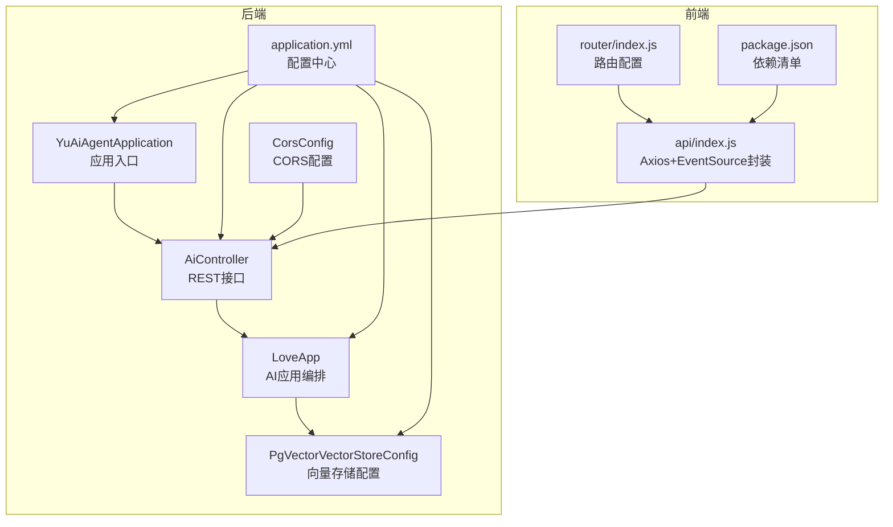
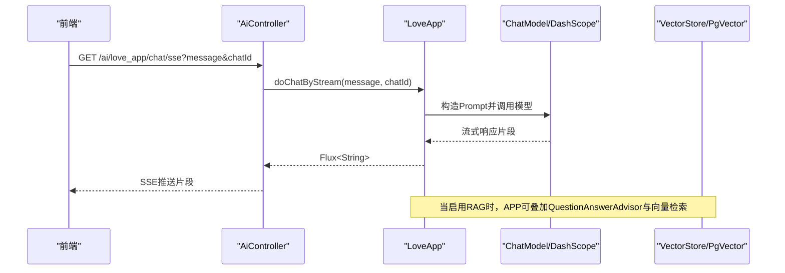
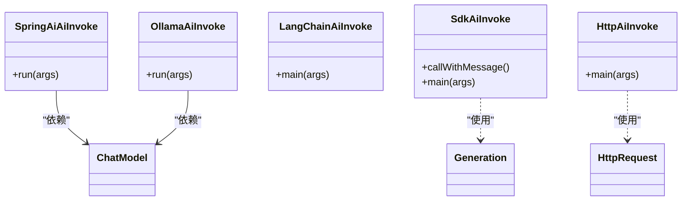
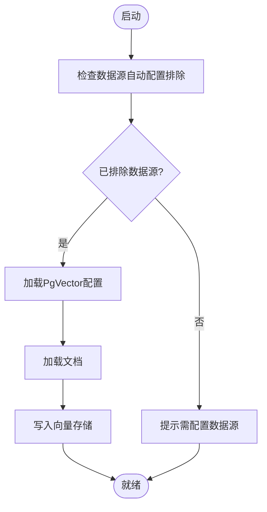
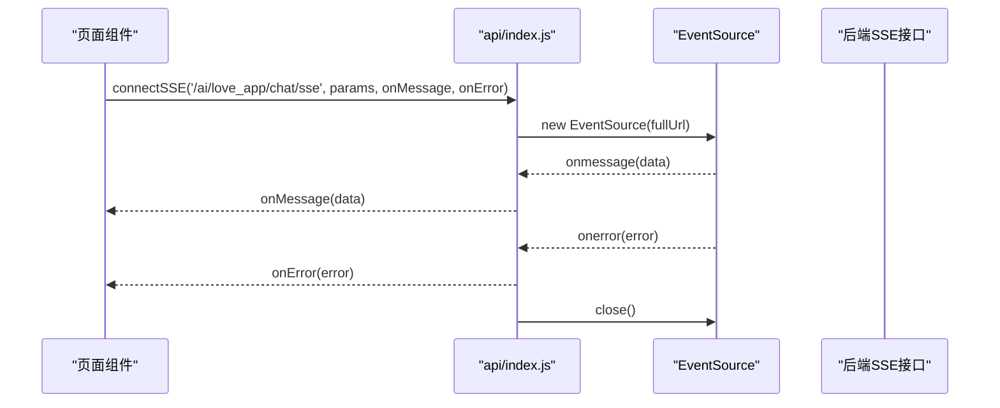
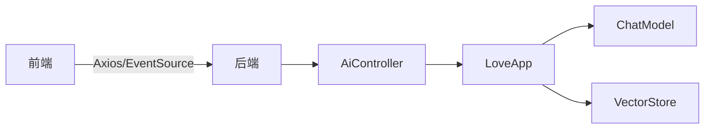

# 故障排除

<cite>
**本文引用的文件**
- [YuAiAgentApplication.java](file://src/main/java/com/yupi/yuaiagent/YuAiAgentApplication.java)
- [AiController.java](file://src/main/java/com/yupi/yuaiagent/controller/AiController.java)
- [CorsConfig.java](file://src/main/java/com/yupi/yuaiagent/config/CorsConfig.java)
- [application.yml](file://src/main/resources/application.yml)
- [application-prod.yml](file://src/main/resources/application-prod.yml)
- [HttpAiInvoke.java](file://src/main/java/com/yupi/yuaiagent/demo/invoke/HttpAiInvoke.java)
- [LangChainAiInvoke.java](file://src/main/java/com/yupi/yuaiagent/demo/invoke/LangChainAiInvoke.java)
- [OllamaAiInvoke.java](file://src/main/java/com/yupi/yuaiagent/demo/invoke/OllamaAiInvoke.java)
- [SdkAiInvoke.java](file://src/main/java/com/yupi/yuaiagent/demo/invoke/SdkAiInvoke.java)
- [SpringAiAiInvoke.java](file://src/main/java/com/yupi/yuaiagent/demo/invoke/SpringAiAiInvoke.java)
- [PgVectorVectorStoreConfig.java](file://src/main/java/com/yupi/yuaiagent/rag/PgVectorVectorStoreConfig.java)
- [LoveApp.java](file://src/main/java/com/yupi/yuaiagent/app/LoveApp.java)
- [index.js](file://yu-ai-agent-frontend/src/api/index.js)
- [index.js](file://yu-ai-agent-frontend/src/router/index.js)
- [package.json](file://yu-ai-agent-frontend/package.json)
</cite>

## 目录
1. [简介](#简介)
2. [项目结构](#项目结构)
3. [核心组件](#核心组件)
4. [架构总览](#架构总览)
5. [详细组件分析](#详细组件分析)
6. [依赖分析](#依赖分析)
7. [性能考虑](#性能考虑)
8. [故障排除指南](#故障排除指南)
9. [结论](#结论)
10. [附录](#附录)

## 简介
本指南面向开发者，提供系统化的故障排除方法，覆盖以下方面：
- AI模型调用失败的诊断：HTTP调用、LangChain调用、Ollama调用、SDK调用、Spring AI调用
- 数据库连接问题：PgVector连接、连接池配置、权限问题
- 前端与后端通信问题：CORS、API调用失败、SSE连接异常
- 日志分析与调试：关键日志位置、错误信息解读、性能问题定位
- 系统监控与告警：配置要点与落地建议

## 项目结构
后端采用Spring Boot，控制器位于controller包，AI应用逻辑在app包，RAG与向量存储在rag包，全局CORS配置在config包。前端位于yu-ai-agent-frontend目录，使用Vue 3 + Axios + EventSource。

**图表来源**
- [YuAiAgentApplication.java:1-18](file://src/main/java/com/yupi/yuaiagent/YuAiAgentApplication.java#L1-L18)
- [AiController.java:1-106](file://src/main/java/com/yupi/yuaiagent/controller/AiController.java#L1-L106)
- [CorsConfig.java:1-26](file://src/main/java/com/yupi/yuaiagent/config/CorsConfig.java#L1-L26)
- [application.yml:1-66](file://src/main/resources/application.yml#L1-L66)
- [LoveApp.java:1-227](file://src/main/java/com/yupi/yuaiagent/app/LoveApp.java#L1-L227)
- [PgVectorVectorStoreConfig.java:1-41](file://src/main/java/com/yupi/yuaiagent/rag/PgVectorVectorStoreConfig.java#L1-L41)
- [index.js:1-60](file://yu-ai-agent-frontend/src/api/index.js#L1-L60)
- [index.js:1-47](file://yu-ai-agent-frontend/src/router/index.js#L1-L47)
- [package.json:1-22](file://yu-ai-agent-frontend/package.json#L1-L22)

**章节来源**
- [YuAiAgentApplication.java:1-18](file://src/main/java/com/yupi/yuaiagent/YuAiAgentApplication.java#L1-L18)
- [AiController.java:1-106](file://src/main/java/com/yupi/yuaiagent/controller/AiController.java#L1-L106)
- [CorsConfig.java:1-26](file://src/main/java/com/yupi/yuaiagent/config/CorsConfig.java#L1-L26)
- [application.yml:1-66](file://src/main/resources/application.yml#L1-L66)
- [LoveApp.java:1-227](file://src/main/java/com/yupi/yuaiagent/app/LoveApp.java#L1-L227)
- [PgVectorVectorStoreConfig.java:1-41](file://src/main/java/com/yupi/yuaiagent/rag/PgVectorVectorStoreConfig.java#L1-L41)
- [index.js:1-60](file://yu-ai-agent-frontend/src/api/index.js#L1-L60)
- [index.js:1-47](file://yu-ai-agent-frontend/src/router/index.js#L1-L47)
- [package.json:1-22](file://yu-ai-agent-frontend/package.json#L1-L22)

## 核心组件
- 应用入口与排除配置：应用入口类排除了数据源自动配置，便于开发阶段不强制依赖数据库。
- 控制器层：提供同步与SSE两种AI对话接口，并支持多种SSE实现变体。
- CORS配置：允许凭据、通配域名模式、全量方法与头。
- AI应用编排：LoveApp负责构建ChatClient、管理对话记忆、工具回调、RAG增强等。
- 向量存储：PgVector配置示例，包含索引类型、距离度量、表名、批大小等参数。
- 前端API封装：Axios实例与EventSource封装，统一SSE连接与错误处理。

**章节来源**
- [YuAiAgentApplication.java:7-10](file://src/main/java/com/yupi/yuaiagent/YuAiAgentApplication.java#L7-L10)
- [AiController.java:18-105](file://src/main/java/com/yupi/yuaiagent/controller/AiController.java#L18-L105)
- [CorsConfig.java:14-24](file://src/main/java/com/yupi/yuaiagent/config/CorsConfig.java#L14-L24)
- [LoveApp.java:27-62](file://src/main/java/com/yupi/yuaiagent/app/LoveApp.java#L27-L62)
- [PgVectorVectorStoreConfig.java:19-40](file://src/main/java/com/yupi/yuaiagent/rag/PgVectorVectorStoreConfig.java#L19-L40)
- [index.js:9-12](file://yu-ai-agent-frontend/src/api/index.js#L9-L12)

## 架构总览
后端通过AiController暴露REST接口，LoveApp作为业务编排器，结合Spring AI ChatClient与工具、RAG向量存储完成对话与增强。前端通过Axios与EventSource与后端SSE交互。

**图表来源**
- [AiController.java:50-53](file://src/main/java/com/yupi/yuaiagent/controller/AiController.java#L50-L53)
- [LoveApp.java:90-97](file://src/main/java/com/yupi/yuaiagent/app/LoveApp.java#L90-L97)
- [application.yml:11-21](file://src/main/resources/application.yml#L11-L21)

## 详细组件分析

### AI模型调用组件
- Spring AI（阿里）：通过ChatModel注入调用，示例见SpringAiAiInvoke。
- Spring AI（Ollama）：通过ChatModel注入调用，示例见OllamaAiInvoke。
- LangChain：QwenChatModel示例，见LangChainAiInvoke。
- SDK（DashScope）：Generation调用示例，见SdkAiInvoke。
- HTTP直连：使用Hutool HTTP封装，见HttpAiInvoke。

**图表来源**
- [SpringAiAiAiInvoke.java:15-27](file://src/main/java/com/yupi/yuaiagent/demo/invoke/SpringAiAiInvoke.java#L15-L27)
- [OllamaAiInvoke.java:15-27](file://src/main/java/com/yupi/yuaiagent/demo/invoke/OllamaAiInvoke.java#L15-L27)
- [LangChainAiInvoke.java:6-16](file://src/main/java/com/yupi/yuaiagent/demo/invoke/LangChainAiInvoke.java#L6-L16)
- [SdkAiInvoke.java:17-49](file://src/main/java/com/yupi/yuaiagent/demo/invoke/SdkAiInvoke.java#L17-L49)
- [HttpAiInvoke.java:10-56](file://src/main/java/com/yupi/yuaiagent/demo/invoke/HttpAiInvoke.java#L10-L56)

**章节来源**
- [SpringAiAiInvoke.java:15-27](file://src/main/java/com/yupi/yuaiagent/demo/invoke/SpringAiAiInvoke.java#L15-L27)
- [OllamaAiInvoke.java:15-27](file://src/main/java/com/yupi/yuaiagent/demo/invoke/OllamaAiInvoke.java#L15-L27)
- [LangChainAiInvoke.java:6-16](file://src/main/java/com/yupi/yuaiagent/demo/invoke/LangChainAiInvoke.java#L6-L16)
- [SdkAiInvoke.java:17-49](file://src/main/java/com/yupi/yuaiagent/demo/invoke/SdkAiInvoke.java#L17-L49)
- [HttpAiInvoke.java:10-56](file://src/main/java/com/yupi/yuaiagent/demo/invoke/HttpAiInvoke.java#L10-L56)

### 数据库与向量存储组件
- 应用排除数据源自动配置，便于开发阶段不强制依赖数据库。
- PgVector配置示例：包含维度、距离类型、索引类型、初始化模式、表名、批大小等。
- 向量存储加载：从文档加载器读取文档并写入向量存储。

**图表来源**
- [YuAiAgentApplication.java:7-10](file://src/main/java/com/yupi/yuaiagent/YuAiAgentApplication.java#L7-L10)
- [PgVectorVectorStoreConfig.java:19-40](file://src/main/java/com/yupi/yuaiagent/rag/PgVectorVectorStoreConfig.java#L19-L40)

**章节来源**
- [YuAiAgentApplication.java:7-10](file://src/main/java/com/yupi/yuaiagent/YuAiAgentApplication.java#L7-L10)
- [PgVectorVectorStoreConfig.java:19-40](file://src/main/java/com/yupi/yuaiagent/rag/PgVectorVectorStoreConfig.java#L19-L40)

### 前端通信组件
- Axios实例：统一基础URL、超时时间。
- EventSource封装：SSE连接、消息分发、错误处理与关闭。
- 路由配置：页面标题与元信息设置。

**图表来源**
- [index.js:14-45](file://yu-ai-agent-frontend/src/api/index.js#L14-L45)
- [AiController.java:50-53](file://src/main/java/com/yupi/yuaiagent/controller/AiController.java#L50-L53)

**章节来源**
- [index.js:9-12](file://yu-ai-agent-frontend/src/api/index.js#L9-L12)
- [index.js:14-45](file://yu-ai-agent-frontend/src/api/index.js#L14-L45)
- [index.js:38-45](file://yu-ai-agent-frontend/src/router/index.js#L38-L45)

## 依赖分析
- 后端依赖：Spring Boot、Spring AI、Spring MVC、OpenAPI文档、CORS配置。
- 前端依赖：Vue 3、Axios、Vue Router。
- 关键耦合点：AiController依赖LoveApp；LoveApp依赖ChatModel、VectorStore、工具回调；前端依赖后端SSE接口。

**图表来源**
- [AiController.java:22-29](file://src/main/java/com/yupi/yuaiagent/controller/AiController.java#L22-L29)
- [LoveApp.java:31-62](file://src/main/java/com/yupi/yuaiagent/app/LoveApp.java#L31-L62)
- [index.js:1-60](file://yu-ai-agent-frontend/src/api/index.js#L1-L60)

**章节来源**
- [AiController.java:22-29](file://src/main/java/com/yupi/yuaiagent/controller/AiController.java#L22-L29)
- [LoveApp.java:31-62](file://src/main/java/com/yupi/yuaiagent/app/LoveApp.java#L31-L62)
- [package.json:11-16](file://yu-ai-agent-frontend/package.json#L11-L16)

## 性能考虑
- SSE超时与背压：后端SseEmitter设置了较长超时，前端EventSource需及时关闭避免资源泄漏。
- 日志级别：application.yml中已将Spring AI日志级别设为DEBUG，便于观察调用细节与性能瓶颈。
- 向量存储批大小：PgVector配置支持调整最大文档批大小，影响入库性能与内存占用。
- 前端超时：Axios默认超时较长，但需结合后端SSE长连接策略综合评估。

**章节来源**
- [AiController.java:77-92](file://src/main/java/com/yupi/yuaiagent/controller/AiController.java#L77-L92)
- [application.yml:63-66](file://src/main/resources/application.yml#L63-L66)
- [PgVectorVectorStoreConfig.java:27-34](file://src/main/java/com/yupi/yuaiagent/rag/PgVectorVectorStoreConfig.java#L27-L34)
- [index.js:9-12](file://yu-ai-agent-frontend/src/api/index.js#L9-L12)

## 故障排除指南

### 一、AI模型调用失败诊断

1) HTTP调用失败
- 症状：网络错误、鉴权失败、模型不可用。
- 排查步骤：
  - 检查API密钥与模型名称是否正确。
  - 校验请求URL与请求体格式。
  - 观察后端日志中Spring AI的DEBUG级别输出。
- 参考实现路径：
  - [HttpAiInvoke.java:12-56](file://src/main/java/com/yupi/yuaiagent/demo/invoke/HttpAiInvoke.java#L12-L56)
  - [application.yml:11-21](file://src/main/resources/application.yml#L11-L21)

2) LangChain调用失败
- 症状：模型构建失败、调用异常。
- 排查步骤：
  - 确认API Key与模型名称。
  - 检查依赖版本兼容性。
- 参考实现路径：
  - [LangChainAiInvoke.java:8-16](file://src/main/java/com/yupi/yuaiagent/demo/invoke/LangChainAiInvoke.java#L8-L16)

3) Ollama调用失败
- 症状：无法连接Ollama服务、模型未拉取。
- 排查步骤：
  - 确认Ollama服务地址与端口可达。
  - 检查模型是否存在且可加载。
- 参考实现路径：
  - [OllamaAiInvoke.java:15-27](file://src/main/java/com/yupi/yuaiagent/demo/invoke/OllamaAiInvoke.java#L15-L27)
  - [application.yml:18-21](file://src/main/resources/application.yml#L18-L21)

4) SDK调用失败
- 症状：API异常、缺少密钥、输入缺失。
- 排查步骤：
  - 捕获并记录异常类型，确认密钥与模型名称。
  - 检查消息格式与角色字段。
- 参考实现路径：
  - [SdkAiInvoke.java:17-49](file://src/main/java/com/yupi/yuaiagent/demo/invoke/SdkAiInvoke.java#L17-L49)

5) Spring AI调用失败
- 症状：ChatModel注入失败、调用超时、响应为空。
- 排查步骤：
  - 检查ChatModel Bean是否正确注册。
  - 查看DEBUG日志定位具体阶段。
  - 对比不同SSE实现（Flux、ServerSentEvent、SseEmitter）的差异。
- 参考实现路径：
  - [SpringAiAiInvoke.java:15-27](file://src/main/java/com/yupi/yuaiagent/demo/invoke/SpringAiAiInvoke.java#L15-L27)
  - [AiController.java:50-104](file://src/main/java/com/yupi/yuaiagent/controller/AiController.java#L50-L104)
  - [application.yml:11-21](file://src/main/resources/application.yml#L11-L21)

### 二、数据库与向量存储问题

1) PgVector连接失败
- 症状：无法建立数据库连接、表不存在、DDL失败。
- 排查步骤：
  - 检查数据源配置是否启用（开发阶段默认排除）。
  - 确认数据库服务可用、凭据正确。
  - 检查向量表初始化与索引配置。
- 参考实现路径：
  - [YuAiAgentApplication.java:7-10](file://src/main/java/com/yupi/yuaiagent/YuAiAgentApplication.java#L7-L10)
  - [PgVectorVectorStoreConfig.java:19-40](file://src/main/java/com/yupi/yuaiagent/rag/PgVectorVectorStoreConfig.java#L19-L40)

2) 连接池与权限问题
- 症状：连接超时、权限不足、事务异常。
- 排查步骤：
  - 检查连接池参数与最大连接数。
  - 核对数据库用户权限与模式(schema)访问。
  - 关注批大小与大文本入库的内存占用。

3) RAG检索异常
- 症状：检索不到相关文档、召回质量差。
- 排查步骤：
  - 确认向量表存在且已写入文档。
  - 检查嵌入维度与距离度量一致性。
  - 调整查询重写与Advisor组合。

### 三、前端与后端通信问题

1) CORS问题
- 症状：预检失败、跨域报错、Cookie丢失。
- 排查步骤：
  - 确认允许凭据、通配域名模式、全量方法与头。
  - 检查前端基础URL与后端上下文路径一致。
- 参考实现路径：
  - [CorsConfig.java:14-24](file://src/main/java/com/yupi/yuaiagent/config/CorsConfig.java#L14-L24)
  - [application.yml:38-41](file://src/main/resources/application.yml#L38-L41)
  - [index.js:4-6](file://yu-ai-agent-frontend/src/api/index.js#L4-L6)

2) API调用失败
- 症状：404、500、超时。
- 排查步骤：
  - 校验后端端口与上下文路径。
  - 检查控制器映射与参数传递。
  - 查看后端日志定位异常。

3) SSE连接异常
- 症状：EventSource连接失败、断开频繁、消息不完整。
- 排查步骤：
  - 检查SSE接口返回类型与编码。
  - 前端及时关闭EventSource，避免资源泄漏。
  - 后端SseEmitter设置合理超时。
- 参考实现路径：
  - [AiController.java:50-92](file://src/main/java/com/yupi/yuaiagent/controller/AiController.java#L50-L92)
  - [index.js:14-45](file://yu-ai-agent-frontend/src/api/index.js#L14-L45)

### 四、日志分析与调试技巧

1) 关键日志位置
- Spring AI调用细节：application.yml中已将日志级别设为DEBUG。
- 控制器与应用层：使用SLF4J记录请求与响应摘要。
- 前端：Axios拦截器与EventSource错误回调。

2) 错误信息解读
- HTTP调用：关注状态码与响应体中的错误描述。
- SDK调用：区分API异常、密钥异常、输入异常。
- SSE：区分连接错误与业务错误，及时关闭连接。

3) 性能问题定位
- 观察Spring AI日志中每步耗时。
- 检查向量存储批大小与数据库I/O。
- 前后端超时参数匹配，避免不必要的等待。

**章节来源**
- [application.yml:63-66](file://src/main/resources/application.yml#L63-L66)
- [AiController.java:38-104](file://src/main/java/com/yupi/yuaiagent/controller/AiController.java#L38-L104)
- [index.js:14-45](file://yu-ai-agent-frontend/src/api/index.js#L14-L45)

### 五、系统监控与告警

1) 配置要点
- 日志级别：保持DEBUG用于问题定位，生产环境可降级。
- 健康检查：可参考HealthController扩展健康端点。
- 指标采集：结合Spring Boot Actuator暴露运行指标。

2) 告警建议
- AI调用失败率与延迟阈值告警。
- SSE连接断线次数与重连频率监控。
- 数据库连接池使用率与超时告警。
- 前端SSE错误与超时统计。

**章节来源**
- [application.yml:63-66](file://src/main/resources/application.yml#L63-L66)
- [AiController.java:18-20](file://src/main/java/com/yupi/yuaiagent/controller/AiController.java#L18-L20)

## 结论
通过本指南，开发者可按“接口—应用—模型—存储—前端”的链路逐层定位问题，并结合日志与SSE特性快速恢复服务。建议在开发阶段保留DEBUG日志，在生产阶段根据监控指标动态调整日志级别与告警阈值。

## 附录

### A. 快速检查清单
- 后端：端口、上下文路径、CORS、AI模型配置、向量存储开关。
- 前端：基础URL、SSE连接、EventSource关闭。
- 数据库：数据源启用、权限、表初始化、批大小。
- 日志：DEBUG级别、错误捕获、性能观测。

### B. 参考实现路径汇总
- [YuAiAgentApplication.java:7-10](file://src/main/java/com/yupi/yuaiagent/YuAiAgentApplication.java#L7-L10)
- [AiController.java:50-104](file://src/main/java/com/yupi/yuaiagent/controller/AiController.java#L50-L104)
- [CorsConfig.java:14-24](file://src/main/java/com/yupi/yuaiagent/config/CorsConfig.java#L14-L24)
- [application.yml:11-21](file://src/main/resources/application.yml#L11-L21)
- [PgVectorVectorStoreConfig.java:19-40](file://src/main/java/com/yupi/yuaiagent/rag/PgVectorVectorStoreConfig.java#L19-L40)
- [LoveApp.java:90-97](file://src/main/java/com/yupi/yuaiagent/app/LoveApp.java#L90-L97)
- [index.js:14-45](file://yu-ai-agent-frontend/src/api/index.js#L14-L45)