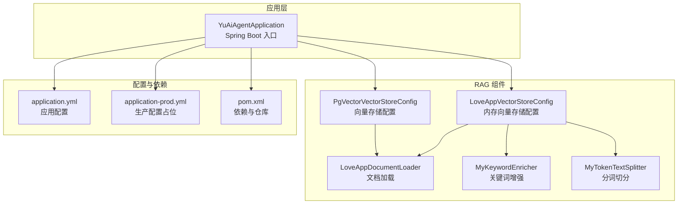
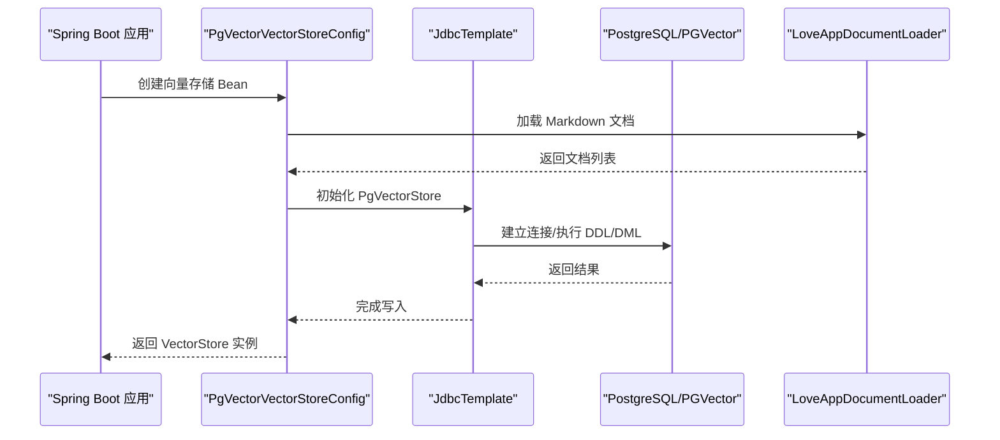
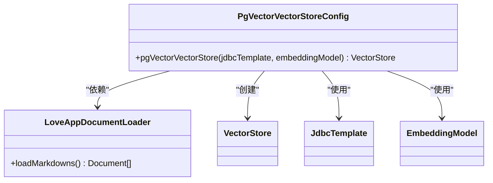
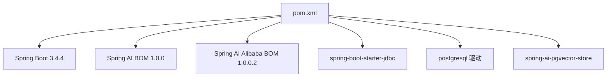
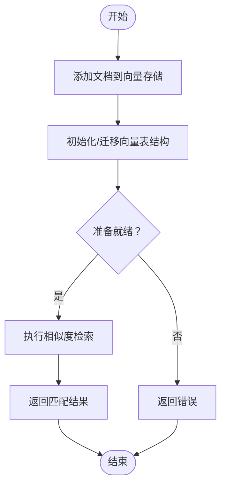

# 数据库连接问题

<cite>
**本文引用的文件**
- [PgVectorVectorStoreConfig.java](file://src/main/java/com/yupi/yuaiagent/rag/PgVectorVectorStoreConfig.java)
- [LoveAppVectorStoreConfig.java](file://src/main/java/com/yupi/yuaiagent/rag/LoveAppVectorStoreConfig.java)
- [application.yml](file://src/main/resources/application.yml)
- [application-prod.yml](file://src/main/resources/application-prod.yml)
- [pom.xml](file://pom.xml)
- [PgVectorVectorStoreConfigTest.java](file://src/test/java/com/yupi/yuaiagent/rag/PgVectorVectorStoreConfigTest.java)
- [YuAiAgentApplication.java](file://src/main/java/com/yupi/yuaiagent/YuAiAgentApplication.java)
- [LoveAppDocumentLoader.java](file://src/main/java/com/yupi/yuaiagent/rag/LoveAppDocumentLoader.java)
- [MyKeywordEnricher.java](file://src/main/java/com/yupi/yuaiagent/rag/MyKeywordEnricher.java)
- [MyTokenTextSplitter.java](file://src/main/java/com/yupi/yuaiagent/rag/MyTokenTextSplitter.java)
</cite>

## 目录
1. [简介](#简介)
2. [项目结构](#项目结构)
3. [核心组件](#核心组件)
4. [架构总览](#架构总览)
5. [详细组件分析](#详细组件分析)
6. [依赖分析](#依赖分析)
7. [性能考虑](#性能考虑)
8. [故障排除指南](#故障排除指南)
9. [结论](#结论)
10. [附录](#附录)

## 简介
本指南聚焦于数据库连接问题的系统化排查与解决，特别针对基于 PgVector 的向量数据库连接失败、连接池配置问题、权限认证错误等常见场景。结合项目中 Spring Boot 与 Spring AI 的集成方式，提供从服务状态检查、连接字符串验证、SSL 证书排查、网络连通性测试到版本兼容性、内存配置与索引性能的完整诊断流程，并给出连接池监控与调优建议（最大连接数、空闲超时、连接泄漏检测）。

## 项目结构
该项目采用 Spring Boot 应用结构，RAG 相关逻辑集中在 rag 包内，数据库连接通过 JDBC 与 PgVector 向量存储集成；同时在 application.yml 中预留了数据源与向量存储配置占位，便于本地开发与生产环境切换。

图表来源
- [YuAiAgentApplication.java:1-18](file://src/main/java/com/yupi/yuaiagent/YuAiAgentApplication.java#L1-L18)
- [PgVectorVectorStoreConfig.java:1-41](file://src/main/java/com/yupi/yuaiagent/rag/PgVectorVectorStoreConfig.java#L1-L41)
- [LoveAppVectorStoreConfig.java:1-42](file://src/main/java/com/yupi/yuaiagent/rag/LoveAppVectorStoreConfig.java#L1-L42)
- [LoveAppDocumentLoader.java:1-56](file://src/main/java/com/yupi/yuaiagent/rag/LoveAppDocumentLoader.java#L1-L56)
- [application.yml:1-66](file://src/main/resources/application.yml#L1-L66)
- [application-prod.yml:1-2](file://src/main/resources/application-prod.yml#L1-L2)
- [pom.xml:1-227](file://pom.xml#L1-L227)

章节来源
- [YuAiAgentApplication.java:1-18](file://src/main/java/com/yupi/yuaiagent/YuAiAgentApplication.java#L1-L18)
- [application.yml:1-66](file://src/main/resources/application.yml#L1-L66)
- [pom.xml:1-227](file://pom.xml#L1-L227)

## 核心组件
- PgVector 向量存储配置：通过 JdbcTemplate 与嵌入模型构建 PgVectorStore，支持维度、距离类型、索引类型、模式名、表名、批量大小等参数。
- 内存向量存储配置：用于本地开发与对比测试，不依赖数据库。
- 文档加载与预处理：加载 Markdown 文档并进行关键词增强与分词切分。
- 应用入口与数据源排除：默认排除数据源自动配置，按需启用数据库功能。

章节来源
- [PgVectorVectorStoreConfig.java:1-41](file://src/main/java/com/yupi/yuaiagent/rag/PgVectorVectorStoreConfig.java#L1-L41)
- [LoveAppVectorStoreConfig.java:1-42](file://src/main/java/com/yupi/yuaiagent/rag/LoveAppVectorStoreConfig.java#L1-L42)
- [LoveAppDocumentLoader.java:1-56](file://src/main/java/com/yupi/yuaiagent/rag/LoveAppDocumentLoader.java#L1-L56)
- [YuAiAgentApplication.java:1-18](file://src/main/java/com/yupi/yuaiagent/YuAiAgentApplication.java#L1-L18)

## 架构总览
下图展示应用启动后，向量存储初始化与文档写入的关键交互路径，以及与数据库连接相关的依赖关系。

图表来源
- [PgVectorVectorStoreConfig.java:24-39](file://src/main/java/com/yupi/yuaiagent/rag/PgVectorVectorStoreConfig.java#L24-L39)
- [LoveAppDocumentLoader.java:32-54](file://src/main/java/com/yupi/yuaiagent/rag/LoveAppDocumentLoader.java#L32-L54)

## 详细组件分析

### PgVectorVectorStoreConfig 分析
- 角色与职责：负责构建并初始化 PgVectorStore，设置维度、距离类型、索引类型、模式名、表名、批量大小等参数，并在初始化时创建或迁移向量表结构。
- 关键点：
  - 使用 JdbcTemplate 进行底层数据库操作。
  - 通过嵌入模型生成向量并批量写入。
  - 默认启用模式 public，表名为 vector_store。
  - 批量大小默认 10000，适合大规模文档入库。

图表来源
- [PgVectorVectorStoreConfig.java:19-39](file://src/main/java/com/yupi/yuaiagent/rag/PgVectorVectorStoreConfig.java#L19-L39)
- [LoveAppDocumentLoader.java:20-54](file://src/main/java/com/yupi/yuaiagent/rag/LoveAppDocumentLoader.java#L20-L54)

章节来源
- [PgVectorVectorStoreConfig.java:1-41](file://src/main/java/com/yupi/yuaiagent/rag/PgVectorVectorStoreConfig.java#L1-L41)

### LoveAppVectorStoreConfig 分析
- 角色与职责：构建内存型 SimpleVectorStore，用于本地开发与快速验证，避免数据库依赖。
- 关键点：
  - 不涉及数据库连接。
  - 通过关键词增强与分词切分提升检索质量。

章节来源
- [LoveAppVectorStoreConfig.java:1-42](file://src/main/java/com/yupi/yuaiagent/rag/LoveAppVectorStoreConfig.java#L1-L42)
- [MyKeywordEnricher.java:1-25](file://src/main/java/com/yupi/yuaiagent/rag/MyKeywordEnricher.java#L1-L25)
- [MyTokenTextSplitter.java:1-24](file://src/main/java/com/yupi/yuaiagent/rag/MyTokenTextSplitter.java#L1-L24)

### 应用入口与数据源排除
- 角色与职责：默认排除 DataSourceAutoConfiguration，避免自动创建数据源，便于在仅使用内存向量存储时无需数据库。
- 关键点：
  - 如需使用 PgVector，应移除数据源自动配置排除项。

章节来源
- [YuAiAgentApplication.java:7-10](file://src/main/java/com/yupi/yuaiagent/YuAiAgentApplication.java#L7-L10)

## 依赖分析
- Spring Boot 版本与依赖管理：使用 Spring Boot 3.4.4，通过 Spring AI BOM 与 Spring AI Alibaba BOM 管理版本。
- JDBC 与 PostgreSQL 驱动：显式引入 spring-boot-starter-jdbc 与 postgresql 驱动，支持 PgVector。
- Spring AI PgVector Store：手动整合 spring-ai-pgvector-store，用于自定义向量存储配置。
- 生产配置占位：application-prod.yml 用于覆盖生产环境配置。

图表来源
- [pom.xml:32-48](file://pom.xml#L32-L48)
- [pom.xml:75-88](file://pom.xml#L75-L88)

章节来源
- [pom.xml:1-227](file://pom.xml#L1-L227)

## 性能考虑
- 批量写入优化：合理设置批量大小，减少往返次数，提高入库效率。
- 索引选择：HNSW 索引在高维向量检索中表现优异，但需平衡索引构建与查询性能。
- 维度与距离类型：根据嵌入模型输出维度与业务需求选择合适距离类型。
- 内存与资源：确保应用 JVM 与数据库实例具备足够内存，避免 OOM 或锁等待。

## 故障排除指南

### 一、数据库服务状态检查
- 确认 PostgreSQL 服务运行正常，监听端口可达。
- 检查数据库实例是否已安装并启用向量扩展（如 pgvector），并确认版本满足要求。
- 在容器环境中，确认数据库容器健康状态与网络连通性。

### 二、连接字符串配置验证
- 在 application.yml 中启用数据源配置，填写正确的 JDBC URL、用户名与密码。
- 若使用 SSL，确保 URL 参数与证书配置正确。
- 生产环境配置优先 application-prod.yml，注意敏感信息保护。

章节来源
- [application.yml:6-10](file://src/main/resources/application.yml#L6-L10)
- [application.yml:32-37](file://src/main/resources/application.yml#L32-L37)
- [application-prod.yml:1-2](file://src/main/resources/application-prod.yml#L1-L2)

### 三、SSL 证书问题排查
- 若启用 SSL，确认数据库服务器证书链完整且受信任。
- 检查客户端驱动是否支持所需 SSL 模式（如 require、verify-ca、verify-full）。
- 在开发环境可先使用非 SSL 连接定位其他问题，再逐步启用 SSL。

### 四、网络连通性测试
- 使用 telnet/nc 或数据库客户端工具测试端口连通性。
- 在容器编排环境中，检查服务发现、DNS 解析与网络策略。
- 防火墙与安全组放行数据库端口。

### 五、权限认证错误
- 核对数据库用户是否存在、密码正确、具备必要的权限（DDL/DML）。
- 检查角色与 SCHEMA 权限，确保可访问 public 模式或指定模式。
- 如使用 IAM/外部认证，确认认证链路与代理配置正确。

### 六、数据库版本兼容性
- 确认 PostgreSQL 版本与 pgvector 插件版本兼容。
- Spring AI PgVector Store 依赖的驱动与协议版本需匹配。

章节来源
- [pom.xml:80-88](file://pom.xml#L80-L88)

### 七、内存配置不足
- 提升应用 JVM 堆内存与直接内存，避免向量计算与批处理过程中的内存瓶颈。
- 调整数据库共享内存参数（如 shared_buffers、work_mem），确保索引构建与查询性能。

### 八、索引性能问题
- 评估 HNSW 参数（ef_construction、m）与数据规模的平衡。
- 定期重建或重排索引，保持查询性能稳定。
- 对高频查询字段建立合适索引，避免全表扫描。

### 九、连接池配置与监控
- 最大连接数：根据并发查询与写入峰值设置，避免连接耗尽。
- 空闲超时：合理设置连接空闲回收时间，避免资源泄露。
- 连接泄漏检测：开启连接池监控与慢查询日志，定期巡检。
- 连接池指标：关注活跃连接数、等待队列长度、拒绝率等关键指标。

### 十、初始化与 Schema 迁移
- 使用 initializeSchema=true 自动创建/迁移向量表结构。
- 检查模式名与表名配置，确保与数据库对象一致。
- 大规模初始化时，建议分批次导入并监控数据库负载。

章节来源
- [PgVectorVectorStoreConfig.java:30-33](file://src/main/java/com/yupi/yuaiagent/rag/PgVectorVectorStoreConfig.java#L30-L33)

### 十一、文档加载与写入流程验证
- 使用测试用例验证向量存储写入与相似度检索功能。
- 确保文档加载成功，关键词增强与分词切分按预期工作。

章节来源
- [PgVectorVectorStoreConfigTest.java:14-32](file://src/test/java/com/yupi/yuaiagent/rag/PgVectorVectorStoreConfigTest.java#L14-L32)
- [LoveAppDocumentLoader.java:32-54](file://src/main/java/com/yupi/yuaiagent/rag/LoveAppDocumentLoader.java#L32-L54)
- [MyKeywordEnricher.java:20-23](file://src/main/java/com/yupi/yuaiagent/rag/MyKeywordEnricher.java#L20-L23)
- [MyTokenTextSplitter.java:14-22](file://src/main/java/com/yupi/yuaiagent/rag/MyTokenTextSplitter.java#L14-L22)

### 十二、启用数据库功能的切换步骤
- 移除应用启动类中的数据源自动配置排除项，启用数据源自动配置。
- 在 application.yml 中填写数据源与向量存储配置。
- 重新运行应用，观察向量存储初始化日志与数据库连接情况。

章节来源
- [YuAiAgentApplication.java:7-10](file://src/main/java/com/yupi/yuaiagent/YuAiAgentApplication.java#L7-L10)
- [application.yml:6-10](file://src/main/resources/application.yml#L6-L10)
- [application.yml:32-37](file://src/main/resources/application.yml#L32-L37)

## 结论
通过系统化的服务状态检查、连接配置验证、SSL 与网络排查、权限与版本兼容性确认，以及连接池与索引性能调优，可以有效解决大多数数据库连接问题。结合项目中的向量存储配置与测试用例，开发者可快速定位并修复连接异常，确保应用稳定运行。

## 附录

### A. 关键流程图：相似度检索调用链

图表来源
- [PgVectorVectorStoreConfig.java:30-39](file://src/main/java/com/yupi/yuaiagent/rag/PgVectorVectorStoreConfig.java#L30-L39)
- [PgVectorVectorStoreConfigTest.java:26-31](file://src/test/java/com/yupi/yuaiagent/rag/PgVectorVectorStoreConfigTest.java#L26-L31)