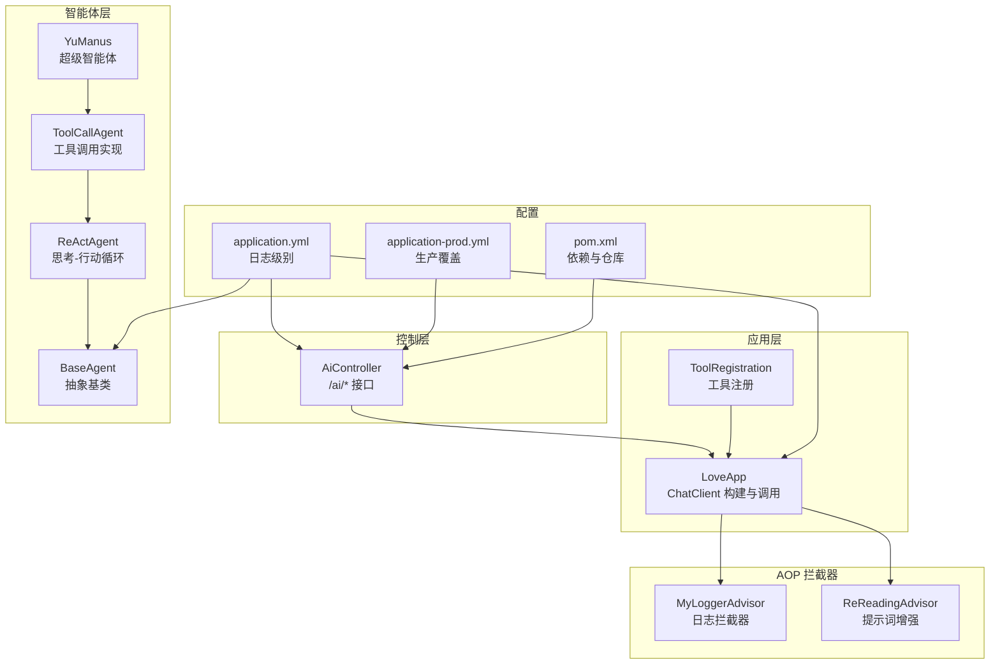
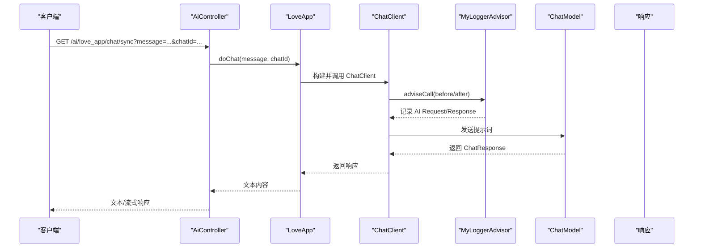
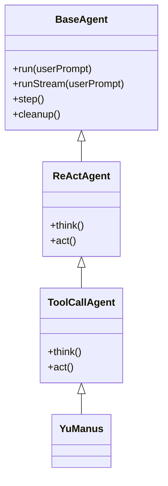
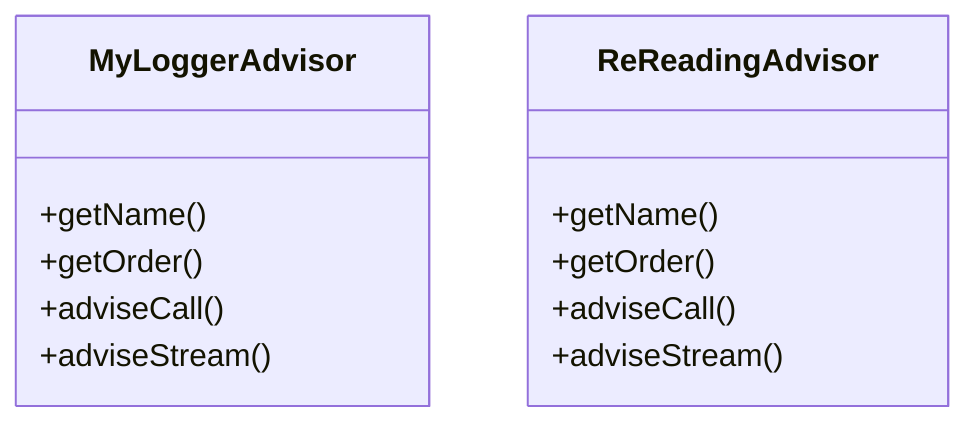
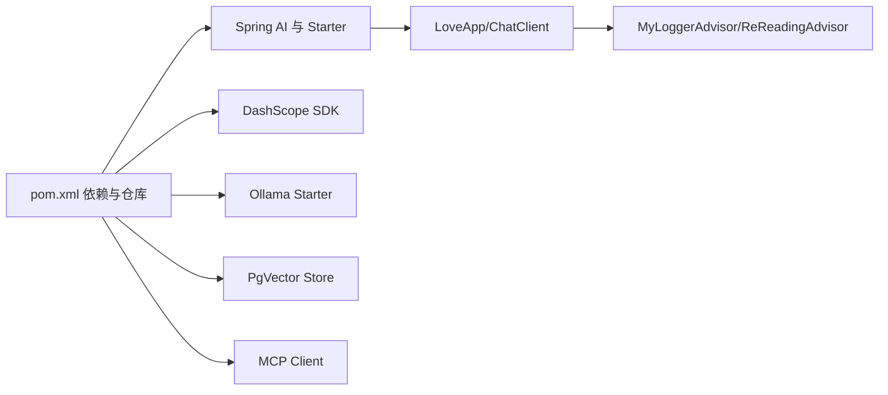

# 日志分析与调试

<cite>
**本文引用的文件**
- [application.yml](file://src/main/resources/application.yml)
- [application-prod.yml](file://src/main/resources/application-prod.yml)
- [YuAiAgentApplication.java](file://src/main/java/com/yupi/yuaiagent/YuAiAgentApplication.java)
- [AiController.java](file://src/main/java/com/yupi/yuaiagent/controller/AiController.java)
- [LoveApp.java](file://src/main/java/com/yupi/yuaiagent/app/LoveApp.java)
- [MyLoggerAdvisor.java](file://src/main/java/com/yupi/yuaiagent/advisor/MyLoggerAdvisor.java)
- [ReReadingAdvisor.java](file://src/main/java/com/yupi/yuaiagent/advisor/ReReadingAdvisor.java)
- [BaseAgent.java](file://src/main/java/com/yupi/yuaiagent/agent/BaseAgent.java)
- [ReActAgent.java](file://src/main/java/com/yupi/yuaiagent/agent/ReActAgent.java)
- [ToolCallAgent.java](file://src/main/java/com/yupi/yuaiagent/agent/ToolCallAgent.java)
- [YuManus.java](file://src/main/java/com/yupi/yuaiagent/agent/YuManus.java)
- [ToolRegistration.java](file://src/main/java/com/yupi/yuaiagent/tools/ToolRegistration.java)
- [pom.xml](file://pom.xml)
</cite>

## 目录
1. [简介](#简介)
2. [项目结构](#项目结构)
3. [核心组件](#核心组件)
4. [架构总览](#架构总览)
5. [详细组件分析](#详细组件分析)
6. [依赖分析](#依赖分析)
7. [性能考虑](#性能考虑)
8. [故障排查指南](#故障排查指南)
9. [结论](#结论)
10. [附录](#附录)

## 简介
本指南面向开发者与运维人员，系统性讲解本项目的日志分析与调试方法，涵盖以下主题：
- 关键日志位置与日志级别配置：AI 调用日志、数据库操作日志、工具调用日志、智能体执行日志等的查看与分析路径。
- 错误信息解读技巧：异常堆栈跟踪分析、性能瓶颈识别、内存泄漏检测等调试技术。
- Spring AOP 拦截器在日志记录中的作用：MyLoggerAdvisor 与 ReReadingAdvisor 的配置与使用方式。
- 高级调试技巧：日志轮转配置、远程日志收集、日志聚合分析。
- 常见问题的日志特征识别与快速定位方法。

## 项目结构
本项目采用 Spring Boot 与 Spring AI 架构，结合自定义 AOP 拦截器实现统一的日志记录与行为增强。核心模块包括：
- 控制层：对外提供 AI 对话接口，支持同步与流式响应。
- 应用层：封装 ChatClient、Advisor、工具回调与 RAG 增强逻辑。
- 智能体层：抽象与具体智能体实现，负责思考-行动循环与工具调用。
- 配置层：日志级别、AI 服务配置、工具注册等。

图表来源
- [AiController.java:18-105](file://src/main/java/com/yupi/yuaiagent/controller/AiController.java#L18-L105)
- [LoveApp.java:27-62](file://src/main/java/com/yupi/yuaiagent/app/LoveApp.java#L27-L62)
- [MyLoggerAdvisor.java:13-56](file://src/main/java/com/yupi/yuaiagent/advisor/MyLoggerAdvisor.java#L13-L56)
- [ReReadingAdvisor.java:12-56](file://src/main/java/com/yupi/yuaiagent/advisor/ReReadingAdvisor.java#L12-L56)
- [BaseAgent.java:17-192](file://src/main/java/com/yupi/yuaiagent/agent/BaseAgent.java#L17-L192)
- [ToolCallAgent.java:24-135](file://src/main/java/com/yupi/yuaiagent/agent/ToolCallAgent.java#L24-L135)
- [YuManus.java:9-37](file://src/main/java/com/yupi/yuaiagent/agent/YuManus.java#L9-L37)
- [ToolRegistration.java:9-37](file://src/main/java/com/yupi/yuaiagent/tools/ToolRegistration.java#L9-L37)
- [application.yml:63-66](file://src/main/resources/application.yml#L63-L66)
- [application-prod.yml:1-2](file://src/main/resources/application-prod.yml#L1-L2)
- [pom.xml:32-48](file://pom.xml#L32-L48)

章节来源
- [AiController.java:18-105](file://src/main/java/com/yupi/yuaiagent/controller/AiController.java#L18-L105)
- [LoveApp.java:27-62](file://src/main/java/com/yupi/yuaiagent/app/LoveApp.java#L27-L62)
- [application.yml:63-66](file://src/main/resources/application.yml#L63-L66)

## 核心组件
- 控制层接口：提供同步与流式 AI 对话入口，便于观察日志与定位问题。
- 应用层 LoveApp：统一构建 ChatClient，注入日志与推理增强 Advisor，支持多轮记忆、RAG 问答与工具调用。
- 智能体层：BaseAgent/ReActAgent/ToolCallAgent/YuManus 实现思考-行动循环与工具调用，内置日志与异常处理。
- AOP 拦截器：MyLoggerAdvisor 记录 AI 请求与响应；ReReadingAdvisor 改写提示词以提升推理稳定性。
- 配置层：application.yml 中设置日志级别，便于观察 Spring AI 的底层调用细节；application-prod.yml 用于生产覆盖。

章节来源
- [AiController.java:38-104](file://src/main/java/com/yupi/yuaiagent/controller/AiController.java#L38-L104)
- [LoveApp.java:43-61](file://src/main/java/com/yupi/yuaiagent/app/LoveApp.java#L43-L61)
- [BaseAgent.java:53-92](file://src/main/java/com/yupi/yuaiagent/agent/BaseAgent.java#L53-L92)
- [ToolCallAgent.java:60-104](file://src/main/java/com/yupi/yuaiagent/agent/ToolCallAgent.java#L60-L104)
- [YuManus.java:15-36](file://src/main/java/com/yupi/yuaiagent/agent/YuManus.java#L15-L36)
- [MyLoggerAdvisor.java:13-56](file://src/main/java/com/yupi/yuaiagent/advisor/MyLoggerAdvisor.java#L13-L56)
- [ReReadingAdvisor.java:12-56](file://src/main/java/com/yupi/yuaiagent/advisor/ReReadingAdvisor.java#L12-L56)
- [application.yml:63-66](file://src/main/resources/application.yml#L63-L66)

## 架构总览
下图展示从控制器到 AI 调用链路，以及日志拦截器如何介入请求与响应阶段。

图表来源
- [AiController.java:38-41](file://src/main/java/com/yupi/yuaiagent/controller/AiController.java#L38-L41)
- [LoveApp.java:71-81](file://src/main/java/com/yupi/yuaiagent/app/LoveApp.java#L71-L81)
- [MyLoggerAdvisor.java:30-52](file://src/main/java/com/yupi/yuaiagent/advisor/MyLoggerAdvisor.java#L30-L52)

## 详细组件分析

### 控制层：AiController
- 提供同步与多种流式接口，便于对比日志输出与性能表现。
- SSE/SSEmitter 场景下，注意连接超时与完成回调，有助于定位网络与客户端问题。

章节来源
- [AiController.java:38-104](file://src/main/java/com/yupi/yuaiagent/controller/AiController.java#L38-L104)

### 应用层：LoveApp
- 统一构建 ChatClient，默认注入日志与推理增强 Advisor。
- 支持多轮对话记忆、RAG 问答、工具调用与 MCP 服务调用，便于分场景定位问题。

章节来源
- [LoveApp.java:43-61](file://src/main/java/com/yupi/yuaiagent/app/LoveApp.java#L43-L61)
- [LoveApp.java:145-172](file://src/main/java/com/yupi/yuaiagent/app/LoveApp.java#L145-L172)
- [LoveApp.java:185-198](file://src/main/java/com/yupi/yuaiagent/app/LoveApp.java#L185-L198)
- [LoveApp.java:212-225](file://src/main/java/com/yupi/yuaiagent/app/LoveApp.java#L212-L225)

### 智能体层：BaseAgent/ReActAgent/ToolCallAgent/YuManus
- BaseAgent：统一的状态机、步骤循环与异常捕获，日志记录关键节点。
- ReActAgent：思考-行动循环，异常直接记录并返回。
- ToolCallAgent：工具选择与执行，记录工具调用信息与结果；遇到终止工具时更新状态。
- YuManus：超级智能体，集成日志 Advisor 与工具集，适合复杂任务的端到端日志追踪。

图表来源
- [BaseAgent.java:23-192](file://src/main/java/com/yupi/yuaiagent/agent/BaseAgent.java#L23-L192)
- [ReActAgent.java:11-52](file://src/main/java/com/yupi/yuaiagent/agent/ReActAgent.java#L11-L52)
- [ToolCallAgent.java:27-135](file://src/main/java/com/yupi/yuaiagent/agent/ToolCallAgent.java#L27-L135)
- [YuManus.java:12-37](file://src/main/java/com/yupi/yuaiagent/agent/YuManus.java#L12-L37)

章节来源
- [BaseAgent.java:53-92](file://src/main/java/com/yupi/yuaiagent/agent/BaseAgent.java#L53-L92)
- [ReActAgent.java:35-50](file://src/main/java/com/yupi/yuaiagent/agent/ReActAgent.java#L35-L50)
- [ToolCallAgent.java:60-104](file://src/main/java/com/yupi/yuaiagent/agent/ToolCallAgent.java#L60-L104)
- [ToolCallAgent.java:111-134](file://src/main/java/com/yupi/yuaiagent/agent/ToolCallAgent.java#L111-L134)
- [YuManus.java:15-36](file://src/main/java/com/yupi/yuaiagent/agent/YuManus.java#L15-L36)

### AOP 拦截器：MyLoggerAdvisor 与 ReReadingAdvisor
- MyLoggerAdvisor：在 AI 请求前记录提示词，在响应后聚合并记录回复文本，便于端到端追踪。
- ReReadingAdvisor：在请求前改写提示词，重复强调问题以提升推理稳定性，适合复杂问题场景。

图表来源
- [MyLoggerAdvisor.java:13-56](file://src/main/java/com/yupi/yuaiagent/advisor/MyLoggerAdvisor.java#L13-L56)
- [ReReadingAdvisor.java:12-56](file://src/main/java/com/yupi/yuaiagent/advisor/ReReadingAdvisor.java#L12-L56)

章节来源
- [MyLoggerAdvisor.java:30-52](file://src/main/java/com/yupi/yuaiagent/advisor/MyLoggerAdvisor.java#L30-L52)
- [ReReadingAdvisor.java:24-45](file://src/main/java/com/yupi/yuaiagent/advisor/ReReadingAdvisor.java#L24-L45)

### 工具注册：ToolRegistration
- 集中注册各类工具回调，便于在应用层或智能体层统一启用工具调用日志与行为。

章节来源
- [ToolRegistration.java:18-36](file://src/main/java/com/yupi/yuaiagent/tools/ToolRegistration.java#L18-L36)

## 依赖分析
- Spring AI 与第三方模型服务：DashScope、Ollama 等，日志级别提升可观察底层调用细节。
- 向量存储与 RAG：PgVector 与自定义 Advisor，便于定位检索增强问题。
- MCP 客户端：支持外部工具服务，便于排查跨进程通信问题。

图表来源
- [pom.xml:50-103](file://pom.xml#L50-L103)
- [LoveApp.java:52-61](file://src/main/java/com/yupi/yuaiagent/app/LoveApp.java#L52-L61)

章节来源
- [pom.xml:32-48](file://pom.xml#L32-L48)
- [pom.xml:50-103](file://pom.xml#L50-L103)

## 性能考虑
- 日志级别：在开发与调试阶段可将日志级别提升至 DEBUG，以观察 Spring AI 的底层调用细节与耗时点。
- 流式输出：SSE/SSEmitter 在长连接场景下需关注超时与完成回调，避免资源泄露。
- 工具调用：工具选择与执行日志可帮助定位工具调用耗时与失败原因。
- RAG 增强：检索与重写环节可能成为性能瓶颈，可通过日志与指标观测定位。

章节来源
- [application.yml:63-66](file://src/main/resources/application.yml#L63-L66)
- [AiController.java:77-91](file://src/main/java/com/yupi/yuaiagent/controller/AiController.java#L77-L91)
- [ToolCallAgent.java:60-104](file://src/main/java/com/yupi/yuaiagent/agent/ToolCallAgent.java#L60-L104)

## 故障排查指南

### 1. 如何查看关键日志位置
- AI 调用日志：MyLoggerAdvisor 在请求前与响应后分别记录提示词与回复文本，便于端到端追踪。
- 工具调用日志：ToolCallAgent 在思考阶段记录工具选择信息，在执行阶段记录工具返回结果。
- 智能体执行日志：BaseAgent/ReActAgent 在每步执行前后记录状态与异常。
- 控制层日志：AiController 的同步与流式接口返回值可用于验证下游处理结果。

章节来源
- [MyLoggerAdvisor.java:30-52](file://src/main/java/com/yupi/yuaiagent/advisor/MyLoggerAdvisor.java#L30-L52)
- [ToolCallAgent.java:84-134](file://src/main/java/com/yupi/yuaiagent/agent/ToolCallAgent.java#L84-L134)
- [BaseAgent.java:72-149](file://src/main/java/com/yupi/yuaiagent/agent/BaseAgent.java#L72-L149)
- [AiController.java:38-104](file://src/main/java/com/yupi/yuaiagent/controller/AiController.java#L38-L104)

### 2. 异常堆栈跟踪分析
- BaseAgent/ReActAgent 在执行过程中捕获异常并记录错误日志，便于快速定位失败步骤。
- 工具调用异常会在工具执行阶段被记录，结合工具返回结果可判断是模型输出问题还是工具执行问题。

章节来源
- [BaseAgent.java:84-87](file://src/main/java/com/yupi/yuaiagent/agent/BaseAgent.java#L84-L87)
- [ReActAgent.java:45-49](file://src/main/java/com/yupi/yuaiagent/agent/ReActAgent.java#L45-L49)
- [ToolCallAgent.java:99-103](file://src/main/java/com/yupi/yuaiagent/agent/ToolCallAgent.java#L99-L103)

### 3. 性能瓶颈识别
- 提升日志级别至 DEBUG，观察 Spring AI 的调用耗时与响应延迟。
- 对比同步与流式接口的耗时差异，定位网络与序列化开销。
- 工具调用与 RAG 检索阶段的日志可辅助识别热点环节。

章节来源
- [application.yml:63-66](file://src/main/resources/application.yml#L63-L66)
- [AiController.java:50-91](file://src/main/java/com/yupi/yuaiagent/controller/AiController.java#L50-L91)
- [LoveApp.java:145-172](file://src/main/java/com/yupi/yuaiagent/app/LoveApp.java#L145-L172)

### 4. 内存泄漏检测
- 关注 SSE/SSEmitter 的超时与完成回调，确保在异常情况下正确释放资源。
- BaseAgent 的 finally 清理逻辑应在所有路径上执行，避免残留引用导致 GC 困难。

章节来源
- [AiController.java:163-176](file://src/main/java/com/yupi/yuaiagent/controller/AiController.java#L163-L176)
- [BaseAgent.java:156-191](file://src/main/java/com/yupi/yuaiagent/agent/BaseAgent.java#L156-L191)

### 5. Spring AOP 拦截器配置与使用
- MyLoggerAdvisor：作为默认 Advisor 注入 ChatClient，可在任意调用点输出请求与响应文本。
- ReReadingAdvisor：通过改写提示词提升推理稳定性，适用于复杂问题场景。
- 在 LoveApp 中既可全局注入，也可按需在特定调用处追加。

章节来源
- [MyLoggerAdvisor.java:18-28](file://src/main/java/com/yupi/yuaiagent/advisor/MyLoggerAdvisor.java#L18-L28)
- [ReReadingAdvisor.java:16-50](file://src/main/java/com/yupi/yuaiagent/advisor/ReReadingAdvisor.java#L16-L50)
- [LoveApp.java:54-61](file://src/main/java/com/yupi/yuaiagent/app/LoveApp.java#L54-L61)
- [LoveApp.java:154-156](file://src/main/java/com/yupi/yuaiagent/app/LoveApp.java#L154-L156)

### 6. 日志轮转、远程收集与聚合
- 日志轮转：建议在生产环境配置基于时间/大小的滚动策略，避免磁盘占用过大。
- 远程收集：可将日志输出到标准输出并通过容器/平台日志采集器集中收集。
- 日志聚合：结合标签（如 chatId、conversationId）进行聚合分析，定位会话异常与性能问题。

说明：本节为通用实践建议，不直接对应具体源码文件。

### 7. 常见问题的日志特征与快速定位
- AI 请求未返回：检查 MyLoggerAdvisor 是否输出“AI Request”但未输出“AI Response”，确认模型服务可用性与网络连通性。
- 工具调用失败：查看 ToolCallAgent 的工具选择与执行日志，区分模型输出问题与工具执行问题。
- SSE 连接中断：关注 AiController 的超时与完成回调日志，排查客户端断开或网络波动。
- RAG 检索异常：在 LoveApp 的 RAG 调用处开启日志，观察检索与重写环节的耗时与结果。

章节来源
- [MyLoggerAdvisor.java:30-52](file://src/main/java/com/yupi/yuaiagent/advisor/MyLoggerAdvisor.java#L30-L52)
- [ToolCallAgent.java:84-134](file://src/main/java/com/yupi/yuaiagent/agent/ToolCallAgent.java#L84-L134)
- [AiController.java:163-176](file://src/main/java/com/yupi/yuaiagent/controller/AiController.java#L163-L176)
- [LoveApp.java:145-172](file://src/main/java/com/yupi/yuaiagent/app/LoveApp.java#L145-L172)

## 结论
通过统一的日志拦截器与清晰的调用链路，本项目能够有效支撑 AI 调用、工具调用、智能体执行与 RAG 增强等场景的调试与分析。建议在开发阶段提升日志级别，结合 SSE/SSEmitter 的生命周期日志与工具调用日志，快速定位问题根因；在生产环境完善日志轮转与远程收集，配合标签化聚合分析，持续优化性能与稳定性。

## 附录

### 日志级别与配置要点
- 开发调试：将日志级别提升至 DEBUG，观察 Spring AI 的底层调用细节。
- 生产覆盖：通过 application-prod.yml 覆盖 application.yml 中的配置项，避免敏感信息泄露。

章节来源
- [application.yml:63-66](file://src/main/resources/application.yml#L63-L66)
- [application-prod.yml:1-2](file://src/main/resources/application-prod.yml#L1-L2)

### 关键类与方法路径参考
- 控制层接口：[AiController.java:38-104](file://src/main/java/com/yupi/yuaiagent/controller/AiController.java#L38-L104)
- 应用层构建与调用：[LoveApp.java:43-61](file://src/main/java/com/yupi/yuaiagent/app/LoveApp.java#L43-L61)
- 日志拦截器实现：[MyLoggerAdvisor.java:18-52](file://src/main/java/com/yupi/yuaiagent/advisor/MyLoggerAdvisor.java#L18-L52)
- 推理增强拦截器实现：[ReReadingAdvisor.java:16-45](file://src/main/java/com/yupi/yuaiagent/advisor/ReReadingAdvisor.java#L16-L45)
- 智能体执行与日志：[BaseAgent.java:72-149](file://src/main/java/com/yupi/yuaiagent/agent/BaseAgent.java#L72-L149)
- 工具调用与日志：[ToolCallAgent.java:84-134](file://src/main/java/com/yupi/yuaiagent/agent/ToolCallAgent.java#L84-L134)
- 超级智能体集成：[YuManus.java:15-36](file://src/main/java/com/yupi/yuaiagent/agent/YuManus.java#L15-L36)
- 工具注册：[ToolRegistration.java:18-36](file://src/main/java/com/yupi/yuaiagent/tools/ToolRegistration.java#L18-L36)