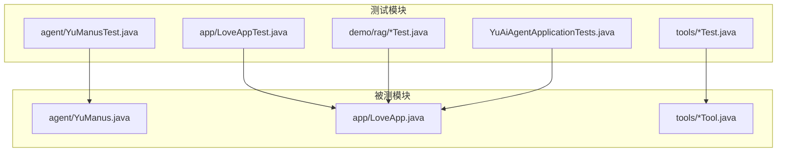
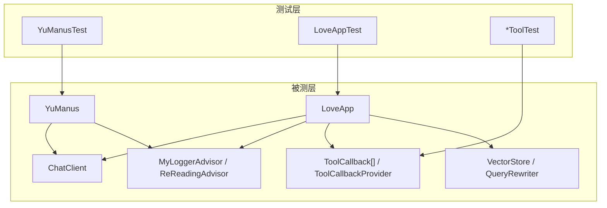
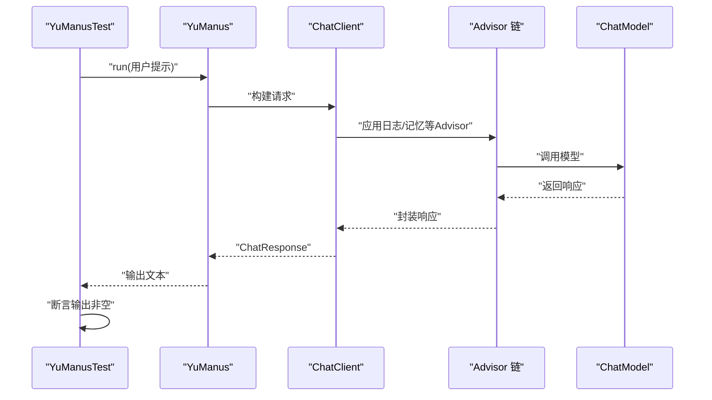
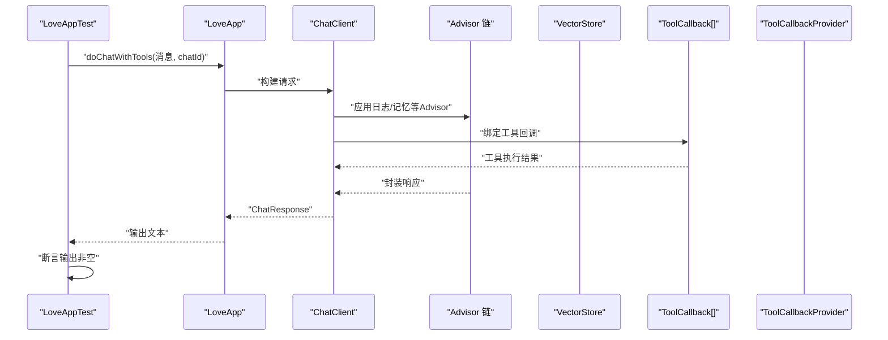
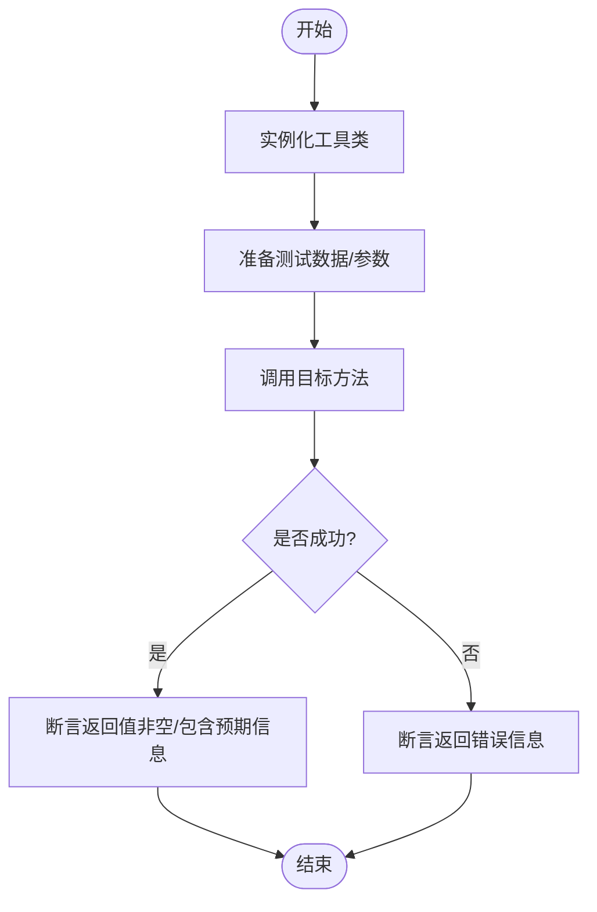
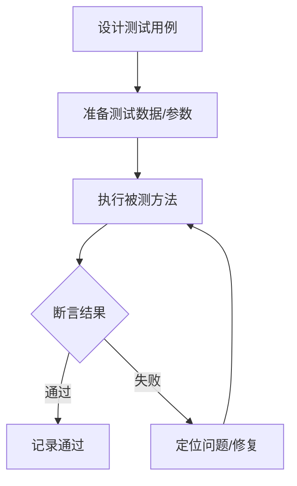
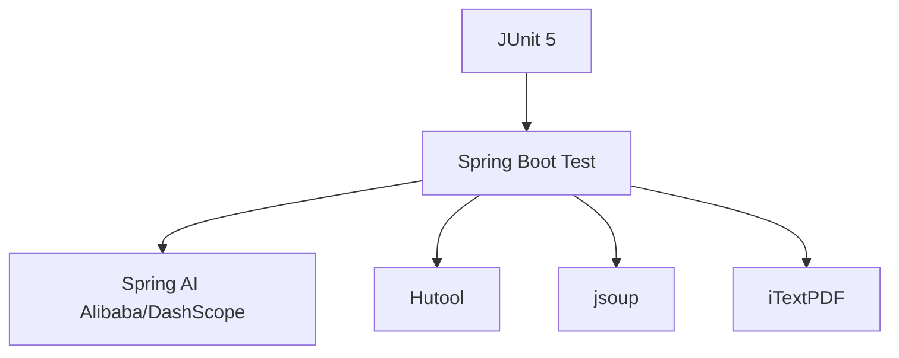

# 单元测试

<cite>
**本文引用的文件**
- [YuManusTest.java](file://src/test/java/com/yupi/yuaiagent/agent/YuManusTest.java)
- [LoveAppTest.java](file://src/test/java/com/yupi/yuaiagent/app/LoveAppTest.java)
- [YuAiAgentApplicationTests.java](file://src/test/java/com/yupi/yuaiagent/YuAiAgentApplicationTests.java)
- [YuManus.java](file://src/main/java/com/yupi/yuaiagent/agent/YuManus.java)
- [LoveApp.java](file://src/main/java/com/yupi/yuaiagent/app/LoveApp.java)
- [FileOperationToolTest.java](file://src/test/java/com/yupi/yuaiagent/tools/FileOperationToolTest.java)
- [PDFGenerationToolTest.java](file://src/test/java/com/yupi/yuaiagent/tools/PDFGenerationToolTest.java)
- [WebScrapingToolTest.java](file://src/test/java/com/yupi/yuaiagent/tools/WebScrapingToolTest.java)
- [WebSearchToolTest.java](file://src/test/java/com/yupi/yuaiagent/tools/WebSearchToolTest.java)
- [FileOperationTool.java](file://src/main/java/com/yupi/yuaiagent/tools/FileOperationTool.java)
- [PDFGenerationTool.java](file://src/main/java/com/yupi/yuaiagent/tools/PDFGenerationTool.java)
- [WebScrapingTool.java](file://src/main/java/com/yupi/yuaiagent/tools/WebScrapingTool.java)
- [WebSearchTool.java](file://src/main/java/com/yupi/yuaiagent/tools/WebSearchTool.java)
- [MultiQueryExpanderDemoTest.java](file://src/test/java/com/yupi/yuaiagent/demo/rag/MultiQueryExpanderDemoTest.java)
- [pom.xml](file://pom.xml)
</cite>

## 目录
1. [引言](#引言)
2. [项目结构](#项目结构)
3. [核心组件](#核心组件)
4. [架构总览](#架构总览)
5. [详细组件分析](#详细组件分析)
6. [依赖分析](#依赖分析)
7. [性能考虑](#性能考虑)
8. [故障排查指南](#故障排查指南)
9. [结论](#结论)
10. [附录](#附录)

## 引言
本文件聚焦于本项目的单元测试实践，系统梳理智能体测试（YuManusTest）、应用层测试（LoveAppTest）、工具类测试（文件操作、PDF生成、网页抓取、网页搜索）的测试策略与实现方法。文档从测试设计原则（边界条件、异常处理、状态验证）出发，结合 JUnit 5 的使用范式，说明 Mock 场景与实现思路（工具类 Mock、外部 API Mock），并讨论测试数据准备、断言策略、测试隔离等关键概念。最后给出测试覆盖率分析与持续改进策略，帮助读者快速理解并扩展本项目的测试体系。

## 项目结构
本项目采用 Spring Boot 标准目录组织，测试代码位于 src/test 下，按包划分清晰：agent、app、tools、demo 等。核心被测对象主要集中在 agent、app、tools 包中，分别对应智能体、应用服务与工具类。

图表来源
- [YuManusTest.java:1-23](file://src/test/java/com/yupi/yuaiagent/agent/YuManusTest.java#L1-L23)
- [LoveAppTest.java:1-88](file://src/test/java/com/yupi/yuaiagent/app/LoveAppTest.java#L1-L88)
- [YuAiAgentApplicationTests.java:1-14](file://src/test/java/com/yupi/yuaiagent/YuAiAgentApplicationTests.java#L1-L14)
- [YuManus.java:1-38](file://src/main/java/com/yupi/yuaiagent/agent/YuManus.java#L1-L38)
- [LoveApp.java:1-227](file://src/main/java/com/yupi/yuaiagent/app/LoveApp.java#L1-L227)
- [FileOperationTool.java:1-41](file://src/main/java/com/yupi/yuaiagent/tools/FileOperationTool.java#L1-L41)
- [PDFGenerationTool.java:1-53](file://src/main/java/com/yupi/yuaiagent/tools/PDFGenerationTool.java#L1-L53)
- [WebScrapingTool.java:1-23](file://src/main/java/com/yupi/yuaiagent/tools/WebScrapingTool.java#L1-L23)
- [WebSearchTool.java:1-54](file://src/main/java/com/yupi/yuaiagent/tools/WebSearchTool.java#L1-L54)

章节来源
- [pom.xml:1-227](file://pom.xml#L1-L227)

## 核心组件
- 智能体测试（YuManusTest）
  - 目标：验证智能体在真实或集成环境下的运行稳定性与输出非空性。
  - 方法：通过 SpringBootTest 加载上下文，注入智能体实例，构造典型用户提示并断言输出非空。
  - 关键点：关注系统提示、下一步提示、最大步数、日志 Advisor 的组合效果。
- 应用层测试（LoveAppTest）
  - 目标：覆盖基础对话、流式对话、报告生成、RAG 对话、工具调用、MCP 调用等多场景。
  - 方法：使用随机 chatId 进行多轮对话，断言返回值非空；对报告生成断言实体解析成功；对工具/MCP 场景断言返回文本非空。
  - 关键点：对话记忆、Advisor 链、工具回调、MCP Provider 的集成验证。
- 工具类测试（FileOperationToolTest、PDFGenerationToolTest、WebScrapingToolTest、WebSearchToolTest）
  - 目标：验证工具类的输入输出、异常兜底与文件/网络交互行为。
  - 方法：直接实例化工具类，传入典型参数，断言返回值非空或包含预期信息；对外部 API 的测试通过注入 API Key 完成。
  - 关键点：文件读写路径、PDF 写入目录、网页抓取超时与异常、搜索接口参数与结果拼接。

章节来源
- [YuManusTest.java:1-23](file://src/test/java/com/yupi/yuaiagent/agent/YuManusTest.java#L1-L23)
- [LoveAppTest.java:1-88](file://src/test/java/com/yupi/yuaiagent/app/LoveAppTest.java#L1-L88)
- [FileOperationToolTest.java:1-27](file://src/test/java/com/yupi/yuaiagent/tools/FileOperationToolTest.java#L1-L27)
- [PDFGenerationToolTest.java:1-17](file://src/test/java/com/yupi/yuaiagent/tools/PDFGenerationToolTest.java#L1-L17)
- [WebScrapingToolTest.java:1-16](file://src/test/java/com/yupi/yuaiagent/tools/WebScrapingToolTest.java#L1-L16)
- [WebSearchToolTest.java:1-24](file://src/test/java/com/yupi/yuaiagent/tools/WebSearchToolTest.java#L1-L24)

## 架构总览
下图展示了测试与被测对象之间的关系，以及测试中涉及的关键组件（Advisor、ChatClient、工具回调、MCP Provider、VectorStore 等）。

图表来源
- [YuManus.java:1-38](file://src/main/java/com/yupi/yuaiagent/agent/YuManus.java#L1-L38)
- [LoveApp.java:1-227](file://src/main/java/com/yupi/yuaiagent/app/LoveApp.java#L1-L227)
- [YuManusTest.java:1-23](file://src/test/java/com/yupi/yuaiagent/agent/YuManusTest.java#L1-L23)
- [LoveAppTest.java:1-88](file://src/test/java/com/yupi/yuaiagent/app/LoveAppTest.java#L1-L88)

## 详细组件分析

### 智能体测试（YuManusTest）
- 测试策略
  - 使用 SpringBootTest 加载完整上下文，确保 ChatClient、Advisor、工具回调链路可用。
  - 构造具有代表性的用户提示，验证 run 输出非空，间接验证系统提示、下一步提示、最大步数与日志 Advisor 的协同工作。
- 设计原则
  - 边界条件：尝试不同长度与复杂度的提示，观察是否触发最大步数限制。
  - 异常处理：若外部模型不可用，应验证返回值包含错误信息而非抛出异常。
  - 状态验证：验证日志 Advisor 是否生效，以及对话历史是否正确传递。
- Mock 场景
  - 外部模型 Mock：通过替换 ChatModel 或使用测试桩模拟模型响应，避免真实网络调用。
  - 工具回调 Mock：对工具链路进行隔离，仅验证智能体调度逻辑。
- 断言策略
  - 使用 Assertions.assertNotNull 断言输出非空；可选断言包含关键词或结构化字段。
- 测试隔离
  - 使用独立的测试配置或测试专用的 ChatModel 实现，避免影响生产环境。

图表来源
- [YuManusTest.java:14-22](file://src/test/java/com/yupi/yuaiagent/agent/YuManusTest.java#L14-L22)
- [YuManus.java:32-36](file://src/main/java/com/yupi/yuaiagent/agent/YuManus.java#L32-L36)

章节来源
- [YuManusTest.java:1-23](file://src/test/java/com/yupi/yuaiagent/agent/YuManusTest.java#L1-L23)
- [YuManus.java:1-38](file://src/main/java/com/yupi/yuaiagent/agent/YuManus.java#L1-L38)

### 应用层测试（LoveAppTest）
- 测试策略
  - 基础对话：多轮对话，断言输出非空，验证对话记忆与 Advisor 生效。
  - 报告生成：断言结构化解析成功，返回实体非空。
  - RAG 对话：验证查询重写、向量检索、Advisor 链路与日志 Advisor 的协同。
  - 工具调用：覆盖联网搜索、网页抓取、资源下载、终端操作、文件操作、PDF 生成等场景。
  - MCP 调用：验证 MCP Provider 的工具回调链路。
- 设计原则
  - 边界条件：空消息、超长消息、重复消息、非法 chatId 等。
  - 异常处理：网络异常、工具执行失败、向量检索失败等情况下的兜底。
  - 状态验证：对话记忆是否按轮次增长，Advisor 参数是否正确传递。
- Mock 场景
  - 外部 API Mock：对搜索接口、网页抓取、MCP 服务进行 Mock，确保测试稳定可控。
  - 向量存储 Mock：使用内存向量存储或测试桩，避免真实数据库依赖。
- 断言策略
  - 使用 Assertions.assertNotNull 断言返回值；对报告生成断言实体字段非空。
- 测试隔离
  - 使用随机 chatId 保证并发安全；对文件/网络 IO 进行最小化依赖。

图表来源
- [LoveAppTest.java:48-73](file://src/test/java/com/yupi/yuaiagent/app/LoveAppTest.java#L48-L73)
- [LoveApp.java:185-198](file://src/main/java/com/yupi/yuaiagent/app/LoveApp.java#L185-L198)

章节来源
- [LoveAppTest.java:1-88](file://src/test/java/com/yupi/yuaiagent/app/LoveAppTest.java#L1-L88)
- [LoveApp.java:1-227](file://src/main/java/com/yupi/yuaiagent/app/LoveApp.java#L1-L227)

### 工具类测试（FileOperationToolTest、PDFGenerationToolTest、WebScrapingToolTest、WebSearchToolTest）
- 文件操作工具（FileOperationTool）
  - 测试要点：读取存在的文件、写入新文件、异常情况（文件不存在、权限不足）。
  - Mock 场景：使用内存文件系统或临时目录，避免真实磁盘 IO。
  - 断言策略：断言返回值非空且包含成功/错误信息。
- PDF 生成工具（PDFGenerationTool）
  - 测试要点：生成 PDF 成功、目录创建、异常捕获（IO 异常）。
  - Mock 场景：使用内存流或临时目录，避免真实磁盘写入。
  - 断言策略：断言返回值包含成功路径或错误信息。
- 网页抓取工具（WebScrapingTool）
  - 测试要点：正常页面抓取、网络异常、HTML 解析。
  - Mock 场景：使用本地 HTML 文件或 HTTP Mock 服务器。
  - 断言策略：断言返回值非空且包含 HTML 内容。
- 网页搜索工具（WebSearchTool）
  - 测试要点：搜索接口调用、参数拼装、结果解析、异常处理。
  - Mock 场景：使用 HTTP Mock 返回固定 JSON，避免真实网络依赖。
  - 断言策略：断言返回值非空且包含搜索结果片段。

图表来源
- [FileOperationToolTest.java:10-25](file://src/test/java/com/yupi/yuaiagent/tools/FileOperationToolTest.java#L10-L25)
- [PDFGenerationToolTest.java:9-16](file://src/test/java/com/yupi/yuaiagent/tools/PDFGenerationToolTest.java#L9-L16)
- [WebScrapingToolTest.java:8-14](file://src/test/java/com/yupi/yuaiagent/tools/WebScrapingToolTest.java#L8-L14)
- [WebSearchToolTest.java:16-22](file://src/test/java/com/yupi/yuaiagent/tools/WebSearchToolTest.java#L16-L22)

章节来源
- [FileOperationToolTest.java:1-27](file://src/test/java/com/yupi/yuaiagent/tools/FileOperationToolTest.java#L1-L27)
- [PDFGenerationToolTest.java:1-17](file://src/test/java/com/yupi/yuaiagent/tools/PDFGenerationToolTest.java#L1-L17)
- [WebScrapingToolTest.java:1-16](file://src/test/java/com/yupi/yuaiagent/tools/WebScrapingToolTest.java#L1-L16)
- [WebSearchToolTest.java:1-24](file://src/test/java/com/yupi/yuaiagent/tools/WebSearchToolTest.java#L1-L24)
- [FileOperationTool.java:1-41](file://src/main/java/com/yupi/yuaiagent/tools/FileOperationTool.java#L1-L41)
- [PDFGenerationTool.java:1-53](file://src/main/java/com/yupi/yuaiagent/tools/PDFGenerationTool.java#L1-L53)
- [WebScrapingTool.java:1-23](file://src/main/java/com/yupi/yuaiagent/tools/WebScrapingTool.java#L1-L23)
- [WebSearchTool.java:1-54](file://src/main/java/com/yupi/yuaiagent/tools/WebSearchTool.java#L1-L54)

### 概念性总览
以下为通用测试流程的概念图，不映射具体源码文件：

## 依赖分析
- 测试框架与工具
  - JUnit 5：用于编写与运行测试。
  - Spring Boot Test：加载应用上下文，支持 @SpringBootTest、@Test、@Resource 等注解。
  - Hutool：用于文件读写、HTTP 请求、JSON 解析等。
  - iTextPDF：用于 PDF 生成。
  - jsoup：用于网页抓取。
  - Spring AI Alibaba、DashScope SDK：用于大模型调用。
- 依赖关系示意

图表来源
- [pom.xml:50-164](file://pom.xml#L50-L164)

章节来源
- [pom.xml:1-227](file://pom.xml#L1-L227)

## 性能考虑
- 测试执行效率
  - 将网络与文件 IO 类测试拆分为独立套件，避免串行阻塞。
  - 使用 Mock 替代真实外部服务，减少测试时间。
- 资源占用
  - 控制向量存储与聊天记忆的容量，避免测试期间内存膨胀。
  - 对 PDF 生成与网页抓取使用临时目录，及时清理。
- 并发与隔离
  - 使用随机 chatId 与独立线程，避免并发冲突。
  - 对共享资源（如文件、端口）进行加锁或命名空间隔离。

## 故障排查指南
- 常见问题与对策
  - 外部 API 不可用：对外部搜索、抓取、MCP 服务进行 Mock，确保测试稳定。
  - 文件路径异常：统一使用 FileConstant 中的保存目录，确保目录存在与权限正确。
  - 向量检索失败：检查 QueryRewriter 与 VectorStore 配置，必要时使用内存向量存储。
  - 日志 Advisor 未生效：确认 ChatClient 默认 Advisor 链路配置正确。
- 排查步骤
  - 逐步缩小范围：先验证工具类单测，再验证应用层集成。
  - 观察日志：启用更详细的日志级别，定位 Advisor、工具回调、MCP 调用链中的问题。
  - 回归测试：修复后回归相关场景，确保无副作用。

## 结论
本项目的单元测试覆盖智能体、应用层与工具类三大核心领域，采用 SpringBootTest 与直接实例化相结合的方式，既保证端到端验证，又兼顾工具类的独立测试。通过 Mock 场景与断言策略，测试能够有效验证边界条件、异常处理与状态一致性。建议后续进一步完善覆盖率统计与自动化报告，持续优化测试用例设计与执行效率。

## 附录
- 测试覆盖率分析与持续改进
  - 覆盖率指标：建议关注关键路径（ChatClient 构建、Advisor 链、工具回调、MCP Provider、VectorStore 查询）的行/分支覆盖率。
  - 改进策略：补充边界用例（空输入、超长输入、异常输入）、增加并发与压力测试、引入快照测试（对稳定输出进行快照比对）。
  - 工具建议：结合 Maven 插件或第三方工具生成覆盖率报告，定期评估并设定阈值。