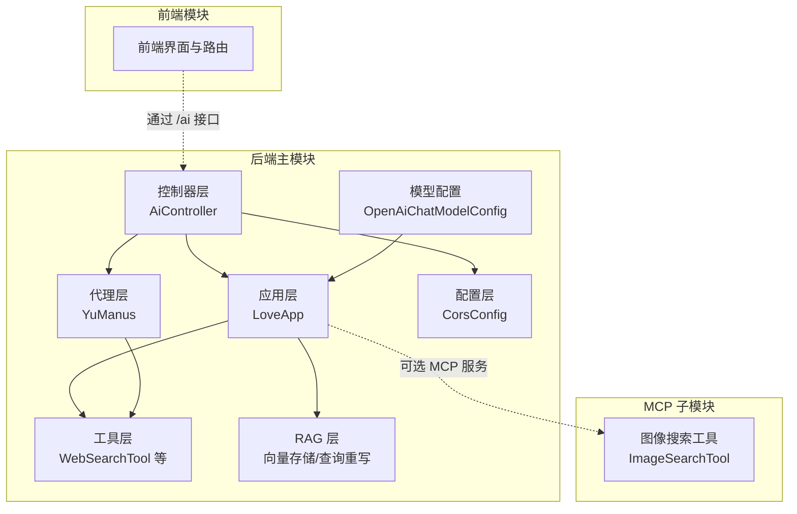
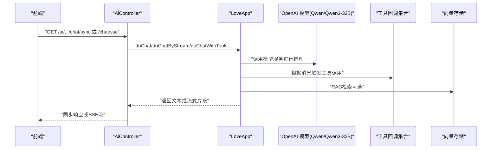
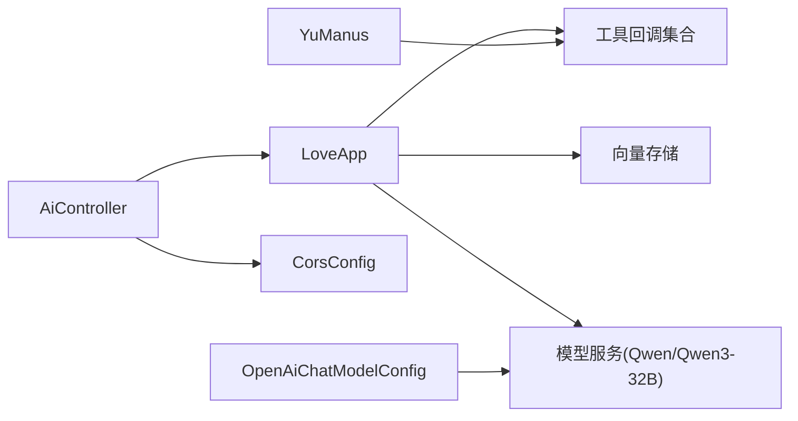

# 测试策略

<cite>
**本文档引用的文件**
- [pom.xml](file://pom.xml)
- [application.yml](file://src/main/resources/application.yml)
- [OpenAiChatModelConfig.java](file://src/main/java/com/yupi/yuaiagent/config/OpenAiChatModelConfig.java)
- [OpenAiModelConnectionTest.java](file://src/test/java/com/yupi/yuaiagent/OpenAiModelConnectionTest.java)
- [YuAiAgentApplicationTests.java](file://src/test/java/com/yupi/yuaiagent/YuAiAgentApplicationTests.java)
- [YuManusTest.java](file://src/test/java/com/yupi/yuaiagent/agent/YuManusTest.java)
- [LoveAppTest.java](file://src/test/java/com/yupi/yuaiagent/app/LoveAppTest.java)
- [WebSearchToolTest.java](file://src/test/java/com/yupi/yuaiagent/tools/WebSearchToolTest.java)
- [WebScrapingToolTest.java](file://src/test/java/com/yupi/yuaiagent/tools/WebScrapingToolTest.java)
- [LoveAppDocumentLoaderTest.java](file://src/test/java/com/yupi/yuaiagent/rag/LoveAppDocumentLoaderTest.java)
- [AiController.java](file://src/main/java/com/yupi/yuaiagent/controller/AiController.java)
- [LoveApp.java](file://src/main/java/com/yupi/yuaiagent/app/LoveApp.java)
- [YuManus.java](file://src/main/java/com/yupi/yuaiagent/agent/YuManus.java)
- [WebSearchTool.java](file://src/main/java/com/yupi/yuaiagent/tools/WebSearchTool.java)
- [CorsConfig.java](file://src/main/java/com/yupi/yuaiagent/config/CorsConfig.java)
- [ImageSearchToolTest.java](file://yu-image-search-mcp-server/src/test/java/com/yupi/yuimagesearchmcpserver/tools/ImageSearchToolTest.java)
- [YuImageSearchMcpServerApplicationTests.java](file://yu-image-search-mcp-server/src/test/java/com/yupi/yuimagesearchmcpserver/YuImageSearchMcpServerApplicationTests.java)
- [ImageSearchTool.java](file://yu-image-search-mcp-server/src/main/java/com/yupi/yuimagesearchmcpserver/tools/ImageSearchTool.java)
</cite>

## 更新摘要
**所做更改**
- 新增OpenAI模型连接测试章节，涵盖基本连通性测试和推理能力测试
- 更新模型配置章节，详细说明Qwen/Qwen3-32B模型集成
- 增强外部依赖测试策略，包含模型服务的Mock和占位实现
- 完善测试环境配置，支持模型服务的本地和远程部署

## 目录
1. 引言
2. 项目结构
3. 核心组件
4. 架构总览
5. 详细组件分析
6. 依赖分析
7. 性能考虑
8. 故障排查指南
9. 结论
10. 附录

## 引言
本测试策略文档面向"鱼皮AI助手"项目，系统化阐述单元测试、集成测试与端到端测试的设计原则与实施路径，覆盖断言策略、Mock对象使用、测试数据与环境管理、性能测试与回归测试，并提出测试自动化与CI/CD集成建议。目标是建立高质量的测试保障体系，确保AI对话、工具调用、RAG检索、MCP服务与前端交互的稳定性与可靠性。

**更新** 新增OpenAI模型连接测试章节，重点验证Qwen/Qwen3-32B模型的连通性和推理能力，确保模型服务集成的稳定性。

## 项目结构
项目采用Spring Boot多模块结构，后端主模块包含AI应用、代理、工具、RAG与控制器等包；前端位于独立目录；另有一个MCP图像搜索子模块。测试用例分布在各模块的test目录中，遵循按包分层组织，覆盖核心业务逻辑与外部依赖交互。

**图表来源**
- [AiController.java:1-106](file://src/main/java/com/yupi/yuaiagent/controller/AiController.java#L1-L106)
- [LoveApp.java:1-227](file://src/main/java/com/yupi/yuaiagent/app/LoveApp.java#L1-L227)
- [YuManus.java:1-38](file://src/main/java/com/yupi/yuaiagent/agent/YuManus.java#L1-L38)
- [WebSearchTool.java:1-54](file://src/main/java/com/yupi/yuaiagent/tools/WebSearchTool.java#L1-L54)
- [CorsConfig.java:1-26](file://src/main/java/com/yupi/yuaiagent/config/CorsConfig.java#L1-L26)
- [OpenAiChatModelConfig.java:1-64](file://src/main/java/com/yupi/yuaiagent/config/OpenAiChatModelConfig.java#L1-L64)
- [ImageSearchTool.java:1-67](file://yu-image-search-mcp-server/src/main/java/com/yupi/yuimagesearchmcpserver/tools/ImageSearchTool.java#L1-L67)

**章节来源**
- [pom.xml:1-232](file://pom.xml#L1-L232)
- [application.yml:1-73](file://src/main/resources/application.yml#L1-L73)

## 核心组件
- 应用层（LoveApp）：封装对话、流式输出、结构化输出、RAG检索与工具调用，负责与外部模型、向量存储、工具回调协作。
- 代理层（YuManus）：面向复杂任务的自主规划与工具编排，基于ChatClient与工具集执行多步骤任务。
- 工具层（WebSearchTool 等）：对外部服务（如搜索引擎、图像搜索）进行封装，作为工具回调被AI调用。
- 控制器层（AiController）：暴露REST接口，支持同步与SSE流式输出，连接应用层与前端。
- 配置层（CorsConfig）：统一跨域策略，保障前后端联调。
- 模型配置层（OpenAiChatModelConfig）：专门配置OpenAI兼容的Qwen/Qwen3-32B模型，提供ChatModel和EmbeddingModel Bean。
- MCP 子模块：提供图像搜索MCP服务，作为工具回调或独立服务运行。

**章节来源**
- [LoveApp.java:1-227](file://src/main/java/com/yupi/yuaiagent/app/LoveApp.java#L1-L227)
- [YuManus.java:1-38](file://src/main/java/com/yupi/yuaiagent/agent/YuManus.java#L1-L38)
- [WebSearchTool.java:1-54](file://src/main/java/com/yupi/yuaiagent/tools/WebSearchTool.java#L1-L54)
- [AiController.java:1-106](file://src/main/java/com/yupi/yuaiagent/controller/AiController.java#L1-L106)
- [CorsConfig.java:1-26](file://src/main/java/com/yupi/yuaiagent/config/CorsConfig.java#L1-L26)
- [OpenAiChatModelConfig.java:1-64](file://src/main/java/com/yupi/yuaiagent/config/OpenAiChatModelConfig.java#L1-L64)
- [ImageSearchTool.java:1-67](file://yu-image-search-mcp-server/src/main/java/com/yupi/yuimagesearchmcpserver/tools/ImageSearchTool.java#L1-L67)

## 架构总览
下图展示测试视角下的系统交互：控制器接收请求，调用应用层；应用层组合工具与RAG；代理层在复杂场景下编排工具；控制器可选择同步或SSE流式返回；前端通过统一接口消费。新增的模型连接测试直接验证Qwen/Qwen3-32B模型的服务可用性。

**图表来源**
- [AiController.java:1-106](file://src/main/java/com/yupi/yuaiagent/controller/AiController.java#L1-L106)
- [LoveApp.java:1-227](file://src/main/java/com/yupi/yuaiagent/app/LoveApp.java#L1-L227)
- [OpenAiChatModelConfig.java:29-47](file://src/main/java/com/yupi/yuaiagent/config/OpenAiChatModelConfig.java#L29-L47)

## 详细组件分析

### 单元测试设计与实现
- 设计原则
  - 面向接口与行为：优先验证方法输入输出与副作用，而非具体实现。
  - 最小化外部依赖：对网络与数据库使用Mock或占位实现，确保测试稳定与可重复。
  - 断言策略：关注关键路径与边界条件，如空值、异常分支、流式输出的完整性。
  - 可维护性：测试命名清晰表达意图，参数化与共享前置逻辑抽取为辅助方法。

- 实现要点
  - Spring Boot测试：使用@SpringBootTest加载上下文，结合@Resource注入被测Bean，减少样板代码。
  - 断言：使用JUnit 5 Assertions进行非空与结果校验，必要时结合日志级别定位问题。
  - 外部依赖隔离：工具类通过构造函数注入API Key或占位实现，避免硬编码与环境耦合。

- 示例与路径
  - 应用层单测：验证多轮对话、结构化输出、RAG与工具调用的基本可用性。
    - [LoveAppTest.java:1-88](file://src/test/java/com/yupi/yuaiagent/app/LoveAppTest.java#L1-L88)
  - 代理层单测：验证复杂任务的执行链路与终止条件。
    - [YuManusTest.java:1-23](file://src/test/java/com/yupi/yuaiagent/agent/YuManusTest.java#L1-L23)
  - 工具层单测：验证网络请求与解析逻辑，使用配置中的API Key。
    - [WebSearchToolTest.java:1-24](file://src/test/java/com/yupi/yuaiagent/tools/WebSearchToolTest.java#L1-L24)
    - [WebScrapingToolTest.java:1-16](file://src/test/java/com/yupi/yuaiagent/tools/WebScrapingToolTest.java#L1-L16)
  - RAG文档加载单测：验证文档加载流程。
    - [LoveAppDocumentLoaderTest.java:1-19](file://src/test/java/com/yupi/yuaiagent/rag/LoveAppDocumentLoaderTest.java#L1-L19)
  - MCP工具单测：验证MCP服务工具的可用性。
    - [ImageSearchToolTest.java:1-20](file://yu-image-search-mcp-server/src/test/java/com/yupi/yuimagesearchmcpserver/tools/ImageSearchToolTest.java#L1-L20)

- Mock对象使用建议
  - 对外部HTTP服务：使用Mockito或本地Stub，避免真实网络调用。
  - 对向量存储：使用内存或轻量实现，或通过接口抽象替换为测试实现。
  - 对模型服务：使用Fake ChatModel或Mock，确保可控的响应与错误场景。

- 断言策略
  - 基本断言：非空、长度、包含特定关键词。
  - 行为断言：流式输出的片段数量与顺序、结构化输出的字段存在性。
  - 错误断言：异常抛出、错误码或错误提示字符串匹配。

**章节来源**
- [YuAiAgentApplicationTests.java:1-14](file://src/test/java/com/yupi/yuaiagent/YuAiAgentApplicationTests.java#L1-L14)
- [LoveAppTest.java:1-88](file://src/test/java/com/yupi/yuaiagent/app/LoveAppTest.java#L1-L88)
- [YuManusTest.java:1-23](file://src/test/java/com/yupi/yuaiagent/agent/YuManusTest.java#L1-L23)
- [WebSearchToolTest.java:1-24](file://src/test/java/com/yupi/yuaiagent/tools/WebSearchToolTest.java#L1-L24)
- [WebScrapingToolTest.java:1-16](file://src/test/java/com/yupi/yuaiagent/tools/WebScrapingToolTest.java#L1-L16)
- [LoveAppDocumentLoaderTest.java:1-19](file://src/test/java/com/yupi/yuaiagent/rag/LoveAppDocumentLoaderTest.java#L1-L19)
- [ImageSearchToolTest.java:1-20](file://yu-image-search-mcp-server/src/test/java/com/yupi/yuimagesearchmcpserver/tools/ImageSearchToolTest.java#L1-L20)

### 集成测试实施方法
- 组件间交互测试
  - 控制器与应用层：验证同步与SSE两种模式的响应一致性与流式完整性。
    - [AiController.java:1-106](file://src/main/java/com/yupi/yuaiagent/controller/AiController.java#L1-L106)
    - [LoveApp.java:1-227](file://src/main/java/com/yupi/yuaiagent/app/LoveApp.java#L1-L227)
  - 应用层与工具：验证工具回调是否正确触发与结果拼接。
    - [WebSearchTool.java:1-54](file://src/main/java/com/yupi/yuaiagent/tools/WebSearchTool.java#L1-L54)
  - 应用层与RAG：验证查询重写与向量检索的组合效果。
    - [LoveApp.java:124-172](file://src/main/java/com/yupi/yuaiagent/app/LoveApp.java#L124-L172)

- API接口测试
  - OpenAPI/Swagger：利用knife4j与springdoc配置，自动生成接口文档，配合接口测试覆盖关键路径。
    - [application.yml:43-59](file://src/main/resources/application.yml#L43-L59)
  - 跨域测试：验证CORS配置对不同Origin、方法与头部的支持。
    - [CorsConfig.java:1-26](file://src/main/java/com/yupi/yuaiagent/config/CorsConfig.java#L1-L26)

- 数据库与向量存储测试
  - 环境准备：在测试配置中启用最小化向量存储或内存实现，避免真实数据库依赖。
  - 场景覆盖：插入/更新/查询/删除的边界条件与事务一致性（如适用）。

- 模型服务集成测试
  - OpenAI兼容API测试：验证Qwen/Qwen3-32B模型的连通性和推理能力。
    - [OpenAiModelConnectionTest.java:59-102](file://src/test/java/com/yupi/yuaiagent/OpenAiModelConnectionTest.java#L59-L102)
  - 配置验证：确保OpenAiChatModelConfig正确加载和配置模型参数。
    - [OpenAiChatModelConfig.java:29-47](file://src/main/java/com/yupi/yuaiagent/config/OpenAiChatModelConfig.java#L29-L47)

**章节来源**
- [AiController.java:1-106](file://src/main/java/com/yupi/yuaiagent/controller/AiController.java#L1-L106)
- [LoveApp.java:1-227](file://src/main/java/com/yupi/yuaiagent/app/LoveApp.java#L1-L227)
- [WebSearchTool.java:1-54](file://src/main/java/com/yupi/yuaiagent/tools/WebSearchTool.java#L1-L54)
- [application.yml:43-59](file://src/main/resources/application.yml#L43-L59)
- [CorsConfig.java:1-26](file://src/main/java/com/yupi/yuaiagent/config/CorsConfig.java#L1-L26)
- [OpenAiModelConnectionTest.java:1-104](file://src/test/java/com/yupi/yuaiagent/OpenAiModelConnectionTest.java#L1-L104)
- [OpenAiChatModelConfig.java:1-64](file://src/main/java/com/yupi/yuaiagent/config/OpenAiChatModelConfig.java#L1-L64)

### 端到端测试实现思路
- 用户场景模拟
  - 典型对话：从问候到深入咨询，再到报告生成与工具调用闭环。
    - [LoveAppTest.java:16-86](file://src/test/java/com/yupi/yuaiagent/app/LoveAppTest.java#L16-L86)
  - 流式体验：验证SSE流式输出的连续性与断连恢复。
    - [AiController.java:50-92](file://src/main/java/com/yupi/yuaiagent/controller/AiController.java#L50-L92)

- 回归测试
  - 关键路径回归：新增功能后重跑核心用例，确保不破坏既有行为。
  - 版本兼容：在不同模型服务与工具版本下验证兼容性。

- 前后端联调
  - 前端通过统一接口消费后端能力，测试应覆盖典型页面流程与错误提示。

- 模型服务端到端测试
  - 连接测试：验证模型服务的可用性和响应时间。
    - [OpenAiModelConnectionTest.java:59-80](file://src/test/java/com/yupi/yuaiagent/OpenAiModelConnectionTest.java#L59-L80)
  - 推理测试：验证模型的逻辑推理和数学计算能力。
    - [OpenAiModelConnectionTest.java:82-102](file://src/test/java/com/yupi/yuaiagent/OpenAiModelConnectionTest.java#L82-L102)

**章节来源**
- [LoveAppTest.java:1-88](file://src/test/java/com/yupi/yuaiagent/app/LoveAppTest.java#L1-L88)
- [AiController.java:1-106](file://src/main/java/com/yupi/yuaiagent/controller/AiController.java#L1-L106)
- [OpenAiModelConnectionTest.java:1-104](file://src/test/java/com/yupi/yuaiagent/OpenAiModelConnectionTest.java#L1-L104)

### 测试覆盖率要求与提升策略
- 覆盖率目标
  - 行为覆盖率：核心业务逻辑（应用层、代理层、工具层）达到较高覆盖率，关键分支与异常路径全覆盖。
  - 接口覆盖率：控制器与OpenAPI文档一致，重要接口均有测试覆盖。
  - 外部依赖：对外部HTTP与向量存储的调用路径均具备Mock或桩实现。
  - 模型服务覆盖率：新增的OpenAI模型连接测试确保模型集成的完整覆盖。

- 提升策略
  - 补充边界与异常：针对空输入、超长输入、网络异常、鉴权失败等场景增加用例。
  - 参数化测试：对相似场景使用参数化，提高用例密度与可维护性。
  - 重构与解耦：通过接口抽象与依赖注入降低耦合，便于Mock与测试。
  - 模型测试增强：增加更多推理类型和复杂场景的测试用例。

### 测试自动化与CI/CD集成
- 自动化执行
  - Maven集成：在pom.xml中配置测试插件与报告生成，确保本地与CI一致。
    - [pom.xml:166-194](file://pom.xml#L166-L194)
  - Spring配置：通过测试专用profile与属性覆盖，隔离真实外部依赖。
    - [application.yml:1-73](file://src/main/resources/application.yml#L1-L73)

- CI/CD建议
  - 触发策略：PR与主干构建均执行单元与集成测试；夜间全量回归。
  - 并行化：按模块拆分测试任务，缩短构建时间。
  - 报告与门禁：覆盖率阈值与失败用例阻断合并。
  - 模型服务测试：在CI环境中配置模型服务依赖，确保模型连接测试的稳定性。

**章节来源**
- [pom.xml:166-194](file://pom.xml#L166-L194)
- [application.yml:1-73](file://src/main/resources/application.yml#L1-L73)

### 测试数据管理与环境搭建
- 测试数据
  - 工具类：通过构造函数注入API Key，避免硬编码；在测试中使用占位或Mock。
    - [WebSearchToolTest.java:13-14](file://src/test/java/com/yupi/yuaiagent/tools/WebSearchToolTest.java#L13-L14)
    - [WebSearchTool.java:23-27](file://src/main/java/com/yupi/yuaiagent/tools/WebSearchTool.java#L23-L27)
  - RAG文档：使用资源目录中的Markdown文档进行加载测试。
    - [LoveAppDocumentLoaderTest.java:15-18](file://src/test/java/com/yupi/yuaiagent/rag/LoveAppDocumentLoaderTest.java#L15-L18)
  - 模型测试数据：使用固定的测试消息和预期结果，确保测试的一致性。
    - [OpenAiModelConnectionTest.java:60-102](file://src/test/java/com/yupi/yuaiagent/OpenAiModelConnectionTest.java#L60-L102)

- 环境搭建
  - 本地开发：通过application.yml启用/禁用外部服务，便于离线测试。
  - CI环境：容器化拉起必要依赖（如MCP服务），或使用Mock替代。
  - 模型服务环境：配置Qwen/Qwen3-32B模型服务地址和认证信息。

**章节来源**
- [WebSearchToolTest.java:1-24](file://src/test/java/com/yupi/yuaiagent/tools/WebSearchToolTest.java#L1-L24)
- [WebSearchTool.java:1-54](file://src/main/java/com/yupi/yuaiagent/tools/WebSearchTool.java#L1-L54)
- [LoveAppDocumentLoaderTest.java:1-19](file://src/test/java/com/yupi/yuaiagent/rag/LoveAppDocumentLoaderTest.java#L1-L19)
- [application.yml:1-73](file://src/main/resources/application.yml#L1-L73)
- [OpenAiModelConnectionTest.java:1-104](file://src/test/java/com/yupi/yuaiagent/OpenAiModelConnectionTest.java#L1-L104)

### 性能测试（高级主题）
- 场景设计
  - 流式输出延迟与吞吐：测量SSE模式下的首字节延迟与持续输出速率。
  - 工具调用耗时：统计工具执行时间分布，识别慢点。
  - RAG检索：评估检索与生成的整体时延与召回质量。
  - 模型推理性能：测量Qwen/Qwen3-32B模型的响应时间和吞吐量。

- 方法建议
  - 压力与并发：使用JMeter或Gatling模拟高并发请求，观察系统瓶颈。
  - 资源监控：结合容器监控指标（CPU、内存、网络）定位性能问题。
  - 优化闭环：基于测试结果迭代模型参数、工具实现与缓存策略。

### 模型服务测试策略
- 连接测试设计
  - 基本连通性测试：验证模型服务的可达性和基础响应。
    - [OpenAiModelConnectionTest.java:59-80](file://src/test/java/com/yupi/yuaiagent/OpenAiModelConnectionTest.java#L59-L80)
  - 推理能力测试：验证模型的逻辑推理和数学计算能力。
    - [OpenAiModelConnectionTest.java:82-102](file://src/test/java/com/yupi/yuaiagent/OpenAiModelConnectionTest.java#L82-L102)

- 配置验证
  - OpenAI兼容API配置：确保模型参数正确传递给OpenAI ChatModel。
    - [OpenAiChatModelConfig.java:29-47](file://src/main/java/com/yupi/yuaiagent/config/OpenAiChatModelConfig.java#L29-L47)
  - 模型参数配置：验证温度、最大令牌数等参数设置。
    - [OpenAiChatModelConfig.java:37-41](file://src/main/java/com/yupi/yuaiagent/config/OpenAiChatModelConfig.java#L37-L41)

- 测试环境要求
  - 模型服务地址：配置正确的Qwen/Qwen3-32B模型服务URL。
    - [application.yml:24-28](file://src/main/resources/application.yml#L24-L28)
  - 认证机制：支持API Key认证和Bearer Token认证。
    - [OpenAiModelConnectionTest.java:34-36](file://src/test/java/com/yupi/yuaiagent/OpenAiModelConnectionTest.java#L34-L36)

**章节来源**
- [OpenAiModelConnectionTest.java:1-104](file://src/test/java/com/yupi/yuaiagent/OpenAiModelConnectionTest.java#L1-L104)
- [OpenAiChatModelConfig.java:1-64](file://src/main/java/com/yupi/yuaiagent/config/OpenAiChatModelConfig.java#L1-L64)
- [application.yml:16-28](file://src/main/resources/application.yml#L16-L28)

## 依赖分析
- 组件耦合
  - 控制器依赖应用层与工具集合；应用层依赖工具、向量存储与模型服务；代理层依赖工具集合。
  - 模型配置层为应用层提供OpenAI兼容的ChatModel和EmbeddingModel。
- 外部依赖
  - 模型服务（DashScope/Ollama/Qwen）、搜索引擎、图像搜索、向量存储（PGVector）等均通过配置与依赖注入接入，测试中应以Mock或占位实现替代。

**图表来源**
- [AiController.java:1-106](file://src/main/java/com/yupi/yuaiagent/controller/AiController.java#L1-L106)
- [LoveApp.java:1-227](file://src/main/java/com/yupi/yuaiagent/app/LoveApp.java#L1-L227)
- [YuManus.java:1-38](file://src/main/java/com/yupi/yuaiagent/agent/YuManus.java#L1-L38)
- [CorsConfig.java:1-26](file://src/main/java/com/yupi/yuaiagent/config/CorsConfig.java#L1-L26)
- [OpenAiChatModelConfig.java:29-47](file://src/main/java/com/yupi/yuaiagent/config/OpenAiChatModelConfig.java#L29-L47)

**章节来源**
- [AiController.java:1-106](file://src/main/java/com/yupi/yuaiagent/controller/AiController.java#L1-L106)
- [LoveApp.java:1-227](file://src/main/java/com/yupi/yuaiagent/app/LoveApp.java#L1-L227)
- [YuManus.java:1-38](file://src/main/java/com/yupi/yuaiagent/agent/YuManus.java#L1-L38)
- [CorsConfig.java:1-26](file://src/main/java/com/yupi/yuaiagent/config/CorsConfig.java#L1-L26)
- [OpenAiChatModelConfig.java:1-64](file://src/main/java/com/yupi/yuaiagent/config/OpenAiChatModelConfig.java#L1-L64)

## 性能考虑
- 流式输出优化：合理设置SSE超时与背压，避免长时间占用连接。
- 工具调用批量化：合并相似请求，减少外部调用次数。
- 缓存策略：对热点查询与工具结果进行缓存，降低重复开销。
- 资源池管理：对外部HTTP与数据库连接进行池化管理，避免频繁创建销毁。
- 模型服务优化：合理配置模型参数，控制响应时间和资源消耗。

## 故障排查指南
- 常见问题
  - API Key缺失：工具类无法访问外部服务，导致返回错误信息。检查配置与注入。
    - [WebSearchToolTest.java:13-14](file://src/test/java/com/yupi/yuaiagent/tools/WebSearchToolTest.java#L13-L14)
    - [WebSearchTool.java:23-27](file://src/main/java/com/yupi/yuaiagent/tools/WebSearchTool.java#L23-L27)
  - 跨域失败：前端无法访问后端接口。检查CORS配置与允许的Origin。
    - [CorsConfig.java:14-23](file://src/main/java/com/yupi/yuaiagent/config/CorsConfig.java#L14-L23)
  - SSE断流：超时或网络波动导致断流。调整超时时间与重试策略。
    - [AiController.java:77-91](file://src/main/java/com/yupi/yuaiagent/controller/AiController.java#L77-L91)
  - 模型连接失败：Qwen/Qwen3-32B模型服务不可达或认证失败。
    - [OpenAiModelConnectionTest.java:66-80](file://src/test/java/com/yupi/yuaiagent/OpenAiModelConnectionTest.java#L66-L80)
    - [application.yml:24-28](file://src/main/resources/application.yml#L24-L28)

- 定位方法
  - 日志级别：在配置中提高日志级别，观察外部调用细节。
    - [application.yml:71-73](file://src/main/resources/application.yml#L71-L73)
  - 单元测试隔离：逐步缩小范围，先验证工具与应用层，再验证控制器。
  - 模型服务诊断：检查模型服务的健康状态和响应时间。

**章节来源**
- [WebSearchToolTest.java:1-24](file://src/test/java/com/yupi/yuaiagent/tools/WebSearchToolTest.java#L1-L24)
- [WebSearchTool.java:1-54](file://src/main/java/com/yupi/yuaiagent/tools/WebSearchTool.java#L1-L54)
- [CorsConfig.java:1-26](file://src/main/java/com/yupi/yuaiagent/config/CorsConfig.java#L1-L26)
- [AiController.java:1-106](file://src/main/java/com/yupi/yuaiagent/controller/AiController.java#L1-L106)
- [application.yml:71-73](file://src/main/resources/application.yml#L71-L73)
- [OpenAiModelConnectionTest.java:1-104](file://src/test/java/com/yupi/yuaiagent/OpenAiModelConnectionTest.java#L1-L104)

## 结论
通过分层测试策略与自动化流水线，项目可在快速迭代的同时保持高质量交付。新增的OpenAI模型连接测试确保了Qwen/Qwen3-32B模型集成的稳定性，建议持续完善覆盖率、强化性能与稳定性测试，并将测试纳入日常开发流程，形成可验证、可回归的质量保障体系。

## 附录
- 测试用例清单（示例）
  - 应用层：多轮对话、结构化输出、RAG检索、工具调用、MCP调用
  - 代理层：多步骤任务编排、终止条件
  - 工具层：网络请求、解析与错误处理
  - 控制器：同步与SSE接口、跨域与异常处理
  - 配置：CORS策略验证、模型服务配置验证
  - 模型服务：连接测试、推理能力测试、性能基准测试