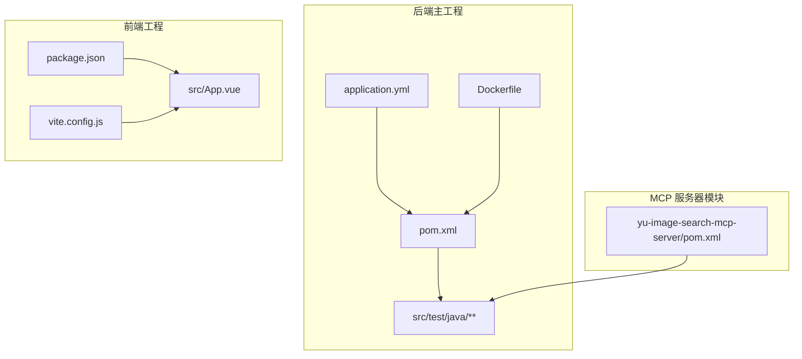
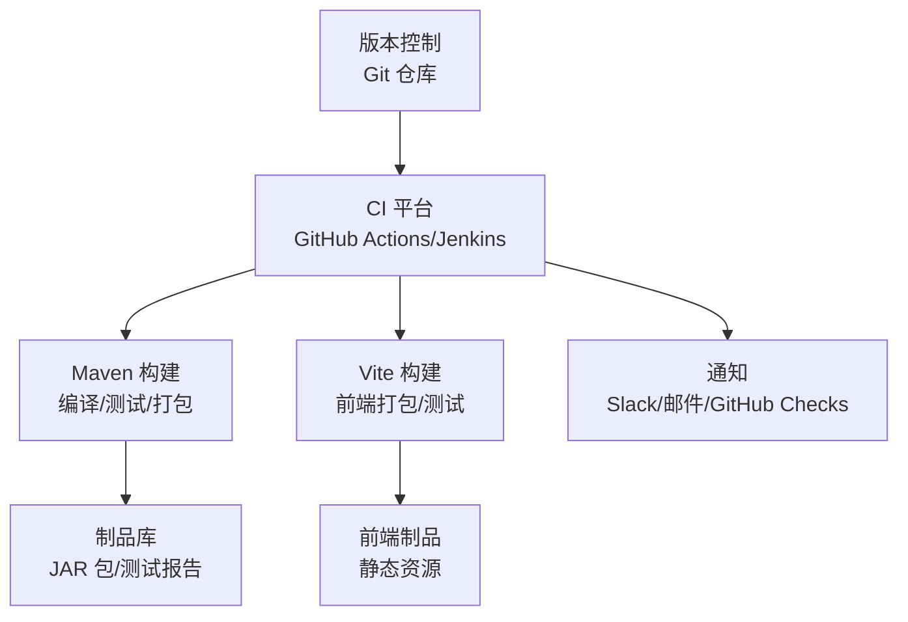
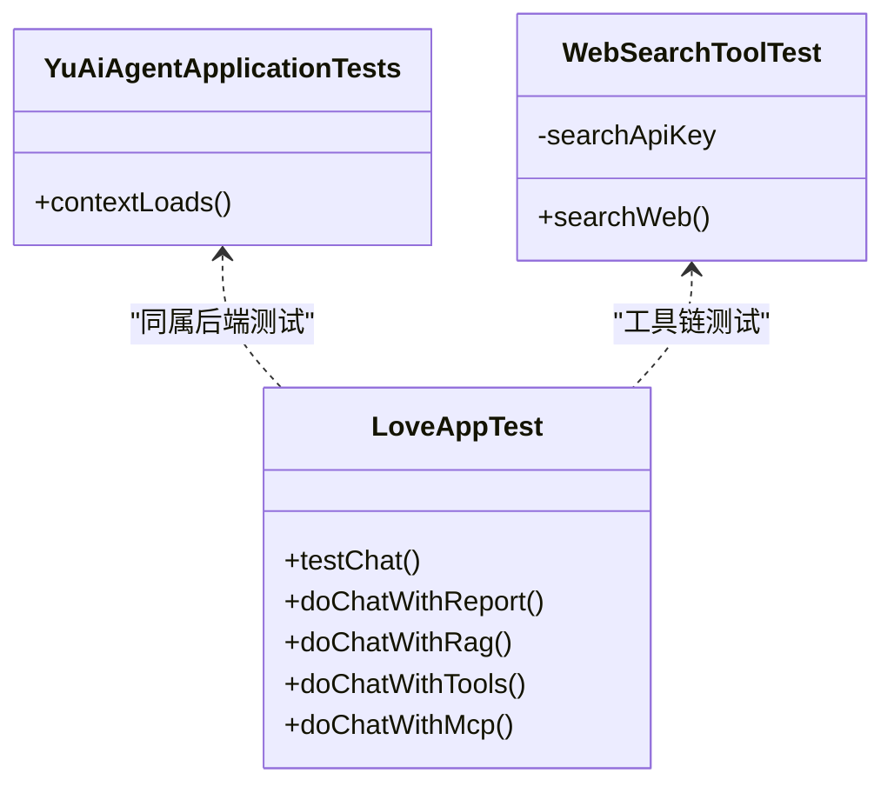
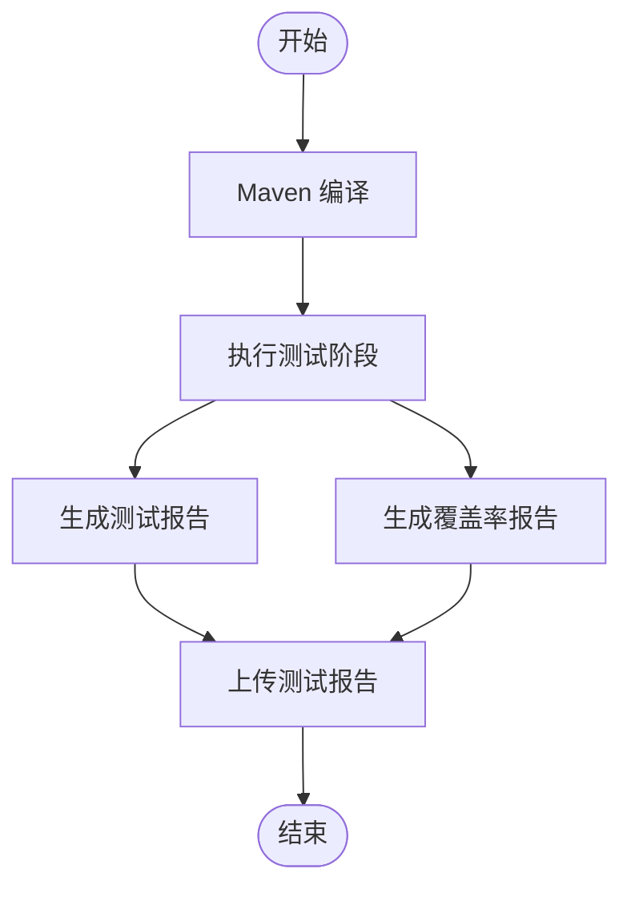
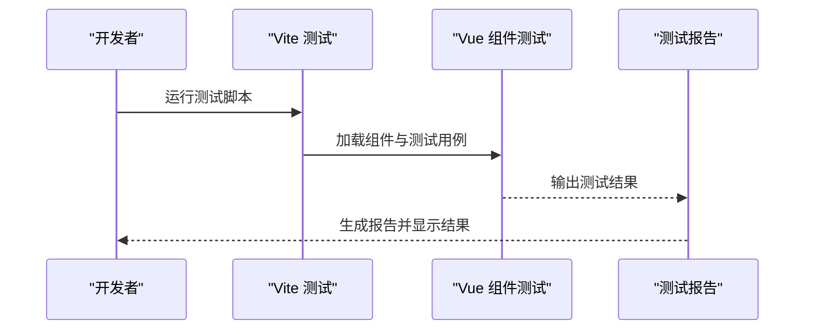
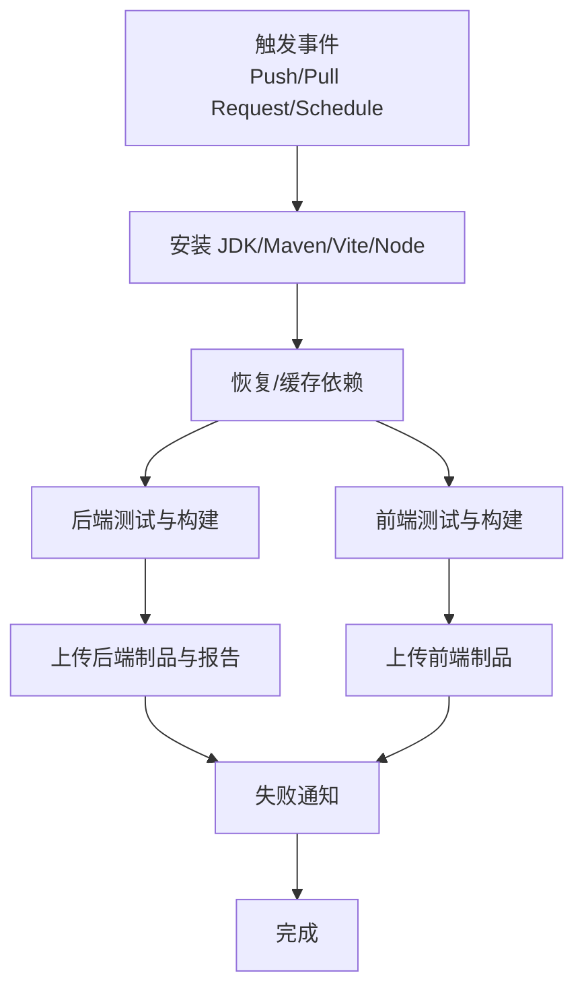
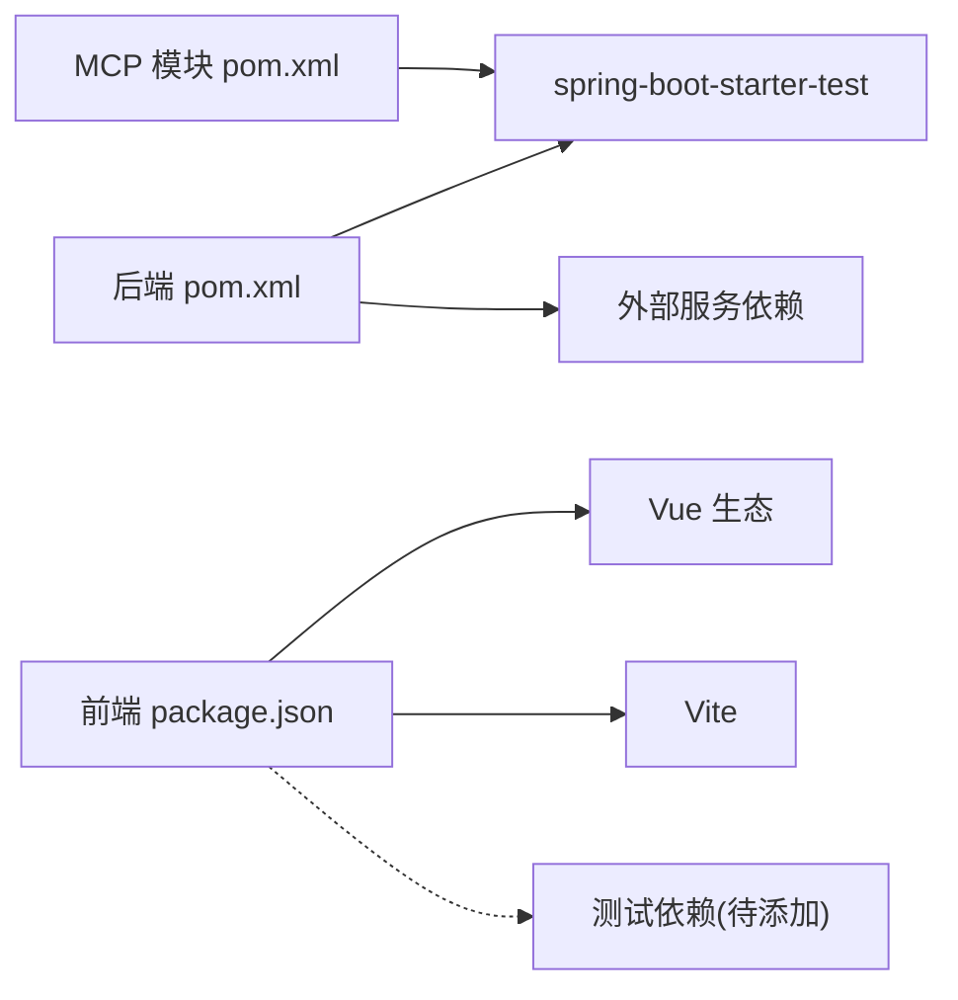

# 测试自动化

<cite>
**本文引用的文件**
- [pom.xml](file://pom.xml)
- [Dockerfile](file://Dockerfile)
- [application.yml](file://src/main/resources/application.yml)
- [application-prod.yml](file://src/main/resources/application-prod.yml)
- [vite.config.js](file://yu-ai-agent-frontend/vite.config.js)
- [package.json](file://yu-ai-agent-frontend/package.json)
- [App.vue](file://yu-ai-agent-frontend/src/App.vue)
- [YuAiAgentApplicationTests.java](file://src/test/java/com/yupi/yuaiagent/YuAiAgentApplicationTests.java)
- [LoveAppTest.java](file://src/test/java/com/yupi/yuaiagent/app/LoveAppTest.java)
- [WebSearchToolTest.java](file://src/test/java/com/yupi/yuaiagent/tools/WebSearchToolTest.java)
- [yu-image-search-mcp-server/pom.xml](file://yu-image-search-mcp-server/pom.xml)
</cite>

## 目录
1. [简介](#简介)
2. [项目结构](#项目结构)
3. [核心组件](#核心组件)
4. [架构总览](#架构总览)
5. [详细组件分析](#详细组件分析)
6. [依赖分析](#依赖分析)
7. [性能考虑](#性能考虑)
8. [故障排查指南](#故障排查指南)
9. [结论](#结论)
10. [附录](#附录)

## 简介
本指南面向在 CI/CD 流水线中实施测试自动化的团队，结合当前代码库现状，系统讲解后端与前端测试的配置与执行策略，并给出可落地的流水线集成建议。内容涵盖：
- Maven 测试配置与执行策略（测试阶段、报告、覆盖率）
- 前端 Vite 测试配置与 Vue 组件测试自动化
- CI 平台集成（GitHub Actions、Jenkins）的参考模板
- 测试环境自动化（Docker 容器化、数据库初始化、外部服务 Mock）
- 测试报告生成与分析、失败通知机制
- 标准化与自动化执行的最佳实践

## 项目结构
该项目采用多模块结构，包含后端主工程与前端工程，以及一个独立的 MCP 服务器模块。测试主要集中在后端 Java 工程与前端 Vue 工程中。

图表来源
- [pom.xml](file://pom.xml)
- [application.yml](file://src/main/resources/application.yml)
- [Dockerfile](file://Dockerfile)
- [vite.config.js](file://yu-ai-agent-frontend/vite.config.js)
- [package.json](file://yu-ai-agent-frontend/package.json)
- [App.vue](file://yu-ai-agent-frontend/src/App.vue)
- [yu-image-search-mcp-server/pom.xml](file://yu-image-search-mcp-server/pom.xml)

章节来源
- [pom.xml](file://pom.xml)
- [application.yml](file://src/main/resources/application.yml)
- [Dockerfile](file://Dockerfile)
- [vite.config.js](file://yu-ai-agent-frontend/vite.config.js)
- [package.json](file://yu-ai-agent-frontend/package.json)
- [App.vue](file://yu-ai-agent-frontend/src/App.vue)
- [yu-image-search-mcp-server/pom.xml](file://yu-image-search-mcp-server/pom.xml)

## 核心组件
- 后端测试基座：基于 JUnit 5 的 Spring Boot 测试，使用 @SpringBootTest 注解加载上下文，覆盖工具类、应用编排、RAG、MCP 等模块。
- 前端测试基座：基于 Vite 的 Vue 3 应用，当前未发现测试脚本或测试依赖，具备扩展空间。
- 构建与运行：Maven 多模块构建；Dockerfile 提供基于 Maven 的打包与运行命令。
- 配置管理：application.yml 提供默认配置，支持本地/生产 profile 切换。

章节来源
- [YuAiAgentApplicationTests.java](file://src/test/java/com/yupi/yuaiagent/YuAiAgentApplicationTests.java)
- [LoveAppTest.java](file://src/test/java/com/yupi/yuaiagent/app/LoveAppTest.java)
- [WebSearchToolTest.java](file://src/test/java/com/yupi/yuaiagent/tools/WebSearchToolTest.java)
- [pom.xml](file://pom.xml)
- [application.yml](file://src/main/resources/application.yml)
- [Dockerfile](file://Dockerfile)
- [vite.config.js](file://yu-ai-agent-frontend/vite.config.js)
- [package.json](file://yu-ai-agent-frontend/package.json)

## 架构总览
下图展示测试在 CI/CD 中的典型位置与交互：

说明
- 后端通过 Maven 执行测试与打包；前端通过 Vite 执行测试与构建。
- 测试报告与制品上传至制品库，失败时触发通知。

## 详细组件分析

### 后端测试配置与执行策略
- 测试框架：JUnit 5 + Spring Boot Test
- 测试范围：应用上下文加载、业务流程（聊天、RAG、工具链）、外部服务调用（如网络搜索）
- 当前状态：已存在基础上下文测试与多个功能测试类；部分测试依赖外部 API Key，需在 CI 环境注入密钥

图表来源
- [YuAiAgentApplicationTests.java](file://src/test/java/com/yupi/yuaiagent/YuAiAgentApplicationTests.java)
- [LoveAppTest.java](file://src/test/java/com/yupi/yuaiagent/app/LoveAppTest.java)
- [WebSearchToolTest.java](file://src/test/java/com/yupi/yuaiagent/tools/WebSearchToolTest.java)

章节来源
- [YuAiAgentApplicationTests.java](file://src/test/java/com/yupi/yuaiagent/YuAiAgentApplicationTests.java)
- [LoveAppTest.java](file://src/test/java/com/yupi/yuaiagent/app/LoveAppTest.java)
- [WebSearchToolTest.java](file://src/test/java/com/yupi/yuaiagent/tools/WebSearchToolTest.java)

### Maven 测试配置与执行策略
- 测试阶段：Maven 默认在 test 阶段执行测试；当前 Dockerfile 在打包前跳过了测试执行，建议在 CI 中显式启用测试
- 依赖与插件：spring-boot-starter-test 提供测试依赖；maven-compiler-plugin 与 spring-boot-maven-plugin 用于编译与打包
- 建议增强点：
  - 在 CI 中使用 Maven Surefire/Failsafe 插件生成标准测试报告（XML/HTML）
  - 引入 JaCoCo 插件生成覆盖率报告，并上传至覆盖率平台
  - 将外部服务 API Key 通过环境变量或 Maven Properties 注入

图表来源
- [pom.xml](file://pom.xml)
- [Dockerfile](file://Dockerfile)

章节来源
- [pom.xml](file://pom.xml)
- [Dockerfile](file://Dockerfile)

### 前端测试自动化（Vite + Vue）
- 当前状态：前端工程未包含测试脚本与测试依赖；Vite 配置仅包含 Vue 插件与别名、开发服务器参数
- 建议方案：
  - 添加测试依赖（如 Vitest、@vue/test-utils），并在 package.json 中新增测试脚本
  - 配置 Vite 测试环境，按需模拟 API、路由与全局状态
  - 在 CI 中执行 npm run test（或对应脚本），并生成测试报告

图表来源
- [vite.config.js](file://yu-ai-agent-frontend/vite.config.js)
- [package.json](file://yu-ai-agent-frontend/package.json)
- [App.vue](file://yu-ai-agent-frontend/src/App.vue)

章节来源
- [vite.config.js](file://yu-ai-agent-frontend/vite.config.js)
- [package.json](file://yu-ai-agent-frontend/package.json)
- [App.vue](file://yu-ai-agent-frontend/src/App.vue)

### CI/CD 流水线集成方案
以下为通用流水线步骤，可在 GitHub Actions 或 Jenkins 中复用。请根据实际环境调整环境变量与制品库地址。

说明
- GitHub Actions：使用 actions/setup-java、maven、node 等 Action；分别执行后端与前端测试与构建
- Jenkins：使用 Pipeline Script，分阶段执行 Maven 与 Vite 命令，收集测试报告与覆盖率

## 依赖分析
- 后端依赖：spring-boot-starter-test 提供测试能力；外部服务依赖（DashScope、Ollama、PgVector、MCP）在测试中可能被调用
- 前端依赖：Vue 3、Vue Router、Axios、Vite、@vitejs/plugin-vue；当前缺少测试相关依赖
- Docker：主工程 Dockerfile 使用 Maven 打包，跳过了测试；建议在 CI 中显式执行测试后再打包

图表来源
- [pom.xml](file://pom.xml)
- [yu-image-search-mcp-server/pom.xml](file://yu-image-search-mcp-server/pom.xml)
- [package.json](file://yu-ai-agent-frontend/package.json)

章节来源
- [pom.xml](file://pom.xml)
- [yu-image-search-mcp-server/pom.xml](file://yu-image-search-mcp-server/pom.xml)
- [package.json](file://yu-ai-agent-frontend/package.json)

## 性能考虑
- 测试并行：在 CI 中合理拆分后端与前端任务，避免串行等待
- 依赖缓存：缓存 Maven 与 npm 依赖，减少重复下载时间
- 测试隔离：将依赖外部服务的测试标记为可选或使用 Mock，降低不稳定因素
- 报告聚合：统一测试报告格式，便于在制品库中快速定位失败用例

## 故障排查指南
- 外部服务密钥缺失：后端测试依赖的 API Key 未注入导致失败。请在 CI 环境变量中配置相应密钥，并在 application.yml 中通过占位符引用
- 数据库/向量库不可用：RAG 与向量存储相关测试需要数据库可用。建议在 CI 中使用容器化数据库或内存数据库进行测试
- 前端测试缺失：当前前端未包含测试脚本。请按“前端测试自动化”章节补充 Vitest 与组件测试
- Docker 打包跳过测试：主工程 Dockerfile 显式跳过了测试。建议在 CI 中先执行测试再打包

章节来源
- [application.yml](file://src/main/resources/application.yml)
- [Dockerfile](file://Dockerfile)
- [vite.config.js](file://yu-ai-agent-frontend/vite.config.js)
- [package.json](file://yu-ai-agent-frontend/package.json)

## 结论
当前代码库已具备后端测试的基础骨架，前端测试尚未落地。通过在 CI 中规范化执行后端与前端测试、生成统一报告、接入覆盖率与通知机制，可显著提升质量与交付效率。建议优先补齐前端测试与覆盖率配置，再完善后端外部依赖的 Mock 与数据库容器化方案。

## 附录
- 测试报告与覆盖率建议
  - 后端：Maven Surefire + JaCoCo，输出 XML/HTML 报告并上传制品库
  - 前端：Vitest + @vitest/ui 或 jest（如需），生成 JUnit/XML 报告以便 CI 统一处理
- 通知机制
  - GitHub Actions：使用 post steps 或第三方集成（如 Slack/GitHub Checks）
  - Jenkins：使用 Email/Slack 插件或 GitHub Checks Publisher
- 环境准备
  - 使用 docker-compose 启动数据库与外部服务（如需要），或在 CI 中使用服务容器
  - 对于外部 API，建议在 CI 中使用 Mock 服务或条件性跳过不稳定测试