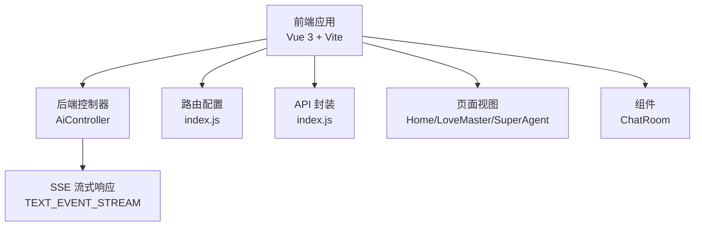
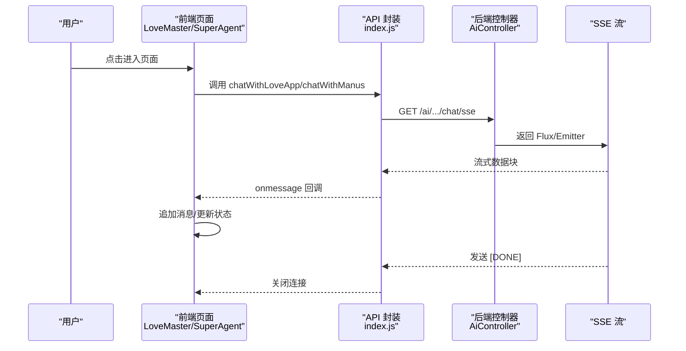
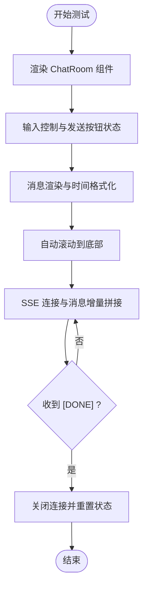
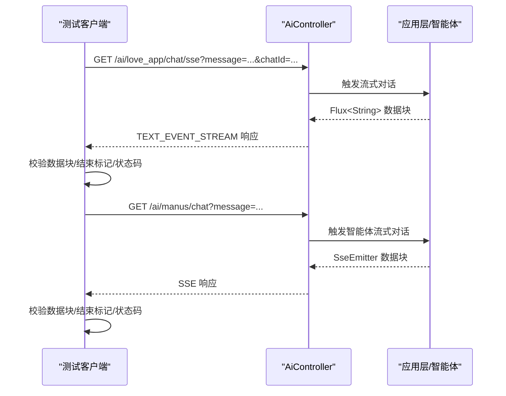
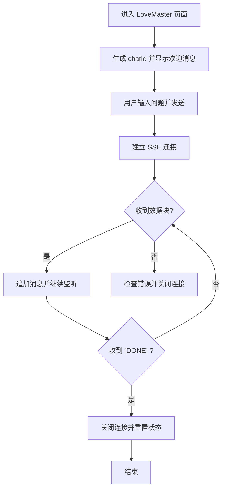
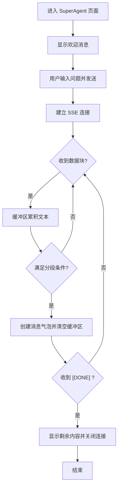
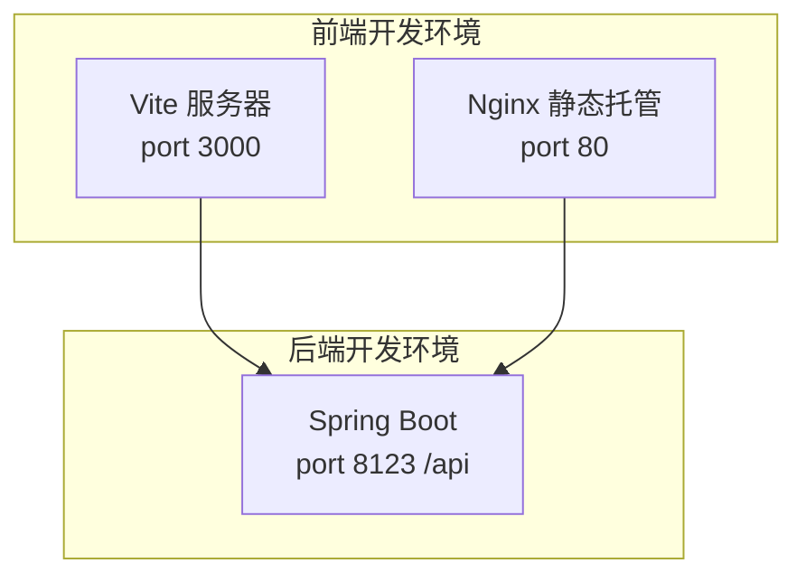
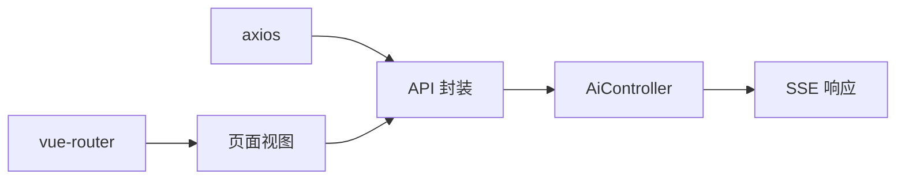

# 端到端测试

<cite>
**本文引用的文件**   
- [README.md](file://README.md)
- [application.yml](file://src/main/resources/application.yml)
- [AiController.java](file://src/main/java/com/yupi/yuaiagent/controller/AiController.java)
- [index.js](file://yu-ai-agent-frontend/src/api/index.js)
- [index.js](file://yu-ai-agent-frontend/src/router/index.js)
- [Home.vue](file://yu-ai-agent-frontend/src/views/Home.vue)
- [LoveMaster.vue](file://yu-ai-agent-frontend/src/views/LoveMaster.vue)
- [SuperAgent.vue](file://yu-ai-agent-frontend/src/views/SuperAgent.vue)
- [ChatRoom.vue](file://yu-ai-agent-frontend/src/components/ChatRoom.vue)
- [vite.config.js](file://yu-ai-agent-frontend/vite.config.js)
- [Dockerfile（前端）](file://yu-ai-agent-frontend/Dockerfile)
- [Dockerfile（后端）](file://Dockerfile)
- [YuAiAgentApplicationTests.java](file://src/test/java/com/yupi/yuaiagent/YuAiAgentApplicationTests.java)
- [LoveAppTest.java](file://src/test/java/com/yupi/yuaiagent/app/LoveAppTest.java)
</cite>

## 目录
1. [简介](#简介)
2. [项目结构](#项目结构)
3. [核心组件](#核心组件)
4. [架构总览](#架构总览)
5. [详细组件分析](#详细组件分析)
6. [依赖分析](#依赖分析)
7. [性能考虑](#性能考虑)
8. [故障排查指南](#故障排查指南)
9. [结论](#结论)
10. [附录](#附录)

## 简介
本文件面向“端到端测试”的系统化落地，覆盖从前端用户界面到后端服务的完整测试流程。内容包括：
- 前端界面测试方法：Vue 组件测试、用户交互测试、响应式设计测试
- 后端 API 端到端测试：请求发送、SSE 流式响应验证、状态码与异常处理
- 用户场景测试用例：情感咨询对话流程、智能体交互流程
- 测试数据准备与管理：测试用户、会话标识、对话历史
- 测试环境搭建与配置：前后端联调、数据库与外部服务 Mock
- 自动化测试脚本编写与执行方法

## 项目结构
该项目采用前后端分离架构：
- 后端：Spring Boot 应用，提供 REST 接口与 SSE 流式输出
- 前端：Vue 3 + Vite 应用，通过 Axios 与 EventSource 进行交互
- 配置：后端通过 application.yml 管理 API 基础路径、日志级别、第三方服务密钥等；前端通过环境变量与路由配置区分开发/生产

图表来源
- [AiController.java:18-105](file://src/main/java/com/yupi/yuaiagent/controller/AiController.java#L18-L105)
- [index.js:1-60](file://yu-ai-agent-frontend/src/api/index.js#L1-L60)
- [index.js:1-47](file://yu-ai-agent-frontend/src/router/index.js#L1-L47)
- [Home.vue:1-524](file://yu-ai-agent-frontend/src/views/Home.vue#L1-L524)
- [LoveMaster.vue:1-244](file://yu-ai-agent-frontend/src/views/LoveMaster.vue#L1-L244)
- [SuperAgent.vue:1-286](file://yu-ai-agent-frontend/src/views/SuperAgent.vue#L1-L286)
- [ChatRoom.vue:1-392](file://yu-ai-agent-frontend/src/components/ChatRoom.vue#L1-L392)

章节来源
- [application.yml:1-66](file://src/main/resources/application.yml#L1-L66)
- [vite.config.js:1-18](file://yu-ai-agent-frontend/vite.config.js#L1-L18)

## 核心组件
- 后端控制器 AiController：提供恋爱咨询与智能体对话的同步与 SSE 接口
- 前端 API 封装：统一管理后端 API 基础路径、SSE 连接封装
- 路由与页面：Home、LoveMaster、SuperAgent 三个页面承载主要用户场景
- 聊天组件 ChatRoom：负责消息渲染、输入控制、滚动与连接状态展示
- 配置与容器：后端 application.yml、前后端 Dockerfile 与前端 vite.config.js

章节来源
- [AiController.java:18-105](file://src/main/java/com/yupi/yuaiagent/controller/AiController.java#L18-L105)
- [index.js:1-60](file://yu-ai-agent-frontend/src/api/index.js#L1-L60)
- [index.js:1-47](file://yu-ai-agent-frontend/src/router/index.js#L1-L47)
- [Home.vue:1-524](file://yu-ai-agent-frontend/src/views/Home.vue#L1-L524)
- [LoveMaster.vue:1-244](file://yu-ai-agent-frontend/src/views/LoveMaster.vue#L1-L244)
- [SuperAgent.vue:1-286](file://yu-ai-agent-frontend/src/views/SuperAgent.vue#L1-L286)
- [ChatRoom.vue:1-392](file://yu-ai-agent-frontend/src/components/ChatRoom.vue#L1-L392)
- [application.yml:1-66](file://src/main/resources/application.yml#L1-L66)
- [vite.config.js:1-18](file://yu-ai-agent-frontend/vite.config.js#L1-L18)
- [Dockerfile（前端）:1-17](file://yu-ai-agent-frontend/Dockerfile#L1-L17)
- [Dockerfile（后端）:1-16](file://Dockerfile#L1-L16)

## 架构总览
端到端测试的关键路径：
- 用户在 Home 页面选择“AI恋爱大师”或“AI超级智能体”
- 前端路由跳转至对应页面，页面通过 API 封装发起 SSE 请求
- 后端 AiController 接收请求，调用应用层逻辑并返回 Flux/Emitter
- 前端 EventSource 接收流式数据，逐步渲染消息气泡
- 测试关注点：请求路径正确、SSE 连接建立、消息增量拼接、最终标记、错误处理与断开

图表来源
- [index.js:14-60](file://yu-ai-agent-frontend/src/api/index.js#L14-L60)
- [AiController.java:50-104](file://src/main/java/com/yupi/yuaiagent/controller/AiController.java#L50-L104)

## 详细组件分析

### 前端组件与交互测试
- Vue 组件测试要点
  - ChatRoom：校验消息渲染、时间格式化、输入禁用与发送按钮状态、自动滚动行为
  - LoveMaster/SuperAgent：校验会话 ID 生成、欢迎消息、SSE 连接状态、消息增量拼接、错误状态与断开
- 用户交互测试要点
  - 键盘事件（Enter 发送）、按钮点击禁用态、输入框高度限制
  - 不同 AI 类型下的头像与样式差异
- 响应式设计测试要点
  - 在不同断点下检查消息气泡布局、输入框高度、头像尺寸与时间对齐

图表来源
- [ChatRoom.vue:55-120](file://yu-ai-agent-frontend/src/components/ChatRoom.vue#L55-L120)
- [LoveMaster.vue:69-107](file://yu-ai-agent-frontend/src/views/LoveMaster.vue#L69-L107)
- [SuperAgent.vue:64-157](file://yu-ai-agent-frontend/src/views/SuperAgent.vue#L64-L157)

章节来源
- [ChatRoom.vue:1-392](file://yu-ai-agent-frontend/src/components/ChatRoom.vue#L1-L392)
- [LoveMaster.vue:1-244](file://yu-ai-agent-frontend/src/views/LoveMaster.vue#L1-L244)
- [SuperAgent.vue:1-286](file://yu-ai-agent-frontend/src/views/SuperAgent.vue#L1-L286)

### 后端 API 端到端测试
- 接口定义与行为
  - 恋爱大师：/ai/love_app/chat/sync、/ai/love_app/chat/sse、/ai/love_app/chat/server_sent_event、/ai/love_app/chat/sse_emitter
  - 智能体：/ai/manus/chat
- 测试关注点
  - 请求路径与 HTTP 方法正确性
  - SSE 响应数据块逐段到达，最终包含结束标记
  - 连接超时与异常处理（如 IO 异常）
  - 响应头 Content-Type 与流式传输特性

图表来源
- [AiController.java:38-104](file://src/main/java/com/yupi/yuaiagent/controller/AiController.java#L38-L104)

章节来源
- [AiController.java:18-105](file://src/main/java/com/yupi/yuaiagent/controller/AiController.java#L18-L105)

### 用户场景测试用例

#### 场景一：情感咨询对话流程（恋爱大师）
- 步骤
  - 打开 Home，点击“AI恋爱大师”
  - 自动生成 chatId，显示欢迎消息
  - 输入问题，触发 SSE 连接
  - 逐步接收增量消息，直至收到结束标记
  - 校验连接状态变化与最终断开
- 断言
  - 首条消息为欢迎语
  - 消息按增量拼接，无重复
  - 收到结束标记后连接关闭
  - 错误情况下连接状态为 error 并关闭

图表来源
- [LoveMaster.vue:55-128](file://yu-ai-agent-frontend/src/views/LoveMaster.vue#L55-L128)
- [index.js:47-55](file://yu-ai-agent-frontend/src/api/index.js#L47-L55)

章节来源
- [LoveMaster.vue:1-244](file://yu-ai-agent-frontend/src/views/LoveMaster.vue#L1-L244)
- [index.js:1-60](file://yu-ai-agent-frontend/src/api/index.js#L1-L60)

#### 场景二：智能体交互流程（超级智能体）
- 步骤
  - 打开 Home，点击“AI超级智能体”
  - 显示欢迎消息
  - 输入问题，触发 SSE 连接
  - 按中文句号/换行/长度阈值分段显示消息气泡
  - 最终聚合剩余内容并关闭连接
- 断言
  - 首条消息立即显示
  - 气泡出现最小间隔时间
  - 最终气泡类型区分（最终/错误）

图表来源
- [SuperAgent.vue:64-157](file://yu-ai-agent-frontend/src/views/SuperAgent.vue#L64-L157)
- [index.js:52-55](file://yu-ai-agent-frontend/src/api/index.js#L52-L55)

章节来源
- [SuperAgent.vue:1-286](file://yu-ai-agent-frontend/src/views/SuperAgent.vue#L1-L286)
- [index.js:1-60](file://yu-ai-agent-frontend/src/api/index.js#L1-L60)

### 测试数据准备与管理
- 测试用户与会话
  - 前端：随机生成 chatId（恋爱大师场景），作为会话标识
  - 后端：控制器接口接受 chatId 参数，用于应用层会话管理
- 对话历史
  - 前端：维护消息数组，包含内容、是否用户、时间戳
  - 后端：应用层负责根据 chatId 维护上下文与历史
- 外部服务与密钥
  - application.yml 中配置第三方 API 密钥与模型参数，测试时可替换为测试密钥或 Mock

章节来源
- [LoveMaster.vue:55-58](file://yu-ai-agent-frontend/src/views/LoveMaster.vue#L55-L58)
- [AiController.java:38-104](file://src/main/java/com/yupi/yuaiagent/controller/AiController.java#L38-L104)
- [application.yml:11-21](file://src/main/resources/application.yml#L11-L21)

### 测试环境搭建与配置
- 前端
  - Vite 开发服务器端口 3000，跨域启用
  - 生产环境使用相对路径访问后端 /api
- 后端
  - 服务端口 8123，context-path 为 /api
  - 日志级别可调至 DEBUG 查看 Spring AI 调用细节
- 容器化
  - 前端：Nginx 托管构建产物，暴露 80 端口
  - 后端：Java -jar 启动，激活 prod profile

图表来源
- [vite.config.js:13-16](file://yu-ai-agent-frontend/vite.config.js#L13-L16)
- [application.yml:38-41](file://src/main/resources/application.yml#L38-L41)
- [Dockerfile（前端）:8-17](file://yu-ai-agent-frontend/Dockerfile#L8-L17)
- [Dockerfile（后端）:12-16](file://Dockerfile#L12-L16)

章节来源
- [vite.config.js:1-18](file://yu-ai-agent-frontend/vite.config.js#L1-L18)
- [application.yml:1-66](file://src/main/resources/application.yml#L1-L66)
- [Dockerfile（前端）:1-17](file://yu-ai-agent-frontend/Dockerfile#L1-L17)
- [Dockerfile（后端）:1-16](file://Dockerfile#L1-L16)

### 自动化测试脚本编写与执行
- 前端自动化建议
  - 使用 Vitest + Vue Test Utils 对组件进行单元测试
  - 使用 Playwright/Cypress 进行端到端交互测试，模拟用户点击、输入、SSE 接收
- 后端自动化建议
  - 使用 Spring Boot Test 启动上下文，结合 Mock 或测试专用配置
  - 使用 REST Assured/HttpClient 验证 SSE 流式响应与结束标记
- 示例执行
  - 后端：运行 Spring Boot 测试入口类，或使用 Maven/Gradle 执行测试
  - 前端：npm run dev 启动 Vite，再运行测试脚本

章节来源
- [YuAiAgentApplicationTests.java:1-14](file://src/test/java/com/yupi/yuaiagent/YuAiAgentApplicationTests.java#L1-L14)
- [LoveAppTest.java:37-70](file://src/test/java/com/yupi/yuaiagent/app/LoveAppTest.java#L37-L70)

## 依赖分析
- 前端依赖
  - axios：HTTP 请求与 SSE 封装
  - vue-router：页面路由与元信息
  - vite：开发与构建工具
- 后端依赖
  - Spring MVC/SSE：提供 TEXT_EVENT_STREAM 响应
  - Spring AI：集成大模型与工具调用（测试中可替换为 Mock）
- 配置耦合
  - application.yml 控制后端端口、上下文路径、第三方密钥
  - 前端 API 基础路径与后端 /api 保持一致

图表来源
- [index.js:1-60](file://yu-ai-agent-frontend/src/api/index.js#L1-L60)
- [index.js:1-47](file://yu-ai-agent-frontend/src/router/index.js#L1-L47)
- [AiController.java:18-105](file://src/main/java/com/yupi/yuaiagent/controller/AiController.java#L18-L105)

章节来源
- [index.js:1-60](file://yu-ai-agent-frontend/src/api/index.js#L1-L60)
- [index.js:1-47](file://yu-ai-agent-frontend/src/router/index.js#L1-L47)
- [AiController.java:18-105](file://src/main/java/com/yupi/yuaiagent/controller/AiController.java#L18-L105)

## 性能考虑
- SSE 连接与背压
  - 前端按块接收并增量渲染，避免一次性渲染大量 DOM
  - 后端 Flux/Emitter 应保证数据块大小合理，避免过长延迟
- 响应式布局
  - 在移动端断点下减少重排与重绘，优先使用 transform/opacity
- 资源与网络
  - 前端静态资源通过 Nginx 缓存，减少带宽占用
  - 后端日志级别在测试时适度降低，避免影响性能

## 故障排查指南
- 常见问题
  - SSE 连接失败：检查后端 /api 前缀与跨域配置
  - 消息不显示：确认前端 onmessage 回调与 [DONE] 标记处理
  - 端口冲突：确认 Vite（3000）与 Spring Boot（8123）端口未被占用
- 日志与诊断
  - application.yml 中开启 DEBUG 日志，观察 Spring AI 调用链
  - 前端控制台检查 EventSource 错误回调与网络面板

章节来源
- [application.yml:64-66](file://src/main/resources/application.yml#L64-L66)
- [index.js:38-44](file://yu-ai-agent-frontend/src/api/index.js#L38-L44)

## 结论
通过将前端组件测试、用户交互测试与后端 API 端到端测试相结合，并围绕 SSE 流式响应与会话管理进行专项验证，可有效保障“情感咨询对话流程”“智能体交互流程”等关键场景的稳定性与一致性。配合合理的测试数据管理与环境配置，能够快速定位问题并提升回归效率。

## 附录
- 快速参考
  - 前端开发：npm run dev（Vite），端口 3000
  - 后端开发：Spring Boot，默认端口 8123，上下文 /api
  - 生产部署：前后端分别使用 Dockerfile 构建与 Nginx 托管
- 相关文档
  - 项目整体介绍与学习大纲参见 [README.md:1-299](file://README.md#L1-L299)