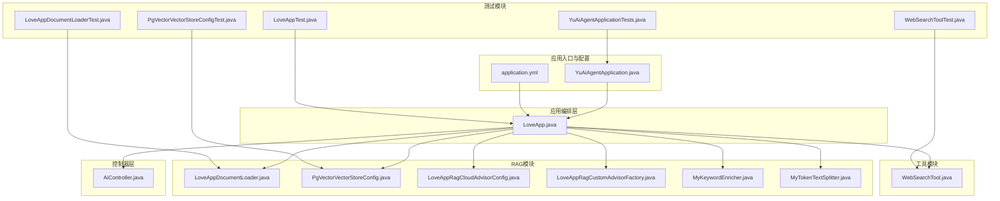
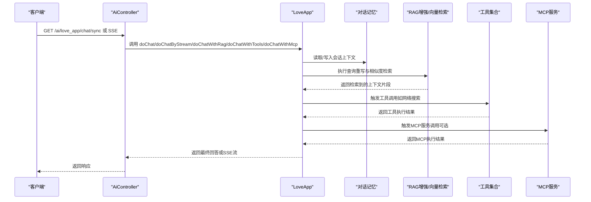
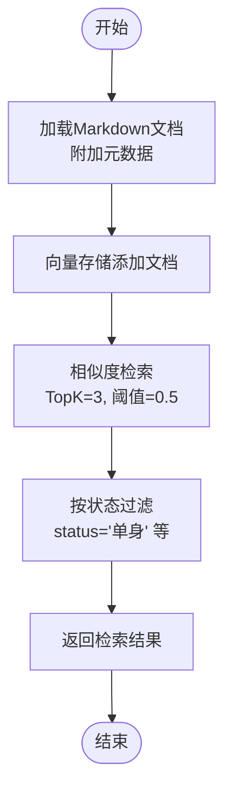
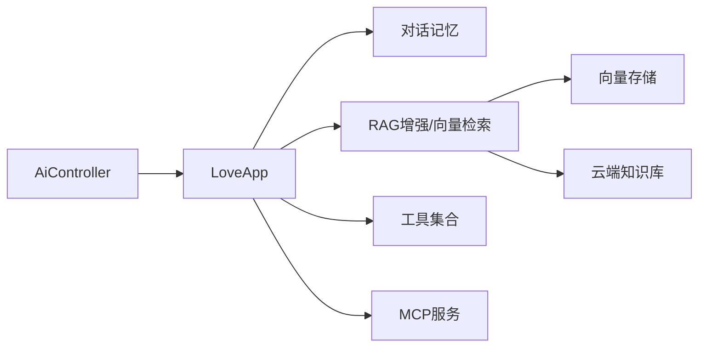

# 集成测试

<cite>
**本文引用的文件**
- [YuAiAgentApplication.java](file://src/main/java/com/yupi/yuaiagent/YuAiAgentApplication.java)
- [application.yml](file://src/main/resources/application.yml)
- [LoveApp.java](file://src/main/java/com/yupi/yuaiagent/app/LoveApp.java)
- [AiController.java](file://src/main/java/com/yupi/yuaiagent/controller/AiController.java)
- [LoveAppDocumentLoader.java](file://src/main/java/com/yupi/yuaiagent/rag/LoveAppDocumentLoader.java)
- [PgVectorVectorStoreConfig.java](file://src/main/java/com/yupi/yuaiagent/rag/PgVectorVectorStoreConfig.java)
- [LoveAppRagCloudAdvisorConfig.java](file://src/main/java/com/yupi/yuaiagent/rag/LoveAppRagCloudAdvisorConfig.java)
- [LoveAppRagCustomAdvisorFactory.java](file://src/main/java/com/yupi/yuaiagent/rag/LoveAppRagCustomAdvisorFactory.java)
- [MyKeywordEnricher.java](file://src/main/java/com/yupi/yuaiagent/rag/MyKeywordEnricher.java)
- [MyTokenTextSplitter.java](file://src/main/java/com/yupi/yuaiagent/rag/MyTokenTextSplitter.java)
- [WebSearchTool.java](file://src/main/java/com/yupi/yuaiagent/tools/WebSearchTool.java)
- [YuAiAgentApplicationTests.java](file://src/test/java/com/yupi/yuaiagent/YuAiAgentApplicationTests.java)
- [LoveAppTest.java](file://src/test/java/com/yupi/yuaiagent/app/LoveAppTest.java)
- [LoveAppDocumentLoaderTest.java](file://src/test/java/com/yupi/yuaiagent/rag/LoveAppDocumentLoaderTest.java)
- [PgVectorVectorStoreConfigTest.java](file://src/test/java/com/yupi/yuaiagent/rag/PgVectorVectorStoreConfigTest.java)
- [WebSearchToolTest.java](file://src/test/java/com/yupi/yuaiagent/tools/WebSearchToolTest.java)
</cite>

## 目录
1. [引言](#引言)
2. [项目结构](#项目结构)
3. [核心组件](#核心组件)
4. [架构总览](#架构总览)
5. [详细组件分析](#详细组件分析)
6. [依赖分析](#依赖分析)
7. [性能考虑](#性能考虑)
8. [故障排查指南](#故障排查指南)
9. [结论](#结论)
10. [附录](#附录)

## 引言
本文件面向RAG系统、向量存储、文档加载等核心模块，提供一套完整的集成测试设计与实施指南。重点覆盖以下方面：
- 组件间交互测试：工具调用链路、API接口集成、数据库连接与向量检索
- 端到端测试方法：从文档加载、向量嵌入、查询检索到最终回答的完整流程
- 测试场景与数据准备：真实业务场景下的输入输出期望、Mock策略与外部服务替代
- 测试环境搭建：数据库初始化、配置开关、外部服务Mock与本地化运行
- 性能与压力测试：吞吐、延迟、并发与资源占用评估方法
- 可靠性保障：错误处理、超时控制、降级策略与可观测性

## 项目结构
该项目采用Spring Boot工程，核心模块包括：
- 应用入口与配置：应用启动类、全局配置文件
- 应用编排层：AI应用编排器负责对话、RAG增强、工具调用、MCP集成
- 控制器层：对外提供REST接口，支持同步与SSE流式响应
- RAG模块：文档加载、向量存储配置、检索增强顾问、关键词增强与文本切分
- 工具模块：网络搜索、网页抓取、文件操作、终端执行、PDF生成等
- 测试模块：单元与集成测试覆盖上述组件

图表来源
- [YuAiAgentApplication.java:1-18](file://src/main/java/com/yupi/yuaiagent/YuAiAgentApplication.java#L1-L18)
- [application.yml:1-66](file://src/main/resources/application.yml#L1-L66)
- [LoveApp.java:1-227](file://src/main/java/com/yupi/yuaiagent/app/LoveApp.java#L1-L227)
- [AiController.java:1-106](file://src/main/java/com/yupi/yuaiagent/controller/AiController.java#L1-L106)
- [LoveAppDocumentLoader.java:1-56](file://src/main/java/com/yupi/yuaiagent/rag/LoveAppDocumentLoader.java#L1-L56)
- [PgVectorVectorStoreConfig.java:1-41](file://src/main/java/com/yupi/yuaiagent/rag/PgVectorVectorStoreConfig.java#L1-L41)
- [LoveAppRagCloudAdvisorConfig.java:1-39](file://src/main/java/com/yupi/yuaiagent/rag/LoveAppRagCloudAdvisorConfig.java#L1-L39)
- [LoveAppRagCustomAdvisorFactory.java:1-41](file://src/main/java/com/yupi/yuaiagent/rag/LoveAppRagCustomAdvisorFactory.java#L1-L41)
- [MyKeywordEnricher.java:1-25](file://src/main/java/com/yupi/yuaiagent/rag/MyKeywordEnricher.java#L1-L25)
- [MyTokenTextSplitter.java:1-24](file://src/main/java/com/yupi/yuaiagent/rag/MyTokenTextSplitter.java#L1-L24)
- [WebSearchTool.java:1-54](file://src/main/java/com/yupi/yuaiagent/tools/WebSearchTool.java#L1-L54)
- [YuAiAgentApplicationTests.java:1-14](file://src/test/java/com/yupi/yuaiagent/YuAiAgentApplicationTests.java#L1-L14)
- [LoveAppTest.java:1-88](file://src/test/java/com/yupi/yuaiagent/app/LoveAppTest.java#L1-L88)
- [LoveAppDocumentLoaderTest.java:1-19](file://src/test/java/com/yupi/yuaiagent/rag/LoveAppDocumentLoaderTest.java#L1-L19)
- [PgVectorVectorStoreConfigTest.java:1-33](file://src/test/java/com/yupi/yuaiagent/rag/PgVectorVectorStoreConfigTest.java#L1-L33)
- [WebSearchToolTest.java:1-24](file://src/test/java/com/yupi/yuaiagent/tools/WebSearchToolTest.java#L1-L24)

章节来源
- [YuAiAgentApplication.java:1-18](file://src/main/java/com/yupi/yuaiagent/YuAiAgentApplication.java#L1-L18)
- [application.yml:1-66](file://src/main/resources/application.yml#L1-L66)

## 核心组件
- 应用入口与配置
  - 应用启动类排除默认数据源自动配置，便于开发调试与按需启用PgVector
  - 全局配置文件定义DashScope API密钥、Ollama基础地址、服务端口、OpenAPI文档路径、日志级别等
- AI应用编排器
  - 负责构建ChatClient、设置系统提示、对话记忆、Advisor链路（日志、重读、RAG增强、工具回调）
  - 支持普通对话、流式SSE、结构化输出、RAG问答、工具调用、MCP服务调用
- 控制器层
  - 对外提供REST接口，支持同步与SSE流式响应，便于前端集成
- RAG模块
  - 文档加载器：从classpath:document目录加载Markdown文档并附加元数据
  - 向量存储配置：基于PgVector的向量存储，支持维度、距离类型、索引类型、批量大小等参数
  - 检索增强顾问：支持云端知识库检索与自定义向量检索增强
  - 关键词增强与文本切分：为文档补充关键词元信息并按Token切分
- 工具模块
  - 网络搜索工具：封装SearchAPI，返回结构化搜索结果片段
- 测试模块
  - 应用上下文加载测试、应用功能测试、文档加载测试、向量存储检索测试、工具调用测试

章节来源
- [YuAiAgentApplication.java:7-10](file://src/main/java/com/yupi/yuaiagent/YuAiAgentApplication.java#L7-L10)
- [application.yml:11-21](file://src/main/resources/application.yml#L11-L21)
- [LoveApp.java:27-62](file://src/main/java/com/yupi/yuaiagent/app/LoveApp.java#L27-L62)
- [AiController.java:18-106](file://src/main/java/com/yupi/yuaiagent/controller/AiController.java#L18-L106)
- [LoveAppDocumentLoader.java:18-56](file://src/main/java/com/yupi/yuaiagent/rag/LoveAppDocumentLoader.java#L18-L56)
- [PgVectorVectorStoreConfig.java:18-41](file://src/main/java/com/yupi/yuaiagent/rag/PgVectorVectorStoreConfig.java#L18-L41)
- [LoveAppRagCloudAdvisorConfig.java:17-39](file://src/main/java/com/yupi/yuaiagent/rag/LoveAppRagCloudAdvisorConfig.java#L17-L39)
- [LoveAppRagCustomAdvisorFactory.java:14-41](file://src/main/java/com/yupi/yuaiagent/rag/LoveAppRagCustomAdvisorFactory.java#L14-L41)
- [MyKeywordEnricher.java:14-25](file://src/main/java/com/yupi/yuaiagent/rag/MyKeywordEnricher.java#L14-L25)
- [MyTokenTextSplitter.java:12-24](file://src/main/java/com/yupi/yuaiagent/rag/MyTokenTextSplitter.java#L12-L24)
- [WebSearchTool.java:18-54](file://src/main/java/com/yupi/yuaiagent/tools/WebSearchTool.java#L18-L54)

## 架构总览
下图展示从HTTP请求到AI回答的端到端集成路径，涵盖对话记忆、RAG检索增强、工具调用与MCP服务。

图表来源
- [AiController.java:38-104](file://src/main/java/com/yupi/yuaiagent/controller/AiController.java#L38-L104)
- [LoveApp.java:71-225](file://src/main/java/com/yupi/yuaiagent/app/LoveApp.java#L71-L225)

## 详细组件分析

### 文档加载与向量存储集成测试
- 测试目标
  - 验证文档加载器从classpath:document目录正确加载Markdown文档并附加元数据
  - 验证向量存储初始化、文档入库、相似度检索与过滤条件生效
- 测试场景
  - 场景1：文档加载成功且返回非空文档列表
  - 场景2：向量存储添加示例文档后，相似度检索返回非空结果
  - 场景3：基于状态过滤的RAG增强顾问返回符合过滤条件的上下文
- 测试数据准备
  - 在classpath:document目录放置若干Markdown文件，文件名包含用于提取状态的标识位
  - 使用测试用的示例文档集合，确保包含不同主题与元信息
- Mock策略
  - 向量存储配置在测试中可选择性启用，避免对真实数据库的依赖
  - 使用内存向量存储或禁用向量存储以隔离数据库连接
- 关键流程图（向量检索）

图表来源
- [LoveAppDocumentLoader.java:32-54](file://src/main/java/com/yupi/yuaiagent/rag/LoveAppDocumentLoader.java#L32-L54)
- [PgVectorVectorStoreConfig.java:24-39](file://src/main/java/com/yupi/yuaiagent/rag/PgVectorVectorStoreConfig.java#L24-L39)
- [LoveAppRagCustomAdvisorFactory.java:23-39](file://src/main/java/com/yupi/yuaiagent/rag/LoveAppRagCustomAdvisorFactory.java#L23-L39)

章节来源
- [LoveAppDocumentLoaderTest.java:15-18](file://src/test/java/com/yupi/yuaiagent/rag/LoveAppDocumentLoaderTest.java#L15-L18)
- [PgVectorVectorStoreConfigTest.java:20-31](file://src/test/java/com/yupi/yuaiagent/rag/PgVectorVectorStoreConfigTest.java#L20-L31)
- [LoveAppRagCustomAdvisorFactory.java:23-39](file://src/main/java/com/yupi/yuaiagent/rag/LoveAppRagCustomAdvisorFactory.java#L23-L39)

### RAG检索增强与查询重写集成测试
- 测试目标
  - 验证查询重写提升检索质量
  - 验证RAG增强顾问链路（云端知识库/自定义向量检索/上下文增强）工作正常
- 测试场景
  - 场景1：普通RAG问答返回非空回答
  - 场景2：开启云端知识库检索增强后，回答包含外部知识片段
  - 场景3：开启自定义向量检索增强并按状态过滤，回答聚焦指定领域
- 测试数据准备
  - 准备包含恋爱主题的文档集合，确保向量存储中有足够覆盖度
  - 准备查询重写样例，验证重写前后语义一致性
- Mock策略
  - 云端知识库可通过配置切换为本地向量检索，避免外部依赖
  - 使用小规模向量存储与固定维度，缩短测试耗时

章节来源
- [LoveAppTest.java:40-46](file://src/test/java/com/yupi/yuaiagent/app/LoveAppTest.java#L40-L46)
- [LoveAppRagCloudAdvisorConfig.java:24-37](file://src/main/java/com/yupi/yuaiagent/rag/LoveAppRagCloudAdvisorConfig.java#L24-L37)
- [LoveAppRagCustomAdvisorFactory.java:23-39](file://src/main/java/com/yupi/yuaiagent/rag/LoveAppRagCustomAdvisorFactory.java#L23-L39)

### 工具调用链路集成测试
- 测试目标
  - 验证工具注册与回调机制，确保工具链路可被AI触发并返回结果
- 测试场景
  - 场景1：网络搜索工具返回非空搜索结果
  - 场景2：网页抓取、资源下载、终端操作、文件操作、PDF生成等工具可被触发
- 测试数据准备
  - 使用SearchAPI的测试密钥，准备典型查询关键词
  - 准备可访问的网页URL与可下载的资源链接
- Mock策略
  - 对外部HTTP服务进行Mock或使用稳定可用的测试服务
  - 对文件系统操作进行沙箱隔离，避免真实文件污染

章节来源
- [WebSearchToolTest.java:16-22](file://src/test/java/com/yupi/yuaiagent/tools/WebSearchToolTest.java#L16-L22)
- [WebSearchTool.java:29-52](file://src/main/java/com/yupi/yuaiagent/tools/WebSearchTool.java#L29-L52)
- [LoveAppTest.java:48-86](file://src/test/java/com/yupi/yuaiagent/app/LoveAppTest.java#L48-L86)

### API接口集成测试
- 测试目标
  - 验证控制器层提供的REST接口在同步与SSE模式下均能返回有效响应
- 测试场景
  - 场景1：GET /ai/love_app/chat/sync 返回非空字符串
  - 场景2：SSE接口返回连续的事件流，客户端可拼接为完整回答
- 测试数据准备
  - 准备唯一chatId与典型用户消息
- Mock策略
  - 通过@SpringBootTest启动完整应用上下文，避免外部依赖

章节来源
- [AiController.java:38-92](file://src/main/java/com/yupi/yuaiagent/controller/AiController.java#L38-L92)
- [LoveAppTest.java:16-30](file://src/test/java/com/yupi/yuaiagent/app/LoveAppTest.java#L16-L30)

### 应用上下文加载测试
- 测试目标
  - 验证应用上下文可正常加载，排除数据库自动配置不影响核心功能
- 测试场景
  - 场景1：contextLoads测试通过

章节来源
- [YuAiAgentApplicationTests.java:9-11](file://src/test/java/com/yupi/yuaiagent/YuAiAgentApplicationTests.java#L9-L11)
- [YuAiAgentApplication.java:7-10](file://src/main/java/com/yupi/yuaiagent/YuAiAgentApplication.java#L7-L10)

## 依赖分析
- 组件耦合与内聚
  - LoveApp对ChatClient、对话记忆、Advisor链路、工具回调、MCP提供者存在高内聚依赖
  - RAG模块通过配置类与组件解耦，便于按需启用/禁用
- 外部依赖与集成点
  - DashScope API、SearchAPI、PgVector数据库、MCP服务
- 潜在循环依赖
  - 当前模块间无明显循环依赖，Advisor链路通过函数式装配避免循环引用
- 接口契约
  - 工具接口通过注解声明，统一回调协议
  - 向量存储遵循Spring AI VectorStore接口契约

图表来源
- [AiController.java:22-29](file://src/main/java/com/yupi/yuaiagent/controller/AiController.java#L22-L29)
- [LoveApp.java:126-225](file://src/main/java/com/yupi/yuaiagent/app/LoveApp.java#L126-L225)
- [PgVectorVectorStoreConfig.java:24-39](file://src/main/java/com/yupi/yuaiagent/rag/PgVectorVectorStoreConfig.java#L24-L39)
- [LoveAppRagCloudAdvisorConfig.java:24-37](file://src/main/java/com/yupi/yuaiagent/rag/LoveAppRagCloudAdvisorConfig.java#L24-L37)

## 性能考虑
- 吞吐与延迟
  - 通过SSE流式输出降低首字节延迟，适合实时对话场景
  - 工具调用与外部服务请求引入网络延迟，建议在测试中记录端到端耗时
- 并发与资源
  - 控制SSE超时时间与并发请求数，避免资源耗尽
  - 向量检索的TopK与相似度阈值影响查询性能，需结合业务权衡
- 数据批量化
  - 向量存储支持批量插入，测试中可模拟大文档集合并评估入库耗时
- 日志与可观测性
  - 将日志级别调整至DEBUG，便于追踪Spring AI调用链路与外部服务交互

章节来源
- [AiController.java:77-92](file://src/main/java/com/yupi/yuaiagent/controller/AiController.java#L77-L92)
- [application.yml:64-66](file://src/main/resources/application.yml#L64-L66)

## 故障排查指南
- 常见问题
  - 文档加载失败：检查classpath:document目录是否存在以及文件权限
  - 向量存储初始化异常：确认数据库连接配置与表初始化开关
  - 外部服务调用失败：检查API密钥、网络连通性与服务可用性
  - SSE超时：调整超时时间或优化后端处理逻辑
- 定位手段
  - 启用DEBUG日志，观察外部服务请求与响应
  - 使用单元测试隔离组件边界，逐步缩小问题范围
  - 在集成测试中增加断言与计时，识别性能瓶颈

章节来源
- [LoveAppDocumentLoader.java:50-52](file://src/main/java/com/yupi/yuaiagent/rag/LoveAppDocumentLoader.java#L50-L52)
- [PgVectorVectorStoreConfig.java:30-31](file://src/main/java/com/yupi/yuaiagent/rag/PgVectorVectorStoreConfig.java#L30-L31)
- [application.yml:11-21](file://src/main/resources/application.yml#L11-L21)

## 结论
本集成测试文档提供了从组件到端到端的完整测试策略，覆盖文档加载、向量存储、RAG检索增强、工具调用与API接口等关键路径。通过合理的Mock与数据准备、严格的断言与计时、以及性能与压力测试方法，能够有效保障系统在真实业务场景中的可靠性与稳定性。

## 附录
- 测试环境搭建步骤
  - 启动应用：使用@SpringBootTest加载完整上下文
  - 配置开关：根据需要启用/禁用数据库与外部服务
  - 数据准备：准备测试文档与工具密钥
  - Mock策略：对外部HTTP与数据库进行Mock或隔离
- 数据准备清单
  - 文档：位于classpath:document目录的Markdown文件
  - 工具密钥：DashScope API Key、SearchAPI Key
  - 向量存储：可选启用PgVector或使用内存向量存储
- 性能与压力测试建议
  - 并发用户数：从10起步，逐步提升至100+，观察延迟与错误率
  - 持续时间：至少30分钟，覆盖峰值与低谷时段
  - 指标采集：QPS、P95/P99延迟、错误率、CPU/内存占用