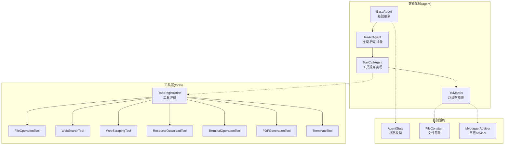
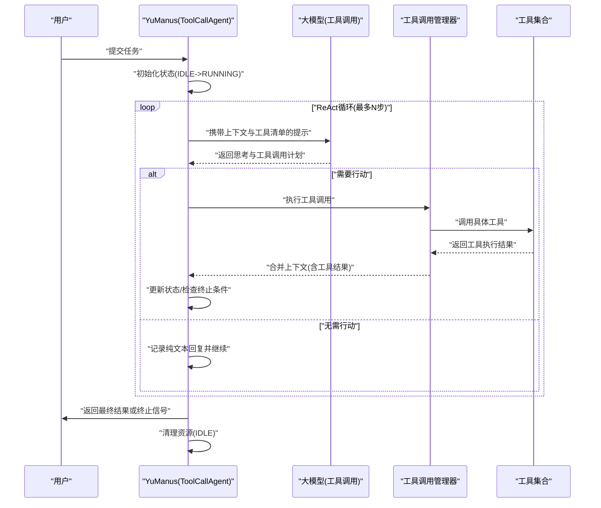
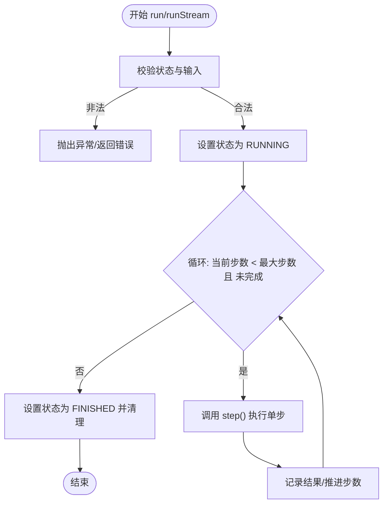
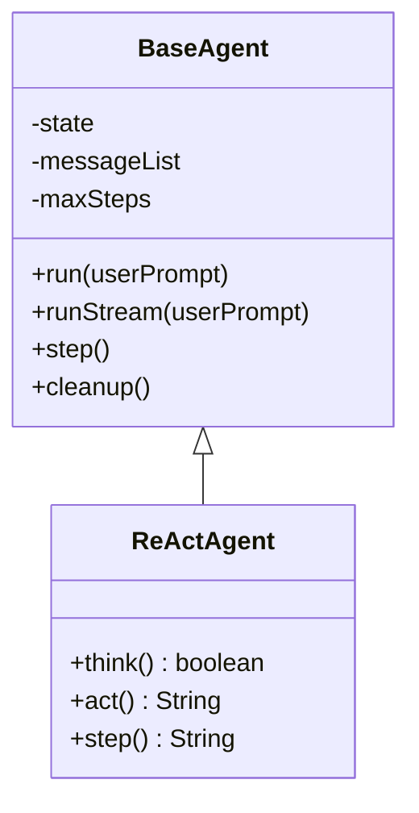
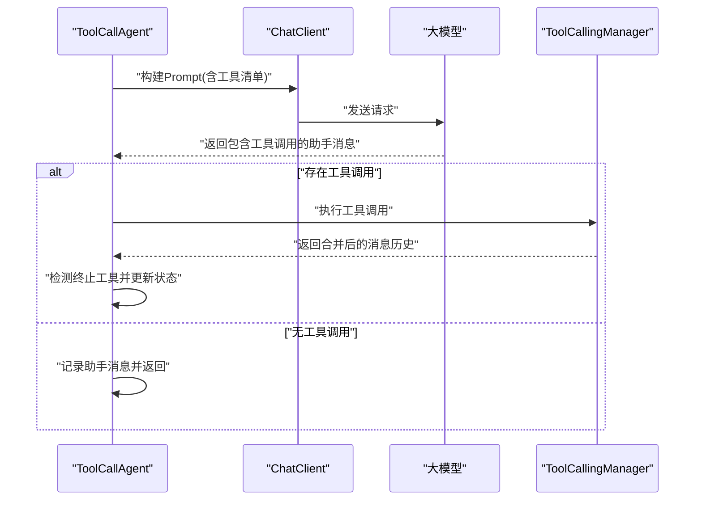
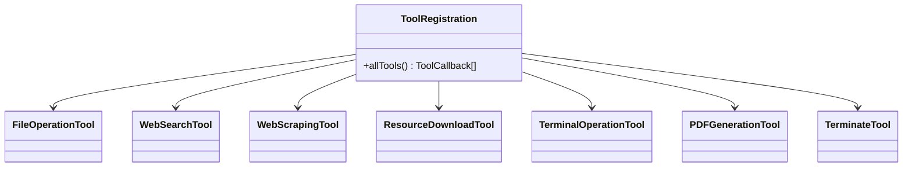
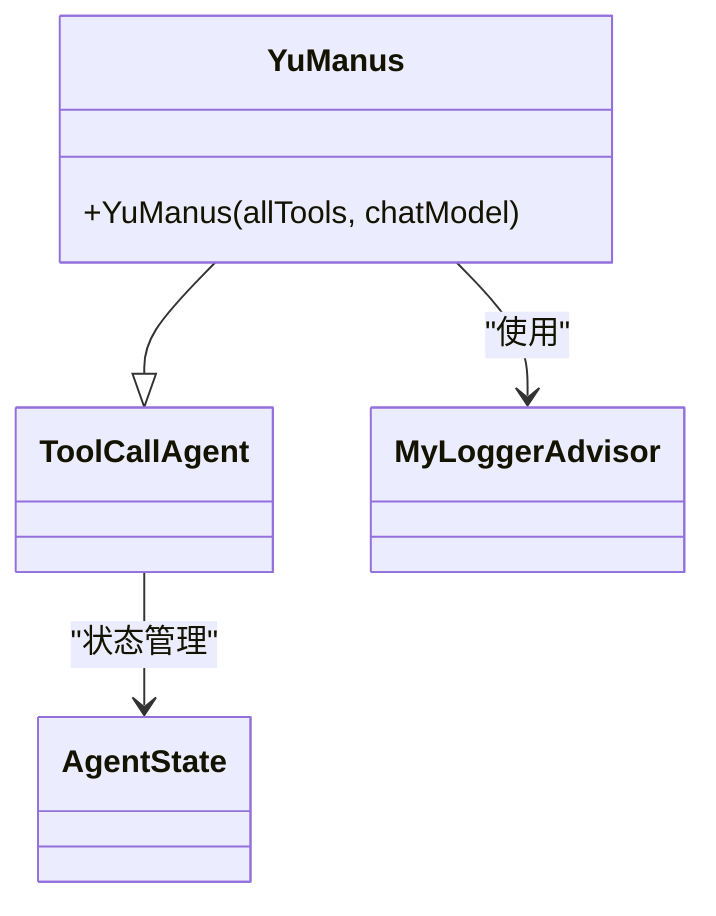
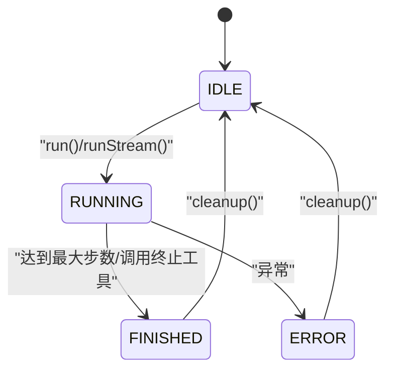
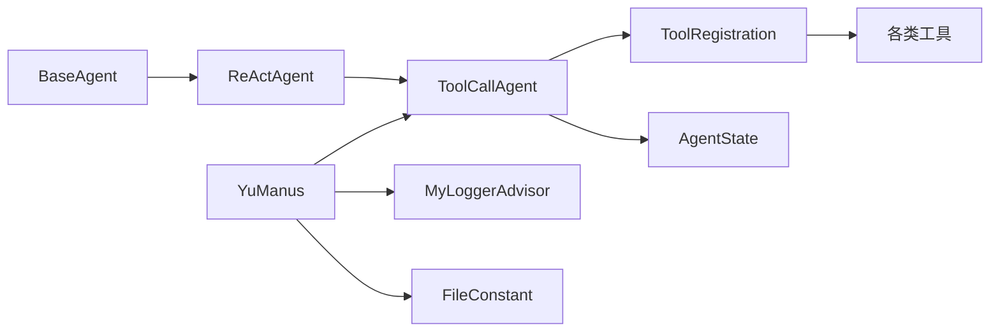

# AI智能体架构

<cite>
**本文引用的文件**
- [BaseAgent.java](file://src/main/java/com/yupi/yuaiagent/agent/BaseAgent.java)
- [ReActAgent.java](file://src/main/java/com/yupi/yuaiagent/agent/ReActAgent.java)
- [ToolCallAgent.java](file://src/main/java/com/yupi/yuaiagent/agent/ToolCallAgent.java)
- [YuManus.java](file://src/main/java/com/yupi/yuaiagent/agent/YuManus.java)
- [AgentState.java](file://src/main/java/com/yupi/yuaiagent/agent/model/AgentState.java)
- [ToolRegistration.java](file://src/main/java/com/yupi/yuaiagent/tools/ToolRegistration.java)
- [TerminalOperationTool.java](file://src/main/java/com/yupi/yuaiagent/tools/TerminalOperationTool.java)
- [WebSearchTool.java](file://src/main/java/com/yupi/yuaiagent/tools/WebSearchTool.java)
- [FileOperationTool.java](file://src/main/java/com/yupi/yuaiagent/tools/FileOperationTool.java)
- [PDFGenerationTool.java](file://src/main/java/com/yupi/yuaiagent/tools/PDFGenerationTool.java)
- [WebScrapingTool.java](file://src/main/java/com/yupi/yuaiagent/tools/WebScrapingTool.java)
- [ResourceDownloadTool.java](file://src/main/java/com/yupi/yuaiagent/tools/ResourceDownloadTool.java)
- [TerminateTool.java](file://src/main/java/com/yupi/yuaiagent/tools/TerminateTool.java)
- [FileConstant.java](file://src/main/java/com/yupi/yuaiagent/constant/FileConstant.java)
- [MyLoggerAdvisor.java](file://src/main/java/com/yupi/yuaiagent/advisor/MyLoggerAdvisor.java)
</cite>

## 目录
1. [简介](#简介)
2. [项目结构](#项目结构)
3. [核心组件](#核心组件)
4. [架构总览](#架构总览)
5. [详细组件分析](#详细组件分析)
6. [依赖分析](#依赖分析)
7. [性能考虑](#性能考虑)
8. [故障排查指南](#故障排查指南)
9. [结论](#结论)
10. [附录](#附录)

## 简介
本文件面向开发者与架构师，系统化阐述基于ReAct（推理-行动）范式的智能体架构设计与实现。文档覆盖以下要点：
- 智能体基类BaseAgent的设计模式与抽象接口定义
- ReActAgent的“思考-行动”循环机制与状态流转
- ToolCallAgent的工具调用机制与工具注册系统
- YuManus超级智能体的自主规划能力与状态管理
- AgentState的状态管理机制与决策过程
- 提供架构图与ReAct循环流程图，帮助快速理解与扩展

## 项目结构
该项目采用按领域分层的组织方式：agent层负责智能体核心逻辑；tools层提供可插拔工具集；advisor层提供日志与拦截器；constant层提供常量配置；controller层提供对外接口。

图表来源
- [BaseAgent.java:1-193](file://src/main/java/com/yupi/yuaiagent/agent/BaseAgent.java#L1-L193)
- [ReActAgent.java:1-53](file://src/main/java/com/yupi/yuaiagent/agent/ReActAgent.java#L1-L53)
- [ToolCallAgent.java:1-136](file://src/main/java/com/yupi/yuaiagent/agent/ToolCallAgent.java#L1-L136)
- [YuManus.java:1-38](file://src/main/java/com/yupi/yuaiagent/agent/YuManus.java#L1-L38)
- [ToolRegistration.java:1-38](file://src/main/java/com/yupi/yuaiagent/tools/ToolRegistration.java#L1-L38)
- [AgentState.java:1-27](file://src/main/java/com/yupi/yuaiagent/agent/model/AgentState.java#L1-L27)
- [FileConstant.java:1-13](file://src/main/java/com/yupi/yuaiagent/constant/FileConstant.java#L1-L13)
- [MyLoggerAdvisor.java:1-54](file://src/main/java/com/yupi/yuaiagent/advisor/MyLoggerAdvisor.java#L1-L54)

章节来源
- [BaseAgent.java:1-193](file://src/main/java/com/yupi/yuaiagent/agent/BaseAgent.java#L1-L193)
- [ReActAgent.java:1-53](file://src/main/java/com/yupi/yuaiagent/agent/ReActAgent.java#L1-L53)
- [ToolCallAgent.java:1-136](file://src/main/java/com/yupi/yuaiagent/agent/ToolCallAgent.java#L1-L136)
- [YuManus.java:1-38](file://src/main/java/com/yupi/yuaiagent/agent/YuManus.java#L1-L38)
- [ToolRegistration.java:1-38](file://src/main/java/com/yupi/yuaiagent/tools/ToolRegistration.java#L1-L38)
- [AgentState.java:1-27](file://src/main/java/com/yupi/yuaiagent/agent/model/AgentState.java#L1-L27)
- [FileConstant.java:1-13](file://src/main/java/com/yupi/yuaiagent/constant/FileConstant.java#L1-L13)
- [MyLoggerAdvisor.java:1-54](file://src/main/java/com/yupi/yuaiagent/advisor/MyLoggerAdvisor.java#L1-L54)

## 核心组件
本节聚焦于智能体核心抽象与实现，解释其职责边界与协作关系。

- BaseAgent：提供统一的执行生命周期、状态机、消息上下文与流式输出支持。子类需实现step以定义单步行为。
- ReActAgent：在BaseAgent之上抽象“思考-行动”两阶段，think决定是否行动，act执行具体动作。
- ToolCallAgent：实现ReActAgent，通过大模型工具调用能力进行思考与行动，并维护工具调用上下文与终止逻辑。
- YuManus：基于ToolCallAgent的具体应用，注入系统提示词、下一步提示词、最大步数与日志Advisor，形成可直接使用的超级智能体。

章节来源
- [BaseAgent.java:17-193](file://src/main/java/com/yupi/yuaiagent/agent/BaseAgent.java#L17-L193)
- [ReActAgent.java:7-53](file://src/main/java/com/yupi/yuaiagent/agent/ReActAgent.java#L7-L53)
- [ToolCallAgent.java:24-136](file://src/main/java/com/yupi/yuaiagent/agent/ToolCallAgent.java#L24-L136)
- [YuManus.java:9-38](file://src/main/java/com/yupi/yuaiagent/agent/YuManus.java#L9-L38)

## 架构总览
ReAct智能体遵循“思考-行动-观察”的循环，结合工具调用与状态机，实现可扩展的自主规划与执行闭环。

图表来源
- [ToolCallAgent.java:59-134](file://src/main/java/com/yupi/yuaiagent/agent/ToolCallAgent.java#L59-L134)
- [YuManus.java:15-36](file://src/main/java/com/yupi/yuaiagent/agent/YuManus.java#L15-L36)
- [BaseAgent.java:53-92](file://src/main/java/com/yupi/yuaiagent/agent/BaseAgent.java#L53-L92)

## 详细组件分析

### BaseAgent：执行生命周期与状态机
- 设计模式：模板方法模式。子类仅需实现step，即可获得统一的run/runStream、状态切换、消息上下文与资源清理。
- 关键点：
  - 状态机：IDLE → RUNNING → FINISHED/ERROR，异常时进入ERROR，完成后进入FINISHED。
  - 步数控制：maxSteps限制循环次数，防止无限执行。
  - 流式输出：runStream通过SseEmitter实时推送每步结果。
  - 上下文：messageList维护对话历史，便于后续工具调用与思考。
- 生命周期：
  - run：同步执行，返回完整结果。
  - runStream：异步流式执行，支持超时与完成回调。
  - cleanup：子类可覆写以释放外部资源。

图表来源
- [BaseAgent.java:53-92](file://src/main/java/com/yupi/yuaiagent/agent/BaseAgent.java#L53-L92)
- [BaseAgent.java:100-177](file://src/main/java/com/yupi/yuaiagent/agent/BaseAgent.java#L100-L177)

章节来源
- [BaseAgent.java:17-193](file://src/main/java/com/yupi/yuaiagent/agent/BaseAgent.java#L17-L193)

### ReActAgent：思考-行动抽象
- 抽象接口：
  - think()：根据当前上下文与系统提示，判断是否需要采取行动。
  - act()：执行具体行动（如工具调用），返回结果。
  - step()：默认实现为先think再act，若think返回false则不执行act。
- 设计意图：将“推理”与“行动”解耦，便于不同策略的智能体实现。

图表来源
- [BaseAgent.java:17-193](file://src/main/java/com/yupi/yuaiagent/agent/BaseAgent.java#L17-L193)
- [ReActAgent.java:7-53](file://src/main/java/com/yupi/yuaiagent/agent/ReActAgent.java#L7-L53)

章节来源
- [ReActAgent.java:7-53](file://src/main/java/com/yupi/yuaiagent/agent/ReActAgent.java#L7-L53)

### ToolCallAgent：工具调用机制与上下文管理
- 思考阶段（think）：
  - 将nextStepPrompt与历史消息合并为Prompt，调用大模型获取工具调用计划。
  - 解析AssistantMessage中的工具调用列表，记录工具选择信息。
  - 若无工具调用，则记录助手消息并返回false；否则返回true。
- 行动阶段（act）：
  - 使用ToolCallingManager执行工具调用，合并conversationHistory。
  - 检测是否调用了终止工具，若是则将状态设为FINISHED。
  - 汇总工具返回结果并返回给上层。
- 关键点：
  - 禁用Spring AI内置工具执行，自管上下文与选项。
  - 使用DashScopeChatOptions禁用内部工具执行，确保可控性。
  - 通过ToolCallback数组注入可用工具，实现松耦合。

图表来源
- [ToolCallAgent.java:59-134](file://src/main/java/com/yupi/yuaiagent/agent/ToolCallAgent.java#L59-L134)

章节来源
- [ToolCallAgent.java:24-136](file://src/main/java/com/yupi/yuaiagent/agent/ToolCallAgent.java#L24-L136)

### 工具注册系统：集中化与可扩展
- ToolRegistration：集中创建并暴露所有可用工具的ToolCallback数组，便于注入到智能体。
- 已注册工具：
  - 文件读写：FileOperationTool
  - 网络搜索：WebSearchTool
  - 网页抓取：WebScrapingTool
  - 资源下载：ResourceDownloadTool
  - 终端命令：TerminalOperationTool
  - PDF生成：PDFGenerationTool
  - 终止工具：TerminateTool
- 设计优势：通过注解驱动的工具声明与集中注册，降低耦合，便于新增/替换工具。

图表来源
- [ToolRegistration.java:18-36](file://src/main/java/com/yupi/yuaiagent/tools/ToolRegistration.java#L18-L36)
- [FileOperationTool.java:11-41](file://src/main/java/com/yupi/yuaiagent/tools/FileOperationTool.java#L11-L41)
- [WebSearchTool.java:18-54](file://src/main/java/com/yupi/yuaiagent/tools/WebSearchTool.java#L18-L54)
- [WebScrapingTool.java:11-23](file://src/main/java/com/yupi/yuaiagent/tools/WebScrapingTool.java#L11-L23)
- [ResourceDownloadTool.java:14-31](file://src/main/java/com/yupi/yuaiagent/tools/ResourceDownloadTool.java#L14-L31)
- [TerminalOperationTool.java:13-38](file://src/main/java/com/yupi/yuaiagent/tools/TerminalOperationTool.java#L13-L38)
- [PDFGenerationTool.java:19-53](file://src/main/java/com/yupi/yuaiagent/tools/PDFGenerationTool.java#L19-L53)
- [TerminateTool.java:8-18](file://src/main/java/com/yupi/yuaiagent/tools/TerminateTool.java#L8-L18)

章节来源
- [ToolRegistration.java:1-38](file://src/main/java/com/yupi/yuaiagent/tools/ToolRegistration.java#L1-L38)

### YuManus：超级智能体的自主规划与状态管理
- 角色定位：基于ToolCallAgent的具体实现，具备自主规划能力，适合复杂任务分解与多工具协同。
- 关键配置：
  - 系统提示词与下一步提示词：指导工具选择与逐步汇报。
  - 最大步数：20步，避免长时间运行。
  - 日志Advisor：MyLoggerAdvisor，统一打印请求与响应文本。
  - ChatClient：绑定DashScope ChatModel，启用Advisor链。
- 决策过程：通过think阶段选择工具，act阶段执行工具并更新上下文，必要时调用终止工具结束任务。

图表来源
- [YuManus.java:12-38](file://src/main/java/com/yupi/yuaiagent/agent/YuManus.java#L12-L38)
- [MyLoggerAdvisor.java:18-54](file://src/main/java/com/yupi/yuaiagent/advisor/MyLoggerAdvisor.java#L18-L54)
- [AgentState.java:6-27](file://src/main/java/com/yupi/yuaiagent/agent/model/AgentState.java#L6-L27)

章节来源
- [YuManus.java:9-38](file://src/main/java/com/yupi/yuaiagent/agent/YuManus.java#L9-L38)

### AgentState：状态管理机制与决策过程
- 状态枚举：IDLE、RUNNING、FINISHED、ERROR，贯穿整个执行生命周期。
- 决策过程：
  - run/runStream前校验状态，非IDLE拒绝执行。
  - think阶段可能决定是否需要行动；若无需行动，仍需记录助手消息。
  - act阶段可能触发终止工具，导致状态变为FINISHED。
  - 异常捕获后进入ERROR，最终由cleanup回收资源。

图表来源
- [AgentState.java:6-27](file://src/main/java/com/yupi/yuaiagent/agent/model/AgentState.java#L6-L27)
- [BaseAgent.java:53-92](file://src/main/java/com/yupi/yuaiagent/agent/BaseAgent.java#L53-L92)
- [ToolCallAgent.java:122-128](file://src/main/java/com/yupi/yuaiagent/agent/ToolCallAgent.java#L122-L128)

章节来源
- [AgentState.java:1-27](file://src/main/java/com/yupi/yuaiagent/agent/model/AgentState.java#L1-L27)

## 依赖分析
- 组件内聚与耦合：
  - BaseAgent与ReActAgent：高内聚，职责清晰；ReActAgent对think/act开放扩展。
  - ToolCallAgent与工具层：通过ToolCallback解耦，工具注册集中化，便于替换与扩展。
  - YuManus与基础设施：依赖ChatClient与Advisor，保持业务逻辑与基础设施分离。
- 外部依赖：
  - Spring AI ChatClient与ToolCallingManager：提供工具调用与消息上下文管理。
  - Hutool：文件与HTTP工具，简化IO与网络操作。
  - Jsoup：网页抓取。
  - iText：PDF生成。

图表来源
- [BaseAgent.java:17-193](file://src/main/java/com/yupi/yuaiagent/agent/BaseAgent.java#L17-L193)
- [ReActAgent.java:7-53](file://src/main/java/com/yupi/yuaiagent/agent/ReActAgent.java#L7-L53)
- [ToolCallAgent.java:24-136](file://src/main/java/com/yupi/yuaiagent/agent/ToolCallAgent.java#L24-L136)
- [ToolRegistration.java:18-36](file://src/main/java/com/yupi/yuaiagent/tools/ToolRegistration.java#L18-L36)
- [YuManus.java:15-36](file://src/main/java/com/yupi/yuaiagent/agent/YuManus.java#L15-L36)
- [MyLoggerAdvisor.java:18-54](file://src/main/java/com/yupi/yuaiagent/advisor/MyLoggerAdvisor.java#L18-L54)
- [FileConstant.java:6-12](file://src/main/java/com/yupi/yuaiagent/constant/FileConstant.java#L6-L12)

章节来源
- [BaseAgent.java:17-193](file://src/main/java/com/yupi/yuaiagent/agent/BaseAgent.java#L17-L193)
- [ReActAgent.java:7-53](file://src/main/java/com/yupi/yuaiagent/agent/ReActAgent.java#L7-L53)
- [ToolCallAgent.java:24-136](file://src/main/java/com/yupi/yuaiagent/agent/ToolCallAgent.java#L24-L136)
- [ToolRegistration.java:18-36](file://src/main/java/com/yupi/yuaiagent/tools/ToolRegistration.java#L18-L36)
- [YuManus.java:15-36](file://src/main/java/com/yupi/yuaiagent/agent/YuManus.java#L15-L36)
- [MyLoggerAdvisor.java:18-54](file://src/main/java/com/yupi/yuaiagent/advisor/MyLoggerAdvisor.java#L18-L54)
- [FileConstant.java:6-12](file://src/main/java/com/yupi/yuaiagent/constant/FileConstant.java#L6-L12)

## 性能考虑
- 流式输出：runStream使用SseEmitter，避免阻塞主线程，适合长任务与实时反馈。
- 步数限制：maxSteps防止无限循环，建议根据任务复杂度调整。
- 工具调用开销：工具执行可能涉及IO与网络，建议在工具内部做超时与重试策略。
- 日志Advisor：统一日志格式，便于监控与排障，但大量日志会影响性能，建议生产环境按需开启。

## 故障排查指南
- 常见问题与定位：
  - 状态异常：若非IDLE状态调用run/runStream，会抛出异常。检查上一次执行是否正常完成或清理。
  - 输入为空：用户提示词为空会导致立即失败。确认前端或调用方传参。
  - 工具调用失败：查看工具返回的错误信息，检查网络、权限与路径。
  - 终止逻辑：若调用终止工具，状态将变为FINISHED。确认是否为预期行为。
- 建议措施：
  - 在think/act中增加更细粒度的日志与异常捕获。
  - 对外部依赖（网络、文件系统）增加超时与重试。
  - 使用MyLoggerAdvisor在开发环境开启详细日志，在生产环境降级。

章节来源
- [BaseAgent.java:53-92](file://src/main/java/com/yupi/yuaiagent/agent/BaseAgent.java#L53-L92)
- [ToolCallAgent.java:99-103](file://src/main/java/com/yupi/yuaiagent/agent/ToolCallAgent.java#L99-L103)
- [MyLoggerAdvisor.java:30-52](file://src/main/java/com/yupi/yuaiagent/advisor/MyLoggerAdvisor.java#L30-L52)

## 结论
该ReAct智能体架构通过清晰的抽象层次与工具化设计，实现了从“思考-行动-观察”的闭环执行。BaseAgent提供稳定的生命期与状态机，ReActAgent解耦推理与行动，ToolCallAgent将工具调用与上下文管理内聚，YuManus作为超级智能体展示了可扩展的自主规划能力。配合集中化的工具注册与日志Advisor，开发者可快速扩展新工具与新智能体，满足复杂任务场景。

## 附录
- 扩展建议：
  - 新增工具：实现ToolCallback并加入ToolRegistration，无需修改现有智能体代码。
  - 自定义智能体：继承ReActAgent或ToolCallAgent，覆盖think/act以实现特定策略。
  - 配置优化：根据任务类型调整maxSteps、日志级别与超时参数。