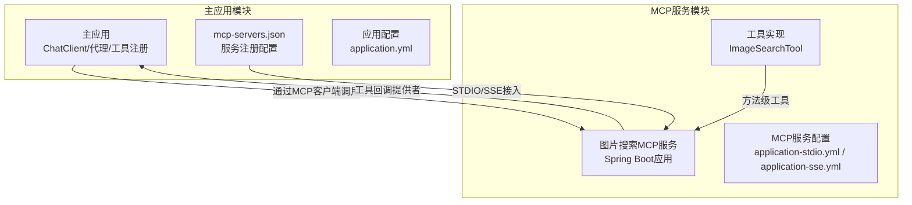
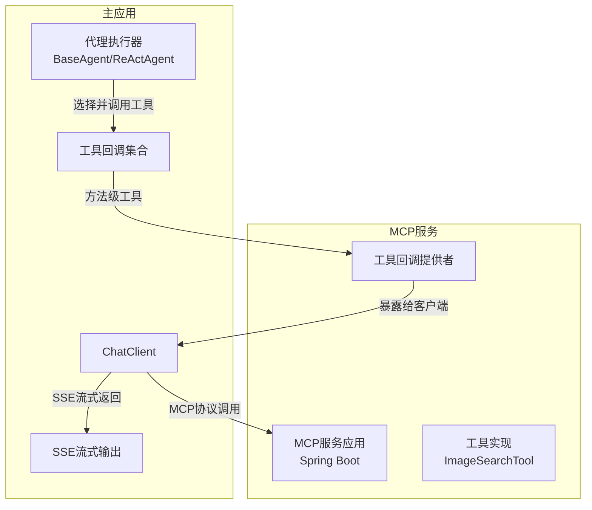
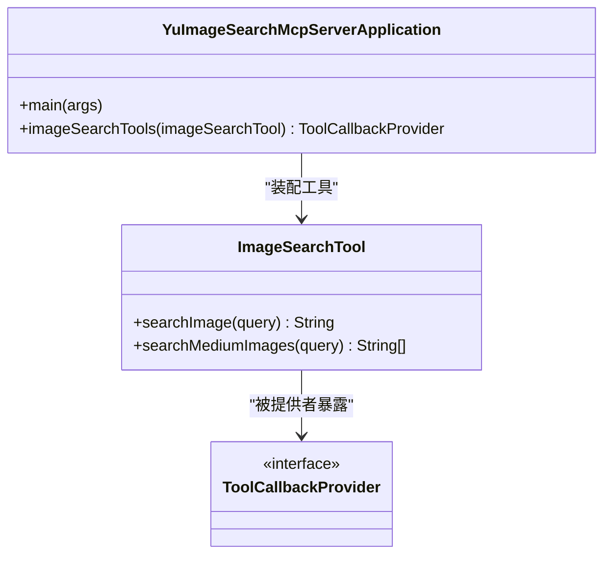
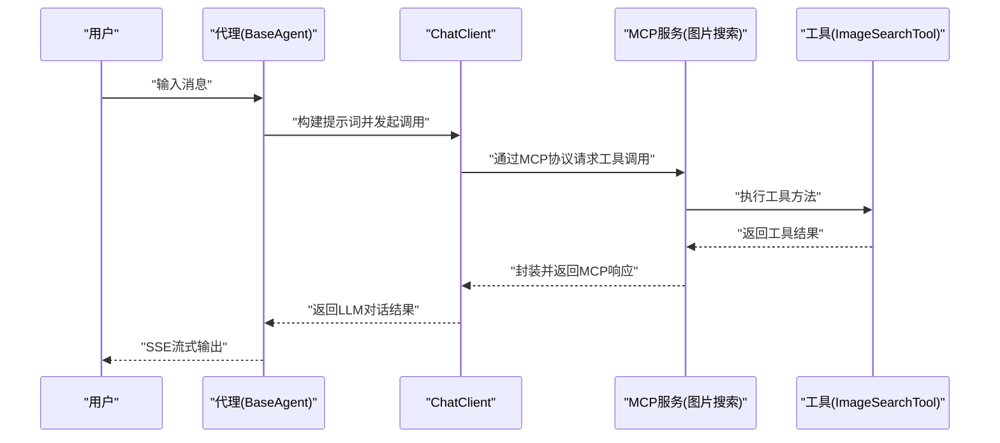
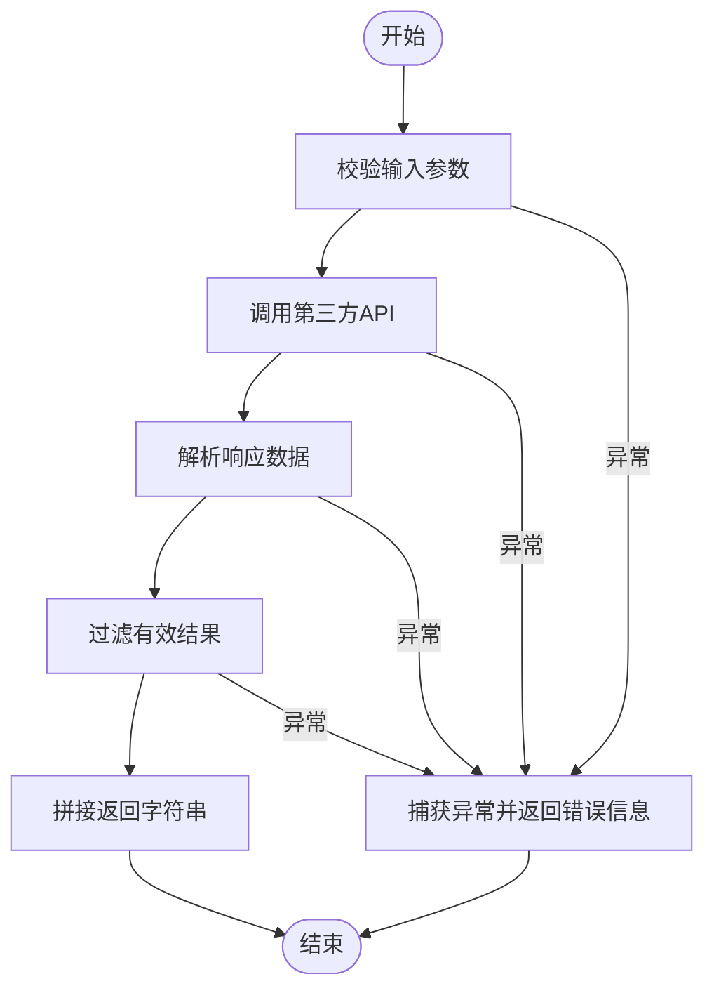
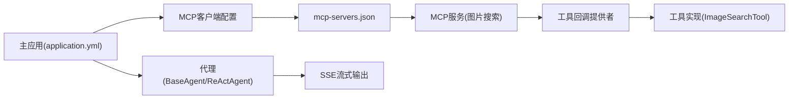

# MCP服务架构

<cite>
**本文引用的文件**
- [mcp-servers.json](file://src/main/resources/mcp-servers.json)
- [application.yml](file://src/main/resources/application.yml)
- [YuImageSearchMcpServerApplication.java](file://yu-image-search-mcp-server/src/main/java/com/yupi/yuimagesearchmcpserver/YuImageSearchMcpServerApplication.java)
- [ImageSearchTool.java](file://yu-image-search-mcp-server/src/main/java/com/yupi/yuimagesearchmcpserver/tools/ImageSearchTool.java)
- [pom.xml](file://yu-image-search-mcp-server/pom.xml)
- [application.yml](file://yu-image-search-mcp-server/src/main/resources/application.yml)
- [application-stdio.yml](file://yu-image-search-mcp-server/src/main/resources/application-stdio.yml)
- [application-sse.yml](file://yu-image-search-mcp-server/src/main/resources/application-sse.yml)
- [ToolRegistration.java](file://src/main/java/com/yupi/yuaiagent/tools/ToolRegistration.java)
- [BaseAgent.java](file://src/main/java/com/yupi/yuaiagent/agent/BaseAgent.java)
- [ReActAgent.java](file://src/main/java/com/yupi/yuaiagent/agent/ReActAgent.java)
- [LoveApp.java](file://src/main/java/com/yupi/yuaiagent/app/LoveApp.java)
- [WebSearchTool.java](file://src/main/java/com/yupi/yuaiagent/tools/WebSearchTool.java)
- [WebScrapingTool.java](file://src/main/java/com/yupi/yuaiagent/tools/WebScrapingTool.java)
- [TerminalOperationTool.java](file://src/main/java/com/yupi/yuaiagent/tools/TerminalOperationTool.java)
</cite>

## 目录
1. [引言](#引言)
2. [项目结构](#项目结构)
3. [核心组件](#核心组件)
4. [架构总览](#架构总览)
5. [详细组件分析](#详细组件分析)
6. [依赖分析](#依赖分析)
7. [性能考虑](#性能考虑)
8. [故障排查指南](#故障排查指南)
9. [结论](#结论)
10. [附录](#附录)

## 引言
本文件系统性阐述模型上下文协议（Model Context Protocol，简称MCP）在本项目中的架构设计与实现机制。重点覆盖以下方面：
- MCP协议基本概念与应用场景：服务发现、异步通信（SSE）、工具调用与外部服务集成。
- mcp-servers.json配置文件的格式与作用：服务注册、进程启动参数与环境变量管理。
- 独立MCP服务模块的架构设计：以“图片搜索MCP服务”为例，说明服务实现、工具暴露与生命周期管理。
- 服务间通信协议、消息格式与错误处理机制：基于Spring AI MCP客户端与MCP服务器的标准交互。
- MCP服务的生命周期管理与资源调度策略：进程启动、STDIO/SSE两种接入模式、工具回调提供者装配。
- 架构图与通信流程图：帮助开发者快速理解MCP协议的应用场景与扩展方法。

## 项目结构
本仓库采用多模块结构：
- 主应用模块：提供聊天客户端、工具注册、代理执行与前端交互入口。
- 独立MCP服务模块：以“图片搜索MCP服务”为例，实现工具方法并通过MCP协议对外暴露。

图表来源
- [application.yml:22-30](file://src/main/resources/application.yml#L22-L30)
- [mcp-servers.json:1-25](file://src/main/resources/mcp-servers.json#L1-L25)
- [YuImageSearchMcpServerApplication.java:10-24](file://yu-image-search-mcp-server/src/main/java/com/yupi/yuimagesearchmcpserver/YuImageSearchMcpServerApplication.java#L10-L24)
- [ImageSearchTool.java:16-32](file://yu-image-search-mcp-server/src/main/java/com/yupi/yuimagesearchmcpserver/tools/ImageSearchTool.java#L16-L32)
- [application-stdio.yml:1-13](file://yu-image-search-mcp-server/src/main/resources/application-stdio.yml#L1-L13)
- [application-sse.yml:1-9](file://yu-image-search-mcp-server/src/main/resources/application-sse.yml#L1-L9)

章节来源
- [application.yml:1-66](file://src/main/resources/application.yml#L1-L66)
- [mcp-servers.json:1-25](file://src/main/resources/mcp-servers.json#L1-L25)

## 核心组件
- MCP服务注册与发现
  - mcp-servers.json定义了MCP服务清单，包含命令、参数与环境变量，支持STDIO或SSE两种接入方式。
- MCP服务模块
  - 图片搜索MCP服务通过Spring Boot启动，使用MethodToolCallbackProvider将工具方法暴露为MCP工具。
- 工具注册与回调
  - 主应用集中注册工具回调，供AI代理在对话中按需调用。
- 代理与异步通信
  - BaseAgent与ReActAgent提供统一的执行框架；LoveApp支持SSE流式输出，提升用户体验。

章节来源
- [mcp-servers.json:1-25](file://src/main/resources/mcp-servers.json#L1-L25)
- [YuImageSearchMcpServerApplication.java:10-24](file://yu-image-search-mcp-server/src/main/java/com/yupi/yuimagesearchmcpserver/YuImageSearchMcpServerApplication.java#L10-L24)
- [ToolRegistration.java:13-37](file://src/main/java/com/yupi/yuaiagent/tools/ToolRegistration.java#L13-L37)
- [BaseAgent.java:25-193](file://src/main/java/com/yupi/yuaiagent/agent/BaseAgent.java#L25-L193)
- [ReActAgent.java:11-53](file://src/main/java/com/yupi/yuaiagent/agent/ReActAgent.java#L11-L53)
- [LoveApp.java:174-226](file://src/main/java/com/yupi/yuaiagent/app/LoveApp.java#L174-L226)

## 架构总览
MCP在本项目中的角色是将外部工具能力以标准化协议暴露给AI代理，形成“工具即服务”的生态。主应用通过MCP客户端连接MCP服务，实现动态工具调用与异步流式输出。

图表来源
- [application.yml:22-30](file://src/main/resources/application.yml#L22-L30)
- [YuImageSearchMcpServerApplication.java:17-22](file://yu-image-search-mcp-server/src/main/java/com/yupi/yuimagesearchmcpserver/YuImageSearchMcpServerApplication.java#L17-L22)
- [ImageSearchTool.java:25-32](file://yu-image-search-mcp-server/src/main/java/com/yupi/yuimagesearchmcpserver/tools/ImageSearchTool.java#L25-L32)
- [BaseAgent.java:100-177](file://src/main/java/com/yupi/yuaiagent/agent/BaseAgent.java#L100-L177)
- [LoveApp.java:90-97](file://src/main/java/com/yupi/yuaiagent/app/LoveApp.java#L90-L97)

## 详细组件分析

### mcp-servers.json配置文件
- 作用
  - 定义MCP服务清单，声明服务名称、启动命令、参数与环境变量，支持STDIO或SSE接入。
- 关键字段
  - 服务名：如“yu-image-search-mcp-server”
  - 命令：如“java”或“npx.cmd”
  - 参数：如JVM参数、JAR路径或包名
  - 环境变量：如API密钥注入
- 接入方式
  - STDIO：通过子进程标准输入输出与MCP客户端通信
  - SSE：通过HTTP SSE端点与MCP客户端通信

章节来源
- [mcp-servers.json:1-25](file://src/main/resources/mcp-servers.json#L1-L25)

### 独立MCP服务模块（图片搜索服务）
- 应用入口
  - Spring Boot应用启动，装配工具回调提供者，将工具方法暴露为MCP工具。
- 工具实现
  - 图片搜索工具通过HTTP请求调用第三方API，解析响应并返回媒体链接列表。
- 生命周期与配置
  - 支持STDIO与SSE两种模式，分别对应不同的Spring配置文件。
  - 通过POM引入Spring AI MCP服务Starter，确保MCP协议栈可用。

图表来源
- [YuImageSearchMcpServerApplication.java:10-24](file://yu-image-search-mcp-server/src/main/java/com/yupi/yuimagesearchmcpserver/YuImageSearchMcpServerApplication.java#L10-L24)
- [ImageSearchTool.java:16-67](file://yu-image-search-mcp-server/src/main/java/com/yupi/yuimagesearchmcpserver/tools/ImageSearchTool.java#L16-L67)

章节来源
- [YuImageSearchMcpServerApplication.java:10-24](file://yu-image-search-mcp-server/src/main/java/com/yupi/yuimagesearchmcpserver/YuImageSearchMcpServerApplication.java#L10-L24)
- [ImageSearchTool.java:16-67](file://yu-image-search-mcp-server/src/main/java/com/yupi/yuimagesearchmcpserver/tools/ImageSearchTool.java#L16-L67)
- [pom.xml:43-66](file://yu-image-search-mcp-server/pom.xml#L43-L66)
- [application.yml:1-7](file://yu-image-search-mcp-server/src/main/resources/application.yml#L1-L7)
- [application-stdio.yml:1-13](file://yu-image-search-mcp-server/src/main/resources/application-stdio.yml#L1-L13)
- [application-sse.yml:1-9](file://yu-image-search-mcp-server/src/main/resources/application-sse.yml#L1-L9)

### 服务间通信协议与消息格式
- 接入模式
  - STDIO：MCP客户端通过子进程I/O与MCP服务交互，适合本地或容器内服务。
  - SSE：MCP服务作为HTTP SSE端点，适合远程服务或跨网络访问。
- 错误处理
  - 工具方法内部捕获异常并返回错误信息，保证调用方能感知失败原因。
  - 主应用代理层对异常进行记录与状态转换，避免影响后续步骤。

章节来源
- [application.yml:22-30](file://src/main/resources/application.yml#L22-L30)
- [ImageSearchTool.java:25-32](file://yu-image-search-mcp-server/src/main/java/com/yupi/yuimagesearchmcpserver/tools/ImageSearchTool.java#L25-L32)
- [BaseAgent.java:84-91](file://src/main/java/com/yupi/yuaiagent/agent/BaseAgent.java#L84-L91)

### MCP服务生命周期管理与资源调度
- 启动与发现
  - mcp-servers.json声明服务后，MCP客户端根据配置启动或连接服务。
- 工具回调提供者
  - 服务端通过MethodToolCallbackProvider将工具方法注册为可调用工具。
  - 客户端通过ToolCallbackProvider接收并转发工具调用请求。
- 资源调度
  - STDIO模式下由父进程管理子进程生命周期；SSE模式下由HTTP服务管理连接与超时。
  - 代理层提供SSE流式输出，优化长耗时工具调用的用户体验。

章节来源
- [mcp-servers.json:1-25](file://src/main/resources/mcp-servers.json#L1-L25)
- [YuImageSearchMcpServerApplication.java:17-22](file://yu-image-search-mcp-server/src/main/java/com/yupi/yuimagesearchmcpserver/YuImageSearchMcpServerApplication.java#L17-L22)
- [BaseAgent.java:100-177](file://src/main/java/com/yupi/yuaiagent/agent/BaseAgent.java#L100-L177)

### 代理与工具调用流程（以“图片搜索MCP服务”为例）

图表来源
- [BaseAgent.java:53-92](file://src/main/java/com/yupi/yuaiagent/agent/BaseAgent.java#L53-L92)
- [LoveApp.java:212-225](file://src/main/java/com/yupi/yuaiagent/app/LoveApp.java#L212-L225)
- [YuImageSearchMcpServerApplication.java:17-22](file://yu-image-search-mcp-server/src/main/java/com/yupi/yuimagesearchmcpserver/YuImageSearchMcpServerApplication.java#L17-L22)
- [ImageSearchTool.java:25-32](file://yu-image-search-mcp-server/src/main/java/com/yupi/yuimagesearchmcpserver/tools/ImageSearchTool.java#L25-L32)

### 工具实现与错误处理（算法流程）

图表来源
- [ImageSearchTool.java:40-65](file://yu-image-search-mcp-server/src/main/java/com/yupi/yuimagesearchmcpserver/tools/ImageSearchTool.java#L40-L65)

## 依赖分析
- Spring AI MCP客户端与服务端
  - 主应用通过MCP客户端配置启用STDIO/SSE接入，并加载mcp-servers.json。
  - MCP服务模块引入MCP服务Starter，提供工具回调提供者与协议适配。
- 工具依赖
  - 图片搜索工具依赖HTTP工具库与JSON解析库；其他工具依赖JSoup、系统命令执行等。
- 代理与SSE
  - 代理层提供SSE流式输出，避免长时间阻塞主线程。

图表来源
- [application.yml:22-30](file://src/main/resources/application.yml#L22-L30)
- [mcp-servers.json:1-25](file://src/main/resources/mcp-servers.json#L1-L25)
- [YuImageSearchMcpServerApplication.java:17-22](file://yu-image-search-mcp-server/src/main/java/com/yupi/yuimagesearchmcpserver/YuImageSearchMcpServerApplication.java#L17-L22)
- [ImageSearchTool.java:16-32](file://yu-image-search-mcp-server/src/main/java/com/yupi/yuimagesearchmcpserver/tools/ImageSearchTool.java#L16-L32)
- [BaseAgent.java:100-177](file://src/main/java/com/yupi/yuaiagent/agent/BaseAgent.java#L100-L177)

章节来源
- [application.yml:1-66](file://src/main/resources/application.yml#L1-L66)
- [pom.xml:43-66](file://yu-image-search-mcp-server/pom.xml#L43-L66)
- [ToolRegistration.java:13-37](file://src/main/java/com/yupi/yuaiagent/tools/ToolRegistration.java#L13-L37)

## 性能考虑
- 异步与流式
  - 使用SSE进行流式输出，降低长耗时工具调用对用户体验的影响。
- 工具调用开销
  - 第三方API调用存在网络延迟，应合理设置超时与重试策略。
- 进程管理
  - STDIO模式下，主进程负责MCP服务进程的生命周期，注意资源回收与异常退出处理。
- 日志与可观测性
  - 在开发阶段开启DEBUG日志，有助于定位MCP协议交互问题。

## 故障排查指南
- MCP服务未启动或无法连接
  - 检查mcp-servers.json中的命令、参数与环境变量是否正确。
  - 确认MCP服务端口与SSE/STDIO配置一致。
- 工具调用失败
  - 查看工具方法内部异常信息，确认第三方API密钥与网络连通性。
  - 检查代理层异常处理逻辑，确保状态转换与资源清理正常。
- SSE连接问题
  - 检查SSE超时设置与浏览器兼容性，必要时调整代理层超时回调。

章节来源
- [mcp-servers.json:1-25](file://src/main/resources/mcp-servers.json#L1-L25)
- [ImageSearchTool.java:25-32](file://yu-image-search-mcp-server/src/main/java/com/yupi/yuimagesearchmcpserver/tools/ImageSearchTool.java#L25-L32)
- [BaseAgent.java:163-176](file://src/main/java/com/yupi/yuaiagent/agent/BaseAgent.java#L163-L176)

## 结论
本项目通过mcp-servers.json实现MCP服务的统一注册与发现，借助Spring AI MCP客户端与服务端协议栈，将工具能力以标准化方式暴露给AI代理。图片搜索MCP服务展示了从工具实现到工具回调提供者的完整链路，配合代理层的异步与流式能力，为复杂业务场景提供了可扩展、可维护的MCP架构实践。

## 附录
- 其他工具示例
  - 网页搜索工具、网页抓取工具、终端操作工具等，均通过注解方式声明为MCP工具，便于统一注册与调用。

章节来源
- [WebSearchTool.java:15-54](file://src/main/java/com/yupi/yuaiagent/tools/WebSearchTool.java#L15-L54)
- [WebScrapingTool.java:8-23](file://src/main/java/com/yupi/yuaiagent/tools/WebScrapingTool.java#L8-L23)
- [TerminalOperationTool.java:10-38](file://src/main/java/com/yupi/yuaiagent/tools/TerminalOperationTool.java#L10-L38)
- [ToolRegistration.java:13-37](file://src/main/java/com/yupi/yuaiagent/tools/ToolRegistration.java#L13-L37)