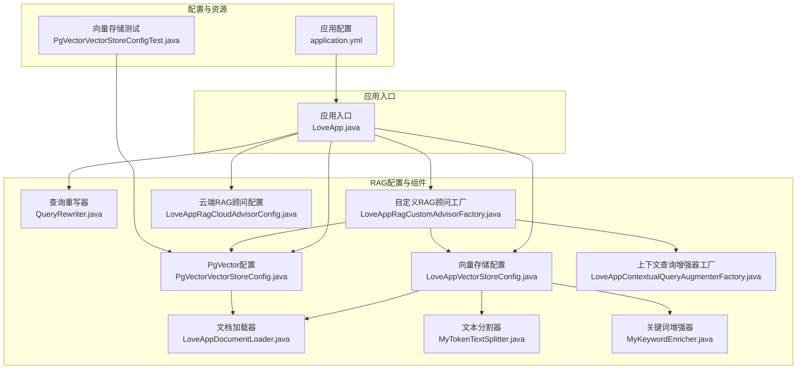
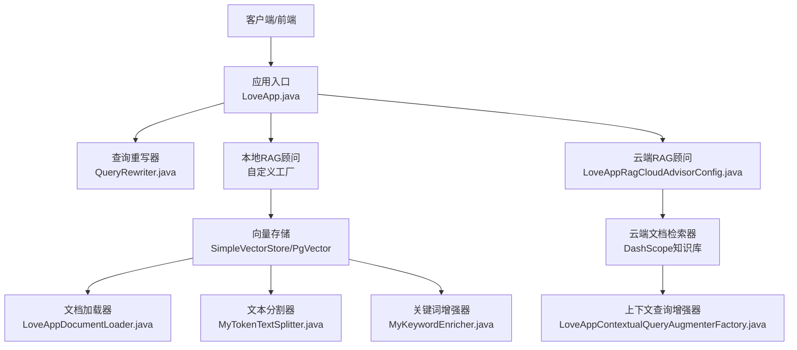
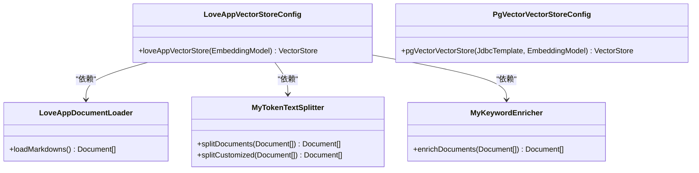
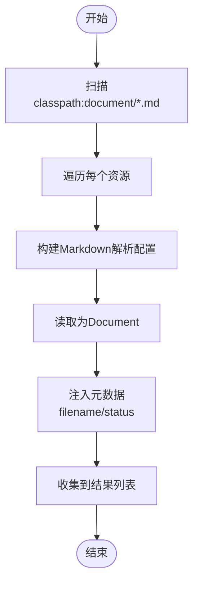
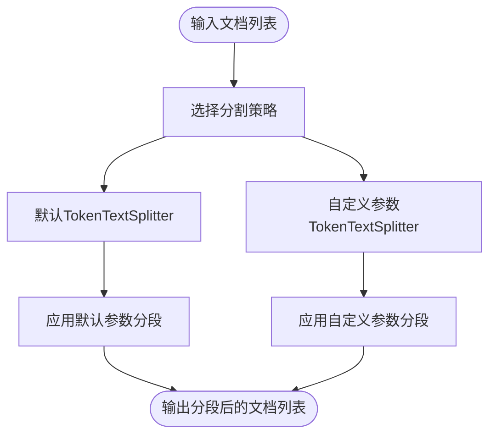
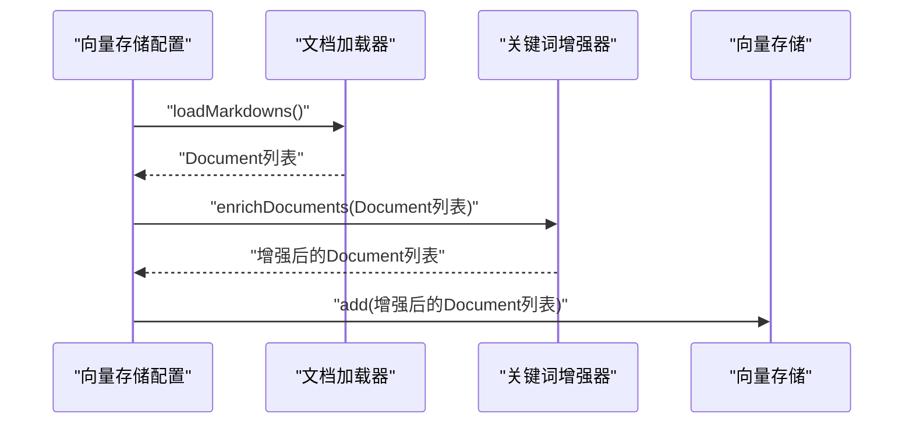
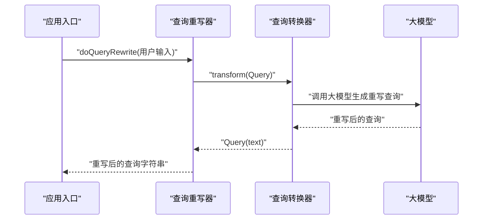
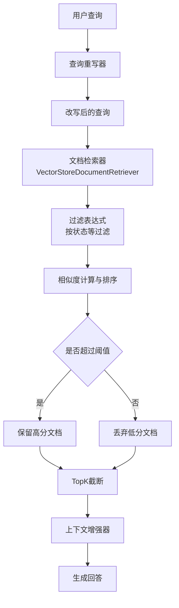
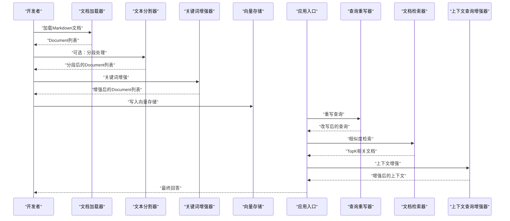
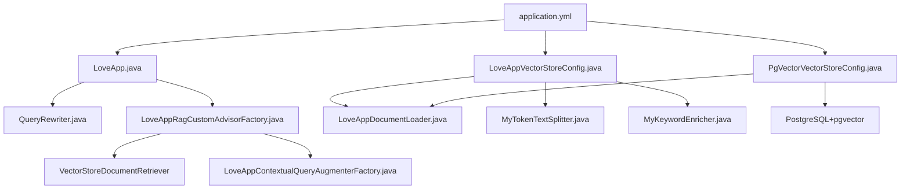

# RAG知识库架构

<cite>
**本文引用的文件**
- [LoveAppVectorStoreConfig.java](file://src/main/java/com/yupi/yuaiagent/rag/LoveAppVectorStoreConfig.java)
- [PgVectorVectorStoreConfig.java](file://src/main/java/com/yupi/yuaiagent/rag/PgVectorVectorStoreConfig.java)
- [LoveAppDocumentLoader.java](file://src/main/java/com/yupi/yuaiagent/rag/LoveAppDocumentLoader.java)
- [MyTokenTextSplitter.java](file://src/main/java/com/yupi/yuaiagent/rag/MyTokenTextSplitter.java)
- [MyKeywordEnricher.java](file://src/main/java/com/yupi/yuaiagent/rag/MyKeywordEnricher.java)
- [QueryRewriter.java](file://src/main/java/com/yupi/yuaiagent/rag/QueryRewriter.java)
- [LoveAppContextualQueryAugmenterFactory.java](file://src/main/java/com/yupi/yuaiagent/rag/LoveAppContextualQueryAugmenterFactory.java)
- [LoveAppRagCustomAdvisorFactory.java](file://src/main/java/com/yupi/yuaiagent/rag/LoveAppRagCustomAdvisorFactory.java)
- [LoveAppRagCloudAdvisorConfig.java](file://src/main/java/com/yupi/yuaiagent/rag/LoveAppRagCloudAdvisorConfig.java)
- [application.yml](file://src/main/resources/application.yml)
- [LoveApp.java](file://src/main/java/com/yupi/yuaiagent/app/LoveApp.java)
- [PgVectorVectorStoreConfigTest.java](file://src/test/java/com/yupi/yuaiagent/rag/PgVectorVectorStoreConfigTest.java)
</cite>

## 目录
1. [引言](#引言)
2. [项目结构](#项目结构)
3. [核心组件](#核心组件)
4. [架构总览](#架构总览)
5. [详细组件分析](#详细组件分析)
6. [依赖分析](#依赖分析)
7. [性能考虑](#性能考虑)
8. [故障排查指南](#故障排查指南)
9. [结论](#结论)
10. [附录](#附录)

## 引言
本文件面向开发者与架构师，系统化梳理该RAG知识库的架构设计与实现要点，重点覆盖以下方面：
- 向量存储配置的两种实现：基于内存的SimpleVectorStore与基于PostgreSQL+PgVector的持久化向量存储，阐明其差异、适用场景与切换方式。
- 文档加载器对Markdown文档的解析与元数据预处理机制。
- 文本分割策略与分段算法，以及可选的自定义参数化分割。
- 关键词增强技术与查询重写机制，提升检索质量与语义匹配能力。
- 向量相似度检索与结果排序策略，结合过滤条件与阈值控制。
- 提供系统架构图与数据处理流程图，帮助快速理解知识库构建与查询过程。

## 项目结构
RAG相关代码集中在后端模块的“rag”包中，并通过Spring配置类在运行时装配；应用入口通过LoveApp对外提供聊天接口，集成RAG顾问以实现检索增强问答。

图表来源
- [LoveAppVectorStoreConfig.java:1-42](file://src/main/java/com/yupi/yuaiagent/rag/LoveAppVectorStoreConfig.java#L1-L42)
- [PgVectorVectorStoreConfig.java:1-41](file://src/main/java/com/yupi/yuaiagent/rag/PgVectorVectorStoreConfig.java#L1-L41)
- [LoveAppDocumentLoader.java:1-56](file://src/main/java/com/yupi/yuaiagent/rag/LoveAppDocumentLoader.java#L1-L56)
- [MyTokenTextSplitter.java:1-24](file://src/main/java/com/yupi/yuaiagent/rag/MyTokenTextSplitter.java#L1-L24)
- [MyKeywordEnricher.java:1-25](file://src/main/java/com/yupi/yuaiagent/rag/MyKeywordEnricher.java#L1-L25)
- [QueryRewriter.java:1-40](file://src/main/java/com/yupi/yuaiagent/rag/QueryRewriter.java#L1-L40)
- [LoveAppContextualQueryAugmenterFactory.java:1-23](file://src/main/java/com/yupi/yuaiagent/rag/LoveAppContextualQueryAugmenterFactory.java#L1-L23)
- [LoveAppRagCustomAdvisorFactory.java:1-41](file://src/main/java/com/yupi/yuaiagent/rag/LoveAppRagCustomAdvisorFactory.java#L1-L41)
- [LoveAppRagCloudAdvisorConfig.java:1-39](file://src/main/java/com/yupi/yuaiagent/rag/LoveAppRagCloudAdvisorConfig.java#L1-L39)
- [application.yml:1-66](file://src/main/resources/application.yml#L1-L66)
- [LoveApp.java:128-162](file://src/main/java/com/yupi/yuaiagent/app/LoveApp.java#L128-L162)
- [PgVectorVectorStoreConfigTest.java:1-33](file://src/test/java/com/yupi/yuaiagent/rag/PgVectorVectorStoreConfigTest.java#L1-L33)

章节来源
- [application.yml:1-66](file://src/main/resources/application.yml#L1-L66)
- [LoveApp.java:128-162](file://src/main/java/com/yupi/yuaiagent/app/LoveApp.java#L128-L162)

## 核心组件
- 向量存储配置
  - 基于内存的SimpleVectorStore：适合开发调试与小规模知识库，无需外部数据库。
  - 基于PgVector的持久化向量存储：适合生产环境，具备高可用、可扩展与批量导入能力。
- 文档加载器
  - 从classpath:document/*.md批量读取Markdown文档，提取文件名等元信息，支持水平线分隔与代码块/引用块开关控制。
- 文本分割器
  - 默认TokenTextSplitter按模型默认参数进行分段；提供自定义参数版本以满足不同长度与重叠策略需求。
- 关键词增强器
  - 基于大模型自动抽取文档关键词并注入元信息，提升检索相关性。
- 查询重写器
  - 将用户输入改写为更利于检索的查询形式，提高召回质量。
- 自定义RAG顾问工厂
  - 组合向量检索器、过滤表达式、相似度阈值与TopK返回数量，并集成上下文查询增强器。
- 云端RAG顾问配置
  - 基于DashScope的知识库服务，提供云端检索增强能力。

章节来源
- [LoveAppVectorStoreConfig.java:14-41](file://src/main/java/com/yupi/yuaiagent/rag/LoveAppVectorStoreConfig.java#L14-L41)
- [PgVectorVectorStoreConfig.java:14-40](file://src/main/java/com/yupi/yuaiagent/rag/PgVectorVectorStoreConfig.java#L14-L40)
- [LoveAppDocumentLoader.java:15-56](file://src/main/java/com/yupi/yuaiagent/rag/LoveAppDocumentLoader.java#L15-L56)
- [MyTokenTextSplitter.java:9-24](file://src/main/java/com/yupi/yuaiagent/rag/MyTokenTextSplitter.java#L9-L24)
- [MyKeywordEnricher.java:11-25](file://src/main/java/com/yupi/yuaiagent/rag/MyKeywordEnricher.java#L11-L25)
- [QueryRewriter.java:10-40](file://src/main/java/com/yupi/yuaiagent/rag/QueryRewriter.java#L10-L40)
- [LoveAppRagCustomAdvisorFactory.java:11-41](file://src/main/java/com/yupi/yuaiagent/rag/LoveAppRagCustomAdvisorFactory.java#L11-L41)
- [LoveAppRagCloudAdvisorConfig.java:14-39](file://src/main/java/com/yupi/yuaiagent/rag/LoveAppRagCloudAdvisorConfig.java#L14-L39)

## 架构总览
下图展示RAG知识库的整体架构：应用入口通过顾问链路接入向量检索与上下文增强，支持本地内存向量存储与云端DashScope知识库两种检索路径。

图表来源
- [LoveApp.java:128-162](file://src/main/java/com/yupi/yuaiagent/app/LoveApp.java#L128-L162)
- [QueryRewriter.java:10-40](file://src/main/java/com/yupi/yuaiagent/rag/QueryRewriter.java#L10-L40)
- [LoveAppRagCustomAdvisorFactory.java:11-41](file://src/main/java/com/yupi/yuaiagent/rag/LoveAppRagCustomAdvisorFactory.java#L11-L41)
- [LoveAppRagCloudAdvisorConfig.java:14-39](file://src/main/java/com/yupi/yuaiagent/rag/LoveAppRagCloudAdvisorConfig.java#L14-L39)
- [LoveAppVectorStoreConfig.java:14-41](file://src/main/java/com/yupi/yuaiagent/rag/LoveAppVectorStoreConfig.java#L14-L41)
- [PgVectorVectorStoreConfig.java:14-40](file://src/main/java/com/yupi/yuaiagent/rag/PgVectorVectorStoreConfig.java#L14-L40)
- [LoveAppDocumentLoader.java:15-56](file://src/main/java/com/yupi/yuaiagent/rag/LoveAppDocumentLoader.java#L15-L56)
- [MyTokenTextSplitter.java:9-24](file://src/main/java/com/yupi/yuaiagent/rag/MyTokenTextSplitter.java#L9-L24)
- [MyKeywordEnricher.java:11-25](file://src/main/java/com/yupi/yuaiagent/rag/MyKeywordEnricher.java#L11-L25)
- [LoveAppContextualQueryAugmenterFactory.java:6-23](file://src/main/java/com/yupi/yuaiagent/rag/LoveAppContextualQueryAugmenterFactory.java#L6-L23)

## 详细组件分析

### 向量存储配置对比：LoveAppVectorStoreConfig vs PgVectorVectorStoreConfig
- LoveAppVectorStoreConfig（内存向量存储）
  - 使用SimpleVectorStore，适合开发调试与小规模知识库。
  - 流程：加载Markdown文档 → 可选文本分割 → 关键词增强 → 写入内存向量库。
- PgVectorVectorStoreConfig（持久化向量存储）
  - 使用PgVectorStore，支持HNSW索引、余弦距离、批量导入与模式/表名配置。
  - 流程：加载Markdown文档 → 写入PgVector向量库（需外部PostgreSQL+pgvector环境）。
- 切换方式
  - 通过注释控制启用/禁用对应配置类；或在应用配置中启用相应连接信息。

图表来源
- [LoveAppVectorStoreConfig.java:14-41](file://src/main/java/com/yupi/yuaiagent/rag/LoveAppVectorStoreConfig.java#L14-L41)
- [PgVectorVectorStoreConfig.java:14-40](file://src/main/java/com/yupi/yuaiagent/rag/PgVectorVectorStoreConfig.java#L14-L40)
- [LoveAppDocumentLoader.java:15-56](file://src/main/java/com/yupi/yuaiagent/rag/LoveAppDocumentLoader.java#L15-L56)
- [MyTokenTextSplitter.java:9-24](file://src/main/java/com/yupi/yuaiagent/rag/MyTokenTextSplitter.java#L9-L24)
- [MyKeywordEnricher.java:11-25](file://src/main/java/com/yupi/yuaiagent/rag/MyKeywordEnricher.java#L11-L25)

章节来源
- [LoveAppVectorStoreConfig.java:14-41](file://src/main/java/com/yupi/yuaiagent/rag/LoveAppVectorStoreConfig.java#L14-L41)
- [PgVectorVectorStoreConfig.java:14-40](file://src/main/java/com/yupi/yuaiagent/rag/PgVectorVectorStoreConfig.java#L14-L40)

### 文档加载器：LoveAppDocumentLoader
- 功能概述
  - 扫描classpath:document/*.md目录下的Markdown文档，逐个读取并构造Document对象。
  - 元数据注入：包含文件名与从文件名派生的状态字段，便于后续过滤与增强。
  - 解析选项：支持水平线分隔、是否包含代码块/引用块等。
- 处理流程
  - 获取资源集合 → 针对每个资源构建MarkdownDocumentReaderConfig → 读取为Document列表 → 聚合返回。

图表来源
- [LoveAppDocumentLoader.java:28-54](file://src/main/java/com/yupi/yuaiagent/rag/LoveAppDocumentLoader.java#L28-L54)

章节来源
- [LoveAppDocumentLoader.java:15-56](file://src/main/java/com/yupi/yuaiagent/rag/LoveAppDocumentLoader.java#L15-L56)

### 文本分割策略：MyTokenTextSplitter
- 默认策略
  - 使用TokenTextSplitter进行分段，适用于大多数场景。
- 自定义策略
  - 提供带参数的构造方法，允许指定最大分段长度、重叠长度、最小段长、最大文档长度等，满足不同业务需求。
- 适用建议
  - 对长文档或对段落边界敏感的场景，优先采用自定义参数版本以控制粒度与重叠。

图表来源
- [MyTokenTextSplitter.java:14-22](file://src/main/java/com/yupi/yuaiagent/rag/MyTokenTextSplitter.java#L14-L22)

章节来源
- [MyTokenTextSplitter.java:9-24](file://src/main/java/com/yupi/yuaiagent/rag/MyTokenTextSplitter.java#L9-L24)

### 关键词增强技术：MyKeywordEnricher
- 技术原理
  - 基于大模型自动抽取文档关键词，注入到Document元信息中，提升检索阶段的关键词匹配能力。
- 实现要点
  - 通过KeywordMetadataEnricher对文档列表进行批量增强，返回增强后的文档集合。
- 应用位置
  - 在向量存储初始化阶段调用，确保后续检索能利用关键词元信息。

图表来源
- [LoveAppVectorStoreConfig.java:30-40](file://src/main/java/com/yupi/yuaiagent/rag/LoveAppVectorStoreConfig.java#L30-L40)
- [MyKeywordEnricher.java:20-23](file://src/main/java/com/yupi/yuaiagent/rag/MyKeywordEnricher.java#L20-L23)

章节来源
- [MyKeywordEnricher.java:11-25](file://src/main/java/com/yupi/yuaiagent/rag/MyKeywordEnricher.java#L11-L25)
- [LoveAppVectorStoreConfig.java:30-40](file://src/main/java/com/yupi/yuaiagent/rag/LoveAppVectorStoreConfig.java#L30-L40)

### 查询重写机制：QueryRewriter
- 功能概述
  - 将用户输入改写为更利于向量检索的查询语句，提升召回质量。
- 实现流程
  - 构建ChatClient与RewriteQueryTransformer → 输入原始Query → 输出改写后的Query文本。

图表来源
- [QueryRewriter.java:16-38](file://src/main/java/com/yupi/yuaiagent/rag/QueryRewriter.java#L16-L38)
- [LoveApp.java:145-156](file://src/main/java/com/yupi/yuaiagent/app/LoveApp.java#L145-L156)

章节来源
- [QueryRewriter.java:10-40](file://src/main/java/com/yupi/yuaiagent/rag/QueryRewriter.java#L10-L40)
- [LoveApp.java:145-156](file://src/main/java/com/yupi/yuaiagent/app/LoveApp.java#L145-L156)

### 向量相似度检索与结果排序
- 检索器与过滤
  - 通过VectorStoreDocumentRetriever组合向量存储、过滤表达式（如按状态过滤）、相似度阈值与TopK返回数量。
- 排序与阈值
  - 相似度阈值用于剔除低相关文档；TopK限制返回数量，兼顾性能与相关性。
- 结果使用
  - 检索到的文档作为上下文增强到最终回答中，提升回答准确性与上下文贴合度。

图表来源
- [LoveAppRagCustomAdvisorFactory.java:23-39](file://src/main/java/com/yupi/yuaiagent/rag/LoveAppRagCustomAdvisorFactory.java#L23-L39)
- [LoveAppContextualQueryAugmenterFactory.java:11-21](file://src/main/java/com/yupi/yuaiagent/rag/LoveAppContextualQueryAugmenterFactory.java#L11-L21)

章节来源
- [LoveAppRagCustomAdvisorFactory.java:11-41](file://src/main/java/com/yupi/yuaiagent/rag/LoveAppRagCustomAdvisorFactory.java#L11-L41)
- [LoveAppContextualQueryAugmenterFactory.java:6-23](file://src/main/java/com/yupi/yuaiagent/rag/LoveAppContextualQueryAugmenterFactory.java#L6-L23)

### 数据处理流程图（知识库构建与查询）
- 构建流程
  - 文档加载 → 文本分割（可选）→ 关键词增强 → 写入向量存储（内存或PgVector）。
- 查询流程
  - 用户输入 → 查询重写 → 向量检索（含过滤、阈值、TopK）→ 上下文增强 → 生成回答。

图表来源
- [LoveAppVectorStoreConfig.java:30-40](file://src/main/java/com/yupi/yuaiagent/rag/LoveAppVectorStoreConfig.java#L30-L40)
- [PgVectorVectorStoreConfig.java:25-39](file://src/main/java/com/yupi/yuaiagent/rag/PgVectorVectorStoreConfig.java#L25-L39)
- [LoveAppDocumentLoader.java:32-54](file://src/main/java/com/yupi/yuaiagent/rag/LoveAppDocumentLoader.java#L32-L54)
- [MyTokenTextSplitter.java:14-22](file://src/main/java/com/yupi/yuaiagent/rag/MyTokenTextSplitter.java#L14-L22)
- [MyKeywordEnricher.java:20-23](file://src/main/java/com/yupi/yuaiagent/rag/MyKeywordEnricher.java#L20-L23)
- [QueryRewriter.java:32-38](file://src/main/java/com/yupi/yuaiagent/rag/QueryRewriter.java#L32-L38)
- [LoveAppRagCustomAdvisorFactory.java:23-39](file://src/main/java/com/yupi/yuaiagent/rag/LoveAppRagCustomAdvisorFactory.java#L23-L39)
- [LoveAppContextualQueryAugmenterFactory.java:11-21](file://src/main/java/com/yupi/yuaiagent/rag/LoveAppContextualQueryAugmenterFactory.java#L11-L21)
- [LoveApp.java:145-156](file://src/main/java/com/yupi/yuaiagent/app/LoveApp.java#L145-L156)

## 依赖分析
- 组件耦合
  - 向量存储配置类依赖文档加载器、文本分割器与关键词增强器；应用入口依赖查询重写器与顾问工厂。
- 外部依赖
  - DashScope API用于云端知识库检索与大模型推理；PostgreSQL+pgvector用于持久化向量存储；Spring AI生态提供向量存储、文档读取与检索增强能力。
- 配置与环境
  - application.yml中提供DashScope API Key、模型选项与日志级别等关键配置项。

图表来源
- [LoveApp.java:128-162](file://src/main/java/com/yupi/yuaiagent/app/LoveApp.java#L128-L162)
- [LoveAppVectorStoreConfig.java:14-41](file://src/main/java/com/yupi/yuaiagent/rag/LoveAppVectorStoreConfig.java#L14-L41)
- [PgVectorVectorStoreConfig.java:14-40](file://src/main/java/com/yupi/yuaiagent/rag/PgVectorVectorStoreConfig.java#L14-L40)
- [application.yml:11-21](file://src/main/resources/application.yml#L11-L21)

章节来源
- [application.yml:11-21](file://src/main/resources/application.yml#L11-L21)
- [LoveApp.java:128-162](file://src/main/java/com/yupi/yuaiagent/app/LoveApp.java#L128-L162)

## 性能考虑
- 分段策略
  - 合理设置分段长度与重叠，避免过短导致语义碎片化，或过长导致嵌入维度浪费与检索开销增加。
- 相似度与阈值
  - 根据业务调整相似度阈值与TopK，平衡召回率与响应速度。
- 批量导入
  - PgVector支持批量导入，建议在大规模知识库场景下使用，减少网络与I/O开销。
- 索引与距离度量
  - HNSW索引与余弦距离通常在高维向量检索中表现良好，需结合数据规模与硬件条件评估。
- 日志与监控
  - 适当开启DEBUG日志，便于定位检索与增强环节的性能瓶颈。

## 故障排查指南
- 文档加载失败
  - 检查classpath:document目录是否存在且包含合法的Markdown文件；确认文件名格式与元数据提取逻辑一致。
- 向量检索无结果
  - 确认向量存储已正确写入文档；检查过滤表达式与相似度阈值设置；验证查询重写是否产生有效查询。
- PgVector连接问题
  - 检查application.yml中的数据库连接配置与权限；确认pgvector扩展已安装并初始化成功。
- 关键词增强未生效
  - 确认大模型API Key与模型选项配置正确；检查增强器调用链路是否被正确装配。

章节来源
- [LoveAppDocumentLoader.java:50-53](file://src/main/java/com/yupi/yuaiagent/rag/LoveAppDocumentLoader.java#L50-L53)
- [PgVectorVectorStoreConfigTest.java:20-32](file://src/test/java/com/yupi/yuaiagent/rag/PgVectorVectorStoreConfigTest.java#L20-L32)

## 结论
该RAG知识库通过清晰的组件划分与可插拔的配置方式，实现了从文档加载、文本分割、关键词增强到向量检索与上下文增强的完整闭环。开发者可根据场景选择内存或PgVector向量存储，并结合查询重写与过滤策略优化检索质量与性能。建议在生产环境中优先采用PgVector持久化方案，并配合完善的日志与监控体系持续优化。

## 附录
- 快速切换向量存储
  - 注释/取消注释对应配置类以启用内存或PgVector实现。
- 配置项参考
  - DashScope API Key、模型名称与日志级别等关键配置位于application.yml中。

章节来源
- [application.yml:11-21](file://src/main/resources/application.yml#L11-L21)
- [LoveAppVectorStoreConfig.java:17-18](file://src/main/java/com/yupi/yuaiagent/rag/LoveAppVectorStoreConfig.java#L17-L18)
- [PgVectorVectorStoreConfig.java:17-18](file://src/main/java/com/yupi/yuaiagent/rag/PgVectorVectorStoreConfig.java#L17-L18)