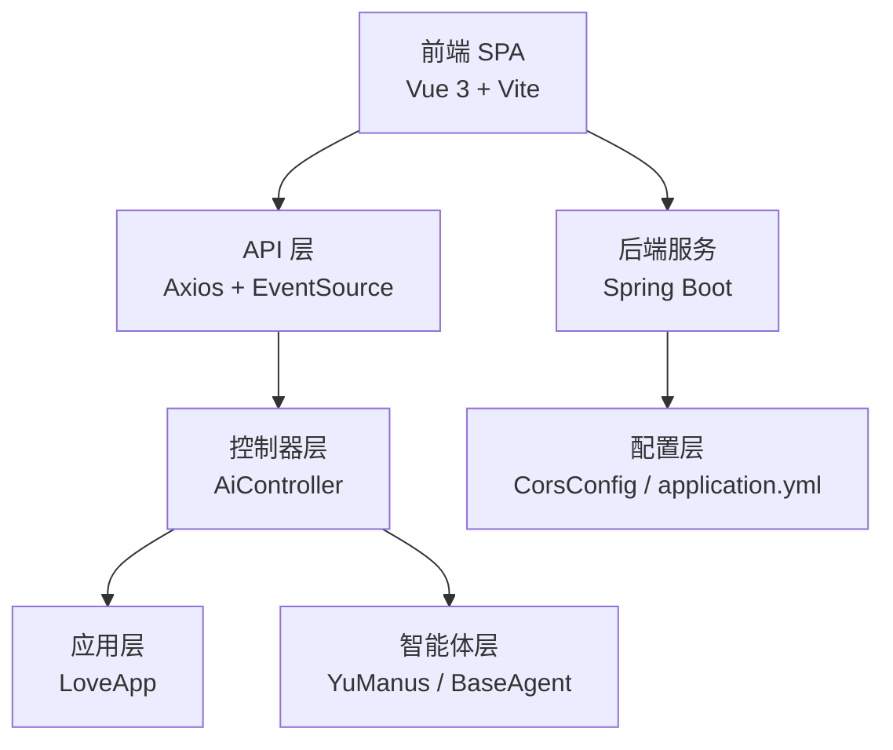
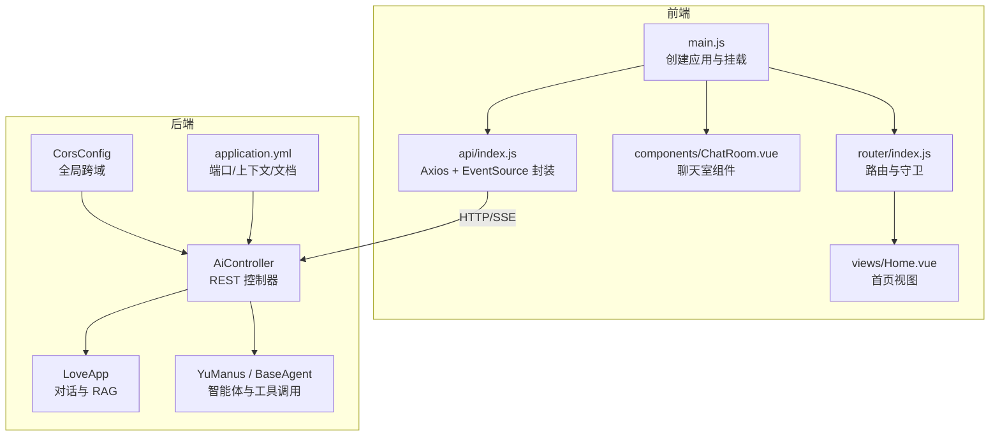
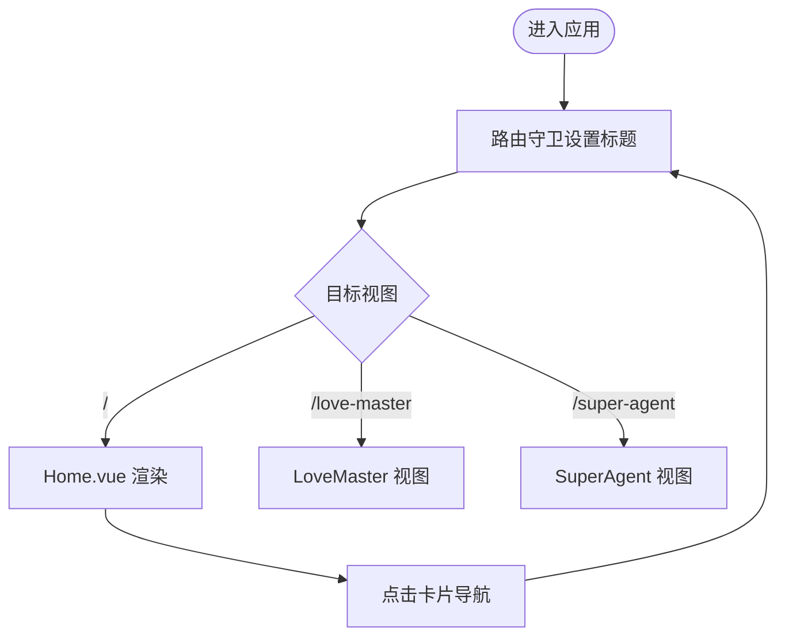
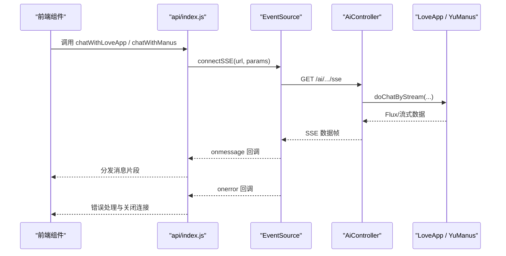
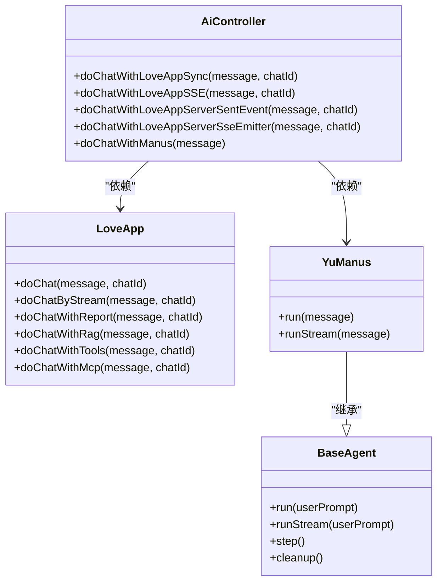
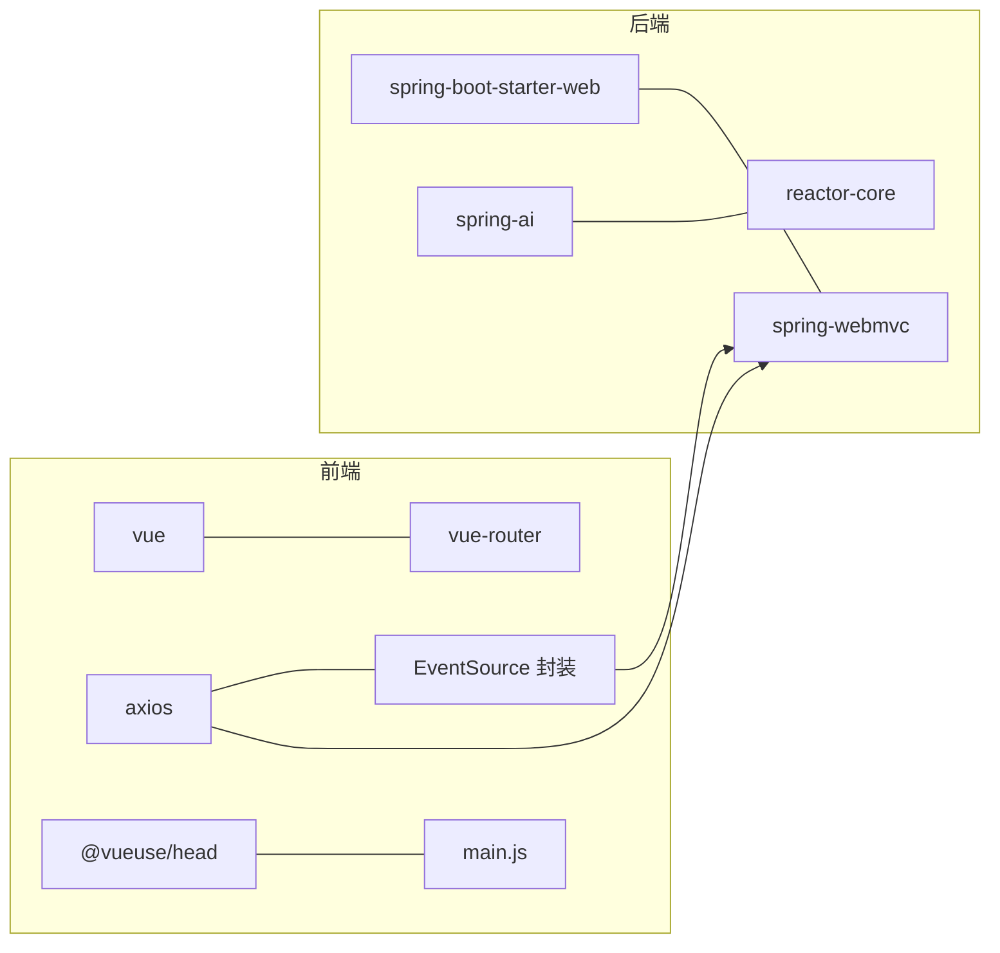

# 前后端架构

<cite>
**本文引用的文件**
- [YuAiAgentApplication.java](file://src/main/java/com/yupi/yuaiagent/YuAiAgentApplication.java)
- [CorsConfig.java](file://src/main/java/com/yupi/yuaiagent/config/CorsConfig.java)
- [AiController.java](file://src/main/java/com/yupi/yuaiagent/controller/AiController.java)
- [application.yml](file://src/main/resources/application.yml)
- [LoveApp.java](file://src/main/java/com/yupi/yuaiagent/app/LoveApp.java)
- [YuManus.java](file://src/main/java/com/yupi/yuaiagent/agent/YuManus.java)
- [BaseAgent.java](file://src/main/java/com/yupi/yuaiagent/agent/BaseAgent.java)
- [main.js](file://yu-ai-agent-frontend/src/main.js)
- [router/index.js](file://yu-ai-agent-frontend/src/router/index.js)
- [api/index.js](file://yu-ai-agent-frontend/src/api/index.js)
- [App.vue](file://yu-ai-agent-frontend/src/App.vue)
- [Home.vue](file://yu-ai-agent-frontend/src/views/Home.vue)
- [ChatRoom.vue](file://yu-ai-agent-frontend/src/components/ChatRoom.vue)
- [package.json](file://yu-ai-agent-frontend/package.json)
- [vite.config.js](file://yu-ai-agent-frontend/vite.config.js)
</cite>

## 目录
1. [引言](#引言)
2. [项目结构](#项目结构)
3. [核心组件](#核心组件)
4. [架构总览](#架构总览)
5. [详细组件分析](#详细组件分析)
6. [依赖分析](#依赖分析)
7. [性能考虑](#性能考虑)
8. [故障排查指南](#故障排查指南)
9. [结论](#结论)
10. [附录](#附录)

## 引言
本项目采用前后端分离架构，前端基于 Vue 3 + Vite 的单页应用（SPA），后端基于 Spring Boot。前端负责用户界面与交互，后端提供 RESTful API，并通过多种传输方式（HTTP、SSE）与前端进行实时数据交换。系统通过全局跨域配置、统一的 API 基础路径与环境变量，实现开发与生产的灵活切换。

## 项目结构
- 后端模块
  - 应用入口与配置：应用启动类、跨域配置、OpenAPI 文档配置、服务端口与上下文路径
  - 控制器层：AI 对话相关接口，支持同步响应与 SSE 流式传输
  - 应用与智能体：LoveApp（恋爱应用）、YuManus（超级智能体）、BaseAgent（抽象代理基类）
- 前端模块
  - 应用入口：创建 Vue 实例、挂载路由与头部管理
  - 路由：首页、恋爱大师页、超级智能体页
  - API 层：封装 Axios 实例与 SSE 连接
  - 视图与组件：首页视图、聊天室组件等

图表来源
- [main.js:1-13](file://yu-ai-agent-frontend/src/main.js#L1-L13)
- [router/index.js:1-47](file://yu-ai-agent-frontend/src/router/index.js#L1-L47)
- [api/index.js:1-60](file://yu-ai-agent-frontend/src/api/index.js#L1-L60)
- [AiController.java:1-106](file://src/main/java/com/yupi/yuaiagent/controller/AiController.java#L1-L106)
- [CorsConfig.java:1-26](file://src/main/java/com/yupi/yuaiagent/config/CorsConfig.java#L1-L26)
- [application.yml:1-66](file://src/main/resources/application.yml#L1-L66)

章节来源
- [YuAiAgentApplication.java:1-18](file://src/main/java/com/yupi/yuaiagent/YuAiAgentApplication.java#L1-L18)
- [application.yml:1-66](file://src/main/resources/application.yml#L1-L66)
- [CorsConfig.java:1-26](file://src/main/java/com/yupi/yuaiagent/config/CorsConfig.java#L1-L26)
- [AiController.java:1-106](file://src/main/java/com/yupi/yuaiagent/controller/AiController.java#L1-L106)
- [main.js:1-13](file://yu-ai-agent-frontend/src/main.js#L1-L13)
- [router/index.js:1-47](file://yu-ai-agent-frontend/src/router/index.js#L1-L47)
- [api/index.js:1-60](file://yu-ai-agent-frontend/src/api/index.js#L1-L60)

## 核心组件
- 后端
  - CORS 全局配置：允许凭据、通配源模式、放行常用方法与头
  - 控制器：提供恋爱应用与超级智能体的同步与流式接口
  - 应用层：LoveApp 封装对话客户端、记忆与 RAG 工具链
  - 智能体层：YuManus 继承 ToolCallAgent，具备工具调用与多步规划能力
- 前端
  - 路由：基于 History 模式的动态导入视图，全局设置页面标题
  - API 层：Axios 实例与 EventSource 封装，统一封装 SSE 连接
  - 视图与组件：首页视图、聊天室组件，负责消息渲染与输入控制

章节来源
- [CorsConfig.java:10-25](file://src/main/java/com/yupi/yuaiagent/config/CorsConfig.java#L10-L25)
- [AiController.java:18-105](file://src/main/java/com/yupi/yuaiagent/controller/AiController.java#L18-L105)
- [LoveApp.java:27-226](file://src/main/java/com/yupi/yuaiagent/app/LoveApp.java#L27-L226)
- [YuManus.java:12-37](file://src/main/java/com/yupi/yuaiagent/agent/YuManus.java#L12-L37)
- [BaseAgent.java:23-192](file://src/main/java/com/yupi/yuaiagent/agent/BaseAgent.java#L23-L192)
- [router/index.js:3-47](file://yu-ai-agent-frontend/src/router/index.js#L3-L47)
- [api/index.js:1-60](file://yu-ai-agent-frontend/src/api/index.js#L1-L60)
- [Home.vue:1-524](file://yu-ai-agent-frontend/src/views/Home.vue#L1-L524)
- [ChatRoom.vue:1-392](file://yu-ai-agent-frontend/src/components/ChatRoom.vue#L1-L392)

## 架构总览
系统采用“前端 SPA + 后端微服务”的典型分离架构。前端通过 Axios 与 EventSource 与后端交互，后端通过 Spring MVC 暴露 REST 接口，并以响应式流或 SSE 形式返回增量数据。跨域策略通过全局配置生效，生产环境通过相对路径与反向代理实现同源访问。

图表来源
- [main.js:1-13](file://yu-ai-agent-frontend/src/main.js#L1-L13)
- [router/index.js:1-47](file://yu-ai-agent-frontend/src/router/index.js#L1-L47)
- [Home.vue:1-524](file://yu-ai-agent-frontend/src/views/Home.vue#L1-L524)
- [ChatRoom.vue:1-392](file://yu-ai-agent-frontend/src/components/ChatRoom.vue#L1-L392)
- [api/index.js:1-60](file://yu-ai-agent-frontend/src/api/index.js#L1-L60)
- [AiController.java:18-105](file://src/main/java/com/yupi/yuaiagent/controller/AiController.java#L18-L105)
- [LoveApp.java:27-226](file://src/main/java/com/yupi/yuaiagent/app/LoveApp.java#L27-L226)
- [YuManus.java:12-37](file://src/main/java/com/yupi/yuaiagent/agent/YuManus.java#L12-L37)
- [BaseAgent.java:23-192](file://src/main/java/com/yupi/yuaiagent/agent/BaseAgent.java#L23-L192)
- [CorsConfig.java:10-25](file://src/main/java/com/yupi/yuaiagent/config/CorsConfig.java#L10-L25)
- [application.yml:38-53](file://src/main/resources/application.yml#L38-L53)

## 详细组件分析

### 前端路由与组件架构
- 路由设计
  - 使用 History 模式，动态导入视图组件，支持 SEO 元信息注入
  - 全局前置守卫设置页面标题，提升用户体验
- 组件架构
  - App.vue 作为根组件，承载全局样式与布局容器
  - Home.vue 提供应用入口卡片导航，跳转至恋爱大师与超级智能体页面
  - ChatRoom.vue 负责消息渲染、输入控制、自动滚动与打字指示器

图表来源
- [router/index.js:33-47](file://yu-ai-agent-frontend/src/router/index.js#L33-L47)
- [Home.vue:11-73](file://yu-ai-agent-frontend/src/views/Home.vue#L11-L73)

章节来源
- [router/index.js:1-47](file://yu-ai-agent-frontend/src/router/index.js#L1-L47)
- [App.vue:1-73](file://yu-ai-agent-frontend/src/App.vue#L1-L73)
- [Home.vue:1-524](file://yu-ai-agent-frontend/src/views/Home.vue#L1-L524)
- [ChatRoom.vue:1-392](file://yu-ai-agent-frontend/src/components/ChatRoom.vue#L1-L392)

### 前端 API 与通信机制
- Axios 实例
  - 基于环境变量设置 API 基础路径：生产使用相对路径，开发指向本地后端
  - 统一超时时间，便于前端侧的错误处理与重试策略
- SSE 封装
  - connectSSE 封装 EventSource，支持参数拼接、消息分发与错误处理
  - 特殊标记“[DONE]”用于流结束信号
- 聊天接口
  - 封装恋爱大师与超级智能体的 SSE 调用，简化组件调用

图表来源
- [api/index.js:14-60](file://yu-ai-agent-frontend/src/api/index.js#L14-L60)
- [AiController.java:50-104](file://src/main/java/com/yupi/yuaiagent/controller/AiController.java#L50-L104)
- [LoveApp.java:90-97](file://src/main/java/com/yupi/yuaiagent/app/LoveApp.java#L90-L97)
- [YuManus.java:12-37](file://src/main/java/com/yupi/yuaiagent/agent/YuManus.java#L12-L37)

章节来源
- [api/index.js:1-60](file://yu-ai-agent-frontend/src/api/index.js#L1-L60)
- [package.json:1-22](file://yu-ai-agent-frontend/package.json#L1-L22)
- [vite.config.js:1-18](file://yu-ai-agent-frontend/vite.config.js#L1-L18)

### 后端 RESTful API 设计与实现
- 接口设计原则
  - 路径层次清晰：/ai 下划分恋爱应用与超级智能体
  - 方法语义明确：同步与流式接口分离，便于前端选择
  - 响应格式：文本流（Flux）或 SSE（ServerSentEvent/SseEmitter）
- 关键接口
  - 同步聊天：/ai/love_app/chat/sync
  - SSE 流式：/ai/love_app/chat/sse 与 /ai/love_app/chat/server_sent_event
  - SSE Emitters：/ai/love_app/chat/sse_emitter
  - 超级智能体：/ai/manus/chat
- 应用与智能体
  - LoveApp：封装对话客户端、记忆与 RAG 工具链
  - YuManus：继承 BaseAgent，具备工具调用与多步规划能力

图表来源
- [AiController.java:18-105](file://src/main/java/com/yupi/yuaiagent/controller/AiController.java#L18-L105)
- [LoveApp.java:27-226](file://src/main/java/com/yupi/yuaiagent/app/LoveApp.java#L27-L226)
- [YuManus.java:12-37](file://src/main/java/com/yupi/yuaiagent/agent/YuManus.java#L12-L37)
- [BaseAgent.java:23-192](file://src/main/java/com/yupi/yuaiagent/agent/BaseAgent.java#L23-L192)

章节来源
- [AiController.java:1-106](file://src/main/java/com/yupi/yuaiagent/controller/AiController.java#L1-L106)
- [LoveApp.java:1-227](file://src/main/java/com/yupi/yuaiagent/app/LoveApp.java#L1-L227)
- [YuManus.java:1-38](file://src/main/java/com/yupi/yuaiagent/agent/YuManus.java#L1-L38)
- [BaseAgent.java:1-193](file://src/main/java/com/yupi/yuaiagent/agent/BaseAgent.java#L1-L193)

### 跨域、版本管理与错误处理
- 跨域（CORS）
  - 允许凭据、通配源模式、放行常用方法与头，覆盖所有路径
- API 版本管理
  - 当前未显式使用版本号前缀，但可通过路径前缀扩展（如 /api/v1/...）
- 错误处理
  - 前端：EventSource 的 onerror 回调与连接关闭
  - 后端：SSE 连接的超时与完成回调，异常捕获与清理

章节来源
- [CorsConfig.java:10-25](file://src/main/java/com/yupi/yuaiagent/config/CorsConfig.java#L10-L25)
- [api/index.js:38-45](file://yu-ai-agent-frontend/src/api/index.js#L38-L45)
- [BaseAgent.java:162-176](file://src/main/java/com/yupi/yuaiagent/agent/BaseAgent.java#L162-L176)

## 依赖分析
- 前端依赖
  - Vue 3、Vue Router、Axios、@vueuse/head
  - Vite 开发服务器与别名解析
- 后端依赖
  - Spring Boot、Spring MVC、Spring AI、响应式编程（Reactor）

图表来源
- [package.json:11-21](file://yu-ai-agent-frontend/package.json#L11-L21)
- [main.js:1-13](file://yu-ai-agent-frontend/src/main.js#L1-L13)
- [AiController.java:1-106](file://src/main/java/com/yupi/yuaiagent/controller/AiController.java#L1-L106)

章节来源
- [package.json:1-22](file://yu-ai-agent-frontend/package.json#L1-L22)
- [vite.config.js:1-18](file://yu-ai-agent-frontend/vite.config.js#L1-L18)

## 性能考虑
- 前端
  - 使用动态导入减少首屏体积
  - SSE 流式渲染，避免一次性大文本导致的卡顿
  - 自动滚动与最小化 DOM 更新
- 后端
  - SSE 连接超时与完成回调，避免长时间占用连接
  - 响应式流（Flux）与背压友好，适合长文本增量输出
  - 可结合限流与缓存策略，降低外部模型调用压力

## 故障排查指南
- 前端
  - 确认 API 基础路径与环境变量一致
  - 检查 EventSource 是否正常触发 onerror 并正确关闭
- 后端
  - 检查 CORS 配置是否允许来源与凭据
  - 关注 SSE 超时与完成回调，确保资源清理
  - 查看日志级别配置，定位 Spring AI 调用细节

章节来源
- [api/index.js:3-12](file://yu-ai-agent-frontend/src/api/index.js#L3-L12)
- [CorsConfig.java:14-23](file://src/main/java/com/yupi/yuaiagent/config/CorsConfig.java#L14-L23)
- [application.yml:64-66](file://src/main/resources/application.yml#L64-L66)
- [BaseAgent.java:162-176](file://src/main/java/com/yupi/yuaiagent/agent/BaseAgent.java#L162-L176)

## 结论
该系统通过清晰的前后端职责划分与统一的通信协议，实现了良好的可维护性与扩展性。前端 SPA 提供流畅的交互体验，后端 REST + SSE 保障了实时性与性能。建议在生产环境中进一步完善 API 版本化、鉴权与限流策略，并持续优化前端渲染与后端响应式流的性能表现。

## 附录
- 配置要点
  - 后端端口与上下文路径：/api
  - OpenAPI 与 Knife4j 文档路径
  - 日志级别调整，便于调试 Spring AI 调用
- 前端开发
  - Vite 别名与开发服务器配置
  - 环境变量驱动的 API 基础路径

章节来源
- [application.yml:38-66](file://src/main/resources/application.yml#L38-L66)
- [vite.config.js:8-16](file://yu-ai-agent-frontend/vite.config.js#L8-L16)