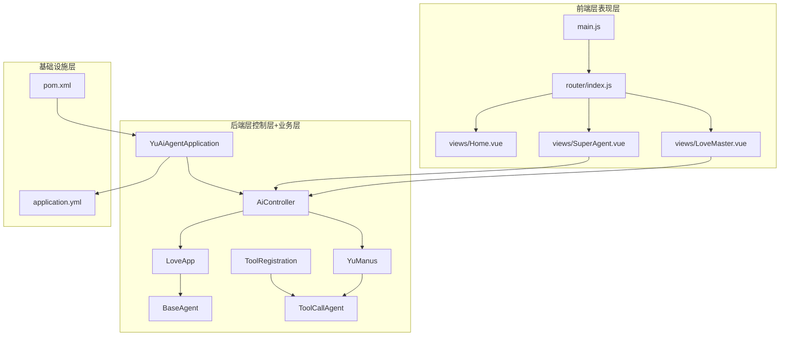
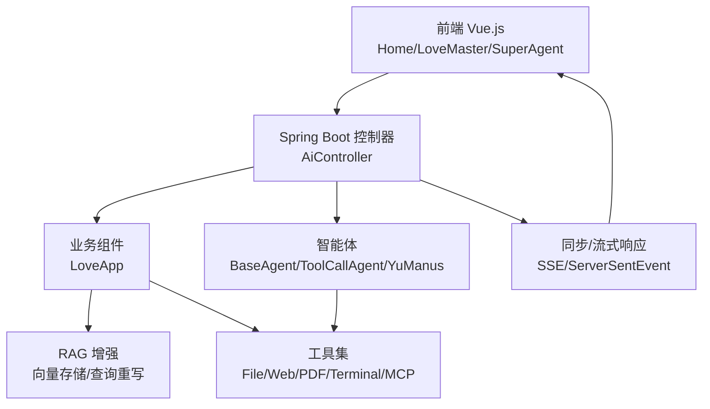
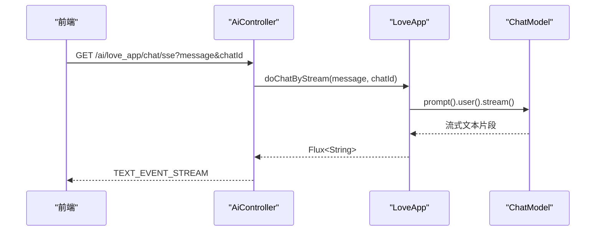
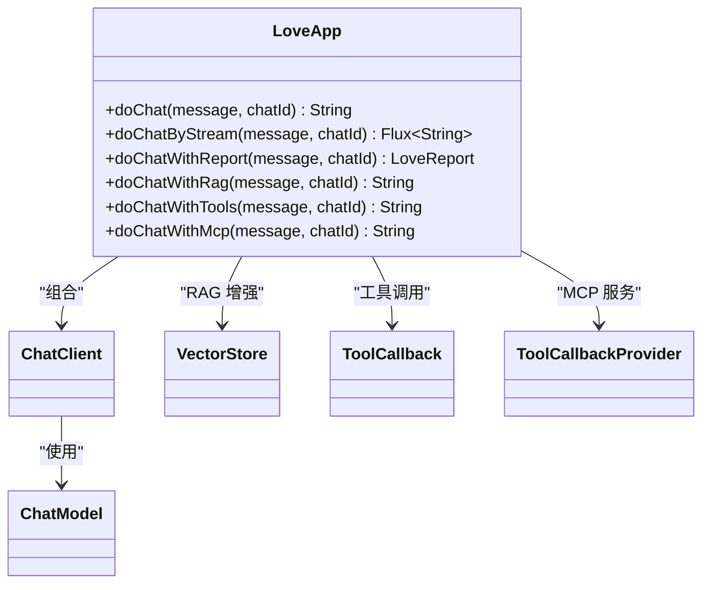
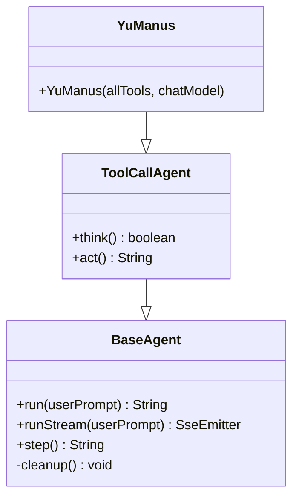
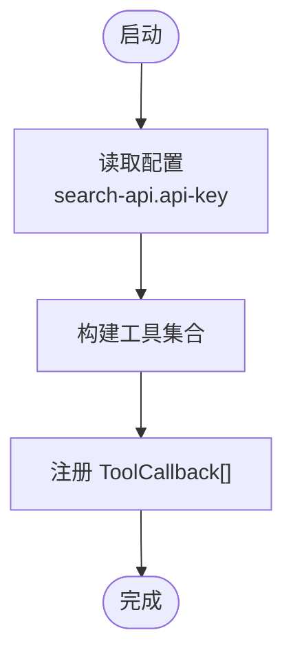
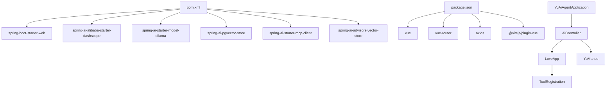

# 整体架构设计

<cite>
**本文档引用的文件**
- [YuAiAgentApplication.java](file://src/main/java/com/yupi/yuaiagent/YuAiAgentApplication.java)
- [AiController.java](file://src/main/java/com/yupi/yuaiagent/controller/AiController.java)
- [LoveApp.java](file://src/main/java/com/yupi/yuaiagent/app/LoveApp.java)
- [BaseAgent.java](file://src/main/java/com/yupi/yuaiagent/agent/BaseAgent.java)
- [ToolCallAgent.java](file://src/main/java/com/yupi/yuaiagent/agent/ToolCallAgent.java)
- [YuManus.java](file://src/main/java/com/yupi/yuaiagent/agent/YuManus.java)
- [ToolRegistration.java](file://src/main/java/com/yupi/yuaiagent/tools/ToolRegistration.java)
- [application.yml](file://src/main/resources/application.yml)
- [pom.xml](file://pom.xml)
- [main.js](file://yu-ai-agent-frontend/src/main.js)
- [index.js](file://yu-ai-agent-frontend/src/router/index.js)
- [Home.vue](file://yu-ai-agent-frontend/src/views/Home.vue)
- [LoveMaster.vue](file://yu-ai-agent-frontend/src/views/LoveMaster.vue)
- [SuperAgent.vue](file://yu-ai-agent-frontend/src/views/SuperAgent.vue)
</cite>

## 目录
1. [引言](#引言)
2. [项目结构](#项目结构)
3. [核心组件](#核心组件)
4. [架构总览](#架构总览)
5. [详细组件分析](#详细组件分析)
6. [依赖分析](#依赖分析)
7. [性能考虑](#性能考虑)
8. [故障排除指南](#故障排除指南)
9. [结论](#结论)

## 引言
本项目是一个基于 Spring Boot 的 AI 超级智能体应用，采用分层架构设计，包含表现层（Vue.js 前端）、控制层（Spring Boot 控制器）、业务层（智能体与应用逻辑）、基础设施层（工具、RAG、MCP 服务）。系统以模块化为核心设计原则，强调可扩展性与可维护性，通过清晰的职责边界和数据流控制，实现从用户交互到大模型推理、工具调用与知识检索的完整链路。

## 项目结构
项目采用前后端分离架构，后端使用 Spring Boot，前端使用 Vue 3 + Vite，同时提供独立的 MCP 服务模块。后端通过控制器暴露 REST 接口，业务逻辑封装在应用组件与智能体中，工具与 RAG 能力通过 Spring AI 生态集成。

**图表来源**
- [main.js:1-13](file://yu-ai-agent-frontend/src/main.js#L1-L13)
- [index.js:1-47](file://yu-ai-agent-frontend/src/router/index.js#L1-L47)
- [Home.vue:1-524](file://yu-ai-agent-frontend/src/views/Home.vue#L1-L524)
- [LoveMaster.vue:1-244](file://yu-ai-agent-frontend/src/views/LoveMaster.vue#L1-L244)
- [SuperAgent.vue:1-286](file://yu-ai-agent-frontend/src/views/SuperAgent.vue#L1-L286)
- [YuAiAgentApplication.java:1-18](file://src/main/java/com/yupi/yuaiagent/YuAiAgentApplication.java#L1-L18)
- [AiController.java:1-106](file://src/main/java/com/yupi/yuaiagent/controller/AiController.java#L1-L106)
- [LoveApp.java:1-227](file://src/main/java/com/yupi/yuaiagent/app/LoveApp.java#L1-L227)
- [BaseAgent.java:1-193](file://src/main/java/com/yupi/yuaiagent/agent/BaseAgent.java#L1-L193)
- [ToolCallAgent.java:1-136](file://src/main/java/com/yupi/yuaiagent/agent/ToolCallAgent.java#L1-L136)
- [YuManus.java:1-38](file://src/main/java/com/yupi/yuaiagent/agent/YuManus.java#L1-L38)
- [ToolRegistration.java:1-38](file://src/main/java/com/yupi/yuaiagent/tools/ToolRegistration.java#L1-L38)
- [application.yml:1-66](file://src/main/resources/application.yml#L1-L66)
- [pom.xml:1-227](file://pom.xml#L1-L227)

**章节来源**
- [YuAiAgentApplication.java:1-18](file://src/main/java/com/yupi/yuaiagent/YuAiAgentApplication.java#L1-L18)
- [AiController.java:1-106](file://src/main/java/com/yupi/yuaiagent/controller/AiController.java#L1-L106)
- [LoveApp.java:1-227](file://src/main/java/com/yupi/yuaiagent/app/LoveApp.java#L1-L227)
- [BaseAgent.java:1-193](file://src/main/java/com/yupi/yuaiagent/agent/BaseAgent.java#L1-L193)
- [ToolCallAgent.java:1-136](file://src/main/java/com/yupi/yuaiagent/agent/ToolCallAgent.java#L1-L136)
- [YuManus.java:1-38](file://src/main/java/com/yupi/yuaiagent/agent/YuManus.java#L1-L38)
- [ToolRegistration.java:1-38](file://src/main/java/com/yupi/yuaiagent/tools/ToolRegistration.java#L1-L38)
- [application.yml:1-66](file://src/main/resources/application.yml#L1-L66)
- [pom.xml:1-227](file://pom.xml#L1-L227)
- [main.js:1-13](file://yu-ai-agent-frontend/src/main.js#L1-L13)
- [index.js:1-47](file://yu-ai-agent-frontend/src/router/index.js#L1-L47)
- [Home.vue:1-524](file://yu-ai-agent-frontend/src/views/Home.vue#L1-L524)
- [LoveMaster.vue:1-244](file://yu-ai-agent-frontend/src/views/LoveMaster.vue#L1-L244)
- [SuperAgent.vue:1-286](file://yu-ai-agent-frontend/src/views/SuperAgent.vue#L1-L286)

## 核心组件
- 表现层（前端）
  - 应用入口：创建 Vue 应用并挂载路由与头部管理。
  - 路由：定义首页、恋爱大师、超级智能体三个页面的导航与元信息。
  - 视图组件：Home 展示应用入口卡片，LoveMaster 与 SuperAgent 提供聊天界面与 SSE 流式交互。
- 控制层（后端控制器）
  - AiController：提供同步与流式接口，支持 SSE 与 ServerSentEvent，统一调度 LoveApp 与 YuManus。
- 业务层（应用与智能体）
  - LoveApp：封装聊天客户端、对话记忆、RAG 增强、工具调用与 MCP 服务调用。
  - BaseAgent/ToolCallAgent/YuManus：抽象智能体执行框架，支持步骤驱动、工具调用与流式输出。
  - ToolRegistration：集中注册可用工具集合。
- 基础设施层
  - application.yml：配置大模型 API Key、SSE/MCP/PGVector 等开关与参数。
  - pom.xml：声明 Spring AI、DashScope、Ollama、PGVector、MCP 客户端等依赖。

**章节来源**
- [AiController.java:18-106](file://src/main/java/com/yupi/yuaiagent/controller/AiController.java#L18-L106)
- [LoveApp.java:27-227](file://src/main/java/com/yupi/yuaiagent/app/LoveApp.java#L27-L227)
- [BaseAgent.java:23-193](file://src/main/java/com/yupi/yuaiagent/agent/BaseAgent.java#L23-L193)
- [ToolCallAgent.java:24-136](file://src/main/java/com/yupi/yuaiagent/agent/ToolCallAgent.java#L24-L136)
- [YuManus.java:9-38](file://src/main/java/com/yupi/yuaiagent/agent/YuManus.java#L9-L38)
- [ToolRegistration.java:9-38](file://src/main/java/com/yupi/yuaiagent/tools/ToolRegistration.java#L9-L38)
- [application.yml:1-66](file://src/main/resources/application.yml#L1-L66)
- [pom.xml:50-164](file://pom.xml#L50-L164)

## 架构总览
系统采用四层分层架构：
- 表现层（前端 Vue.js）：负责用户交互与实时渲染，通过 API 组件发起请求并消费 SSE。
- 控制层（Spring Boot 控制器）：接收前端请求，编排业务组件与智能体，返回同步或流式响应。
- 业务层（智能体与应用逻辑）：封装聊天客户端、对话记忆、RAG 增强、工具调用与 MCP 服务调用。
- 基础设施层（工具、RAG、MCP 服务）：提供向量存储、搜索引擎、外部 MCP 服务等能力。

**图表来源**
- [AiController.java:18-106](file://src/main/java/com/yupi/yuaiagent/controller/AiController.java#L18-L106)
- [LoveApp.java:27-227](file://src/main/java/com/yupi/yuaiagent/app/LoveApp.java#L27-L227)
- [BaseAgent.java:23-193](file://src/main/java/com/yupi/yuaiagent/agent/BaseAgent.java#L23-L193)
- [ToolCallAgent.java:24-136](file://src/main/java/com/yupi/yuaiagent/agent/ToolCallAgent.java#L24-L136)
- [YuManus.java:9-38](file://src/main/java/com/yupi/yuaiagent/agent/YuManus.java#L9-L38)
- [ToolRegistration.java:9-38](file://src/main/java/com/yupi/yuaiagent/tools/ToolRegistration.java#L9-L38)

## 详细组件分析

### 控制层组件分析（AiController）
- 职责边界
  - 提供统一的 AI 能力入口，支持同步与流式对话。
  - 将前端请求委派给 LoveApp 或 YuManus，并将响应以 SSE 形式返回。
- 关键交互
  - /ai/love_app/chat/sync：同步对话。
  - /ai/love_app/chat/sse：Flux 流式响应。
  - /ai/love_app/chat/server_sent_event：ServerSentEvent 包装。
  - /ai/love_app/chat/sse_emitter：SseEmitter 实现长连接。
  - /ai/manus/chat：调用 YuManus 并返回流式响应。

**图表来源**
- [AiController.java:50-68](file://src/main/java/com/yupi/yuaiagent/controller/AiController.java#L50-L68)
- [LoveApp.java:90-97](file://src/main/java/com/yupi/yuaiagent/app/LoveApp.java#L90-L97)

**章节来源**
- [AiController.java:18-106](file://src/main/java/com/yupi/yuaiagent/controller/AiController.java#L18-L106)
- [LoveApp.java:71-97](file://src/main/java/com/yupi/yuaiagent/app/LoveApp.java#L71-L97)

### 业务层组件分析（LoveApp）
- 职责边界
  - 封装 ChatClient，配置系统提示词与对话记忆。
  - 提供基础对话、流式对话、RAG 增强、工具调用、MCP 服务调用等能力。
- 关键特性
  - 对话记忆：支持内存式对话记忆与文件式记忆（可选）。
  - RAG 增强：支持多种向量存储与查询重写。
  - 工具调用：通过 ToolCallback 集合实现多工具联动。
  - MCP 服务：通过 ToolCallbackProvider 集成外部 MCP 服务。

**图表来源**
- [LoveApp.java:27-227](file://src/main/java/com/yupi/yuaiagent/app/LoveApp.java#L27-L227)

**章节来源**
- [LoveApp.java:27-227](file://src/main/java/com/yupi/yuaiagent/app/LoveApp.java#L27-L227)

### 智能体组件分析（BaseAgent/ToolCallAgent/YuManus）
- 职责边界
  - BaseAgent：抽象智能体执行框架，支持步骤驱动与流式输出。
  - ToolCallAgent：实现 think/act 的 ReAct 流程，管理工具调用与消息上下文。
  - YuManus：具体智能体实现，配置系统提示词与最大步数。
- 关键流程
  - run/runStream：初始化状态、构建消息上下文、执行步骤循环。
  - think：调用大模型生成下一步动作与工具选择。
  - act：执行工具调用并将结果写入上下文。

**图表来源**
- [BaseAgent.java:23-193](file://src/main/java/com/yupi/yuaiagent/agent/BaseAgent.java#L23-L193)
- [ToolCallAgent.java:24-136](file://src/main/java/com/yupi/yuaiagent/agent/ToolCallAgent.java#L24-L136)
- [YuManus.java:9-38](file://src/main/java/com/yupi/yuaiagent/agent/YuManus.java#L9-L38)

**章节来源**
- [BaseAgent.java:23-193](file://src/main/java/com/yupi/yuaiagent/agent/BaseAgent.java#L23-L193)
- [ToolCallAgent.java:24-136](file://src/main/java/com/yupi/yuaiagent/agent/ToolCallAgent.java#L24-L136)
- [YuManus.java:9-38](file://src/main/java/com/yupi/yuaiagent/agent/YuManus.java#L9-L38)

### 工具注册组件分析（ToolRegistration）
- 职责边界
  - 集中注册所有可用工具，形成 ToolCallback 数组，供智能体与应用组件使用。
- 工具类型
  - 文件操作、网页搜索、网页抓取、资源下载、终端操作、PDF 生成、终止工具等。

**图表来源**
- [ToolRegistration.java:9-38](file://src/main/java/com/yupi/yuaiagent/tools/ToolRegistration.java#L9-L38)

**章节来源**
- [ToolRegistration.java:9-38](file://src/main/java/com/yupi/yuaiagent/tools/ToolRegistration.java#L9-L38)

### 基础设施配置分析（application.yml/pom.xml）
- application.yml
  - 配置大模型 API Key、模型参数、SSE/MCP/PGVector 等开关。
  - 配置 Swagger/Knife4j 文档路径与语言。
- pom.xml
  - 依赖 Spring Boot、Spring AI、DashScope、Ollama、PGVector、MCP 客户端等。
  - 管理依赖版本与仓库源，确保 Spring AI 相关依赖可正确拉取。

**章节来源**
- [application.yml:1-66](file://src/main/resources/application.yml#L1-L66)
- [pom.xml:32-164](file://pom.xml#L32-L164)

## 依赖分析
系统依赖关系清晰，前后端通过 HTTP/SSE 通信，后端内部通过组件装配与工具注册实现松耦合。

**图表来源**
- [pom.xml:50-164](file://pom.xml#L50-L164)
- [package.json:1-22](file://yu-ai-agent-frontend/package.json#L1-L22)
- [YuAiAgentApplication.java:1-18](file://src/main/java/com/yupi/yuaiagent/YuAiAgentApplication.java#L1-L18)
- [AiController.java:1-106](file://src/main/java/com/yupi/yuaiagent/controller/AiController.java#L1-L106)
- [LoveApp.java:1-227](file://src/main/java/com/yupi/yuaiagent/app/LoveApp.java#L1-L227)
- [YuManus.java:1-38](file://src/main/java/com/yupi/yuaiagent/agent/YuManus.java#L1-L38)
- [ToolRegistration.java:1-38](file://src/main/java/com/yupi/yuaiagent/tools/ToolRegistration.java#L1-L38)

**章节来源**
- [pom.xml:50-164](file://pom.xml#L50-L164)
- [package.json:1-22](file://yu-ai-agent-frontend/package.json#L1-L22)

## 性能考虑
- 流式输出优化
  - 使用 SSE/ServerSentEvent 降低前端等待时间，提升用户体验。
  - 在智能体与应用层均提供流式接口，减少一次性响应体积。
- 工具调用与消息上下文
  - 通过工具调用管理器与消息上下文合并，避免重复请求与冗余对话。
- 向量存储与查询重写
  - RAG 增强可结合查询重写与上下文增强，提高检索质量与响应速度。
- 前后端分离
  - 前端路由懒加载与组件按需引入，减少初始包体大小。

## 故障排除指南
- SSE 连接异常
  - 检查后端控制器的 SSE 超时与完成回调设置，确认前端事件源正确关闭。
  - 关注日志级别配置，启用 DEBUG 查看 Spring AI 调用细节。
- 工具调用失败
  - 确认工具注册与 API Key 配置正确，检查工具执行结果与终止工具触发。
- RAG 与向量存储
  - 确认向量存储服务可用与查询重写配置生效，必要时切换不同增强策略。
- MCP 服务
  - 检查 MCP 客户端配置与服务端连接，确保工具回调提供者可用。

**章节来源**
- [AiController.java:77-92](file://src/main/java/com/yupi/yuaiagent/controller/AiController.java#L77-L92)
- [application.yml:64-66](file://src/main/resources/application.yml#L64-L66)
- [ToolCallAgent.java:111-134](file://src/main/java/com/yupi/yuaiagent/agent/ToolCallAgent.java#L111-L134)
- [LoveApp.java:145-172](file://src/main/java/com/yupi/yuaiagent/app/LoveApp.java#L145-L172)

## 结论
本项目通过清晰的分层架构与模块化设计，实现了从前端交互到后端智能体与工具调用的完整闭环。控制层统一编排，业务层封装复杂逻辑，基础设施层提供可插拔的能力扩展点。该设计既保证了系统的可扩展性与可维护性，也为后续接入更多工具、RAG 与 MCP 服务提供了良好的基础。