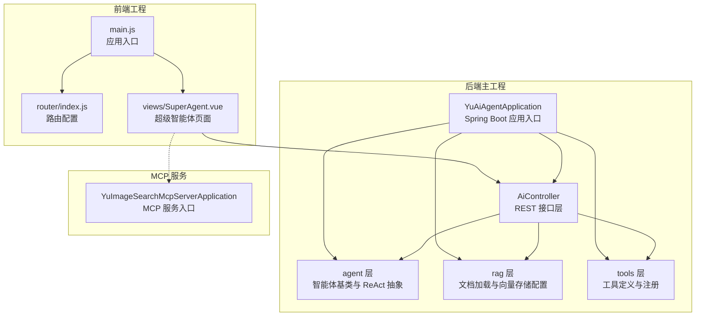
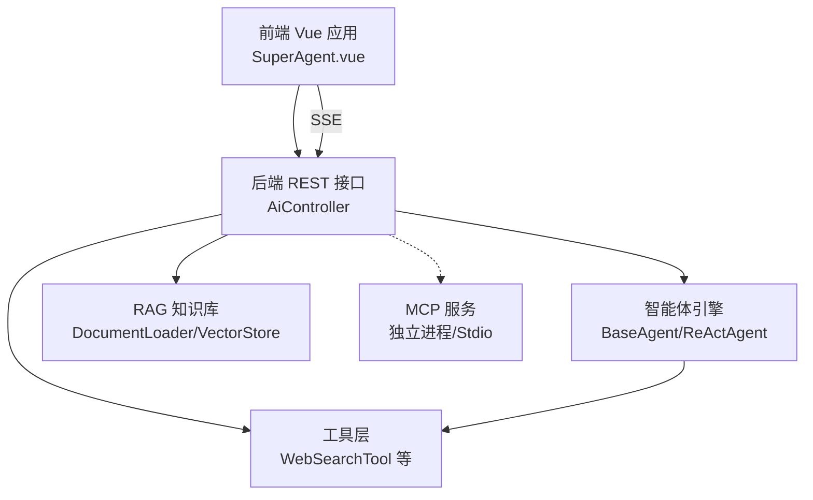
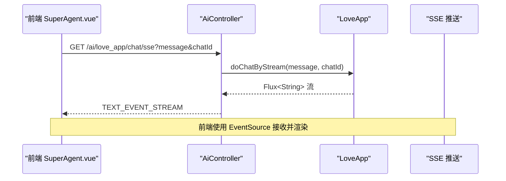
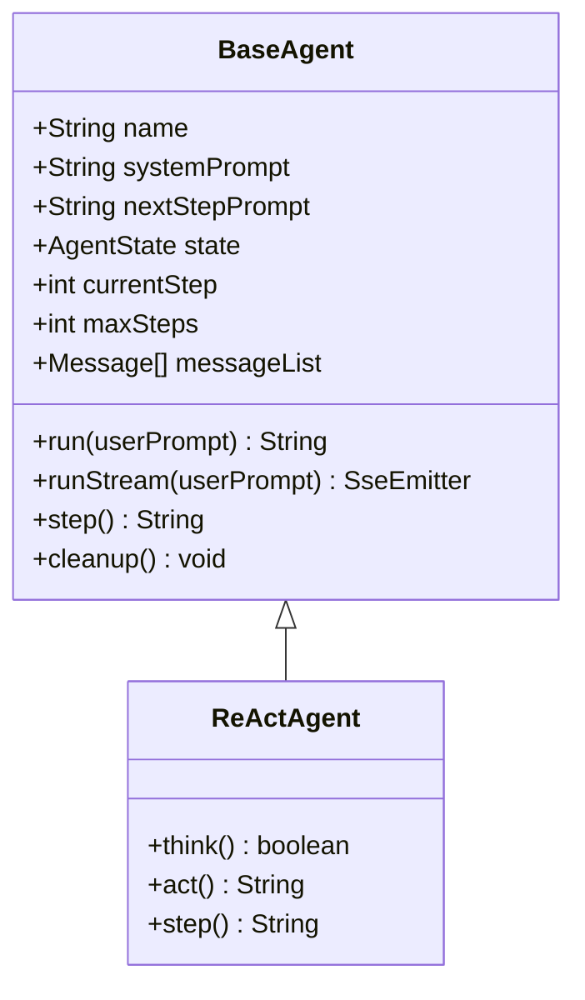
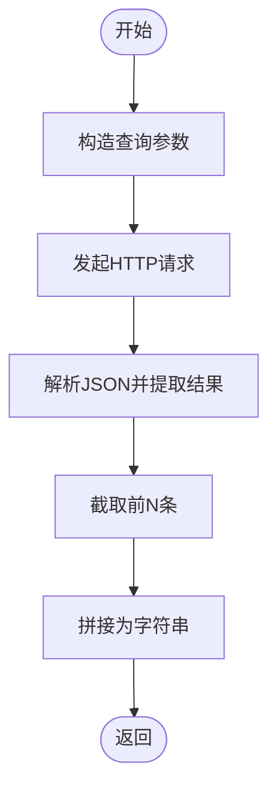
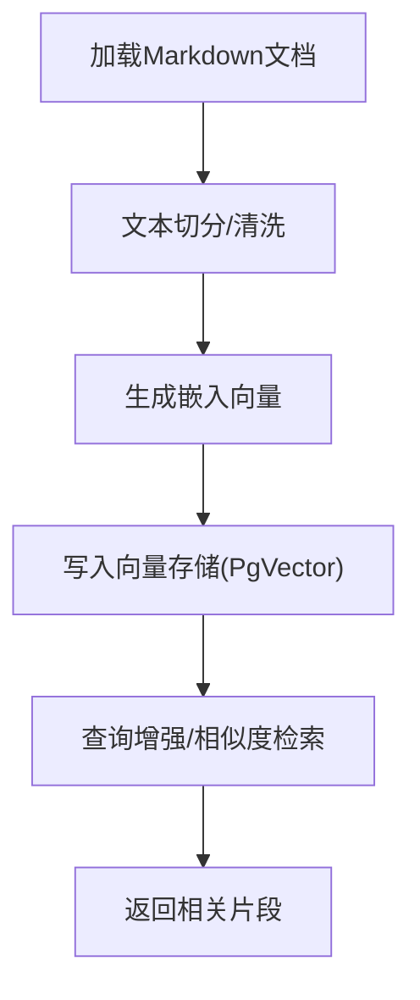
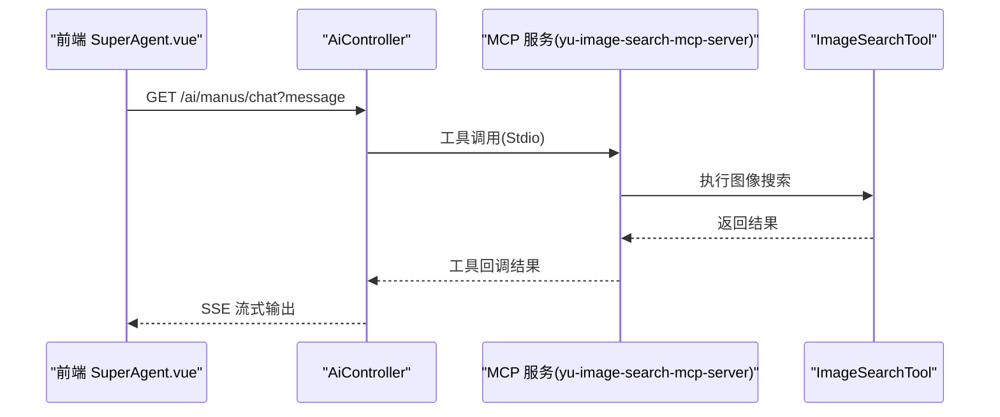
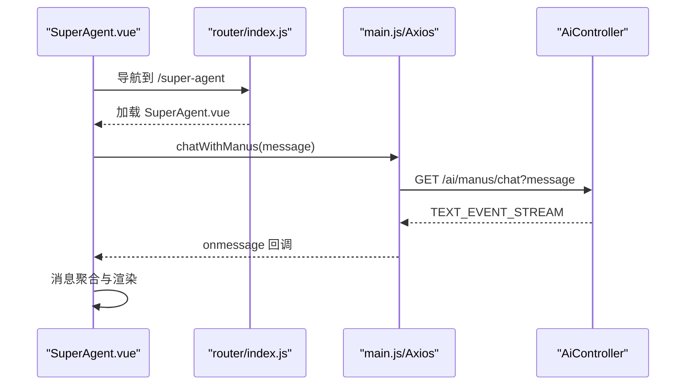
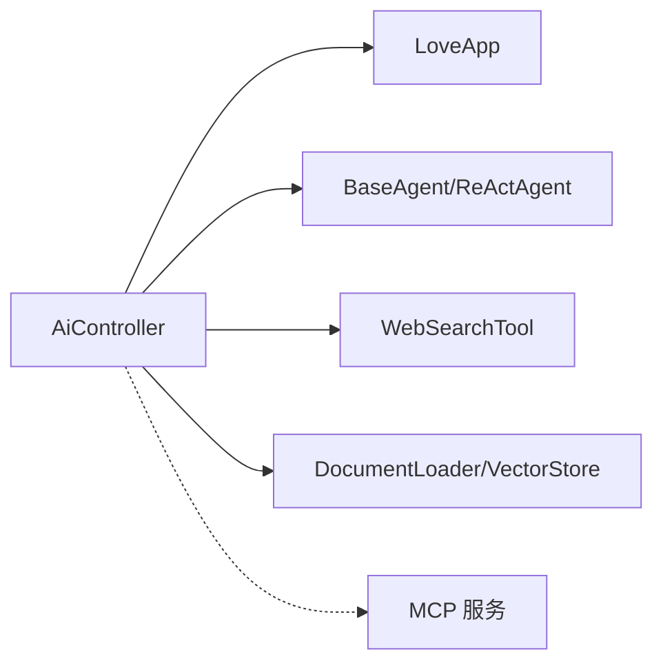

# 系统架构

<cite>
**本文引用的文件**
- [YuAiAgentApplication.java](file://src/main/java/com/yupi/yuaiagent/YuAiAgentApplication.java)
- [application.yml](file://src/main/resources/application.yml)
- [AiController.java](file://src/main/java/com/yupi/yuaiagent/controller/AiController.java)
- [BaseAgent.java](file://src/main/java/com/yupi/yuaiagent/agent/BaseAgent.java)
- [ReActAgent.java](file://src/main/java/com/yupi/yuaiagent/agent/ReActAgent.java)
- [WebSearchTool.java](file://src/main/java/com/yupi/yuaiagent/tools/WebSearchTool.java)
- [LoveAppDocumentLoader.java](file://src/main/java/com/yupi/yuaiagent/rag/LoveAppDocumentLoader.java)
- [PgVectorVectorStoreConfig.java](file://src/main/java/com/yupi/yuaiagent/rag/PgVectorVectorStoreConfig.java)
- [mcp-servers.json](file://src/main/resources/mcp-servers.json)
- [YuImageSearchMcpServerApplication.java](file://yu-image-search-mcp-server/src/main/java/com/yupi/yuimagesearchmcpserver/YuImageSearchMcpServerApplication.java)
- [package.json](file://yu-ai-agent-frontend/package.json)
- [main.js](file://yu-ai-agent-frontend/src/main.js)
- [index.js](file://yu-ai-agent-frontend/src/router/index.js)
- [vite.config.js](file://yu-ai-agent-frontend/vite.config.js)
- [SuperAgent.vue](file://yu-ai-agent-frontend/src/views/SuperAgent.vue)
</cite>

## 目录
1. [引言](#引言)
2. [项目结构](#项目结构)
3. [核心组件](#核心组件)
4. [架构总览](#架构总览)
5. [详细组件分析](#详细组件分析)
6. [依赖分析](#依赖分析)
7. [性能考虑](#性能考虑)
8. [故障排查指南](#故障排查指南)
9. [结论](#结论)
10. [附录](#附录)

## 引言
本项目是一个AI超级智能体应用平台，采用前后端分离架构：前端使用Vue.js构建用户界面与交互体验，后端基于Spring Boot提供REST接口与智能体编排能力；同时集成了RAG知识库与MCP服务扩展，支持ReAct模式的推理与行动循环以及工具调用。本文档从分层架构视角出发，系统化阐述控制器层、业务逻辑层、工具层与基础设施层的职责划分，解释前后端交互模式，深入解析ReAct智能体与RAG知识库的架构设计，并给出架构图与组件关系图，帮助开发者快速理解与扩展系统。

## 项目结构
项目由三个主要部分构成：
- 后端主工程：提供智能体编排、RAG知识库与MCP集成能力
- 前端工程：提供聊天界面与SSE流式渲染
- MCP独立服务：提供图像搜索等外部工具能力

**图表来源**
- [YuAiAgentApplication.java:1-18](file://src/main/java/com/yupi/yuaiagent/YuAiAgentApplication.java#L1-L18)
- [AiController.java:1-106](file://src/main/java/com/yupi/yuaiagent/controller/AiController.java#L1-L106)
- [BaseAgent.java:1-193](file://src/main/java/com/yupi/yuaiagent/agent/BaseAgent.java#L1-L193)
- [ReActAgent.java:1-53](file://src/main/java/com/yupi/yuaiagent/agent/ReActAgent.java#L1-L53)
- [LoveAppDocumentLoader.java:1-56](file://src/main/java/com/yupi/yuaiagent/rag/LoveAppDocumentLoader.java#L1-L56)
- [PgVectorVectorStoreConfig.java:1-41](file://src/main/java/com/yupi/yuaiagent/rag/PgVectorVectorStoreConfig.java#L1-L41)
- [WebSearchTool.java:1-54](file://src/main/java/com/yupi/yuaiagent/tools/WebSearchTool.java#L1-L54)
- [main.js:1-13](file://yu-ai-agent-frontend/src/main.js#L1-L13)
- [index.js:1-47](file://yu-ai-agent-frontend/src/router/index.js#L1-L47)
- [SuperAgent.vue:1-286](file://yu-ai-agent-frontend/src/views/SuperAgent.vue#L1-L286)
- [YuImageSearchMcpServerApplication.java:1-25](file://yu-image-search-mcp-server/src/main/java/com/yupi/yuimagesearchmcpserver/YuImageSearchMcpServerApplication.java#L1-L25)

**章节来源**
- [YuAiAgentApplication.java:1-18](file://src/main/java/com/yupi/yuaiagent/YuAiAgentApplication.java#L1-L18)
- [application.yml:1-66](file://src/main/resources/application.yml#L1-L66)
- [package.json:1-22](file://yu-ai-agent-frontend/package.json#L1-L22)
- [main.js:1-13](file://yu-ai-agent-frontend/src/main.js#L1-L13)
- [index.js:1-47](file://yu-ai-agent-frontend/src/router/index.js#L1-L47)
- [vite.config.js:1-18](file://yu-ai-agent-frontend/vite.config.js#L1-L18)

## 核心组件
- 控制器层：AiController提供REST接口，支持同步与SSE流式对话，统一调度业务应用与智能体执行。
- 业务逻辑层：agent.BaseAgent与agent.ReActAgent定义智能体执行框架，支持步骤驱动与ReAct推理-行动循环。
- 工具层：tools.WebSearchTool等工具以注解方式声明，配合工具回调在智能体决策中被调用。
- 基础设施层：RAG文档加载与向量存储配置，MCP服务配置与独立服务进程，支撑外部能力扩展。

**章节来源**
- [AiController.java:1-106](file://src/main/java/com/yupi/yuaiagent/controller/AiController.java#L1-L106)
- [BaseAgent.java:1-193](file://src/main/java/com/yupi/yuaiagent/agent/BaseAgent.java#L1-L193)
- [ReActAgent.java:1-53](file://src/main/java/com/yupi/yuaiagent/agent/ReActAgent.java#L1-L53)
- [WebSearchTool.java:1-54](file://src/main/java/com/yupi/yuaiagent/tools/WebSearchTool.java#L1-L54)
- [LoveAppDocumentLoader.java:1-56](file://src/main/java/com/yupi/yuaiagent/rag/LoveAppDocumentLoader.java#L1-L56)
- [PgVectorVectorStoreConfig.java:1-41](file://src/main/java/com/yupi/yuaiagent/rag/PgVectorVectorStoreConfig.java#L1-L41)

## 架构总览
系统采用分层架构与前后端分离模式：
- 分层架构
  - 控制器层：暴露HTTP接口，负责请求接入与响应封装（含SSE）
  - 业务逻辑层：封装智能体生命周期与执行流程，支持ReAct模式
  - 工具层：提供可插拔的工具集合，支持外部能力调用
  - 基础设施层：RAG知识库与MCP服务，提供检索增强与外部工具扩展
- 前后端分离
  - 前端：Vue 3 + Vue Router + Axios，页面通过SSE接收后端流式输出
  - 后端：Spring Boot，提供REST与SSE能力，统一编排智能体与工具

**图表来源**
- [AiController.java:1-106](file://src/main/java/com/yupi/yuaiagent/controller/AiController.java#L1-L106)
- [BaseAgent.java:1-193](file://src/main/java/com/yupi/yuaiagent/agent/BaseAgent.java#L1-L193)
- [ReActAgent.java:1-53](file://src/main/java/com/yupi/yuaiagent/agent/ReActAgent.java#L1-L53)
- [WebSearchTool.java:1-54](file://src/main/java/com/yupi/yuaiagent/tools/WebSearchTool.java#L1-L54)
- [LoveAppDocumentLoader.java:1-56](file://src/main/java/com/yupi/yuaiagent/rag/LoveAppDocumentLoader.java#L1-L56)
- [PgVectorVectorStoreConfig.java:1-41](file://src/main/java/com/yupi/yuaiagent/rag/PgVectorVectorStoreConfig.java#L1-L41)
- [SuperAgent.vue:1-286](file://yu-ai-agent-frontend/src/views/SuperAgent.vue#L1-L286)

## 详细组件分析

### 控制器层：AiController
- 职责
  - 对外提供REST接口，支持同步与SSE两种调用方式
  - 将请求委派给业务应用LoveApp与智能体YuManus
  - 支持ServerSentEvent与SseEmitter两种SSE实现
- 关键点
  - /ai/love_app/chat/sync：同步返回
  - /ai/love_app/chat/sse：响应式Flux流
  - /ai/love_app/chat/server_sent_event：包装为ServerSentEvent
  - /ai/love_app/chat/sse_emitter：传统SseEmitter推送
  - /ai/manus/chat：直接调用YuManus进行流式对话

**图表来源**
- [AiController.java:1-106](file://src/main/java/com/yupi/yuaiagent/controller/AiController.java#L1-L106)
- [SuperAgent.vue:1-286](file://yu-ai-agent-frontend/src/views/SuperAgent.vue#L1-L286)

**章节来源**
- [AiController.java:1-106](file://src/main/java/com/yupi/yuaiagent/controller/AiController.java#L1-L106)

### 业务逻辑层：智能体框架（BaseAgent 与 ReActAgent）
- BaseAgent
  - 管理代理状态（IDLE/RUNNING/FINISHED/ERROR）
  - 维护消息上下文与最大步数限制
  - 提供run与runStream两种执行模式，后者通过SseEmitter实现流式输出
- ReActAgent
  - 在think/act之间形成“思考-行动”循环
  - step方法按顺序先think再act，若think返回false则不执行行动

**图表来源**
- [BaseAgent.java:1-193](file://src/main/java/com/yupi/yuaiagent/agent/BaseAgent.java#L1-L193)
- [ReActAgent.java:1-53](file://src/main/java/com/yupi/yuaiagent/agent/ReActAgent.java#L1-L53)

**章节来源**
- [BaseAgent.java:1-193](file://src/main/java/com/yupi/yuaiagent/agent/BaseAgent.java#L1-L193)
- [ReActAgent.java:1-53](file://src/main/java/com/yupi/yuaiagent/agent/ReActAgent.java#L1-L53)

### 工具层：WebSearchTool
- 功能
  - 通过注解声明工具能力，支持外部搜索调用
  - 将查询参数拼装为HTTP请求，解析返回并截取前若干条结果
- 集成
  - 作为工具对象注入到智能体中，配合工具回调在ReAct过程中被调用

**图表来源**
- [WebSearchTool.java:1-54](file://src/main/java/com/yupi/yuaiagent/tools/WebSearchTool.java#L1-L54)

**章节来源**
- [WebSearchTool.java:1-54](file://src/main/java/com/yupi/yuaiagent/tools/WebSearchTool.java#L1-L54)

### 基础设施层：RAG知识库
- 文档加载
  - LoveAppDocumentLoader扫描classpath:document下的Markdown文件，读取为Document并附加元数据
- 向量存储
  - PgVectorVectorStoreConfig基于JDBC与嵌入模型初始化向量存储，加载文档并写入向量库
- 查询增强
  - 可结合上下文查询与重写策略（如多查询展开、关键词增强等），在后续组件中扩展

**图表来源**
- [LoveAppDocumentLoader.java:1-56](file://src/main/java/com/yupi/yuaiagent/rag/LoveAppDocumentLoader.java#L1-L56)
- [PgVectorVectorStoreConfig.java:1-41](file://src/main/java/com/yupi/yuaiagent/rag/PgVectorVectorStoreConfig.java#L1-L41)

**章节来源**
- [LoveAppDocumentLoader.java:1-56](file://src/main/java/com/yupi/yuaiagent/rag/LoveAppDocumentLoader.java#L1-L56)
- [PgVectorVectorStoreConfig.java:1-41](file://src/main/java/com/yupi/yuaiagent/rag/PgVectorVectorStoreConfig.java#L1-L41)

### 基础设施层：MCP服务集成
- 服务发现与配置
  - mcp-servers.json定义多个MCP服务器（如高德地图、图像搜索）
  - 图像搜索MCP服务通过独立Spring Boot应用导出工具回调
- 通信机制
  - Stdio方式启动MCP服务，后端通过工具回调注册可用工具
  - 支持异步工具调用与事件流式返回

**图表来源**
- [mcp-servers.json:1-25](file://src/main/resources/mcp-servers.json#L1-L25)
- [YuImageSearchMcpServerApplication.java:1-25](file://yu-image-search-mcp-server/src/main/java/com/yupi/yuimagesearchmcpserver/YuImageSearchMcpServerApplication.java#L1-L25)
- [AiController.java:1-106](file://src/main/java/com/yupi/yuaiagent/controller/AiController.java#L1-L106)
- [SuperAgent.vue:1-286](file://yu-ai-agent-frontend/src/views/SuperAgent.vue#L1-L286)

**章节来源**
- [mcp-servers.json:1-25](file://src/main/resources/mcp-servers.json#L1-L25)
- [YuImageSearchMcpServerApplication.java:1-25](file://yu-image-search-mcp-server/src/main/java/com/yupi/yuimagesearchmcpserver/YuImageSearchMcpServerApplication.java#L1-L25)

### 前后端交互模式
- 前端
  - main.js创建应用与路由，SuperAgent.vue承载聊天UI
  - 使用Axios与EventSource建立SSE连接，按中文句号与换行进行消息气泡聚合渲染
- 后端
  - AiController提供SSE接口，将智能体/应用的流式输出通过TEXT_EVENT_STREAM返回
  - 前端断开连接时正确释放资源，避免内存泄漏

**图表来源**
- [SuperAgent.vue:1-286](file://yu-ai-agent-frontend/src/views/SuperAgent.vue#L1-L286)
- [index.js:1-47](file://yu-ai-agent-frontend/src/router/index.js#L1-L47)
- [main.js:1-13](file://yu-ai-agent-frontend/src/main.js#L1-L13)
- [AiController.java:1-106](file://src/main/java/com/yupi/yuaiagent/controller/AiController.java#L1-L106)

**章节来源**
- [SuperAgent.vue:1-286](file://yu-ai-agent-frontend/src/views/SuperAgent.vue#L1-L286)
- [index.js:1-47](file://yu-ai-agent-frontend/src/router/index.js#L1-L47)
- [main.js:1-13](file://yu-ai-agent-frontend/src/main.js#L1-L13)

## 依赖分析
- 组件耦合
  - 控制器层对业务应用与智能体存在直接依赖，便于统一编排
  - 工具层通过注解与回调机制与智能体松耦合，便于扩展
  - RAG与MCP作为基础设施，通过配置与Bean注入与核心逻辑解耦
- 外部依赖
  - Spring AI、Hutool、PostgreSQL/PgVector、MCP客户端等

**图表来源**
- [AiController.java:1-106](file://src/main/java/com/yupi/yuaiagent/controller/AiController.java#L1-L106)
- [BaseAgent.java:1-193](file://src/main/java/com/yupi/yuaiagent/agent/BaseAgent.java#L1-L193)
- [ReActAgent.java:1-53](file://src/main/java/com/yupi/yuaiagent/agent/ReActAgent.java#L1-L53)
- [WebSearchTool.java:1-54](file://src/main/java/com/yupi/yuaiagent/tools/WebSearchTool.java#L1-L54)
- [LoveAppDocumentLoader.java:1-56](file://src/main/java/com/yupi/yuaiagent/rag/LoveAppDocumentLoader.java#L1-L56)
- [PgVectorVectorStoreConfig.java:1-41](file://src/main/java/com/yupi/yuaiagent/rag/PgVectorVectorStoreConfig.java#L1-L41)

**章节来源**
- [application.yml:1-66](file://src/main/resources/application.yml#L1-L66)

## 性能考虑
- SSE长连接
  - 合理设置超时时间与连接回收，避免长时间占用资源
  - 前端按句号与换行进行消息聚合，减少DOM更新频率
- 智能体执行
  - 限制最大步数，防止无限循环；必要时引入中间态检查点
- 工具调用
  - 对外部HTTP请求增加超时与重试策略，避免阻塞主线程
- RAG检索
  - 向量索引类型与距离度量需根据数据规模与精度要求权衡
- MCP服务
  - 通过Stdio/进程隔离提升稳定性，避免单点故障

## 故障排查指南
- SSE连接异常
  - 检查后端SSE超时与完成回调是否正确触发
  - 前端EventSource是否正确关闭与重连
- 工具调用失败
  - 校验工具参数与外部服务可用性，查看工具返回错误信息
- RAG检索异常
  - 确认向量存储初始化与文档加载成功，检查嵌入维度与索引配置
- MCP服务不可用
  - 校验mcp-servers.json命令路径与环境变量，确认服务进程健康

**章节来源**
- [BaseAgent.java:100-177](file://src/main/java/com/yupi/yuaiagent/agent/BaseAgent.java#L100-L177)
- [SuperAgent.vue:110-157](file://yu-ai-agent-frontend/src/views/SuperAgent.vue#L110-L157)
- [WebSearchTool.java:36-52](file://src/main/java/com/yupi/yuaiagent/tools/WebSearchTool.java#L36-L52)

## 结论
本系统通过清晰的分层架构与前后端分离设计，实现了从REST接口到智能体执行、从工具调用到知识库检索与MCP扩展的完整链路。ReAct模式提供了稳健的推理-行动闭环，SSE流式输出提升了用户体验。RAG与MCP为系统提供了可扩展的知识增强与外部能力集成能力。建议在生产环境中完善监控、限流与容错策略，并持续优化向量索引与工具调用的性能表现。

## 附录
- 配置要点
  - application.yml中包含AI模型、SSE、OpenAPI与日志级别等关键配置项
  - 前端通过vite.config.js配置本地开发端口与别名路径
- 开发与部署
  - 后端可通过排除数据源自动配置简化开发环境
  - 前端使用Vite进行开发与构建，路由采用history模式

**章节来源**
- [application.yml:1-66](file://src/main/resources/application.yml#L1-L66)
- [vite.config.js:1-18](file://yu-ai-agent-frontend/vite.config.js#L1-L18)
- [YuAiAgentApplication.java:1-18](file://src/main/java/com/yupi/yuaiagent/YuAiAgentApplication.java#L1-L18)