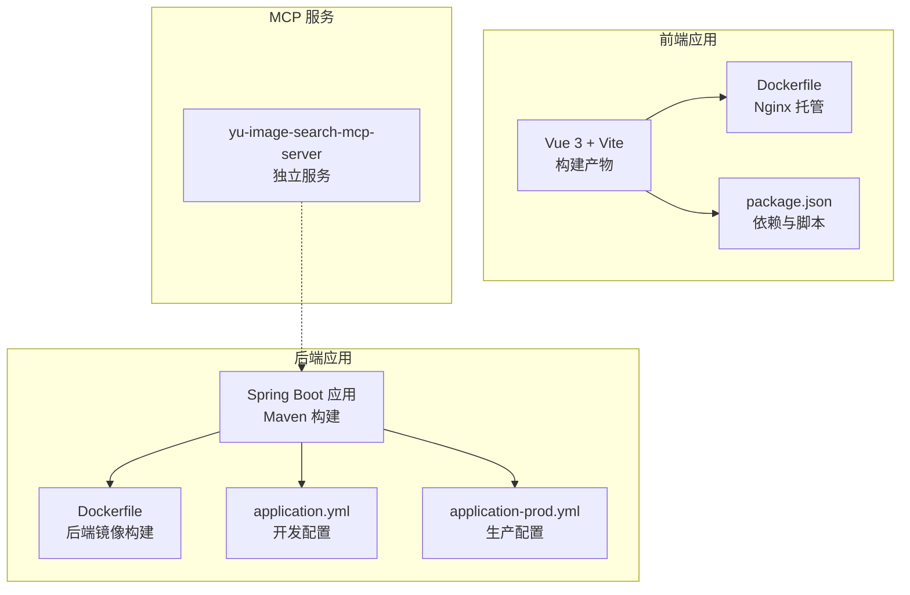
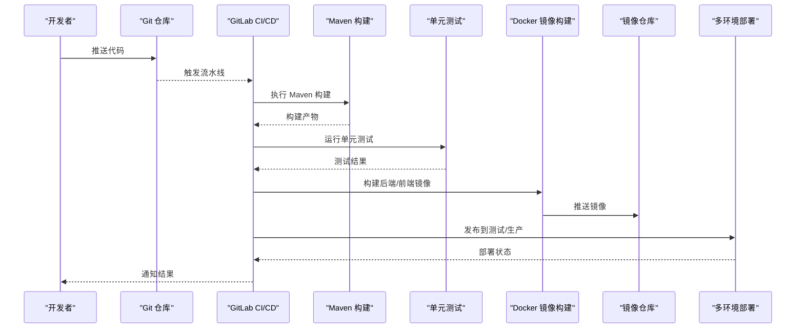
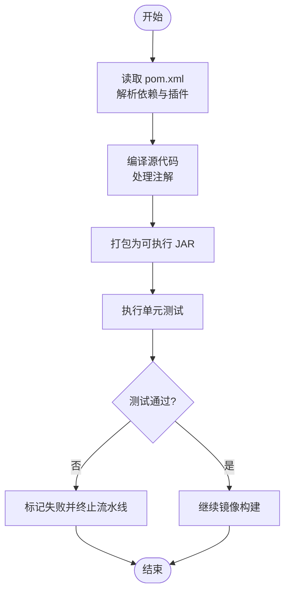
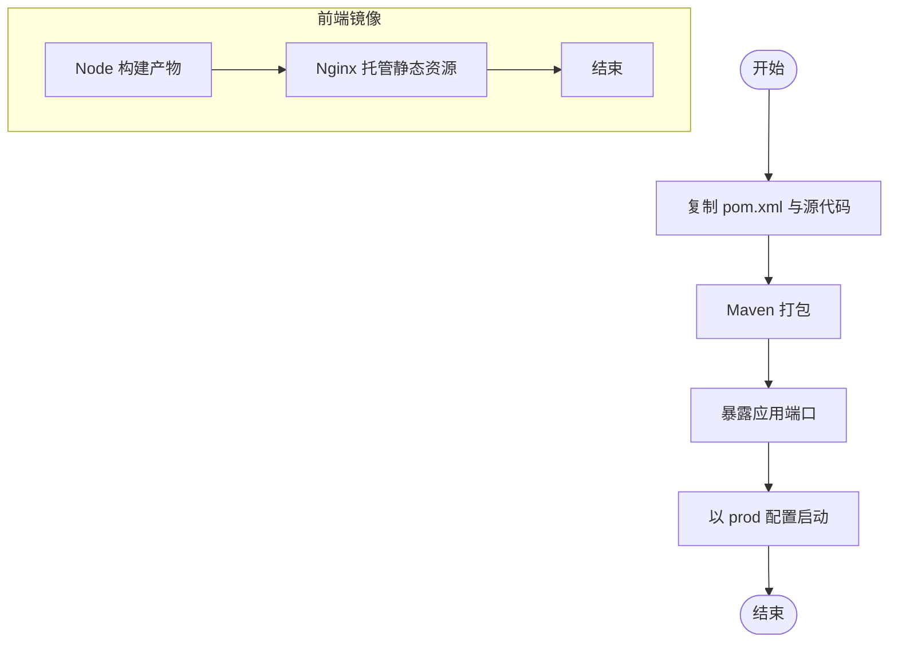
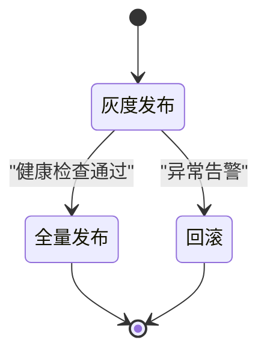
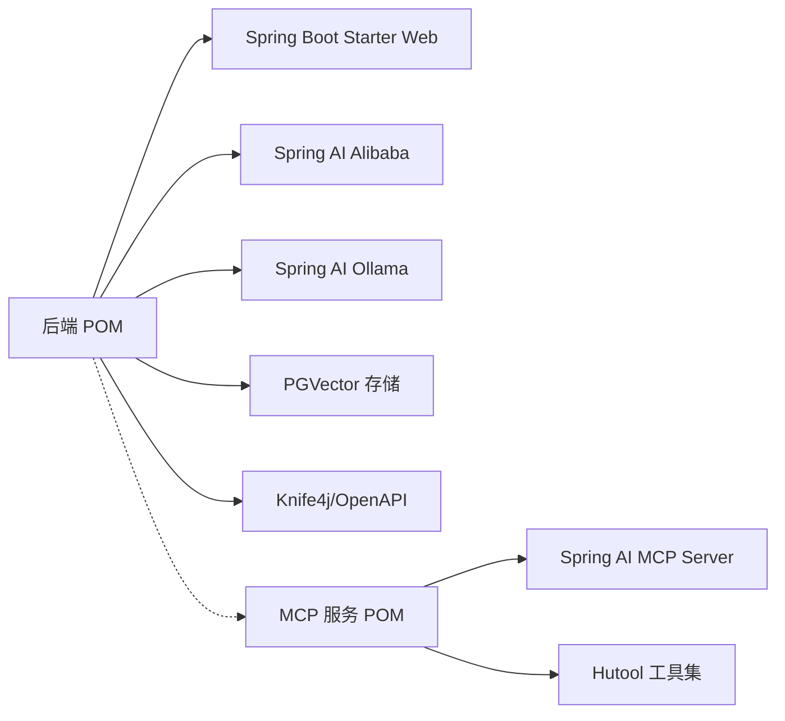

# CI/CD流水线

<cite>
**本文引用的文件**
- [pom.xml](file://pom.xml)
- [Dockerfile](file://Dockerfile)
- [yu-ai-agent-frontend/Dockerfile](file://yu-ai-agent-frontend/Dockerfile)
- [yu-ai-agent-frontend/package.json](file://yu-ai-agent-frontend/package.json)
- [src/main/resources/application.yml](file://src/main/resources/application.yml)
- [src/main/resources/application-prod.yml](file://src/main/resources/application-prod.yml)
- [src/test/java/com/yupi/yuaiagent/YuAiAgentApplicationTests.java](file://src/test/java/com/yupi/yuaiagent/YuAiAgentApplicationTests.java)
- [yu-image-search-mcp-server/pom.xml](file://yu-image-search-mcp-server/pom.xml)
- [yu-image-search-mcp-server/src/main/resources/application.yml](file://yu-image-search-mcp-server/src/main/resources/application.yml)
</cite>

## 目录
1. [简介](#简介)
2. [项目结构](#项目结构)
3. [核心组件](#核心组件)
4. [架构总览](#架构总览)
5. [详细组件分析](#详细组件分析)
6. [依赖关系分析](#依赖关系分析)
7. [性能考虑](#性能考虑)
8. [故障排除指南](#故障排除指南)
9. [结论](#结论)
10. [附录](#附录)

## 简介
本指南面向在 GitLab CI/CD 中落地自动化流水线的工程团队，围绕本仓库的后端 Spring Boot 应用与前端 Vue 应用，提供从构建、测试、质量门禁到多环境部署与镜像管理的完整实践路径。内容涵盖：
- Maven 构建与测试自动化
- Docker 镜像自动构建与推送
- 多环境部署策略（开发、测试、生产）
- 蓝绿/滚动部署思路与回滚策略
- 质量门禁（代码扫描、安全检查、性能测试）建议

## 项目结构
本仓库包含以下关键模块：
- 后端主应用：Spring Boot 应用，使用 Maven 管理依赖与构建
- 前端应用：Vue 3 + Vite 构建，Nginx 托管静态资源
- MCP 服务子项目：独立的 Spring AI MCP 服务，用于图片搜索等工具能力
- Dockerfile：后端与前端的容器化构建脚本
- 配置文件：application.yml 与 application-prod.yml，用于不同环境配置

图表来源
- [pom.xml:1-227](file://pom.xml#L1-L227)
- [Dockerfile:1-16](file://Dockerfile#L1-L16)
- [yu-ai-agent-frontend/Dockerfile:1-17](file://yu-ai-agent-frontend/Dockerfile#L1-L17)
- [yu-ai-agent-frontend/package.json:1-22](file://yu-ai-agent-frontend/package.json#L1-L22)
- [src/main/resources/application.yml:1-66](file://src/main/resources/application.yml#L1-L66)
- [src/main/resources/application-prod.yml:1-2](file://src/main/resources/application-prod.yml#L1-L2)
- [yu-image-search-mcp-server/pom.xml:1-121](file://yu-image-search-mcp-server/pom.xml#L1-L121)
- [yu-image-search-mcp-server/src/main/resources/application.yml:1-7](file://yu-image-search-mcp-server/src/main/resources/application.yml#L1-L7)

章节来源
- [pom.xml:1-227](file://pom.xml#L1-L227)
- [Dockerfile:1-16](file://Dockerfile#L1-L16)
- [yu-ai-agent-frontend/Dockerfile:1-17](file://yu-ai-agent-frontend/Dockerfile#L1-L17)
- [yu-ai-agent-frontend/package.json:1-22](file://yu-ai-agent-frontend/package.json#L1-L22)
- [src/main/resources/application.yml:1-66](file://src/main/resources/application.yml#L1-L66)
- [src/main/resources/application-prod.yml:1-2](file://src/main/resources/application-prod.yml#L1-L2)
- [yu-image-search-mcp-server/pom.xml:1-121](file://yu-image-search-mcp-server/pom.xml#L1-L121)
- [yu-image-search-mcp-server/src/main/resources/application.yml:1-7](file://yu-image-search-mcp-server/src/main/resources/application.yml#L1-L7)

## 核心组件
- Maven 构建与测试
  - 使用 Maven Wrapper 与标准 POM 管理依赖与插件，包含编译器与 Spring Boot 插件配置
  - 单元测试入口位于应用测试类，覆盖上下文加载
- Docker 镜像
  - 后端镜像：基于 Maven 官方镜像，执行打包并以 prod 配置运行
  - 前端镜像：多阶段构建，使用 Nginx 托管静态资源
- 配置管理
  - application.yml 提供开发默认配置；application-prod.yml 作为生产覆盖模板
  - MCP 服务独立配置文件，端口与 profile 明确分离

章节来源
- [pom.xml:166-194](file://pom.xml#L166-L194)
- [src/test/java/com/yupi/yuaiagent/YuAiAgentApplicationTests.java:1-14](file://src/test/java/com/yupi/yuaiagent/YuAiAgentApplicationTests.java#L1-L14)
- [Dockerfile:1-16](file://Dockerfile#L1-L16)
- [yu-ai-agent-frontend/Dockerfile:1-17](file://yu-ai-agent-frontend/Dockerfile#L1-L17)
- [src/main/resources/application.yml:1-66](file://src/main/resources/application.yml#L1-L66)
- [src/main/resources/application-prod.yml:1-2](file://src/main/resources/application-prod.yml#L1-L2)
- [yu-image-search-mcp-server/src/main/resources/application.yml:1-7](file://yu-image-search-mcp-server/src/main/resources/application.yml#L1-L7)

## 架构总览
下图展示从代码提交到多环境部署的整体流程，包括构建、测试、镜像构建与推送、部署与回滚策略。

## 详细组件分析

### Maven 构建与测试自动化
- 依赖管理与版本控制
  - 使用 Spring Boot 父 POM 与 Spring AI/Spring AI Alibaba 的 BOM 管理版本
  - 依赖仓库包含里程碑与快照源，确保最新特性可用
- 构建插件
  - 编译器插件配置 Lombok 注解处理器
  - Spring Boot 插件排除 Lombok，避免打包冗余
- 测试执行
  - 单元测试入口类存在，可直接由 Maven Surefire/Failsafe 插件运行
- 代码覆盖率
  - 当前未启用覆盖率插件，可在 CI 中集成覆盖率统计与阈值校验

图表来源
- [pom.xml:166-194](file://pom.xml#L166-L194)
- [src/test/java/com/yupi/yuaiagent/YuAiAgentApplicationTests.java:1-14](file://src/test/java/com/yupi/yuaiagent/YuAiAgentApplicationTests.java#L1-L14)

章节来源
- [pom.xml:29-49](file://pom.xml#L29-L49)
- [pom.xml:166-194](file://pom.xml#L166-L194)
- [src/test/java/com/yupi/yuaiagent/YuAiAgentApplicationTests.java:1-14](file://src/test/java/com/yupi/yuaiagent/YuAiAgentApplicationTests.java#L1-L14)

### Docker 镜像自动构建与推送
- 后端镜像
  - 基于 Maven 官方镜像，仅复制必要文件，执行打包命令
  - 暴露应用端口并通过 prod 配置启动
- 前端镜像
  - 多阶段构建：Node 构建产物，Nginx 托管静态资源
  - 使用自定义 Nginx 配置文件
- 镜像命名与标签
  - 建议按分支/版本/时间戳生成标签，结合 Git 标签或 CI 变量
- 推送策略
  - 在 CI 中登录镜像仓库，推送多标签镜像，便于回滚

图表来源
- [Dockerfile:1-16](file://Dockerfile#L1-L16)
- [yu-ai-agent-frontend/Dockerfile:1-17](file://yu-ai-agent-frontend/Dockerfile#L1-L17)

章节来源
- [Dockerfile:1-16](file://Dockerfile#L1-L16)
- [yu-ai-agent-frontend/Dockerfile:1-17](file://yu-ai-agent-frontend/Dockerfile#L1-L17)
- [yu-ai-agent-frontend/package.json:1-22](file://yu-ai-agent-frontend/package.json#L1-L22)

### 多环境部署策略
- 环境划分
  - 开发环境：使用 application.yml 默认配置，便于本地联调
  - 测试环境：使用 application-prod.yml 覆盖敏感配置
  - 生产环境：使用外部密钥管理与只读配置挂载
- 部署方式
  - 蓝绿部署：准备两套实例，流量在两者间切换
  - 滚动更新：逐步替换实例，降低停机风险
- 回滚策略
  - 记录镜像标签与部署时间，回滚至最近一次成功标签
  - 配置回滚：保留上一版本配置快照

### 质量门禁与持续集成
- 代码扫描
  - 建议在 CI 中集成静态分析工具（如 SpotBugs、Checkstyle、Spotless），在合并请求中强制通过
- 安全检查
  - 依赖漏洞扫描：使用 OWASP Dependency-Check 或类似工具
  - 密钥泄露检测：在 CI 中启用敏感信息扫描
- 性能测试
  - 在测试环境中执行轻量级性能回归测试，监控关键接口响应时间与吞吐
- 代码覆盖率
  - 在 CI 中启用覆盖率统计与阈值校验，未达标则阻断合并

## 依赖关系分析
后端应用与 MCP 服务相互独立，但共享 Spring AI 生态与配置体系。

图表来源
- [pom.xml:50-164](file://pom.xml#L50-L164)
- [yu-image-search-mcp-server/pom.xml:43-66](file://yu-image-search-mcp-server/pom.xml#L43-L66)

章节来源
- [pom.xml:50-164](file://pom.xml#L50-L164)
- [yu-image-search-mcp-server/pom.xml:43-66](file://yu-image-search-mcp-server/pom.xml#L43-L66)

## 性能考虑
- 构建缓存
  - Maven 与 Node 构建缓存：在 CI 中启用缓存，减少重复下载与安装时间
- 并行化
  - 将测试与镜像构建并行执行，缩短流水线总时长
- 镜像分层
  - 后端镜像仅复制必要文件，前端多阶段构建减少最终镜像体积
- 资源限制
  - 在 CI Runner 上设置内存与 CPU 限制，避免资源争用

## 故障排除指南
- 构建失败
  - 检查 Maven 仓库可达性与网络代理配置
  - 确认 Java 版本与依赖版本兼容
- 测试失败
  - 查看测试日志定位失败用例，必要时在本地复现
- 镜像构建失败
  - 核对 Dockerfile 文件复制路径与权限
  - 确认镜像仓库凭据与网络连通性
- 部署异常
  - 检查环境变量与配置文件是否正确挂载
  - 关注健康检查与端口占用情况

## 结论
通过标准化的 Maven 构建、多阶段 Docker 镜像与多环境部署策略，结合质量门禁与回滚机制，可显著提升交付效率与稳定性。建议在现有基础上补充覆盖率、静态分析与安全扫描，并在测试环境完善性能回归测试，形成闭环的质量保障体系。

## 附录
- 配置文件要点
  - application.yml：默认开发配置，包含 API 文档与日志级别
  - application-prod.yml：生产覆盖模板，注意敏感信息保护
- MCP 服务
  - 独立的 Spring AI MCP 服务，端口与 profile 明确，便于单独部署与扩展

章节来源
- [src/main/resources/application.yml:1-66](file://src/main/resources/application.yml#L1-L66)
- [src/main/resources/application-prod.yml:1-2](file://src/main/resources/application-prod.yml#L1-L2)
- [yu-image-search-mcp-server/src/main/resources/application.yml:1-7](file://yu-image-search-mcp-server/src/main/resources/application.yml#L1-L7)