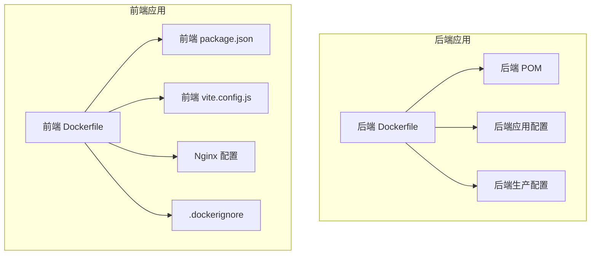
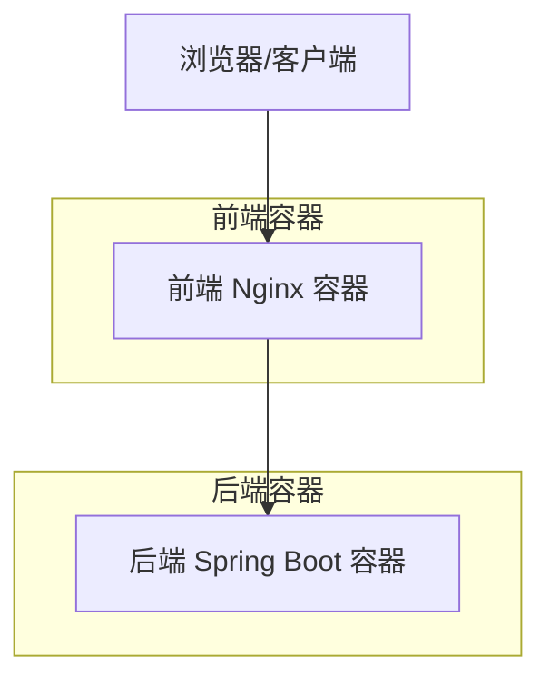
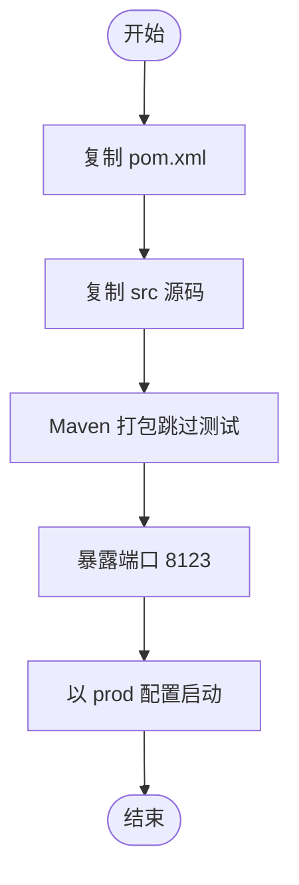
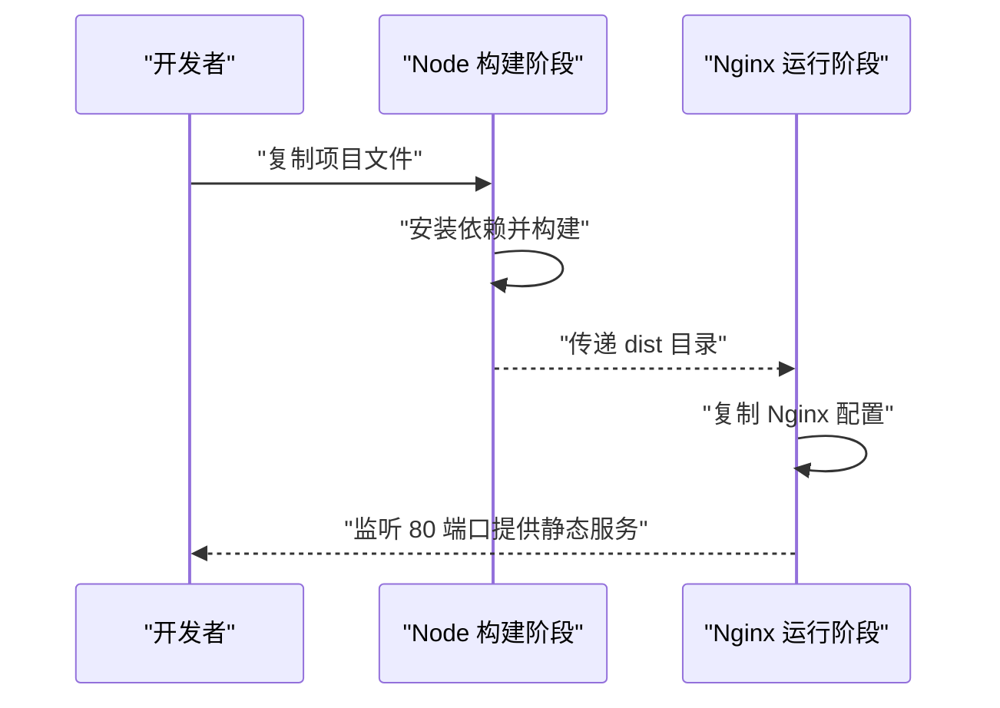
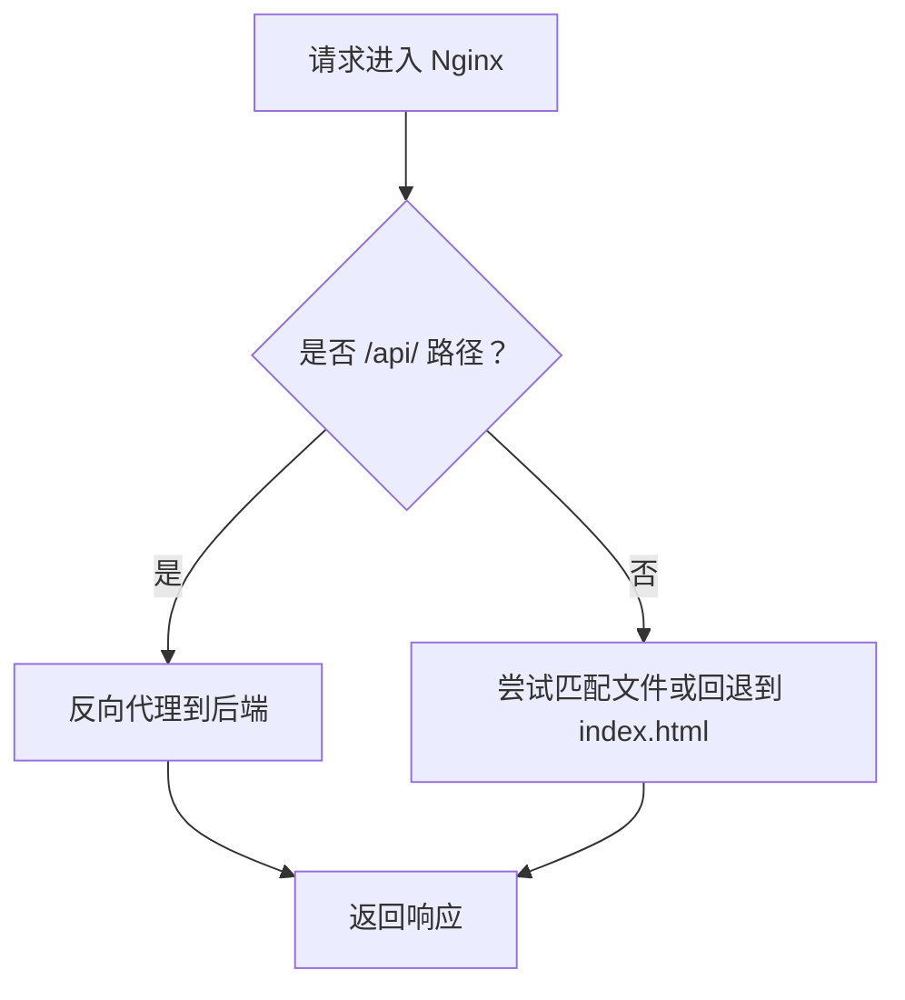
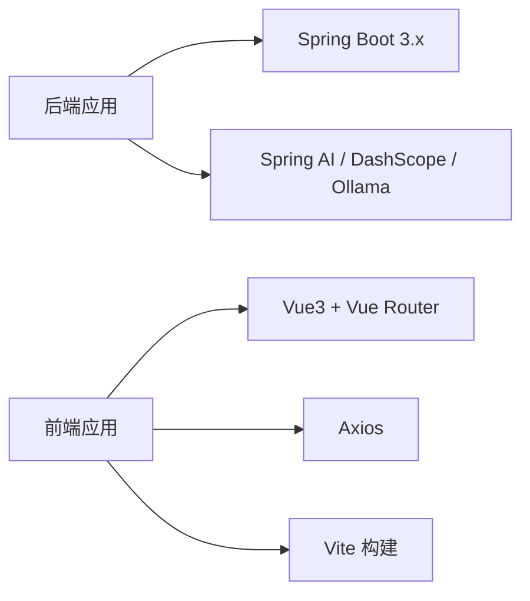
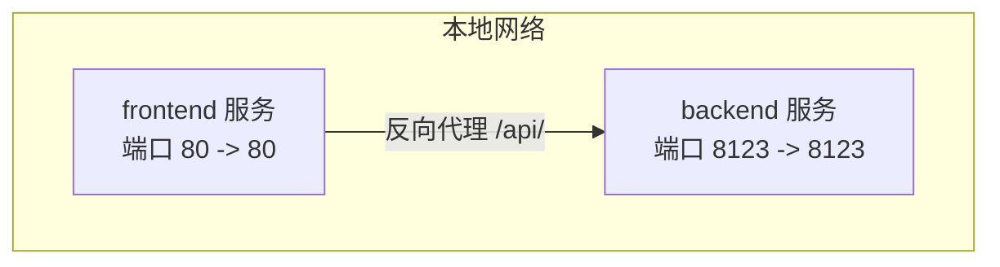

# Docker容器化部署

<cite>
**本文引用的文件**
- [Dockerfile（后端）](file://Dockerfile)
- [Dockerfile（前端）](file://yu-ai-agent-frontend/Dockerfile)
- [Nginx配置（前端）](file://yu-ai-agent-frontend/nginx.conf)
- [.dockerignore（前端）](file://yu-ai-agent-frontend/.dockerignore)
- [POM（后端）](file://pom.xml)
- [应用配置（后端）](file://src/main/resources/application.yml)
- [生产配置（后端）](file://src/main/resources/application-prod.yml)
- [前端包管理（前端）](file://yu-ai-agent-frontend/package.json)
- [前端Vite配置（前端）](file://yu-ai-agent-frontend/vite.config.js)
- [前端说明（前端）](file://yu-ai-agent-frontend/README.md)
- [项目说明（后端）](file://README.md)
</cite>

## 目录
1. [简介](#简介)
2. [项目结构](#项目结构)
3. [核心组件](#核心组件)
4. [架构总览](#架构总览)
5. [详细组件分析](#详细组件分析)
6. [依赖关系分析](#依赖关系分析)
7. [性能与镜像优化](#性能与镜像优化)
8. [容器运行与编排](#容器运行与编排)
9. [故障排查指南](#故障排查指南)
10. [结论](#结论)

## 简介
本文件面向希望将后端与前端应用容器化的读者，提供从 Dockerfile 构建到本地编排的完整实践指南。内容涵盖：
- 后端应用的镜像构建策略、Maven 打包流程、端口暴露与启动参数
- 前端应用的多阶段构建、Node.js 依赖安装、Vite 构建与 Nginx 静态托管
- 多阶段构建与镜像体积优化技巧
- 容器运行命令示例（环境变量、卷挂载、网络）
- Docker Compose 示例（本地开发与测试环境一键部署）

## 项目结构
该项目采用前后端分离的多模块结构，后端为 Spring Boot 应用，前端为 Vue3 + Vite 应用，分别提供独立的 Dockerfile 与运行配置。

图表来源
- [Dockerfile（后端）:1-16](file://Dockerfile#L1-L16)
- [Dockerfile（前端）:1-17](file://yu-ai-agent-frontend/Dockerfile#L1-L17)
- [Nginx配置（前端）:1-49](file://yu-ai-agent-frontend/nginx.conf#L1-L49)
- [.dockerignore（前端）:1-40](file://yu-ai-agent-frontend/.dockerignore#L1-L40)
- [POM（后端）:1-227](file://pom.xml#L1-L227)
- [应用配置（后端）:1-66](file://src/main/resources/application.yml#L1-L66)
- [生产配置（后端）:1-2](file://src/main/resources/application-prod.yml#L1-L2)
- [前端包管理（前端）:1-22](file://yu-ai-agent-frontend/package.json#L1-L22)
- [前端Vite配置（前端）:1-18](file://yu-ai-agent-frontend/vite.config.js#L1-L18)

章节来源
- [Dockerfile（后端）:1-16](file://Dockerfile#L1-L16)
- [Dockerfile（前端）:1-17](file://yu-ai-agent-frontend/Dockerfile#L1-L17)
- [POM（后端）:1-227](file://pom.xml#L1-L227)
- [应用配置（后端）:1-66](file://src/main/resources/application.yml#L1-L66)
- [生产配置（后端）:1-2](file://src/main/resources/application-prod.yml#L1-L2)
- [前端包管理（前端）:1-22](file://yu-ai-agent-frontend/package.json#L1-L22)
- [前端Vite配置（前端）:1-18](file://yu-ai-agent-frontend/vite.config.js#L1-L18)
- [前端说明（前端）:1-56](file://yu-ai-agent-frontend/README.md#L1-L56)
- [项目说明（后端）:1-299](file://README.md#L1-L299)

## 核心组件
- 后端镜像（Java + Spring Boot）
  - 基础镜像：预装 Maven 与 JDK21 的官方镜像
  - 工作目录：/app
  - 文件复制：仅复制 pom.xml 与 src，减少缓存失效
  - 打包：执行 Maven 清理与打包（跳过测试）
  - 端口：暴露 8123
  - 启动：以 prod 配置文件启动
- 前端镜像（Node.js + Nginx）
  - 多阶段构建：Node 阶段安装依赖并构建；Nginx 阶段托管静态资源
  - 构建产物：dist 目录
  - Nginx 配置：根目录、API 反代、SSE 优化、静态资源缓存
  - 端口：暴露 80
  - 启动：前台运行 Nginx

章节来源
- [Dockerfile（后端）:1-16](file://Dockerfile#L1-L16)
- [Dockerfile（前端）:1-17](file://yu-ai-agent-frontend/Dockerfile#L1-L17)
- [Nginx配置（前端）:1-49](file://yu-ai-agent-frontend/nginx.conf#L1-L49)
- [POM（后端）:1-227](file://pom.xml#L1-L227)
- [应用配置（后端）:1-66](file://src/main/resources/application.yml#L1-L66)
- [生产配置（后端）:1-2](file://src/main/resources/application-prod.yml#L1-L2)
- [前端包管理（前端）:1-22](file://yu-ai-agent-frontend/package.json#L1-L22)
- [前端Vite配置（前端）:1-18](file://yu-ai-agent-frontend/vite.config.js#L1-L18)

## 架构总览
下图展示了容器化后的整体运行架构：前端容器通过反向代理访问后端容器，后端容器按需访问外部服务或本地工具链。

图表来源
- [Dockerfile（前端）:1-17](file://yu-ai-agent-frontend/Dockerfile#L1-L17)
- [Nginx配置（前端）:1-49](file://yu-ai-agent-frontend/nginx.conf#L1-L49)
- [Dockerfile（后端）:1-16](file://Dockerfile#L1-L16)

## 详细组件分析

### 后端应用镜像（Spring Boot）
- 基础镜像与工作目录
  - 使用预装 Maven 与 JDK21 的镜像作为基础层，确保构建环境一致
  - 工作目录设为 /app，便于后续复制与打包
- 文件复制与缓存优化
  - 先复制 pom.xml，再复制 src，利用 Docker 缓存分层策略，避免源码变更导致依赖重装
- Maven 打包与产物
  - 执行清理与打包（跳过测试），生成可执行 JAR
  - 启动时通过 JVM 参数激活 prod 配置文件
- 端口与启动
  - 暴露 8123 端口
  - CMD 使用 java -jar 启动应用

图表来源
- [Dockerfile（后端）:1-16](file://Dockerfile#L1-L16)
- [POM（后端）:1-227](file://pom.xml#L1-L227)
- [应用配置（后端）:1-66](file://src/main/resources/application.yml#L1-L66)
- [生产配置（后端）:1-2](file://src/main/resources/application-prod.yml#L1-L2)

章节来源
- [Dockerfile（后端）:1-16](file://Dockerfile#L1-L16)
- [POM（后端）:1-227](file://pom.xml#L1-L227)
- [应用配置（后端）:1-66](file://src/main/resources/application.yml#L1-L66)
- [生产配置（后端）:1-2](file://src/main/resources/application-prod.yml#L1-L2)

### 前端应用镜像（Vue3 + Vite + Nginx）
- 多阶段构建
  - 构建阶段：基于 node:20-alpine，安装依赖并执行 Vite 构建
  - 运行阶段：基于 nginx:alpine，复制构建产物至 /usr/share/nginx/html
- Nginx 配置要点
  - 根目录与路由回退：所有 HTML 请求返回 index.html，适配 Vue Router
  - API 反向代理：将 /api/ 前缀转发至指定后端地址，设置必要的请求头
  - SSE 优化：关闭缓冲、禁用缓存、设置读超时，保证实时流式传输
  - 静态资源缓存：对 JS/CSS/字体等资源设置长缓存与缓存控制头
- 构建与运行
  - 构建脚本由 package.json 定义
  - 启动命令直接运行 Nginx 前台进程

图表来源
- [Dockerfile（前端）:1-17](file://yu-ai-agent-frontend/Dockerfile#L1-L17)
- [Nginx配置（前端）:1-49](file://yu-ai-agent-frontend/nginx.conf#L1-L49)
- [前端包管理（前端）:1-22](file://yu-ai-agent-frontend/package.json#L1-L22)
- [前端Vite配置（前端）:1-18](file://yu-ai-agent-frontend/vite.config.js#L1-L18)

章节来源
- [Dockerfile（前端）:1-17](file://yu-ai-agent-frontend/Dockerfile#L1-L17)
- [Nginx配置（前端）:1-49](file://yu-ai-agent-frontend/nginx.conf#L1-L49)
- [前端包管理（前端）:1-22](file://yu-ai-agent-frontend/package.json#L1-L22)
- [前端Vite配置（前端）:1-18](file://yu-ai-agent-frontend/vite.config.js#L1-L18)
- [.dockerignore（前端）:1-40](file://yu-ai-agent-frontend/.dockerignore#L1-L40)

### API 反向代理与路由回退（Nginx）
- 路由回退：location / 中的 try_files 将未命中路径回退到 index.html，解决 SPA 刷新 404
- API 反代：location ^~ /api/ 将前端请求转发至后端服务，设置 Host、X-Real-IP、X-Forwarded-* 等头
- SSE 优化：proxy_http_version 1.1、proxy_buffering off、proxy_read_timeout 600s 等
- 静态资源：对常见静态资源设置 expires 与 Cache-Control

图表来源
- [Nginx配置（前端）:1-49](file://yu-ai-agent-frontend/nginx.conf#L1-L49)

章节来源
- [Nginx配置（前端）:1-49](file://yu-ai-agent-frontend/nginx.conf#L1-L49)

## 依赖关系分析
- 后端
  - 基于 Spring Boot 3.x 与 Java 21
  - 通过 Spring AI 与第三方 SDK（如 DashScope、Ollama）集成
  - 通过 Maven 插件生成可执行 JAR
- 前端
  - 基于 Vue3、Vue Router、Axios 与 Vite
  - 通过 package.json 管理依赖与脚本
  - 通过 vite.config.js 配置开发服务器与别名

图表来源
- [POM（后端）:1-227](file://pom.xml#L1-L227)
- [应用配置（后端）:1-66](file://src/main/resources/application.yml#L1-L66)
- [前端包管理（前端）:1-22](file://yu-ai-agent-frontend/package.json#L1-L22)
- [前端Vite配置（前端）:1-18](file://yu-ai-agent-frontend/vite.config.js#L1-L18)

章节来源
- [POM（后端）:1-227](file://pom.xml#L1-L227)
- [应用配置（后端）:1-66](file://src/main/resources/application.yml#L1-L66)
- [前端包管理（前端）:1-22](file://yu-ai-agent-frontend/package.json#L1-L22)
- [前端Vite配置（前端）:1-18](file://yu-ai-agent-frontend/vite.config.js#L1-L18)

## 性能与镜像优化
- 后端镜像
  - 仅复制 pom.xml 与 src，减少无关文件进入缓存层，提高增量构建效率
  - 使用预装 Maven 的镜像，避免重复安装工具链
- 前端镜像
  - 多阶段构建：Node 阶段负责构建，Nginx 阶段仅携带运行时所需文件，显著减小最终镜像体积
  - .dockerignore 忽略 node_modules、dist、日志与 IDE 相关文件，避免污染构建上下文
  - Nginx 静态资源缓存与长缓存头，降低带宽与加载时间
- 通用建议
  - 使用 .dockerignore 限制复制范围
  - 在 CI 中复用 Maven/Node 缓存层（若使用私有镜像仓库或缓存机制）
  - 生产环境尽量使用只读文件系统与非 root 用户（需配合权限与配置）

章节来源
- [Dockerfile（后端）:1-16](file://Dockerfile#L1-L16)
- [Dockerfile（前端）:1-17](file://yu-ai-agent-frontend/Dockerfile#L1-L17)
- [.dockerignore（前端）:1-40](file://yu-ai-agent-frontend/.dockerignore#L1-L40)
- [Nginx配置（前端）:1-49](file://yu-ai-agent-frontend/nginx.conf#L1-L49)

## 容器运行与编排

### 单容器运行示例
- 后端容器
  - 端口映射：将宿主机 8123 映射到容器 8123
  - 环境变量：通过 -e 指定 Spring 配置文件与日志级别
  - 卷挂载：将配置文件或日志目录挂载到容器内
  - 示例命令（不含具体密钥）：
    - docker run -d --name backend -p 8123:8123 -v /宿主机配置:/app/config 后端镜像名
- 前端容器
  - 端口映射：将宿主机 80 映射到容器 80
  - 环境变量：可通过 Nginx 配置或上游后端地址调整
  - 示例命令：
    - docker run -d --name frontend -p 80:80 前端镜像名

### Docker Compose 示例（本地开发）
以下为本地开发与测试环境的典型编排思路（请根据实际网络与服务地址调整）：
- 服务
  - backend：后端应用，暴露 8123，挂载配置与日志目录
  - frontend：前端应用，暴露 80，反向代理 /api/ 到 backend
- 网络
  - 使用自定义网络，使 frontend 与 backend 可通过服务名互相访问
- 关键点
  - 前端 Nginx 的 proxy_pass 地址应指向 backend 服务名与端口
  - 如需热更新，可在前端挂载源码目录并使用开发服务器（不推荐生产）

图表来源
- [Dockerfile（前端）:1-17](file://yu-ai-agent-frontend/Dockerfile#L1-L17)
- [Nginx配置（前端）:1-49](file://yu-ai-agent-frontend/nginx.conf#L1-L49)
- [Dockerfile（后端）:1-16](file://Dockerfile#L1-L16)

章节来源
- [Dockerfile（后端）:1-16](file://Dockerfile#L1-L16)
- [Dockerfile（前端）:1-17](file://yu-ai-agent-frontend/Dockerfile#L1-L17)
- [Nginx配置（前端）:1-49](file://yu-ai-agent-frontend/nginx.conf#L1-L49)

## 故障排查指南
- 前端 404 或路由刷新空白
  - 检查 Nginx 是否启用 try_files 回退到 index.html
  - 确认前端路由模式与 Nginx location 匹配
- API 无法访问或跨域
  - 检查 Nginx /api/ 反代配置与后端 CORS 设置
  - 确认 Host 与 X-Forwarded-* 头是否正确传递
- SSE 不稳定或断流
  - 检查 proxy_http_version 1.1、proxy_buffering off、proxy_read_timeout 等配置
- 构建失败或依赖安装慢
  - 检查 .dockerignore 是否遗漏关键文件
  - 确认 Node 镜像与网络可达性
- 后端启动异常
  - 检查 prod 配置文件是否生效，确认端口未被占用
  - 查看容器日志定位依赖或数据库连接问题

章节来源
- [Nginx配置（前端）:1-49](file://yu-ai-agent-frontend/nginx.conf#L1-L49)
- [应用配置（后端）:1-66](file://src/main/resources/application.yml#L1-L66)
- [生产配置（后端）:1-2](file://src/main/resources/application-prod.yml#L1-L2)
- [.dockerignore（前端）:1-40](file://yu-ai-agent-frontend/.dockerignore#L1-L40)

## 结论
通过上述 Dockerfile 与 Nginx 配置，项目实现了：
- 后端：稳定、可复现的 Java 应用镜像，使用 Maven 清理打包与生产配置
- 前端：多阶段构建的轻量级运行镜像，具备路由回退与 API 反代能力
- 运维：清晰的端口暴露、启动命令与配置文件分离，便于本地与生产部署

建议在生产环境中结合 Docker Compose 或 K8s 进行编排，并配套健康检查、日志采集与安全加固。