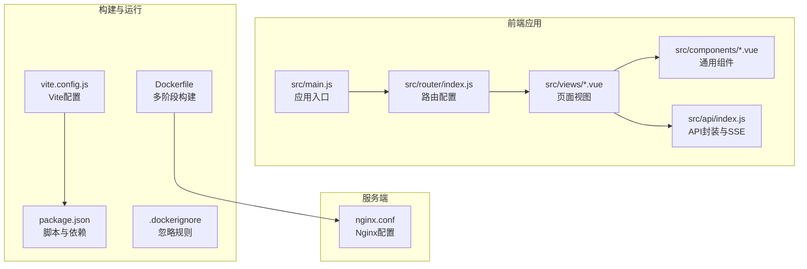
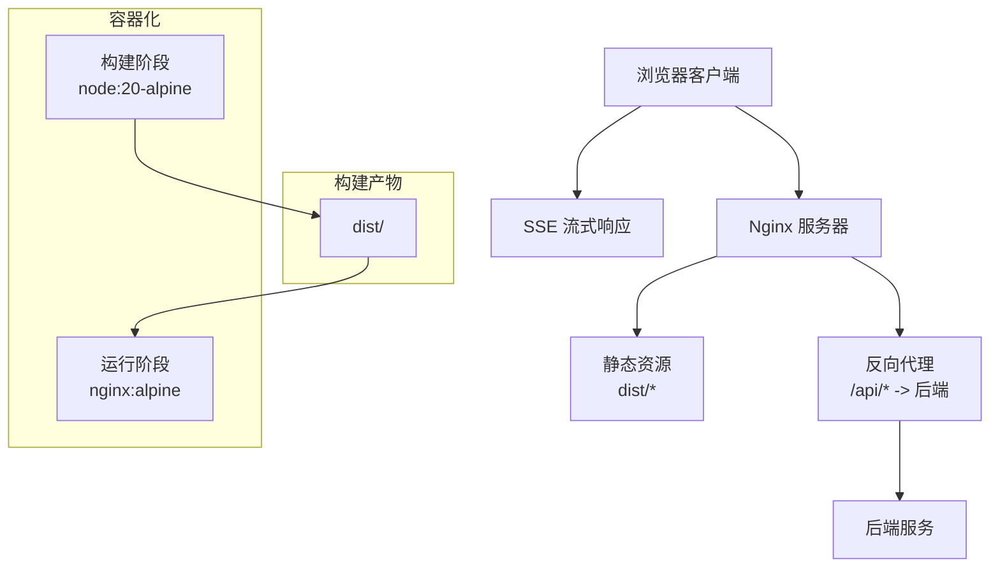
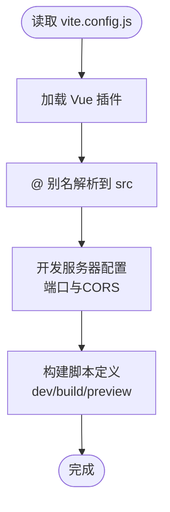
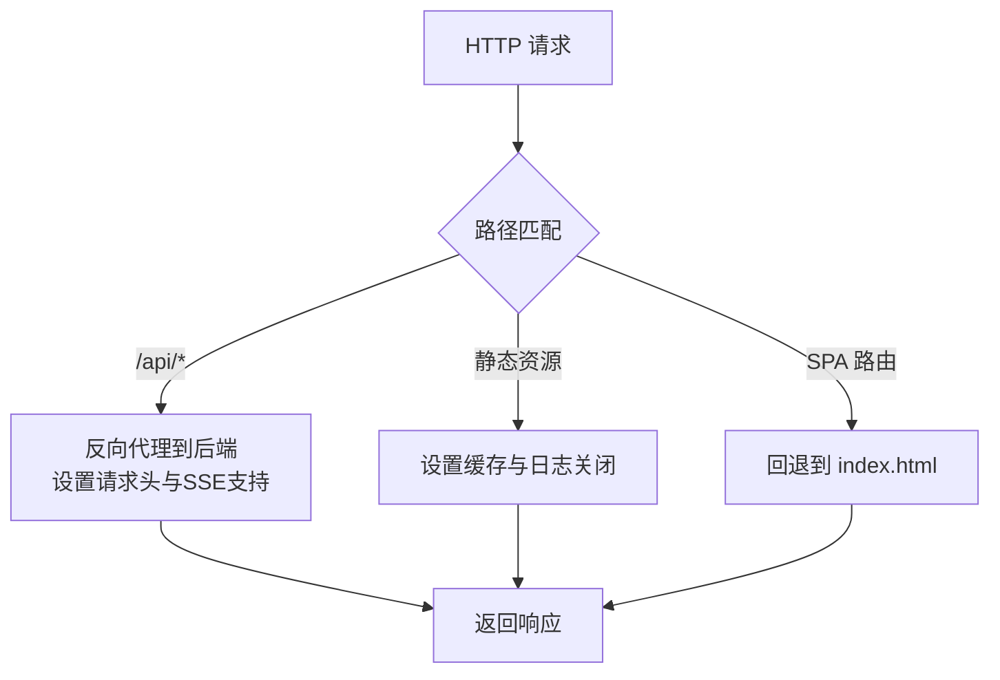
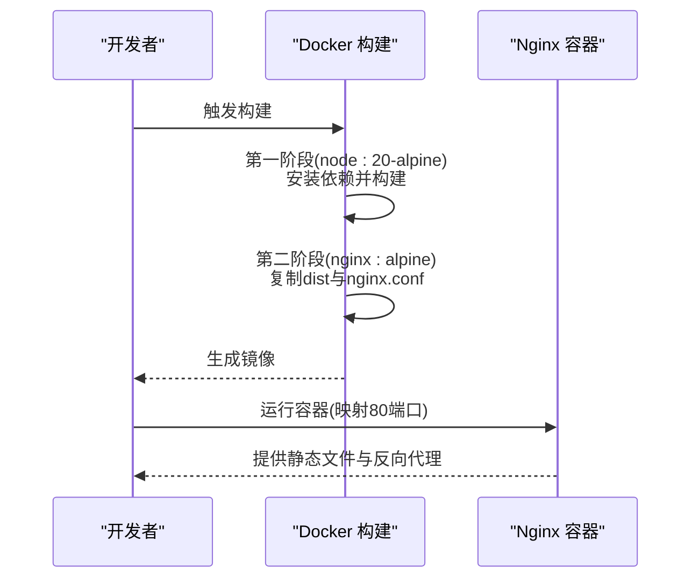
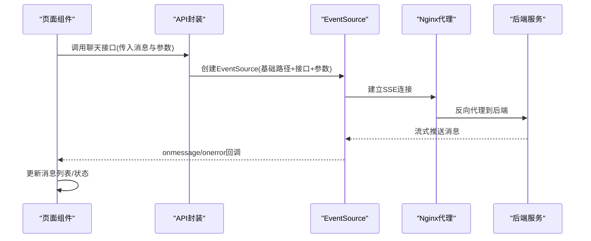
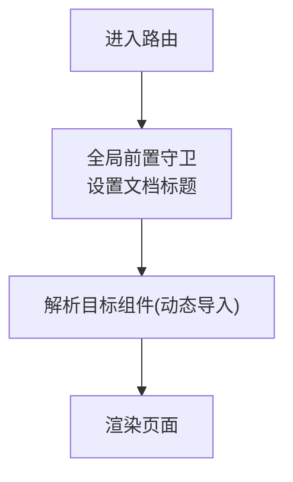
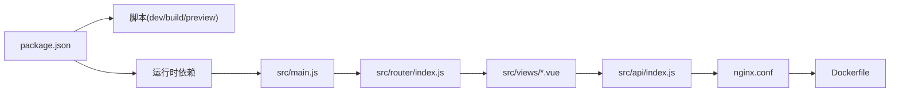

# 前端应用部署

<cite>
**本文引用的文件**
- [vite.config.js](file://yu-ai-agent-frontend/vite.config.js)
- [package.json](file://yu-ai-agent-frontend/package.json)
- [nginx.conf](file://yu-ai-agent-frontend/nginx.conf)
- [Dockerfile](file://yu-ai-agent-frontend/Dockerfile)
- [.dockerignore](file://yu-ai-agent-frontend/.dockerignore)
- [src/main.js](file://yu-ai-agent-frontend/src/main.js)
- [src/router/index.js](file://yu-ai-agent-frontend/src/router/index.js)
- [src/api/index.js](file://yu-ai-agent-frontend/src/api/index.js)
- [src/views/Home.vue](file://yu-ai-agent-frontend/src/views/Home.vue)
- [src/views/LoveMaster.vue](file://yu-ai-agent-frontend/src/views/LoveMaster.vue)
- [src/views/SuperAgent.vue](file://yu-ai-agent-frontend/src/views/SuperAgent.vue)
- [src/components/AppFooter.vue](file://yu-ai-agent-frontend/src/components/AppFooter.vue)
- [README.md](file://yu-ai-agent-frontend/README.md)
</cite>

## 目录
1. [简介](#简介)
2. [项目结构](#项目结构)
3. [核心组件](#核心组件)
4. [架构总览](#架构总览)
5. [详细组件分析](#详细组件分析)
6. [依赖关系分析](#依赖关系分析)
7. [性能考虑](#性能考虑)
8. [故障排查指南](#故障排查指南)
9. [结论](#结论)
10. [附录](#附录)

## 简介
本指南面向需要部署 Vue.js 前端应用的工程团队，结合仓库中的 Vite 构建配置、Nginx 服务器配置以及 Docker 化打包方案，提供从本地开发到生产部署的完整流程说明。文档覆盖以下主题：
- Vite 构建配置要点：构建输出目录、静态资源处理、开发服务器与跨域、环境变量使用方式
- Nginx 服务器配置：静态文件服务、反向代理、CORS、SSE 支持、缓存策略
- 多种部署场景：传统服务器部署、容器化部署（Docker）、云平台部署思路
- 性能优化策略：代码分割、懒加载、缓存策略
- 部署后的验证与测试方法

## 项目结构
前端项目位于 yu-ai-agent-frontend 目录，采用 Vue 3 + Vite 的现代前端技术栈，配合 Nginx 提供静态文件服务与反向代理，支持 Docker 化一键部署。

图表来源
- [src/main.js:1-13](file://yu-ai-agent-frontend/src/main.js#L1-L13)
- [src/router/index.js:1-47](file://yu-ai-agent-frontend/src/router/index.js#L1-L47)
- [vite.config.js:1-18](file://yu-ai-agent-frontend/vite.config.js#L1-L18)
- [package.json:1-22](file://yu-ai-agent-frontend/package.json#L1-L22)
- [Dockerfile:1-17](file://yu-ai-agent-frontend/Dockerfile#L1-L17)
- [.dockerignore:1-40](file://yu-ai-agent-frontend/.dockerignore#L1-L40)
- [nginx.conf:1-49](file://yu-ai-agent-frontend/nginx.conf#L1-L49)

章节来源
- [README.md:1-56](file://yu-ai-agent-frontend/README.md#L1-L56)
- [package.json:1-22](file://yu-ai-agent-frontend/package.json#L1-L22)

## 核心组件
- 应用入口与插件注册：在应用入口中注册路由、head 管理与全局样式，确保页面标题与 SEO 元信息正确注入。
- 路由与页面：使用 Vue Router 的 history 模式与动态导入实现懒加载；页面通过 meta 字段设置标题与描述。
- API 与 SSE：统一的 API 基础路径根据 NODE_ENV 切换；封装 SSE 连接以支持流式响应。
- 视图组件：首页、恋爱大师、超级智能体页面均采用按需加载与响应式布局；聊天组件通过事件源接收实时消息。
- 构建与运行：Vite 提供开发服务器与生产构建；Dockerfile 实现多阶段构建与 Nginx 部署；.dockerignore 控制构建上下文。

章节来源
- [src/main.js:1-13](file://yu-ai-agent-frontend/src/main.js#L1-L13)
- [src/router/index.js:1-47](file://yu-ai-agent-frontend/src/router/index.js#L1-L47)
- [src/api/index.js:1-60](file://yu-ai-agent-frontend/src/api/index.js#L1-L60)
- [src/views/Home.vue:1-524](file://yu-ai-agent-frontend/src/views/Home.vue#L1-L524)
- [src/views/LoveMaster.vue:1-244](file://yu-ai-agent-frontend/src/views/LoveMaster.vue#L1-L244)
- [src/views/SuperAgent.vue:1-286](file://yu-ai-agent-frontend/src/views/SuperAgent.vue#L1-L286)
- [vite.config.js:1-18](file://yu-ai-agent-frontend/vite.config.js#L1-L18)
- [Dockerfile:1-17](file://yu-ai-agent-frontend/Dockerfile#L1-L17)
- [.dockerignore:1-40](file://yu-ai-agent-frontend/.dockerignore#L1-L40)

## 架构总览
前端应用通过 Vite 在开发模式下提供热更新与本地预览，在生产模式下输出静态资源。Nginx 作为反向代理与静态文件服务器，将 /api 前缀的请求转发至后端，并对静态资源进行缓存优化。Dockerfile 将构建产物复制到 Nginx 镜像中，便于在任意环境中快速启动。

图表来源
- [nginx.conf:1-49](file://yu-ai-agent-frontend/nginx.conf#L1-L49)
- [Dockerfile:1-17](file://yu-ai-agent-frontend/Dockerfile#L1-L17)
- [src/api/index.js:1-60](file://yu-ai-agent-frontend/src/api/index.js#L1-L60)

## 详细组件分析

### Vite 构建配置
- 插件与别名：启用 Vue 插件并配置 @ 别名指向 src，简化导入路径。
- 开发服务器：监听本地端口，开启 CORS，便于联调后端。
- 构建脚本：通过 package.json 的 scripts 定义 dev/build/preview 命令。

图表来源
- [vite.config.js:1-18](file://yu-ai-agent-frontend/vite.config.js#L1-L18)
- [package.json:1-22](file://yu-ai-agent-frontend/package.json#L1-L22)

章节来源
- [vite.config.js:1-18](file://yu-ai-agent-frontend/vite.config.js#L1-L18)
- [package.json:1-22](file://yu-ai-agent-frontend/package.json#L1-L22)

### Nginx 服务器配置
- 静态文件根目录与回退：root 指向 /usr/share/nginx/html；location / 使用 try_files 回退到 index.html，解决 SPA 路由刷新 404。
- 反向代理：location ^~ /api/ 将 API 请求转发至后端地址，设置 Host、X-Real-IP、X-Forwarded-For、X-Forwarded-Proto 等头部；针对 SSE 的 proxy_http_version 1.1、proxy_buffering off、proxy_cache off、chunked_transfer_encoding off、较长超时等配置。
- 静态资源缓存：对 JS/CSS/图片/WebFont 等资源设置一年过期与公共缓存控制。
- 错误页：定义常见错误页并放置于静态目录。

图表来源
- [nginx.conf:1-49](file://yu-ai-agent-frontend/nginx.conf#L1-L49)

章节来源
- [nginx.conf:1-49](file://yu-ai-agent-frontend/nginx.conf#L1-L49)

### Docker 化部署
- 多阶段构建：第一阶段使用 node:20-alpine 安装依赖并执行构建；第二阶段使用 nginx:alpine，复制 dist 到 /usr/share/nginx/html，并将自定义 nginx.conf 替换默认配置；暴露 80 端口并以前台方式启动 Nginx。
- 构建上下文：.dockerignore 忽略 node_modules、dist、构建日志、编辑器配置等，减少镜像体积与构建时间。

图表来源
- [Dockerfile:1-17](file://yu-ai-agent-frontend/Dockerfile#L1-L17)
- [.dockerignore:1-40](file://yu-ai-agent-frontend/.dockerignore#L1-L40)

章节来源
- [Dockerfile:1-17](file://yu-ai-agent-frontend/Dockerfile#L1-L17)
- [.dockerignore:1-40](file://yu-ai-agent-frontend/.dockerignore#L1-L40)

### API 与 SSE 集成
- 基础路径：根据 NODE_ENV 切换 API 基础路径，生产环境使用相对路径以适配同源部署。
- SSE 封装：封装 connectSSE，拼接查询参数，创建 EventSource 并处理消息与错误；提供两个具体聊天接口。
- 页面集成：恋爱大师与超级智能体页面分别调用对应接口，使用聊天组件展示消息流。

图表来源
- [src/api/index.js:1-60](file://yu-ai-agent-frontend/src/api/index.js#L1-L60)
- [nginx.conf:14-35](file://yu-ai-agent-frontend/nginx.conf#L14-L35)

章节来源
- [src/api/index.js:1-60](file://yu-ai-agent-frontend/src/api/index.js#L1-L60)
- [src/views/LoveMaster.vue:69-107](file://yu-ai-agent-frontend/src/views/LoveMaster.vue#L69-L107)
- [src/views/SuperAgent.vue:64-157](file://yu-ai-agent-frontend/src/views/SuperAgent.vue#L64-L157)

### 路由与页面懒加载
- 路由配置：使用 history 模式与动态导入实现按需加载；全局前置守卫设置页面标题。
- 页面视图：首页与两个功能页面均采用动态导入与响应式布局；页面通过 meta 字段注入 SEO 元信息。

图表来源
- [src/router/index.js:1-47](file://yu-ai-agent-frontend/src/router/index.js#L1-L47)
- [src/views/Home.vue:54-67](file://yu-ai-agent-frontend/src/views/Home.vue#L54-L67)

章节来源
- [src/router/index.js:1-47](file://yu-ai-agent-frontend/src/router/index.js#L1-L47)
- [src/views/Home.vue:1-524](file://yu-ai-agent-frontend/src/views/Home.vue#L1-L524)

## 依赖关系分析
- 构建与运行：package.json 定义了 dev/build/preview 脚本，依赖 vite 与 @vitejs/plugin-vue；运行时依赖 vue、vue-router、axios、@vueuse/head。
- 运行时依赖：应用入口注册路由与 head 管理；路由配置使用 history 模式；API 层根据环境切换基础路径。
- 服务端依赖：Nginx 作为静态文件服务器与反向代理；Dockerfile 将构建产物复制到 Nginx 镜像。

图表来源
- [package.json:1-22](file://yu-ai-agent-frontend/package.json#L1-L22)
- [src/main.js:1-13](file://yu-ai-agent-frontend/src/main.js#L1-L13)
- [src/router/index.js:1-47](file://yu-ai-agent-frontend/src/router/index.js#L1-L47)
- [src/api/index.js:1-60](file://yu-ai-agent-frontend/src/api/index.js#L1-L60)
- [nginx.conf:1-49](file://yu-ai-agent-frontend/nginx.conf#L1-L49)
- [Dockerfile:1-17](file://yu-ai-agent-frontend/Dockerfile#L1-L17)

章节来源
- [package.json:1-22](file://yu-ai-agent-frontend/package.json#L1-L22)
- [src/main.js:1-13](file://yu-ai-agent-frontend/src/main.js#L1-L13)
- [src/router/index.js:1-47](file://yu-ai-agent-frontend/src/router/index.js#L1-L47)
- [src/api/index.js:1-60](file://yu-ai-agent-frontend/src/api/index.js#L1-L60)
- [nginx.conf:1-49](file://yu-ai-agent-frontend/nginx.conf#L1-L49)
- [Dockerfile:1-17](file://yu-ai-agent-frontend/Dockerfile#L1-L17)

## 性能考虑
- 代码分割与懒加载：路由与页面采用动态导入，实现按需加载，降低首屏体积。
- 静态资源缓存：Nginx 对 JS/CSS/媒体与 WebFont 设置一年缓存与公共缓存控制，提升二次访问速度。
- SSE 优化：Nginx 针对 SSE 关闭代理缓存与缓冲，保持长连接与流式传输稳定。
- 构建产物优化：Docker 多阶段构建仅保留必要文件，减少镜像体积。

章节来源
- [src/router/index.js:1-47](file://yu-ai-agent-frontend/src/router/index.js#L1-L47)
- [nginx.conf:37-42](file://yu-ai-agent-frontend/nginx.conf#L37-L42)
- [Dockerfile:1-17](file://yu-ai-agent-frontend/Dockerfile#L1-L17)

## 故障排查指南
- SPA 路由 404：确认 Nginx 的 try_files 回退到 index.html 已生效。
- API 404 或跨域问题：检查 /api 前缀的反向代理配置与后端可达性；确认请求头已正确传递。
- SSE 连接失败：确认 Nginx 的 proxy_http_version 1.1、proxy_buffering off、proxy_cache off、较长超时等配置已启用。
- 缓存导致静态资源不更新：清理浏览器缓存或检查 Nginx 缓存头；必要时在构建产物中引入哈希后缀（可在 Vite 中配置）。
- Docker 镜像无法启动：检查容器日志与端口占用；确认 dist 已复制到 /usr/share/nginx/html，且 nginx.conf 已生效。

章节来源
- [nginx.conf:8-11](file://yu-ai-agent-frontend/nginx.conf#L8-L11)
- [nginx.conf:14-35](file://yu-ai-agent-frontend/nginx.conf#L14-L35)
- [nginx.conf:37-42](file://yu-ai-agent-frontend/nginx.conf#L37-L42)
- [Dockerfile:10-13](file://yu-ai-agent-frontend/Dockerfile#L10-L13)

## 结论
本指南基于仓库中的 Vite、Nginx 与 Docker 配置，提供了从开发到生产的完整部署路径。通过合理的路由回退、反向代理与缓存策略，结合多阶段 Docker 构建，可快速、稳定地交付 Vue.js 前端应用。建议在生产环境中进一步完善 SSL/TLS、健康检查与监控告警，以提升安全性与可观测性。

## 附录

### 部署场景与最佳实践
- 传统服务器部署
  - 在目标服务器安装 Nginx，将构建产物 dist 放置于 Nginx 根目录，并将自定义 nginx.conf 替换默认配置。
  - 配置防火墙放行 80/443 端口，确保后端服务可达。
- 容器化部署（Docker）
  - 使用仓库提供的 Dockerfile 进行构建与运行；如需 HTTPS，可在宿主机侧使用反向代理或容器编排工具挂载证书。
- 云平台部署
  - 可将镜像推送到云镜像仓库，结合弹性负载均衡与自动扩缩容；静态资源可托管于对象存储并开启 CDN 加速。
- CDN 部署
  - 将 dist 上传至 CDN，配置缓存策略与回源规则；确保 /api 前缀走自有反向代理链路。

章节来源
- [Dockerfile:1-17](file://yu-ai-agent-frontend/Dockerfile#L1-L17)
- [nginx.conf:1-49](file://yu-ai-agent-frontend/nginx.conf#L1-L49)

### 部署后的验证与测试
- 功能验证：访问首页与各功能页面，确认路由跳转与懒加载正常；检查页面标题与 SEO 元信息。
- API 与 SSE：在恋爱大师与超级智能体页面发送消息，观察实时响应与连接状态变化。
- 缓存与性能：检查静态资源缓存头与加载时间；对比首次与二次访问速度。
- 反向代理：确认 /api 前缀请求被正确转发至后端，且请求头携带正确信息。

章节来源
- [src/views/Home.vue:54-67](file://yu-ai-agent-frontend/src/views/Home.vue#L54-L67)
- [src/views/LoveMaster.vue:69-107](file://yu-ai-agent-frontend/src/views/LoveMaster.vue#L69-L107)
- [src/views/SuperAgent.vue:64-157](file://yu-ai-agent-frontend/src/views/SuperAgent.vue#L64-L157)
- [nginx.conf:14-35](file://yu-ai-agent-frontend/nginx.conf#L14-L35)