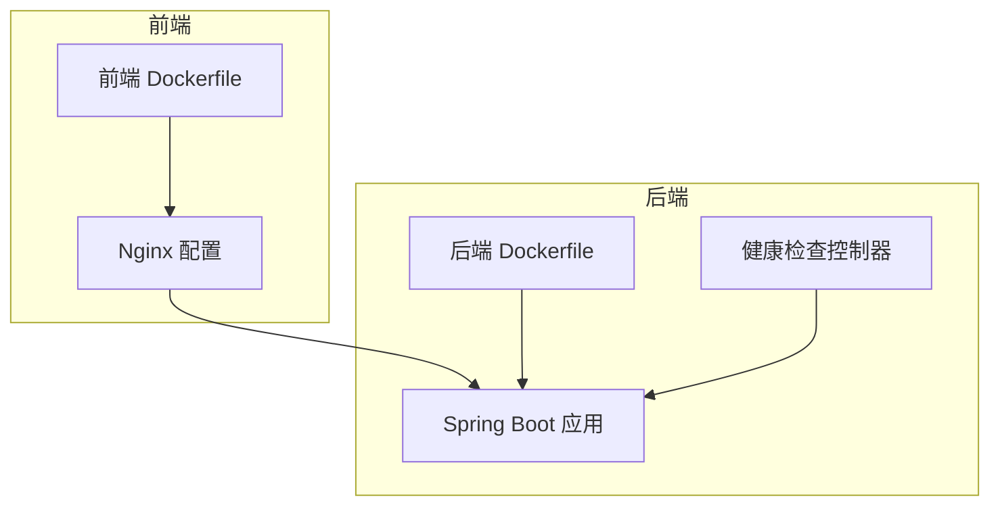
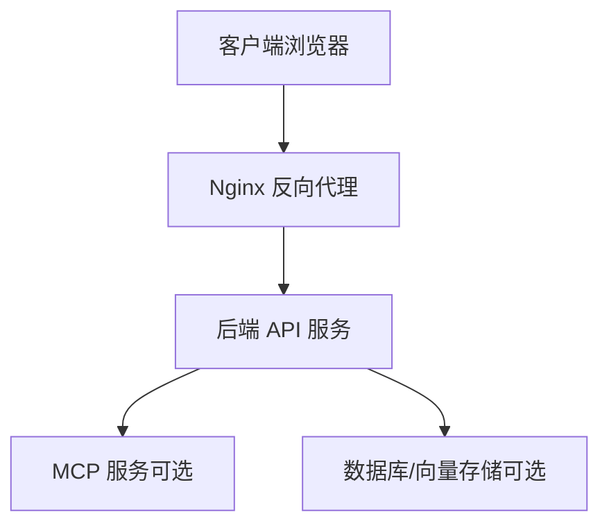
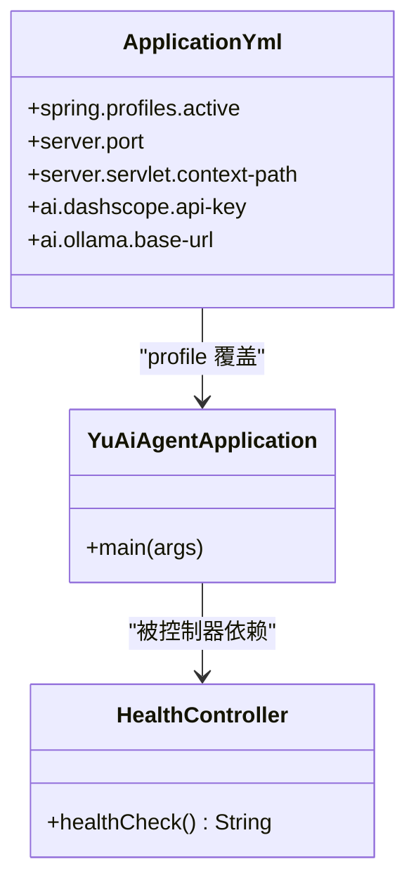
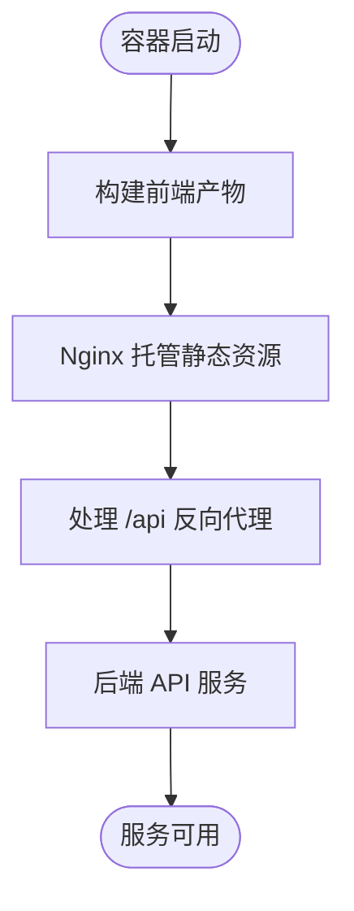
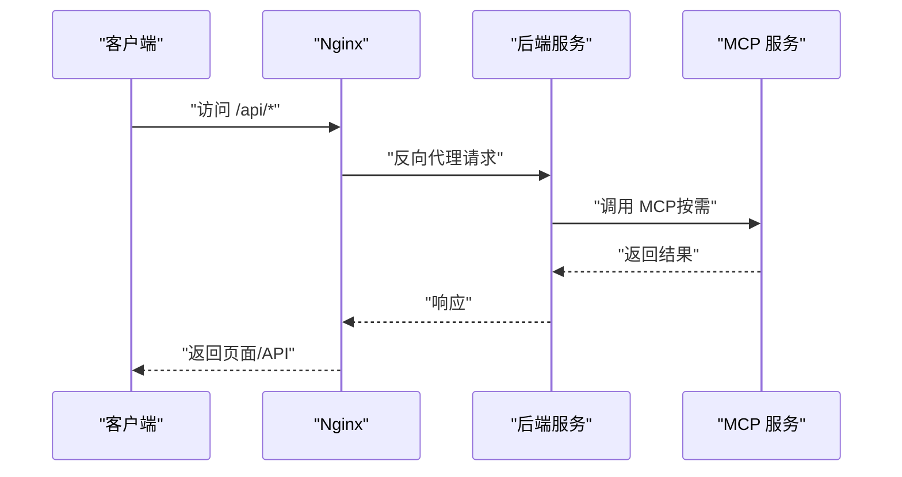
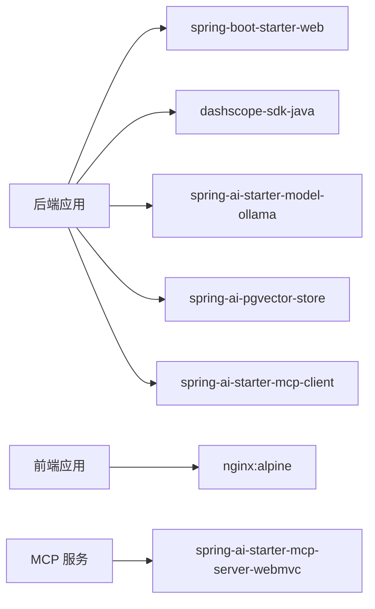

# 生产环境部署

<cite>
**本文引用的文件**
- [application.yml](file://src/main/resources/application.yml)
- [application-prod.yml](file://src/main/resources/application-prod.yml)
- [Dockerfile（后端）](file://Dockerfile)
- [Dockerfile（前端）](file://yu-ai-agent-frontend/Dockerfile)
- [nginx.conf（前端）](file://yu-ai-agent-frontend/nginx.conf)
- [pom.xml（后端）](file://pom.xml)
- [pom.xml（MCP 服务）](file://yu-image-search-mcp-server/pom.xml)
- [HealthController.java](file://src/main/java/com/yupi/yuaiagent/controller/HealthController.java)
- [YuAiAgentApplication.java](file://src/main/java/com/yupi/yuaiagent/YuAiAgentApplication.java)
- [application.yml（MCP 服务）](file://yu-image-search-mcp-server/src/main/resources/application.yml)
- [application-sse.yml（MCP 服务）](file://yu-image-search-mcp-server/src/main/resources/application-sse.yml)
- [application-stdio.yml（MCP 服务）](file://yu-image-search-mcp-server/src/main/resources/application-stdio.yml)
</cite>

## 目录
1. [简介](#简介)
2. [项目结构](#项目结构)
3. [核心组件](#核心组件)
4. [架构总览](#架构总览)
5. [详细组件分析](#详细组件分析)
6. [依赖分析](#依赖分析)
7. [性能考虑](#性能考虑)
8. [故障排查指南](#故障排查指南)
9. [结论](#结论)
10. [附录](#附录)

## 简介
本指南面向生产环境部署，覆盖服务器准备、环境配置、服务启动与停止、负载均衡与安全加固等完整流程。结合代码库中的配置与容器化脚本，给出可落地的实施步骤，并强调敏感信息的安全管理与健康检查机制。

## 项目结构
后端采用 Spring Boot，前端使用 Vite 构建并通过 Nginx 托管静态资源；整体通过 Docker 容器化打包与运行。后端提供健康检查接口，前端通过 Nginx 反向代理后端 API。

图表来源
- [Dockerfile（前端）:1-17](file://yu-ai-agent-frontend/Dockerfile#L1-L17)
- [nginx.conf（前端）:1-49](file://yu-ai-agent-frontend/nginx.conf#L1-L49)
- [Dockerfile（后端）:1-16](file://Dockerfile#L1-L16)
- [HealthController.java:1-16](file://src/main/java/com/yupi/yuaiagent/controller/HealthController.java#L1-L16)

章节来源
- [Dockerfile（前端）:1-17](file://yu-ai-agent-frontend/Dockerfile#L1-L17)
- [Dockerfile（后端）:1-16](file://Dockerfile#L1-L16)
- [nginx.conf（前端）:1-49](file://yu-ai-agent-frontend/nginx.conf#L1-L49)

## 核心组件
- 后端服务：Spring Boot 应用，暴露健康检查接口，支持生产环境配置文件覆盖。
- 前端服务：Vite 构建产物由 Nginx 托管，提供单页应用路由支持与 API 反代。
- MCP 服务：独立的 Spring AI MCP 服务，支持 SSE 或 STDIO 模式。
- 容器化：后端与前端分别打包为容器镜像，统一通过编排系统运行。

章节来源
- [application.yml:1-66](file://src/main/resources/application.yml#L1-L66)
- [application-prod.yml:1-2](file://src/main/resources/application-prod.yml#L1-L2)
- [HealthController.java:1-16](file://src/main/java/com/yupi/yuaiagent/controller/HealthController.java#L1-L16)
- [pom.xml（后端）:1-227](file://pom.xml#L1-L227)
- [pom.xml（MCP 服务）:1-121](file://yu-image-search-mcp-server/pom.xml#L1-L121)

## 架构总览
生产环境典型拓扑：Nginx 作为入口反向代理，后端服务提供 API，MCP 服务按需运行并与后端协作。数据库与向量存储可按需部署在外部或容器内。

图表来源
- [nginx.conf（前端）:1-49](file://yu-ai-agent-frontend/nginx.conf#L1-L49)
- [application.yml（MCP 服务）:1-7](file://yu-image-search-mcp-server/src/main/resources/application.yml#L1-L7)

## 详细组件分析

### 后端服务（Spring Boot）
- 端口与上下文：后端监听端口与上下文路径在配置文件中定义，生产环境可通过 profile 覆盖。
- 健康检查：提供 /health 接口用于存活探针。
- 数据库与向量存储：当前工程默认关闭数据源自动配置，按需启用并配置外部数据库与向量存储。
- AI 模型与工具：配置中包含多家大模型与本地 Ollama 的示例，生产环境应替换为真实密钥与地址。

图表来源
- [YuAiAgentApplication.java:1-18](file://src/main/java/com/yupi/yuaiagent/YuAiAgentApplication.java#L1-L18)
- [HealthController.java:1-16](file://src/main/java/com/yupi/yuaiagent/controller/HealthController.java#L1-L16)
- [application.yml:1-66](file://src/main/resources/application.yml#L1-L66)

章节来源
- [application.yml:1-66](file://src/main/resources/application.yml#L1-L66)
- [application-prod.yml:1-2](file://src/main/resources/application-prod.yml#L1-L2)
- [HealthController.java:1-16](file://src/main/java/com/yupi/yuaiagent/controller/HealthController.java#L1-L16)
- [YuAiAgentApplication.java:1-18](file://src/main/java/com/yupi/yuaiagent/YuAiAgentApplication.java#L1-L18)

### 前端服务（Vite + Nginx）
- 构建与运行：前端使用多阶段 Dockerfile 构建，运行阶段使用 Nginx 托管静态资源。
- 路由支持：Nginx 将 SPA 路由回退到 index.html，避免刷新 404。
- API 反代：将 /api 前缀的请求转发至后端 API 地址，设置必要的头部与超时参数。

图表来源
- [Dockerfile（前端）:1-17](file://yu-ai-agent-frontend/Dockerfile#L1-L17)
- [nginx.conf（前端）:1-49](file://yu-ai-agent-frontend/nginx.conf#L1-L49)

章节来源
- [Dockerfile（前端）:1-17](file://yu-ai-agent-frontend/Dockerfile#L1-L17)
- [nginx.conf（前端）:1-49](file://yu-ai-agent-frontend/nginx.conf#L1-L49)

### MCP 服务（可选）
- 模式选择：支持 SSE 与 STDIO 两种模式，按需启用。
- 端口与类型：配置文件定义端口与服务类型，便于与后端集成。

图表来源
- [nginx.conf（前端）:14-35](file://yu-ai-agent-frontend/nginx.conf#L14-L35)
- [application.yml（MCP 服务）:1-7](file://yu-image-search-mcp-server/src/main/resources/application.yml#L1-L7)

章节来源
- [application.yml（MCP 服务）:1-7](file://yu-image-search-mcp-server/src/main/resources/application.yml#L1-L7)
- [application-sse.yml（MCP 服务）:1-10](file://yu-image-search-mcp-server/src/main/resources/application-sse.yml#L1-L10)
- [application-stdio.yml（MCP 服务）:1-13](file://yu-image-search-mcp-server/src/main/resources/application-stdio.yml#L1-L13)

## 依赖分析
- 后端依赖：Spring Web、DashScope SDK、Ollama、PgVector、MCP 客户端等。
- 前端依赖：Vite、Nginx 镜像。
- MCP 服务依赖：Spring AI MCP Server Starter。

图表来源
- [pom.xml（后端）:50-164](file://pom.xml#L50-L164)
- [pom.xml（MCP 服务）:43-66](file://yu-image-search-mcp-server/pom.xml#L43-L66)
- [Dockerfile（前端）:9-17](file://yu-ai-agent-frontend/Dockerfile#L9-L17)

章节来源
- [pom.xml（后端）:1-227](file://pom.xml#L1-L227)
- [pom.xml（MCP 服务）:1-121](file://yu-image-search-mcp-server/pom.xml#L1-L121)

## 性能考虑
- 反向代理优化：Nginx 中已开启关闭缓存与非缓冲模式以支持 SSE，建议根据流量调整 worker 进程数与连接数上限。
- 日志与监控：生产环境建议集中化日志采集与指标上报，结合健康检查接口完善告警。
- 资源隔离：容器资源限制与 CPU/内存配额，避免资源争抢。
- 缓存策略：静态资源设置长缓存，API 请求避免缓存敏感数据。

## 故障排查指南
- 健康检查：通过 /health 接口确认服务存活状态。
- 日志定位：查看容器日志与 Nginx 访问/错误日志，定位 5xx 错误与代理失败原因。
- 端口连通性：确认后端端口、MCP 端口与反代端口是否开放且未冲突。
- 配置覆盖：确保生产 profile 正确加载，敏感信息通过环境变量注入而非硬编码。

章节来源
- [HealthController.java:1-16](file://src/main/java/com/yupi/yuaiagent/controller/HealthController.java#L1-L16)
- [application.yml:1-66](file://src/main/resources/application.yml#L1-L66)
- [application-prod.yml:1-2](file://src/main/resources/application-prod.yml#L1-L2)

## 结论
本指南基于现有配置与容器化脚本，给出了生产环境部署的完整流程与注意事项。建议在正式上线前完成敏感信息脱敏、网络与安全加固、负载均衡与高可用部署，并建立完善的监控与告警体系。

## 附录

### 服务器准备与环境要求
- 操作系统：推荐 Linux（如 Ubuntu/CentOS），内核版本满足容器运行要求。
- JDK：后端使用 Java 21，确保系统安装对应版本。
- 容器运行时：安装 Docker 并确保镜像拉取与容器运行正常。
- 网络：开放 Nginx（80）、后端（8123）、MCP（8127）端口，配置安全组或防火墙规则。

章节来源
- [pom.xml（后端）:29-31](file://pom.xml#L29-L31)
- [Dockerfile（后端）:1-16](file://Dockerfile#L1-L16)
- [Dockerfile（前端）:1-17](file://yu-ai-agent-frontend/Dockerfile#L1-L17)

### 生产环境配置文件使用
- profile 切换：后端通过命令行参数激活 prod profile，实现配置覆盖。
- 敏感信息管理：数据库连接、AI 模型密钥等敏感信息建议通过环境变量注入，避免提交到版本库。
- 配置优先级：生产配置文件会覆盖默认配置，注意字段一致性与类型匹配。

章节来源
- [Dockerfile（后端）:15-16](file://Dockerfile#L15-L16)
- [application.yml:1-66](file://src/main/resources/application.yml#L1-L66)
- [application-prod.yml:1-2](file://src/main/resources/application-prod.yml#L1-L2)

### 服务启动与停止脚本（建议）
- 启动顺序：先启动数据库/向量存储，再启动 MCP 服务，最后启动后端与前端。
- 停止顺序：先停止前端，再停止后端，最后停止 MCP 与数据库。
- 健康检查：使用 /health 接口进行探活，失败时触发重启策略。
- 日志管理：容器日志落盘并定期清理，保留最近 N 天的日志。

章节来源
- [HealthController.java:1-16](file://src/main/java/com/yupi/yuaiagent/controller/HealthController.java#L1-L16)
- [Dockerfile（前端）:1-17](file://yu-ai-agent-frontend/Dockerfile#L1-L17)
- [Dockerfile（后端）:1-16](file://Dockerfile#L1-L16)

### 负载均衡配置示例（Nginx）
- 反向代理：将 /api 前缀转发至后端集群，支持多实例横向扩展。
- 负载均衡算法：轮询或最少连接，结合健康检查剔除异常节点。
- 会话保持：若存在状态依赖，可启用基于 Cookie 的会话保持。
- SSE 支持：保持长连接与禁用缓冲，确保事件推送稳定。

章节来源
- [nginx.conf（前端）:14-35](file://yu-ai-agent-frontend/nginx.conf#L14-L35)

### 安全加固措施
- 防火墙：仅开放必要端口，限制来源 IP。
- SSL 证书：为域名申请并安装证书，强制 HTTPS。
- 访问控制：后端接口增加鉴权与限流，前端静态资源防直接访问敏感路径。
- 镜像安全：使用可信基础镜像，定期扫描漏洞并更新依赖。

章节来源
- [nginx.conf（前端）:1-49](file://yu-ai-agent-frontend/nginx.conf#L1-L49)
- [pom.xml（后端）:1-227](file://pom.xml#L1-L227)