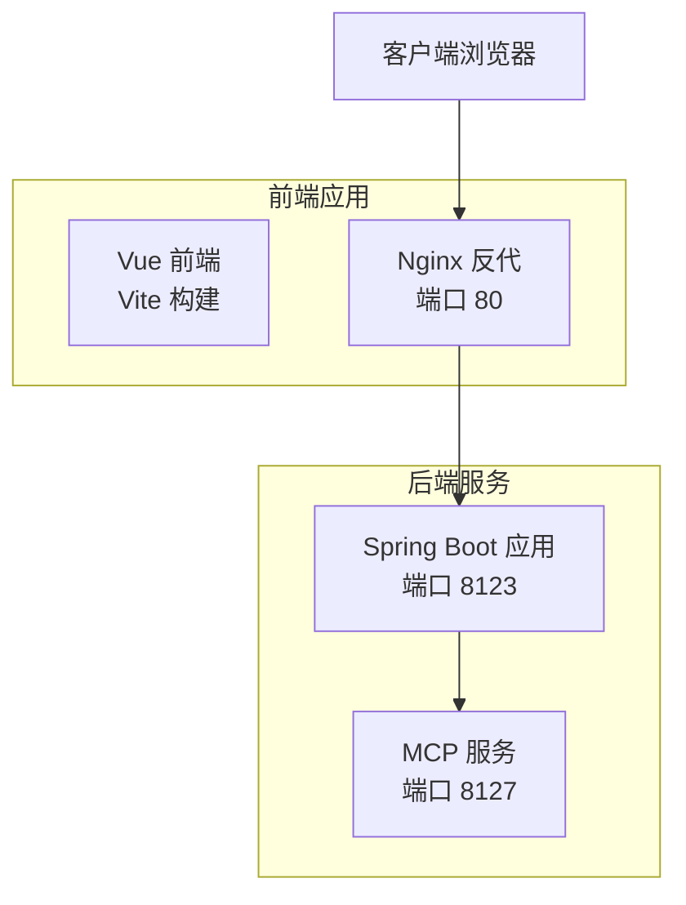
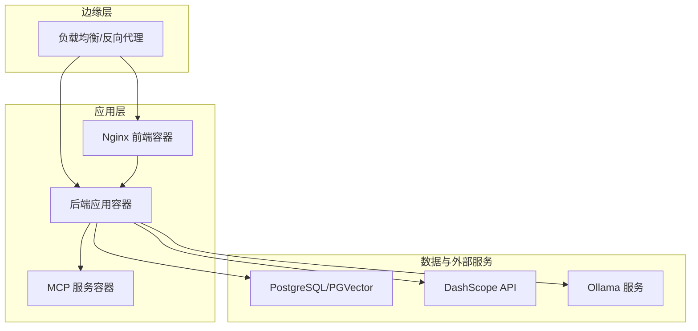
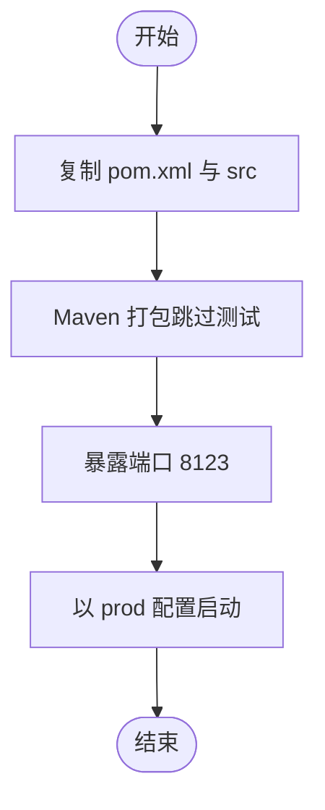
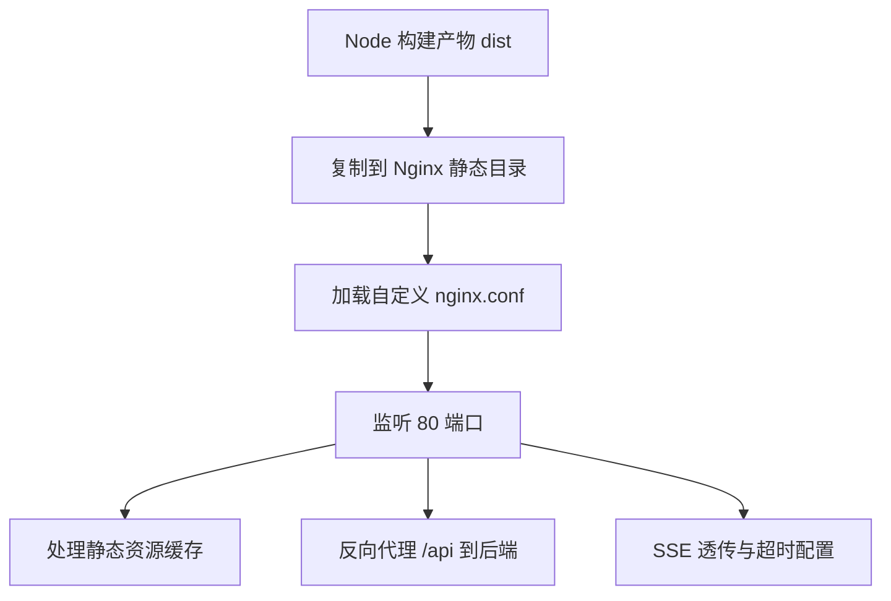
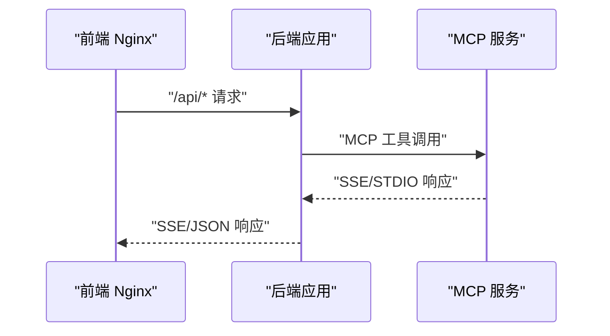
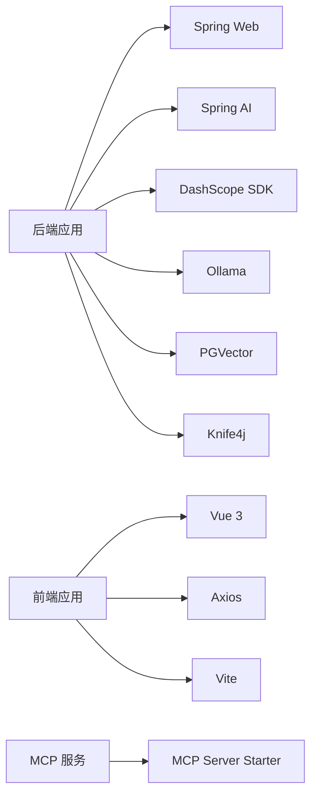

# 部署指南

<cite>
**本文引用的文件**
- [Dockerfile](file://Dockerfile)
- [pom.xml](file://pom.xml)
- [application.yml](file://src/main/resources/application.yml)
- [application-prod.yml](file://src/main/resources/application-prod.yml)
- [yu-ai-agent-frontend/Dockerfile](file://yu-ai-agent-frontend/Dockerfile)
- [yu-ai-agent-frontend/nginx.conf](file://yu-ai-agent-frontend/nginx.conf)
- [yu-ai-agent-frontend/package.json](file://yu-ai-agent-frontend/package.json)
- [yu-ai-agent-frontend/vite.config.js](file://yu-ai-agent-frontend/vite.config.js)
- [yu-image-search-mcp-server/pom.xml](file://yu-image-search-mcp-server/pom.xml)
- [yu-image-search-mcp-server/src/main/resources/application.yml](file://yu-image-search-mcp-server/src/main/resources/application.yml)
- [yu-image-search-mcp-server/src/main/resources/application-sse.yml](file://yu-image-search-mcp-server/src/main/resources/application-sse.yml)
- [README.md](file://README.md)
</cite>

## 目录
1. [简介](#简介)
2. [项目结构](#项目结构)
3. [核心组件](#核心组件)
4. [架构总览](#架构总览)
5. [详细组件分析](#详细组件分析)
6. [依赖关系分析](#依赖关系分析)
7. [性能考虑](#性能考虑)
8. [故障排查指南](#故障排查指南)
9. [结论](#结论)
10. [附录](#附录)

## 简介
本指南面向生产环境部署与运维，涵盖后端服务、前端应用、MCP 辅助服务的容器化与编排、环境配置、构建与发布、CI/CD 流水线、负载均衡与高可用、监控告警、性能调优、安全加固与备份恢复等运维实践。读者无需深入代码即可按步骤完成稳定可靠的生产部署。

## 项目结构
该项目由三部分组成：
- 后端主服务：基于 Spring Boot 3 的 Java 应用，提供 AI 对话、RAG、工具调用与 MCP 客户端能力。
- 前端应用：基于 Vue 3 + Vite 的单页应用，通过 Nginx 提供静态托管与反向代理。
- MCP 服务：独立的图像搜索 MCP 服务，用于扩展工具能力。

图表来源
- [Dockerfile](file://Dockerfile)
- [yu-ai-agent-frontend/Dockerfile](file://yu-ai-agent-frontend/Dockerfile)
- [yu-ai-agent-frontend/nginx.conf](file://yu-ai-agent-frontend/nginx.conf)
- [yu-image-search-mcp-server/src/main/resources/application.yml](file://yu-image-search-mcp-server/src/main/resources/application.yml)

章节来源
- [README.md](file://README.md)
- [pom.xml](file://pom.xml)
- [yu-image-search-mcp-server/pom.xml](file://yu-image-search-mcp-server/pom.xml)

## 核心组件
- 后端主服务
  - 使用 Maven 构建，打包为可执行 JAR，暴露端口 8123，默认运行在 /api 上下文路径。
  - 生产配置位于 application-prod.yml，可覆盖 application.yml 中的默认值。
- 前端应用
  - 使用 Vite 构建，产物复制至 Nginx 静态目录；Nginx 配置支持 Vue 路由回退、API 反代、SSE 透传与缓存优化。
- MCP 服务
  - 独立的 Spring AI MCP 服务，支持 SSE 或 STDIO 模式，端口 8127。

章节来源
- [application.yml](file://src/main/resources/application.yml)
- [application-prod.yml](file://src/main/resources/application-prod.yml)
- [Dockerfile](file://Dockerfile)
- [yu-ai-agent-frontend/Dockerfile](file://yu-ai-agent-frontend/Dockerfile)
- [yu-ai-agent-frontend/nginx.conf](file://yu-ai-agent-frontend/nginx.conf)
- [yu-image-search-mcp-server/src/main/resources/application.yml](file://yu-image-search-mcp-server/src/main/resources/application.yml)

## 架构总览
生产部署采用“容器化 + 反向代理 + 外部服务”的架构：
- 后端主服务与 MCP 服务分别容器化，通过反向代理统一入口。
- 前端通过 Nginx 提供静态资源与 API 反代，支持 SSE。
- 数据库与外部 AI 服务（如 DashScope、Ollama）作为外部依赖，需在生产网络中可达。

图表来源
- [yu-ai-agent-frontend/nginx.conf](file://yu-ai-agent-frontend/nginx.conf)
- [application.yml](file://src/main/resources/application.yml)
- [yu-image-search-mcp-server/src/main/resources/application.yml](file://yu-image-search-mcp-server/src/main/resources/application.yml)

## 详细组件分析

### 后端服务容器化与启动
- 基础镜像与构建
  - 使用 maven:3.9-amazoncorretto-21 作为基础镜像，仅复制 pom.xml 与 src，执行 mvn clean package -DskipTests。
  - 暴露端口 8123，使用 prod 配置文件启动。
- 运行参数
  - CMD 以 --spring.profiles.active=prod 激活生产配置，避免在镜像中携带敏感信息。
- 依赖与模块
  - 依赖 Spring Web、Spring AI、DashScope SDK、Ollama、PGVector、Knife4j 等，构建时自动解析 BOM 与快照仓库。

图表来源
- [Dockerfile](file://Dockerfile)

章节来源
- [Dockerfile](file://Dockerfile)
- [pom.xml](file://pom.xml)
- [application.yml](file://src/main/resources/application.yml)
- [application-prod.yml](file://src/main/resources/application-prod.yml)

### 前端应用容器化与 Nginx 配置
- 构建阶段
  - 使用 node:20-alpine，安装依赖并执行 npm run build。
- 运行阶段
  - 使用 nginx:alpine，将 dist 目录复制到 /usr/share/nginx/html，并以自定义 nginx.conf 替换默认配置。
  - 暴露端口 80，前台启动 nginx。
- Nginx 关键点
  - Vue 路由回退到 index.html，解决刷新 404。
  - /api 前缀反代到后端服务，设置 Host、X-Real-IP、X-Forwarded-* 请求头。
  - SSE 场景保持连接、关闭缓存、放宽读超时。
  - 静态资源设置长缓存与 public 标记。

图表来源
- [yu-ai-agent-frontend/Dockerfile](file://yu-ai-agent-frontend/Dockerfile)
- [yu-ai-agent-frontend/nginx.conf](file://yu-ai-agent-frontend/nginx.conf)

章节来源
- [yu-ai-agent-frontend/Dockerfile](file://yu-ai-agent-frontend/Dockerfile)
- [yu-ai-agent-frontend/nginx.conf](file://yu-ai-agent-frontend/nginx.conf)
- [yu-ai-agent-frontend/package.json](file://yu-ai-agent-frontend/package.json)
- [yu-ai-agent-frontend/vite.config.js](file://yu-ai-agent-frontend/vite.config.js)

### MCP 服务容器化与运行
- 模块与依赖
  - 使用 Spring AI MCP Server Starter，支持 WebMvc 模式。
  - 默认 profile 为 sse，端口 8127。
- 运行建议
  - 与后端服务同机或同网络，确保后端可通过 MCP 地址访问。
  - 如使用 STDIO，需在后端配置 stdio 服务器列表。

图表来源
- [yu-image-search-mcp-server/src/main/resources/application.yml](file://yu-image-search-mcp-server/src/main/resources/application.yml)
- [yu-image-search-mcp-server/src/main/resources/application-sse.yml](file://yu-image-search-mcp-server/src/main/resources/application-sse.yml)
- [yu-ai-agent-frontend/nginx.conf](file://yu-ai-agent-frontend/nginx.conf)

章节来源
- [yu-image-search-mcp-server/pom.xml](file://yu-image-search-mcp-server/pom.xml)
- [yu-image-search-mcp-server/src/main/resources/application.yml](file://yu-image-search-mcp-server/src/main/resources/application.yml)
- [yu-image-search-mcp-server/src/main/resources/application-sse.yml](file://yu-image-search-mcp-server/src/main/resources/application-sse.yml)

## 依赖关系分析
- 后端依赖
  - Spring Web、Spring AI、DashScope SDK、Ollama、PGVector、Knife4j、LangChain4j 等。
  - 通过 BOM 与快照仓库管理版本，确保依赖一致性。
- 前端依赖
  - Vue 3、Vue Router、Axios、Vite 插件等。
- MCP 服务
  - Spring AI MCP Server Starter，支持 SSE/STDIO。

图表来源
- [pom.xml](file://pom.xml)
- [yu-image-search-mcp-server/pom.xml](file://yu-image-search-mcp-server/pom.xml)
- [yu-ai-agent-frontend/package.json](file://yu-ai-agent-frontend/package.json)

章节来源
- [pom.xml](file://pom.xml)
- [yu-image-search-mcp-server/pom.xml](file://yu-image-search-mcp-server/pom.xml)
- [yu-ai-agent-frontend/package.json](file://yu-ai-agent-frontend/package.json)

## 性能考虑
- 前端性能
  - 静态资源启用一年缓存与 public 标记，减少带宽消耗。
  - Vue 路由回退避免刷新导致的二次请求。
- 后端性能
  - 生产环境使用 prod 配置，避免调试日志与冗余输出。
  - 合理设置 JVM 参数与线程池大小，结合容器资源限制。
- SSE 与反代
  - Nginx 对 SSE 关闭缓存、保持连接、放宽读超时，保证实时性。
- 数据库与外部服务
  - PGVector 与 DashScope/Ollama 的连接池与超时需在生产配置中优化。

## 故障排查指南
- 常见问题定位
  - 前端 404：检查 Nginx 的 try_files 是否指向 index.html。
  - API 无法访问：确认 /api 反代地址与后端端口一致。
  - SSE 不生效：检查 proxy_set_header、proxy_http_version、proxy_buffering、proxy_read_timeout。
  - MCP 无法连接：核对 MCP 服务地址、端口与后端配置。
- 日志与可观测性
  - 后端生产日志级别与 Swagger/Knife4j 接口文档路径可在生产配置中调整。
  - 建议在容器编排中挂载日志卷，集中采集与告警。

章节来源
- [yu-ai-agent-frontend/nginx.conf](file://yu-ai-agent-frontend/nginx.conf)
- [application.yml](file://src/main/resources/application.yml)
- [application-prod.yml](file://src/main/resources/application-prod.yml)

## 结论
通过容器化与反向代理，本项目实现了前后端分离、MCP 扩展与外部服务解耦的生产架构。遵循本文的部署与运维实践，可确保系统在生产环境中的稳定性、可维护性与可扩展性。

## 附录

### 生产环境部署步骤
- 服务器准备
  - 准备 Linux 服务器，安装 Docker 与 Docker Compose。
  - 配置防火墙开放 80、8123、8127 端口。
- 依赖安装
  - PostgreSQL 与 PGVector（或云服务）、DashScope API Key、Ollama 服务（如需本地模型）。
- 服务启动
  - 使用 Docker Compose 启动后端、前端、MCP 服务与数据库。
  - 在生产配置中注入数据库连接、API Key、MCP 地址等敏感信息。
- 健康检查与探针
  - 后端提供健康检查端点，前端通过 Nginx 返回 200/50x 错误页。

章节来源
- [Dockerfile](file://Dockerfile)
- [yu-ai-agent-frontend/Dockerfile](file://yu-ai-agent-frontend/Dockerfile)
- [yu-image-search-mcp-server/src/main/resources/application.yml](file://yu-image-search-mcp-server/src/main/resources/application.yml)
- [application.yml](file://src/main/resources/application.yml)

### CI/CD 流水线与自动化部署
- 构建阶段
  - 后端：拉取代码 → Maven 清理构建 → 产出 JAR → 构建 Docker 镜像 → 推送镜像仓库。
  - 前端：拉取代码 → npm install → npm run build → 构建 Docker 镜像 → 推送镜像仓库。
  - MCP：拉取代码 → Maven 构建 → 构建 Docker 镜像 → 推送镜像仓库。
- 发布阶段
  - 使用 Docker Compose 或 Kubernetes 部署，滚动更新。
  - 使用环境变量或密钥管理服务注入敏感配置。
- 质量门禁
  - 单元测试、依赖扫描、镜像漏洞扫描、安全基线检查。

章节来源
- [Dockerfile](file://Dockerfile)
- [yu-ai-agent-frontend/Dockerfile](file://yu-ai-agent-frontend/Dockerfile)
- [yu-image-search-mcp-server/pom.xml](file://yu-image-search-mcp-server/pom.xml)
- [pom.xml](file://pom.xml)

### 负载均衡、高可用与监控告警
- 负载均衡
  - 使用 Nginx 或云厂商 LB 将流量分发至多个后端实例。
- 高可用
  - 多副本部署后端与前端，数据库使用主从或云托管高可用。
- 监控告警
  - 指标：CPU、内存、请求延迟、错误率、SSE 连接数。
  - 日志：统一采集、结构化、分级告警。
  - 健康检查：容器健康探针 + 应用健康端点。

### 安全加固与备份恢复
- 安全加固
  - 网络：最小权限、内网隔离、TLS 终止。
  - 配置：敏感信息使用密钥管理服务，避免硬编码。
  - 镜像：定期更新基础镜像，清理构建缓存。
- 备份恢复
  - 数据库定时备份与异地容灾。
  - 配置与日志卷备份，版本化管理。