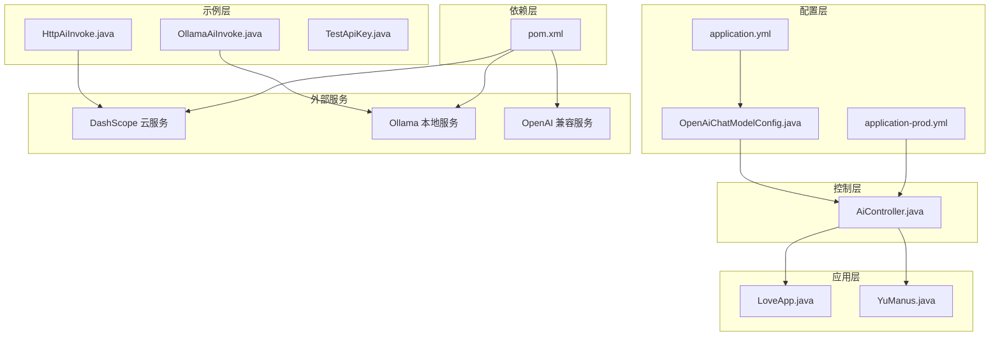
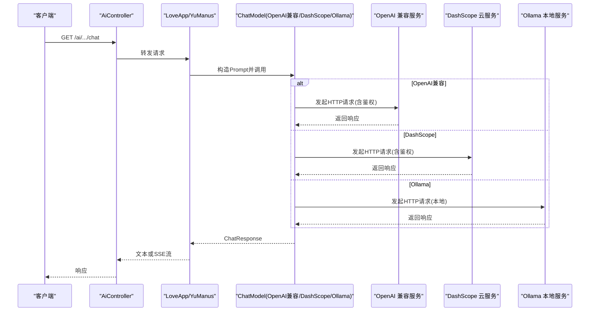
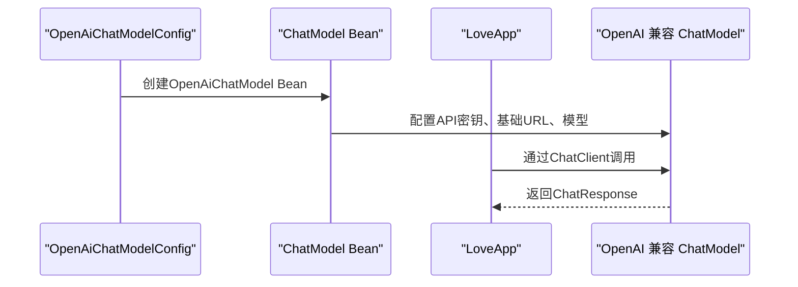
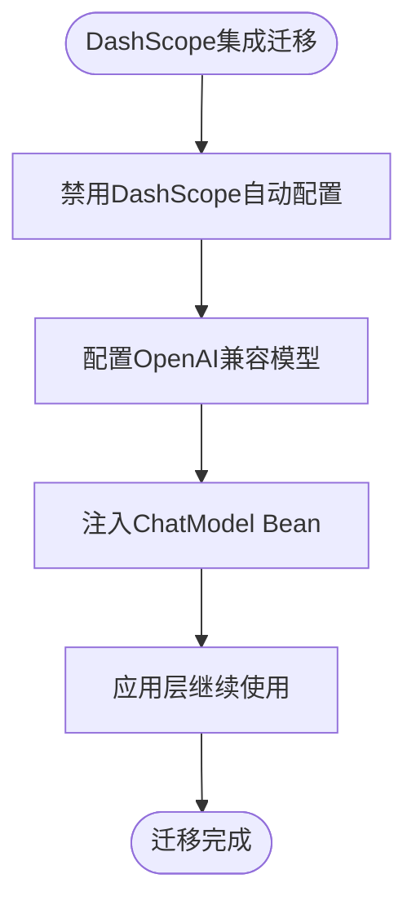
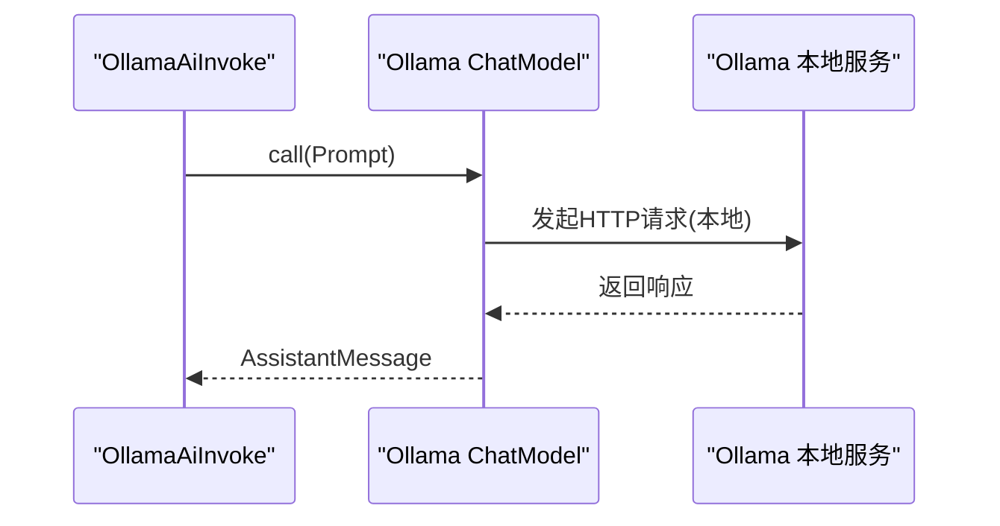
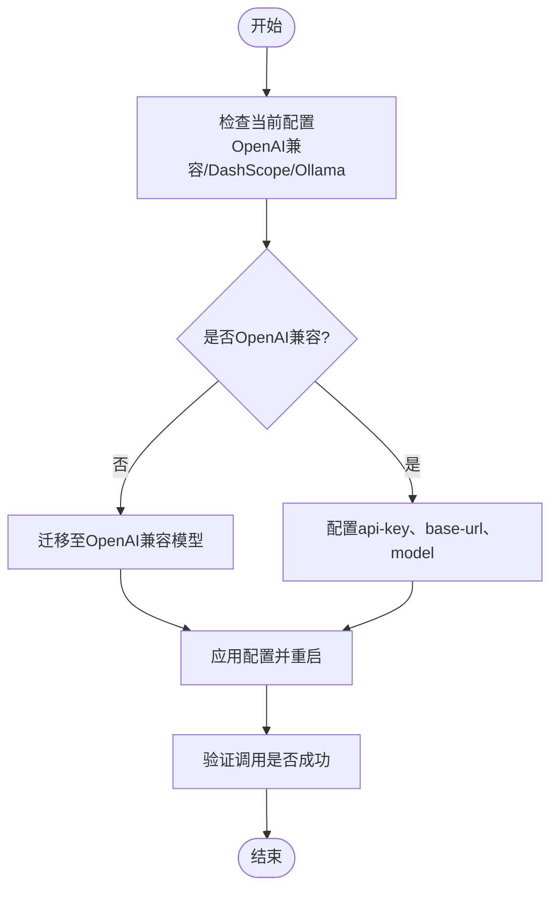
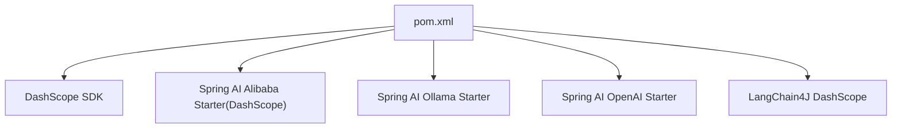

# AI模型配置

<cite>
**本文引用的文件**
- [application.yml](file://src/main/resources/application.yml)
- [application-prod.yml](file://src/main/resources/application-prod.yml)
- [pom.xml](file://pom.xml)
- [OpenAiChatModelConfig.java](file://src/main/java/com/yupi/yuaiagent/config/OpenAiChatModelConfig.java)
- [AiController.java](file://src/main/java/com/yupi/yuaiagent/controller/AiController.java)
- [LoveApp.java](file://src/main/java/com/yupi/yuaiagent/app/LoveApp.java)
- [YuManus.java](file://src/main/java/com/yupi/yuaiagent/agent/YuManus.java)
- [OllamaAiInvoke.java](file://src/main/java/com/yupi/yuaiagent/demo/invoke/OllamaAiInvoke.java)
- [HttpAiInvoke.java](file://src/main/java/com/yupi/yuaiagent/demo/invoke/HttpAiInvoke.java)
- [TestApiKey.java](file://src/main/java/com/yupi/yuaiagent/demo/invoke/TestApiKey.java)
- [mcp-servers.json](file://src/main/resources/mcp-servers.json)
- [application-stdio.yml](file://yu-image-search-mcp-server/src/main/resources/application-stdio.yml)
</cite>

## 更新摘要
**所做更改**
- 更新DashScope集成架构，迁移到OpenAI兼容模型系统
- 新增OpenAiChatModelConfig配置类，替代原有的DashScope配置
- 更新application.yml配置结构，移除DashScope配置项，新增OpenAI配置项
- 更新依赖管理，移除DashScope相关依赖，新增Spring AI OpenAI依赖
- 更新控制器和应用层代码，适配新的ChatModel注入方式

## 目录
1. [简介](#简介)
2. [项目结构](#项目结构)
3. [核心组件](#核心组件)
4. [架构总览](#架构总览)
5. [详细组件分析](#详细组件分析)
6. [依赖分析](#依赖分析)
7. [性能考虑](#性能考虑)
8. [故障排查指南](#故障排查指南)
9. [结论](#结论)
10. [附录](#附录)

## 简介
本文件面向AI模型配置与运维人员，系统性说明DashScope与Ollama两大AI模型服务在本项目中的配置方法、参数调优、性能配置、安全与迁移策略，并提供故障排查与最佳实践。项目采用Spring Boot与Spring AI生态，结合DashScope SDK与Spring AI OpenAI Starter，支持本地与云端模型统一接入。**重要更新**：项目已将DashScope集成迁移到OpenAI兼容模型系统，通过OpenAiChatModelConfig配置类实现统一的模型管理。

## 项目结构
本项目采用分层+特性模块组织方式：
- 配置层：application.yml集中管理AI服务、服务器端口、OpenAPI文档与日志级别
- 控制层：AiController提供同步与SSE流式接口，对接LoveApp与YuManus应用
- 应用层：LoveApp负责对话记忆、RAG检索与工具调用；YuManus为超级智能体
- 配置层：OpenAiChatModelConfig提供OpenAI兼容模型的Bean配置
- 示例层：OllamaAiInvoke与HttpAiInvoke演示Spring AI与HTTP直连两种调用方式
- 依赖层：pom.xml声明DashScope SDK与Spring AI相关Starter

**图表来源**
- [application.yml:1-73](file://src/main/resources/application.yml#L1-L73)
- [OpenAiChatModelConfig.java:1-64](file://src/main/java/com/yupi/yuaiagent/config/OpenAiChatModelConfig.java#L1-L64)
- [AiController.java:1-106](file://src/main/java/com/yupi/yuaiagent/controller/AiController.java#L1-L106)
- [LoveApp.java:1-227](file://src/main/java/com/yupi/yuaiagent/app/LoveApp.java#L1-L227)
- [YuManus.java:1-38](file://src/main/java/com/yupi/yuaiagent/agent/YuManus.java#L1-L38)
- [OllamaAiInvoke.java:1-28](file://src/main/java/com/yupi/yuaiagent/demo/invoke/OllamaAiInvoke.java#L1-L28)
- [HttpAiInvoke.java:1-57](file://src/main/java/com/yupi/yuaiagent/demo/invoke/HttpAiInvoke.java#L1-L57)
- [TestApiKey.java:1-11](file://src/main/java/com/yupi/yuaiagent/demo/invoke/TestApiKey.java#L1-L11)
- [pom.xml:66-70](file://pom.xml#L66-L70)

**章节来源**
- [application.yml:1-73](file://src/main/resources/application.yml#L1-L73)
- [OpenAiChatModelConfig.java:1-64](file://src/main/java/com/yupi/yuaiagent/config/OpenAiChatModelConfig.java#L1-L64)
- [AiController.java:1-106](file://src/main/java/com/yupi/yuaiagent/controller/AiController.java#L1-L106)
- [pom.xml:66-70](file://pom.xml#L66-L70)

## 核心组件
- **OpenAI兼容模型配置**（更新）
  - 通过OpenAiChatModelConfig配置类提供OpenAI兼容的ChatModel Bean，支持公司内部部署的Qwen/Qwen3-32B模型
  - 配置包括API密钥、基础URL和模型名称，支持温度、最大令牌数等参数设置
  - 替代原有的DashScope配置方式，实现统一的模型管理
- **DashScope集成迁移**
  - application.yml中禁用了DashScope自动配置，使用OpenAI兼容模型系统
  - AiController仍保留dashscopeChatModel注入，但实际使用的是OpenAI兼容的ChatModel
  - LoveApp与YuManus通过ChatClient构建对话客户端，支持同步与SSE流式对话
- **Ollama配置与调用**
  - 在配置文件中设置base-url与chat.model，Spring AI Ollama Starter自动装配ChatModel
  - 示例类OllamaAiInvoke通过依赖注入的ollamaChatModel发起对话
- **工具与RAG**
  - LoveApp支持对话记忆、结构化输出、RAG检索与工具回调，便于在不同场景下扩展能力
- **日志与可观测性**
  - application.yml开启org.springframework.ai日志级别，便于调试与性能分析

**章节来源**
- [OpenAiChatModelConfig.java:13-62](file://src/main/java/com/yupi/yuaiagent/config/OpenAiChatModelConfig.java#L13-L62)
- [application.yml:8-28](file://src/main/resources/application.yml#L8-L28)
- [AiController.java:28-29](file://src/main/java/com/yupi/yuaiagent/controller/AiController.java#L28-L29)
- [LoveApp.java:43-61](file://src/main/java/com/yupi/yuaiagent/app/LoveApp.java#L43-L61)
- [YuManus.java:15-36](file://src/main/java/com/yupi/yuaiagent/agent/YuManus.java#L15-L36)
- [OllamaAiInvoke.java:17-26](file://src/main/java/com/yupi/yuaiagent/demo/invoke/OllamaAiInvoke.java#L17-L26)
- [application.yml:70-73](file://src/main/resources/application.yml#L70-L73)

## 架构总览
下图展示从控制器到应用、再到AI服务的调用链路，以及三种模型服务的接入点。

**图表来源**
- [AiController.java:38-104](file://src/main/java/com/yupi/yuaiagent/controller/AiController.java#L38-L104)
- [LoveApp.java:71-96](file://src/main/java/com/yupi/yuaiagent/app/LoveApp.java#L71-L96)
- [YuManus.java:32-35](file://src/main/java/com/yupi/yuaiagent/agent/YuManus.java#L32-L35)
- [OpenAiChatModelConfig.java:31-47](file://src/main/java/com/yupi/yuaiagent/config/OpenAiChatModelConfig.java#L31-L47)
- [application.yml:16-28](file://src/main/resources/application.yml#L16-L28)

## 详细组件分析

### OpenAI兼容模型配置（新增）
- **配置要点**
  - 在OpenAiChatModelConfig中通过@Bean定义OpenAiChatModel Bean
  - 支持从application.yml读取api-key、base-url和model配置
  - 默认模型为Qwen/Qwen3-32B，温度0.7，最大令牌数2000
  - 提供EmbeddingModel Bean用于RAG向量存储
- **调用路径**
  - OpenAiChatModelConfig创建ChatModel实例，通过@Primary注解优先注入
  - AiController注入ChatModel（实际为OpenAI兼容模型），LoveApp与YuManus通过ChatClient构建对话客户端
- **参数与模型选择**
  - 模型名称在OpenAiChatModelConfig中集中管理，可通过application.yml动态配置
  - 支持温度、最大令牌数等参数调优，便于适应不同应用场景

**图表来源**
- [OpenAiChatModelConfig.java:29-47](file://src/main/java/com/yupi/yuaiagent/config/OpenAiChatModelConfig.java#L29-L47)
- [OpenAiChatModelConfig.java:53-62](file://src/main/java/com/yupi/yuaiagent/config/OpenAiChatModelConfig.java#L53-L62)
- [AiController.java:28-29](file://src/main/java/com/yupi/yuaiagent/controller/AiController.java#L28-L29)

**章节来源**
- [OpenAiChatModelConfig.java:13-62](file://src/main/java/com/yupi/yuaiagent/config/OpenAiChatModelConfig.java#L13-L62)
- [application.yml:23-28](file://src/main/resources/application.yml#L23-L28)

### DashScope集成迁移
- **配置迁移**
  - application.yml中显式禁用了DashScope自动配置：DashScopeAutoConfiguration和DashScopeChatAutoConfiguration
  - 保留了ai.dashscope.api-key配置项，但不再使用DashScope SDK
  - 通过OpenAI兼容模型系统实现DashScope功能的等价替代
- **调用适配**
  - AiController仍注入dashscopeChatModel，但实际注入的是OpenAI兼容的ChatModel Bean
  - LoveApp与YuManus的ChatClient配置保持不变，继续使用ChatModel进行对话
- **依赖清理**
  - 移除了DashScope SDK和Spring AI Alibaba Starter(DashScope)依赖
  - 保留了LangChain4J DashScope支持，用于特定场景

**图表来源**
- [application.yml:8-10](file://src/main/resources/application.yml#L8-L10)
- [OpenAiChatModelConfig.java:31-47](file://src/main/java/com/yupi/yuaiagent/config/OpenAiChatModelConfig.java#L31-L47)
- [AiController.java:28-29](file://src/main/java/com/yupi/yuaiagent/controller/AiController.java#L28-L29)

**章节来源**
- [application.yml:8-10](file://src/main/resources/application.yml#L8-L10)
- [application.yml:17-22](file://src/main/resources/application.yml#L17-L22)
- [AiController.java:28-29](file://src/main/java/com/yupi/yuaiagent/controller/AiController.java#L28-L29)

### Ollama配置与调用
- **配置要点**
  - 在ai.ollama.base-url中填入Ollama服务地址；在ai.ollama.chat.model中指定默认模型名称
  - 通过Spring AI Ollama Starter自动装配ChatModel，示例类OllamaAiInvoke演示了直接调用
- **调用路径**
  - 依赖注入ollamaChatModel后，可直接发起对话；适合本地私有化部署与离线场景
- **参数与模型选择**
  - 模型名称与基础URL集中配置，便于快速切换与横向扩展

**图表来源**
- [OllamaAiInvoke.java:17-26](file://src/main/java/com/yupi/yuaiagent/demo/invoke/OllamaAiInvoke.java#L17-L26)
- [application.yml:18-21](file://src/main/resources/application.yml#L18-L21)

**章节来源**
- [application.yml:18-21](file://src/main/resources/application.yml#L18-L21)
- [OllamaAiInvoke.java:17-26](file://src/main/java/com/yupi/yuaiagent/demo/invoke/OllamaAiInvoke.java#L17-L26)

### API密钥配置与安全管理
- **配置位置**
  - OpenAI兼容模型密钥：spring.ai.openai.api-key
  - DashScope密钥：ai.dashscope.api-key（保留但不再使用）
  - 搜索服务密钥：search-api.api-key
  - 测试密钥示例：TestApiKey接口（仅用于演示，不应用于生产）
- **安全建议**
  - 生产环境使用环境变量或配置中心注入密钥，避免硬编码
  - application-prod.yml用于覆盖本地配置，注意不要包含敏感信息
  - 如需MCP服务配合，其配置位于mcp-servers.json与对应服务的application-stdio.yml中

**章节来源**
- [application.yml:23-24](file://src/main/resources/application.yml#L23-L24)
- [application.yml:17-19](file://src/main/resources/application.yml#L17-L19)
- [application.yml:67-69](file://src/main/resources/application.yml#L67-L69)
- [TestApiKey.java:6-10](file://src/main/java/com/yupi/yuaiagent/demo/invoke/TestApiKey.java#L6-L10)
- [application-prod.yml:1-2](file://src/main/resources/application-prod.yml#L1-L2)
- [mcp-servers.json:1-25](file://src/main/resources/mcp-servers.json#L1-L25)
- [application-stdio.yml:1-13](file://yu-image-search-mcp-server/src/main/resources/application-stdio.yml#L1-L13)

### 模型选择、参数调优与性能配置
- **模型选择**
  - OpenAI兼容模型：在OpenAiChatModelConfig中配置，默认为Qwen/Qwen3-32B；可通过application.yml动态调整
  - DashScope：保留配置但不再使用，可在需要时重新启用
  - Ollama：在ai.ollama.chat.model中指定，默认为gemma3:1b；可在应用层动态传参覆盖
- **参数调优**
  - 通过OpenAiChatModelConfig中的OpenAiChatOptions设置温度、最大令牌数等参数
  - 通过ChatClient.advisors或参数传入机制，可灵活设置系统提示、上下文窗口、最大步数等
  - LoveApp与YuManus均支持结构化输出与工具回调，便于在不同任务中优化交互体验
- **性能配置**
  - SSE超时与流式传输：AiController提供多种SSE实现，可根据网络与前端需求调整超时与缓冲策略
  - 日志级别：application.yml中开启org.springframework.ai日志，便于定位性能瓶颈与调用细节

**章节来源**
- [OpenAiChatModelConfig.java:37-41](file://src/main/java/com/yupi/yuaiagent/config/OpenAiChatModelConfig.java#L37-L41)
- [application.yml:23-28](file://src/main/resources/application.yml#L23-L28)
- [AiController.java:77-91](file://src/main/java/com/yupi/yuaiagent/controller/AiController.java#L77-L91)
- [LoveApp.java:111-122](file://src/main/java/com/yupi/yuaiagent/app/LoveApp.java#L111-L122)
- [YuManus.java:30-36](file://src/main/java/com/yupi/yuaiagent/agent/YuManus.java#L30-L36)
- [application.yml:70-73](file://src/main/resources/application.yml#L70-L73)

### 不同AI服务提供商的配置差异与迁移方法
- **配置差异**
  - OpenAI兼容模型：需要spring.ai.openai.api-key、base-url与模型名称；通过OpenAiChatModelConfig配置
  - DashScope：需要ai.dashscope.api-key与云上模型名称；现已禁用自动配置但仍保留配置项
  - Ollama：需要ai.ollama.base-url与本地模型名称；通过Spring AI Ollama Starter集成
- **迁移方法**
  - OpenAI兼容迁移：通过OpenAiChatModelConfig实现无缝迁移，无需修改应用层代码
  - DashScope迁移：禁用自动配置并通过OpenAI兼容模型替代功能
  - 动态切换：在应用层通过ChatClient.advisors或参数传入，实现运行时模型切换
  - MCP服务：若使用MCP扩展，需确保mcp-servers.json与对应服务的application-stdio.yml正确配置

**图表来源**
- [application.yml:16-28](file://src/main/resources/application.yml#L16-L28)
- [OpenAiChatModelConfig.java:20-27](file://src/main/java/com/yupi/yuaiagent/config/OpenAiChatModelConfig.java#L20-L27)
- [application.yml:8-10](file://src/main/resources/application.yml#L8-L10)

**章节来源**
- [application.yml:16-28](file://src/main/resources/application.yml#L16-L28)
- [OpenAiChatModelConfig.java:20-27](file://src/main/java/com/yupi/yuaiagent/config/OpenAiChatModelConfig.java#L20-L27)
- [application.yml:8-10](file://src/main/resources/application.yml#L8-L10)
- [mcp-servers.json:1-25](file://src/main/resources/mcp-servers.json#L1-L25)
- [application-stdio.yml:1-13](file://yu-image-search-mcp-server/src/main/resources/application-stdio.yml#L1-L13)

### 最佳实践与性能优化建议
- **最佳实践**
  - 将密钥与敏感配置放入环境变量或配置中心，避免硬编码
  - 使用SSE进行长连接流式输出，提升用户体验；根据业务场景调整超时与缓冲
  - 在应用层通过ChatClient.advisors统一接入日志、记忆与RAG增强
  - 通过OpenAiChatModelConfig集中管理模型配置，便于维护和扩展
- **性能优化**
  - 合理设置对话记忆窗口大小与上下文长度，减少不必要的历史上下文
  - 对高频调用开启日志级别为DEBUG前评估性能影响，生产环境建议降低日志级别
  - 使用结构化输出与工具回调，减少重复往返与二次解析成本
  - 通过温度和最大令牌数参数平衡生成质量和性能

**章节来源**
- [AiController.java:77-91](file://src/main/java/com/yupi/yuaiagent/controller/AiController.java#L77-L91)
- [LoveApp.java:48-51](file://src/main/java/com/yupi/yuaiagent/app/LoveApp.java#L48-L51)
- [OpenAiChatModelConfig.java:37-41](file://src/main/java/com/yupi/yuaiagent/config/OpenAiChatModelConfig.java#L37-L41)
- [application.yml:70-73](file://src/main/resources/application.yml#L70-L73)

## 依赖分析
项目通过Maven引入DashScope SDK与Spring AI相关Starter，实现对DashScope与Ollama的统一接入。**重要更新**：移除了DashScope相关依赖，新增Spring AI OpenAI Starter。

**图表来源**
- [pom.xml:56-70](file://pom.xml#L56-L70)
- [pom.xml:109-114](file://pom.xml#L109-L114)

**章节来源**
- [pom.xml:56-70](file://pom.xml#L56-L70)
- [pom.xml:109-114](file://pom.xml#L109-L114)

## 性能考虑
- **日志开销**：开启DEBUG级别日志有助于问题定位，但会增加I/O与CPU消耗，建议在生产环境适度降低
- **SSE超时**：AiController中SseEmitter超时时间可按需调整，避免长时间占用资源
- **模型选择**：OpenAI兼容模型通常具备更强算力与更丰富的参数，本地模型具备低延迟优势；根据场景选择合适的模型与参数组合
- **配置优化**：通过OpenAiChatModelConfig集中管理模型参数，便于性能调优和监控

**章节来源**
- [application.yml:70-73](file://src/main/resources/application.yml#L70-L73)
- [AiController.java:77-91](file://src/main/java/com/yupi/yuaiagent/controller/AiController.java#L77-L91)
- [OpenAiChatModelConfig.java:37-41](file://src/main/java/com/yupi/yuaiagent/config/OpenAiChatModelConfig.java#L37-L41)

## 故障排查指南
- **OpenAI兼容模型调用失败**
  - 检查spring.ai.openai.api-key是否正确；确认base-url可达且支持OpenAI兼容接口
  - 查看日志中org.springframework.ai的调用细节，定位错误原因
- **DashScope调用失败**
  - 检查ai.dashscope.api-key是否正确；确认网络可达与请求签名是否符合要求
  - 注意DashScope已禁用自动配置，如需使用需重新启用相关配置
- **Ollama调用失败**
  - 检查ai.ollama.base-url是否可达；确认本地Ollama服务已启动且模型已拉取
- **密钥与环境变量**
  - 生产环境请勿将密钥写入代码或配置文件；使用环境变量或配置中心注入
- **SSE连接异常**
  - 调整SseEmitter超时时间；检查网络稳定性与防火墙策略
- **MCP服务问题**
  - 确认mcp-servers.json与对应服务的application-stdio.yml配置正确；检查命令与参数是否可用

**章节来源**
- [application.yml:23-28](file://src/main/resources/application.yml#L23-L28)
- [application.yml:17-19](file://src/main/resources/application.yml#L17-L19)
- [application.yml:70-73](file://src/main/resources/application.yml#L70-L73)
- [AiController.java:77-91](file://src/main/java/com/yupi/yuaiagent/controller/AiController.java#L77-L91)
- [application.yml:8-10](file://src/main/resources/application.yml#L8-L10)
- [mcp-servers.json:1-25](file://src/main/resources/mcp-servers.json#L1-L25)
- [application-stdio.yml:1-13](file://yu-image-search-mcp-server/src/main/resources/application-stdio.yml#L1-L13)

## 结论
本项目通过统一的配置与依赖管理，实现了DashScope与Ollama两类AI服务的无缝接入。**重要更新**：项目已成功将DashScope集成迁移到OpenAI兼容模型系统，通过OpenAiChatModelConfig实现统一的模型管理。建议在生产环境中严格管理密钥与配置，结合SSE与结构化输出优化用户体验，并通过日志与参数调优持续提升性能与稳定性。

## 附录
- **配置文件注释示例**
  - application.yml中包含大量注释，用于提示用户替换占位符与启用/禁用某些功能（如向量存储、MCP等）
  - 新增了DashScope自动配置禁用的注释说明
- **实际部署时的配置调整策略**
  - 本地开发：使用默认占位符与本地Ollama；开启DEBUG日志辅助定位
  - 生产部署：使用环境变量注入密钥；关闭或限制DEBUG日志；根据流量与SLA调整SSE超时与模型参数
  - OpenAI兼容模型：通过OpenAiChatModelConfig集中管理，便于维护和扩展

**章节来源**
- [application.yml:6-37](file://src/main/resources/application.yml#L6-L37)
- [application.yml:70-73](file://src/main/resources/application.yml#L70-L73)
- [OpenAiChatModelConfig.java:13-18](file://src/main/java/com/yupi/yuaiagent/config/OpenAiChatModelConfig.java#L13-L18)