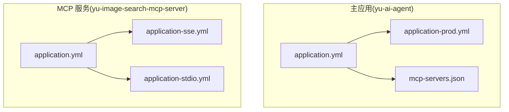
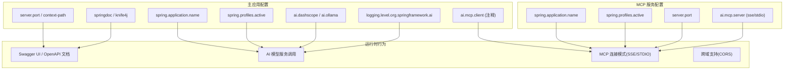
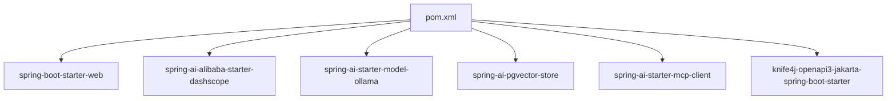

# 应用配置

<cite>
**本文引用的文件**
- [application.yml](file://src/main/resources/application.yml)
- [application-prod.yml](file://src/main/resources/application-prod.yml)
- [application.yml](file://yu-image-search-mcp-server/src/main/resources/application.yml)
- [application-sse.yml](file://yu-image-search-mcp-server/src/main/resources/application-sse.yml)
- [application-stdio.yml](file://yu-image-search-mcp-server/src/main/resources/application-stdio.yml)
- [mcp-servers.json](file://src/main/resources/mcp-servers.json)
- [pom.xml](file://pom.xml)
- [YuAiAgentApplication.java](file://src/main/java/com/yupi/yuaiagent/YuAiAgentApplication.java)
- [CorsConfig.java](file://src/main/java/com/yupi/yuaiagent/config/CorsConfig.java)
- [AiController.java](file://src/main/java/com/yupi/yuaiagent/controller/AiController.java)
</cite>

## 目录
1. [简介](#简介)
2. [项目结构](#项目结构)
3. [核心组件](#核心组件)
4. [架构总览](#架构总览)
5. [详细组件分析](#详细组件分析)
6. [依赖分析](#依赖分析)
7. [性能考虑](#性能考虑)
8. [故障排查指南](#故障排查指南)
9. [结论](#结论)
10. [附录](#附录)

## 简介
本文件聚焦于应用的配置体系，系统性梳理 Spring Boot 配置文件的结构与优先级、profiles 的作用与切换机制，并结合项目中的 application.yml 与 application-prod.yml 实例，详解服务器端口、上下文路径、Swagger/OpenAPI（knife4j）配置等基础应用设置。同时给出开发与生产环境的差异与最佳实践、配置文件组织结构、注释规范与版本管理建议，以及常见配置错误的排查方法与解决方案。

## 项目结构
本项目包含两个主要模块：
- 主应用：yu-ai-agent，负责聊天、RAG、工具调用等核心能力，配置位于 src/main/resources 下。
- MCP 服务：yu-image-search-mcp-server，独立运行的 MCP 服务，用于图像搜索工具链，配置位于其模块的 resources 下。

图表来源
- [application.yml:1-66](file://src/main/resources/application.yml#L1-L66)
- [application-prod.yml:1-2](file://src/main/resources/application-prod.yml#L1-L2)
- [application.yml:1-7](file://yu-image-search-mcp-server/src/main/resources/application.yml#L1-L7)
- [application-sse.yml:1-10](file://yu-image-search-mcp-server/src/main/resources/application-sse.yml#L1-L10)
- [application-stdio.yml:1-13](file://yu-image-search-mcp-server/src/main/resources/application-stdio.yml#L1-L13)

章节来源
- [application.yml:1-66](file://src/main/resources/application.yml#L1-L66)
- [application-prod.yml:1-2](file://src/main/resources/application-prod.yml#L1-L2)
- [application.yml:1-7](file://yu-image-search-mcp-server/src/main/resources/application.yml#L1-L7)
- [application-sse.yml:1-10](file://yu-image-search-mcp-server/src/main/resources/application-sse.yml#L1-L10)
- [application-stdio.yml:1-13](file://yu-image-search-mcp-server/src/main/resources/application-stdio.yml#L1-L13)

## 核心组件
- 配置文件与激活
  - 主应用默认激活本地开发配置，通过 profiles.active 字段指定当前环境。
  - 生产环境配置文件 application-prod.yml 为占位文件，用于覆盖或补充生产环境配置。
- 服务器与上下文路径
  - server.port 定义监听端口；server.servlet.context-path 定义上下文路径。
- Swagger/OpenAPI 与 Knife4j
  - springdoc.swagger-ui.path 与 springdoc.api-docs.path 定义 UI 与文档访问路径。
  - knife4j.enable 与 knife4j.setting.language 控制 Knife4j 的启用与语言。
- AI 与外部服务集成
  - ai.dashscope 与 ai.ollama 提供模型服务配置示例。
  - ai.mcp.client.sse 与 ai.mcp.client.stdio 为 MCP 客户端连接示例（被注释，便于开发）。
  - mcp-servers.json 中通过 JVM 参数控制 MCP 服务的 stdio 模式与 web 类型。
- 日志与调试
  - logging.level.org.springframework.ai 设置为 DEBUG，便于查看 Spring AI 调用细节。

章节来源
- [application.yml:1-66](file://src/main/resources/application.yml#L1-L66)
- [application-prod.yml:1-2](file://src/main/resources/application-prod.yml#L1-L2)
- [mcp-servers.json:1-25](file://src/main/resources/mcp-servers.json#L1-L25)

## 架构总览
下图展示配置在不同模块中的分布与相互关系，以及与运行时行为的映射。

图表来源
- [application.yml:1-66](file://src/main/resources/application.yml#L1-L66)
- [application.yml:1-7](file://yu-image-search-mcp-server/src/main/resources/application.yml#L1-L7)
- [application-sse.yml:1-10](file://yu-image-search-mcp-server/src/main/resources/application-sse.yml#L1-L10)
- [application-stdio.yml:1-13](file://yu-image-search-mcp-server/src/main/resources/application-stdio.yml#L1-L13)

## 详细组件分析

### 配置文件基本语法与优先级
- 基本语法
  - 使用缩进表达层级，键值对以冒号分隔，列表项使用短横线加空格。
  - 注释以 # 开头，便于临时屏蔽配置项。
- 配置优先级（从高到低）
  - 命令行参数（如 --server.port=8080）
  - 系统环境变量（如 SERVER_PORT=8080）
  - application-{profile}.yml（按激活顺序合并）
  - application.yml（基础配置）
  - 默认属性（spring-boot 默认值）
- 在本项目中
  - 主应用通过 profiles.active 指定当前激活的 profile（例如 local），对应 application-local.yml（若存在）。
  - 生产配置文件 application-prod.yml 用于覆盖生产环境敏感配置，避免硬编码到版本控制。

章节来源
- [application.yml:1-66](file://src/main/resources/application.yml#L1-L66)
- [application-prod.yml:1-2](file://src/main/resources/application-prod.yml#L1-L2)

### Profiles 的作用与切换机制
- 作用
  - 将与环境相关的内容（如数据库、日志、第三方密钥）隔离在不同文件中，便于维护与安全。
- 切换机制
  - 通过 spring.profiles.active 指定当前激活的 profile。
  - 可通过命令行参数或环境变量覆盖该值，实现动态切换。
- 示例
  - 主应用：profiles.active: local，表示激活本地开发配置。
  - MCP 服务：profiles.active: sse 或 stdio，分别对应 SSE 或 STDIO 模式的 MCP 服务配置。

章节来源
- [application.yml:4-5](file://src/main/resources/application.yml#L4-L5)
- [application.yml:4-5](file://yu-image-search-mcp-server/src/main/resources/application.yml#L4-L5)
- [application-sse.yml:1-10](file://yu-image-search-mcp-server/src/main/resources/application-sse.yml#L1-L10)
- [application-stdio.yml:1-13](file://yu-image-search-mcp-server/src/main/resources/application-stdio.yml#L1-L13)

### 服务器端口与上下文路径
- 端口与上下文路径
  - server.port：主应用监听端口为 8123。
  - server.servlet.context-path：上下文路径为 /api。
- 影响范围
  - Swagger UI 与 OpenAPI 文档的访问路径受此影响。
  - 前端代理或网关需据此转发请求。

章节来源
- [application.yml:38-41](file://src/main/resources/application.yml#L38-L41)

### Swagger/OpenAPI 与 Knife4j 配置
- 路径定义
  - springdoc.swagger-ui.path：Swagger UI 访问路径。
  - springdoc.api-docs.path：OpenAPI 文档 JSON 访问路径。
  - knife4j.enable：启用 Knife4j 增强 UI。
  - knife4j.setting.language：界面语言为简体中文。
- 包扫描与分组
  - springdoc.group-configs 配置了默认分组，匹配所有路径并扫描控制器包，确保接口文档完整呈现。

章节来源
- [application.yml:42-58](file://src/main/resources/application.yml#L42-L58)

### AI 与外部服务配置
- DashScope 与 Ollama
  - ai.dashscope.api-key：模型服务密钥占位。
  - ai.dashscope.chat.options.model：默认模型名称。
  - ai.ollama.base-url：本地推理服务地址。
  - ai.ollama.chat.model：本地模型名称。
- MCP 客户端（示例）
  - ai.mcp.client.sse 与 ai.mcp.client.stdio 为连接示例，当前被注释，便于开发阶段灵活切换。
- MCP 服务端配置
  - yu-image-search-mcp-server 的 application-sse.yml 与 application-stdio.yml 分别启用 SSE 与 STDIO 模式。
  - stdio 模式下关闭 Web 应用类型与 Banner 输出，适配 CLI 场景。

章节来源
- [application.yml:11-37](file://src/main/resources/application.yml#L11-L37)
- [application-sse.yml:1-10](file://yu-image-search-mcp-server/src/main/resources/application-sse.yml#L1-L10)
- [application-stdio.yml:1-13](file://yu-image-search-mcp-server/src/main/resources/application-stdio.yml#L1-L13)

### 日志与调试
- 日志级别
  - logging.level.org.springframework.ai 设置为 DEBUG，便于查看 Spring AI 的调用细节与参数。
- 建议
  - 开发环境可开启更详细的日志；生产环境建议调整为 INFO 或 WARN，避免泄露敏感信息。

章节来源
- [application.yml:64-66](file://src/main/resources/application.yml#L64-L66)

### 跨域配置（CORS）
- 全局跨域策略
  - 允许任意来源、允许凭证、放行常用方法与头部、暴露全部响应头。
- 适用场景
  - 前后端分离部署时，前端通过 /api 路由访问后端接口，需确保跨域配置生效。

章节来源
- [CorsConfig.java:10-25](file://src/main/java/com/yupi/yuaiagent/config/CorsConfig.java#L10-L25)

### SSE 与 MCP 连接示例
- SSE 接口
  - AiController 提供多种 SSE 接口，用于流式返回聊天结果。
- MCP 连接
  - mcp-servers.json 中通过 JVM 参数控制 MCP 服务的 stdio 模式与 web 类型，实现与主应用的协作。

章节来源
- [AiController.java:50-81](file://src/main/java/com/yupi/yuaiagent/controller/AiController.java#L50-L81)
- [mcp-servers.json:13-23](file://src/main/resources/mcp-servers.json#L13-L23)

## 依赖分析
- Maven 与 Spring Boot 版本
  - 项目基于 Spring Boot 3.4.4，Java 21。
- 关键依赖
  - spring-boot-starter-web：Web 服务。
  - spring-ai-alibaba-starter-dashscope：阿里云 DashScope 大模型接入。
  - spring-ai-starter-model-ollama：Ollama 本地模型接入。
  - spring-ai-pgvector-store：手动整合 PGVector 向量存储。
  - spring-ai-starter-mcp-client：MCP 客户端。
  - knife4j-openapi3-jakarta-spring-boot-starter：Knife4j 增强 UI。
- 仓库配置
  - 引入 Spring Milestones 与 Snapshots 仓库，确保能获取最新依赖。

图表来源
- [pom.xml:50-164](file://pom.xml#L50-L164)

章节来源
- [pom.xml:29-49](file://pom.xml#L29-L49)
- [pom.xml:50-164](file://pom.xml#L50-L164)

## 性能考虑
- 端口与上下文路径
  - 合理选择端口与上下文路径，避免与其他服务冲突，减少反向代理层的复杂度。
- 日志级别
  - 生产环境建议降低日志级别，避免过多 I/O 对吞吐的影响。
- Swagger/OpenAPI
  - 在生产环境可限制文档访问路径或仅在内网开放，减少不必要的暴露面。
- MCP 连接模式
  - SSE 适合浏览器直连，STDIO 适合 CLI 或进程间通信，按场景选择以获得更好性能与稳定性。

## 故障排查指南
- 端口占用
  - 现象：启动失败，提示端口已被占用。
  - 处理：修改 server.port 或释放占用端口。
  - 参考：[application.yml:38-41](file://src/main/resources/application.yml#L38-L41)
- 上下文路径不匹配
  - 现象：前端无法访问接口或 404。
  - 处理：确认前端代理或网关是否正确转发到 /api 前缀。
  - 参考：[application.yml:40-41](file://src/main/resources/application.yml#L40-L41)
- Swagger/UI 访问异常
  - 现象：无法打开 Swagger UI 或 OpenAPI 文档。
  - 处理：检查 springdoc.swagger-ui.path 与 springdoc.api-docs.path 是否与上下文路径一致。
  - 参考：[application.yml:42-50](file://src/main/resources/application.yml#L42-L50)
- AI 密钥或模型配置错误
  - 现象：调用 DashScope 或 Ollama 失败。
  - 处理：核对 ai.dashscope.api-key 与 ai.ollama.base-url、chat.model 是否正确。
  - 参考：[application.yml:11-21](file://src/main/resources/application.yml#L11-L21)
- MCP 连接失败
  - 现象：SSE/STDIO 连接异常。
  - 处理：确认 mcp-servers.json 中的 JVM 参数与 MCP 服务端配置一致；检查端口与网络可达性。
  - 参考：[mcp-servers.json:13-23](file://src/main/resources/mcp-servers.json#L13-L23)
- 跨域问题
  - 现象：浏览器报跨域错误。
  - 处理：确认 CORS 配置已生效，且允许的来源与方法满足前端需求。
  - 参考：[CorsConfig.java:10-25](file://src/main/java/com/yupi/yuaiagent/config/CorsConfig.java#L10-L25)

## 结论
本项目采用清晰的配置分层与 profiles 机制，将开发与生产环境配置解耦，配合 Swagger/Knife4j、AI 服务与 MCP 连接示例，形成完整的应用配置体系。建议在生产环境中严格区分敏感配置，使用环境变量或外部化配置管理，并遵循最小暴露原则与安全基线。

## 附录

### 开发与生产环境差异与最佳实践
- 差异点
  - 端口与上下文路径：开发环境可使用较低端口与简单路径，生产环境建议统一出口与网关路由。
  - AI 密钥与模型：开发环境使用示例密钥，生产环境使用真实密钥与稳定模型。
  - MCP 连接：开发阶段可注释连接示例，生产环境明确启用模式（SSE/STDIO）。
  - 日志级别：开发 DEBUG，生产 INFO/WARN。
- 最佳实践
  - 不将敏感信息提交到版本控制，使用环境变量或外部配置中心。
  - 使用 profiles.active 的命令行参数或环境变量进行动态切换。
  - 对外暴露的文档与 UI 仅在内网或受控环境下开放。

### 配置文件组织结构与注释规范
- 组织结构
  - application.yml：基础配置与默认值。
  - application-{profile}.yml：按环境划分的配置文件，如 application-prod.yml。
  - mcp-servers.json：MCP 服务的命令与参数配置，含 JVM 参数示例。
- 注释规范
  - 使用 # 注释，说明用途与注意事项，便于团队协作与维护。
  - 对敏感字段（如密钥）使用占位符并在注释中提醒替换。

### 版本管理建议
- 配置文件
  - application.yml 与 application-{profile}.yml 提交到版本控制，但不包含敏感信息。
  - application-prod.yml 作为模板文件，不在版本控制中提交真实敏感配置。
- 外部化配置
  - 使用环境变量或配置中心覆盖敏感配置，保证不同环境的一致性与安全性。