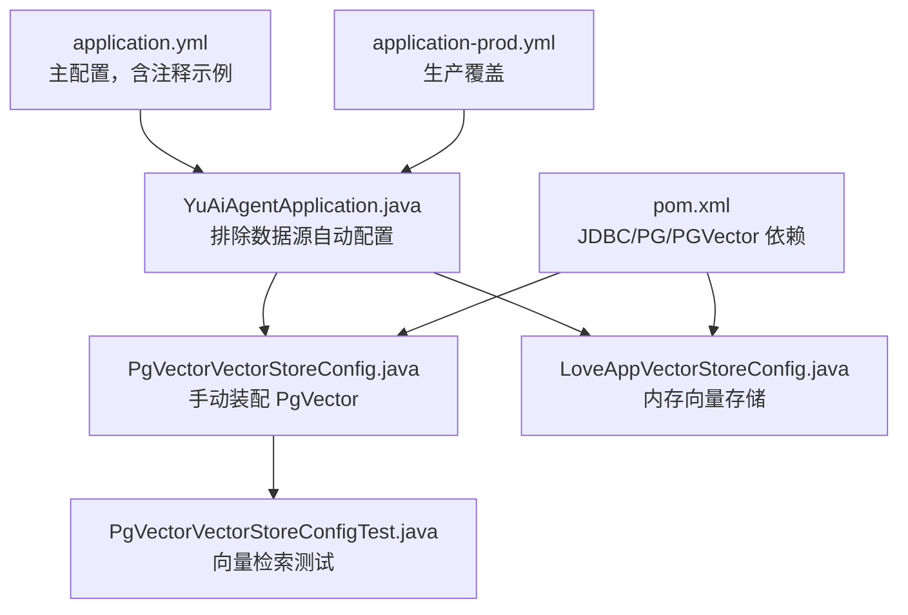
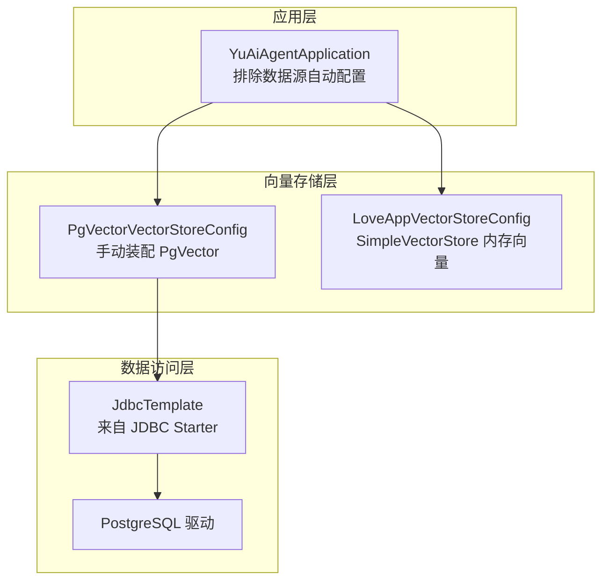
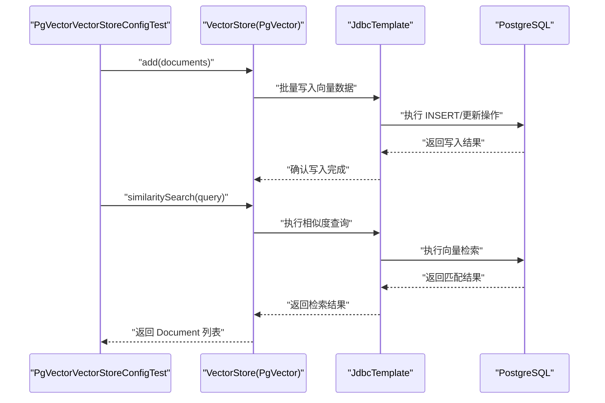
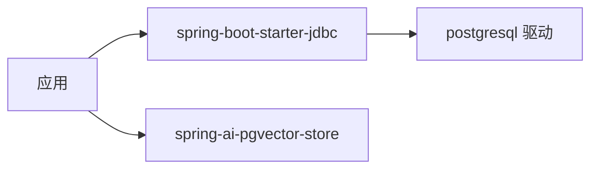

# 数据库配置

<cite>
**本文引用的文件**
- [application.yml](file://src/main/resources/application.yml)
- [application-prod.yml](file://src/main/resources/application-prod.yml)
- [PgVectorVectorStoreConfig.java](file://src/main/java/com/yupi/yuaiagent/rag/PgVectorVectorStoreConfig.java)
- [LoveAppVectorStoreConfig.java](file://src/main/java/com/yupi/yuaiagent/rag/LoveAppVectorStoreConfig.java)
- [YuAiAgentApplication.java](file://src/main/java/com/yupi/yuaiagent/YuAiAgentApplication.java)
- [pom.xml](file://pom.xml)
- [PgVectorVectorStoreConfigTest.java](file://src/test/java/com/yupi/yuaiagent/rag/PgVectorVectorStoreConfigTest.java)
- [application.yml（图像搜索MCP服务）](file://yu-image-search-mcp-server/src/main/resources/application.yml)
- [application-sse.yml（图像搜索MCP服务）](file://yu-image-search-mcp-server/src/main/resources/application-sse.yml)
</cite>

## 目录
1. [简介](#简介)
2. [项目结构](#项目结构)
3. [核心组件](#核心组件)
4. [架构总览](#架构总览)
5. [详细组件分析](#详细组件分析)
6. [依赖分析](#依赖分析)
7. [性能考虑](#性能考虑)
8. [故障排查指南](#故障排查指南)
9. [结论](#结论)
10. [附录](#附录)

## 简介
本指南围绕项目中的数据库与向量存储配置展开，重点说明以下内容：
- 数据源配置的关键参数（URL、用户名、密码等）在当前工程中的现状与启用方式
- 数据库驱动与连接池的依赖与默认行为
- PostgreSQL 与 PgVector 的配置要点、参数说明与性能优化建议
- 连接故障的诊断方法与常见问题解决方案
- 安全性考虑与最佳实践
- 配置文件中的注释示例与实际部署时的调整方法

说明：当前工程默认不启用传统关系型数据库的数据源自动配置，而是通过手动装配 JDBC 与 PgVector 组件实现向量检索能力。因此，数据源配置项在主配置文件中处于注释状态；如需启用传统数据源，请按“附录”指引进行调整。

## 项目结构
与数据库配置直接相关的文件与模块如下：
- 主应用配置：application.yml（包含注释示例与非数据库相关配置）
- 生产环境配置占位：application-prod.yml（用于覆盖敏感或环境差异）
- 应用入口排除数据源自动配置：YuAiAgentApplication.java
- 向量存储配置：
  - PgVectorVectorStoreConfig.java（手动装配 PgVector）
  - LoveAppVectorStoreConfig.java（内存向量存储，用于对比）
- Maven 依赖：pom.xml（包含 JDBC、PostgreSQL、PgVector 相关依赖）
- 测试：PgVectorVectorStoreConfigTest.java（验证向量检索流程）

图表来源
- [application.yml:1-66](file://src/main/resources/application.yml#L1-L66)
- [application-prod.yml:1-2](file://src/main/resources/application-prod.yml#L1-L2)
- [YuAiAgentApplication.java:1-18](file://src/main/java/com/yupi/yuaiagent/YuAiAgentApplication.java#L1-L18)
- [PgVectorVectorStoreConfig.java:1-41](file://src/main/java/com/yupi/yuaiagent/rag/PgVectorVectorStoreConfig.java#L1-L41)
- [LoveAppVectorStoreConfig.java:1-42](file://src/main/java/com/yupi/yuaiagent/rag/LoveAppVectorStoreConfig.java#L1-L42)
- [pom.xml:75-88](file://pom.xml#L75-L88)
- [PgVectorVectorStoreConfigTest.java:1-33](file://src/test/java/com/yupi/yuaiagent/rag/PgVectorVectorStoreConfigTest.java#L1-L33)

章节来源
- [application.yml:1-66](file://src/main/resources/application.yml#L1-L66)
- [application-prod.yml:1-2](file://src/main/resources/application-prod.yml#L1-L2)
- [YuAiAgentApplication.java:1-18](file://src/main/java/com/yupi/yuaiagent/YuAiAgentApplication.java#L1-L18)
- [pom.xml:75-88](file://pom.xml#L75-L88)

## 核心组件
- 数据源与连接池
  - 当前工程通过排除数据源自动配置的方式，默认不启用传统关系型数据库的数据源。
  - 如需启用，应在应用入口处移除对数据源自动配置的排除，并在配置文件中添加数据源参数（URL、用户名、密码等）。
- PostgreSQL 与 PgVector
  - 工程已引入 JDBC Starter、PostgreSQL 驱动与 PgVector Store 依赖，可直接使用 JdbcTemplate 与 PgVector 构建向量存储。
  - PgVector 配置示例位于向量存储配置类中，包含维度、距离类型、索引类型、表名、批大小等参数。
- 内存向量存储（对比参考）
  - 提供了基于 SimpleVectorStore 的内存向量存储配置，便于在本地或演示场景下快速验证检索逻辑。

章节来源
- [YuAiAgentApplication.java:7-10](file://src/main/java/com/yupi/yuaiagent/YuAiAgentApplication.java#L7-L10)
- [PgVectorVectorStoreConfig.java:24-39](file://src/main/java/com/yupi/yuaiagent/rag/PgVectorVectorStoreConfig.java#L24-L39)
- [LoveAppVectorStoreConfig.java:29-40](file://src/main/java/com/yupi/yuaiagent/rag/LoveAppVectorStoreConfig.java#L29-L40)
- [pom.xml:75-88](file://pom.xml#L75-L88)

## 架构总览
下图展示了当前工程的数据库与向量存储架构：应用通过排除数据源自动配置，转而使用手动装配的 JDBC 与 PgVector，实现向量检索功能；同时保留内存向量存储作为对比与演示。

图表来源
- [YuAiAgentApplication.java:7-10](file://src/main/java/com/yupi/yuaiagent/YuAiAgentApplication.java#L7-L10)
- [PgVectorVectorStoreConfig.java:24-39](file://src/main/java/com/yupi/yuaiagent/rag/PgVectorVectorStoreConfig.java#L24-L39)
- [LoveAppVectorStoreConfig.java:29-40](file://src/main/java/com/yupi/yuaiagent/rag/LoveAppVectorStoreConfig.java#L29-L40)
- [pom.xml:75-88](file://pom.xml#L75-L88)

## 详细组件分析

### 数据源与连接池配置
- 当前状态
  - 主配置文件中存在数据源参数的注释示例，表明这些参数在需要启用传统数据源时可被使用。
  - 应用入口排除了数据源自动配置，避免在未启用数据源的情况下加载相关 Bean。
- 启用步骤（如需使用传统数据源）
  - 在应用入口移除对数据源自动配置的排除，使 Spring Boot 自动加载数据源相关 Bean。
  - 在配置文件中取消数据源参数的注释，并填入正确的 URL、用户名、密码等。
  - 若需自定义连接池参数，可在配置文件中添加相应属性（例如连接数、超时时间等）。
- 参数说明（通用）
  - URL：数据库连接地址（含协议、主机、端口、数据库名、参数等）
  - 用户名：数据库访问用户
  - 密码：数据库访问密码
  - 其他：连接池大小、超时、SSL 等（根据所选连接池实现而定）

章节来源
- [application.yml:6-10](file://src/main/resources/application.yml#L6-L10)
- [YuAiAgentApplication.java:7-10](file://src/main/java/com/yupi/yuaiagent/YuAiAgentApplication.java#L7-L10)

### PostgreSQL 与 PgVector 配置
- 依赖与装配
  - Maven 依赖包含 JDBC Starter、PostgreSQL 驱动与 PgVector Store，确保运行时具备连接与向量存储能力。
  - 向量存储配置类通过 JdbcTemplate 与嵌入模型构建 PgVectorStore，并支持初始化模式、表名、索引类型、距离类型、维度、批大小等参数。
- 关键参数说明
  - 维度：向量维度（与嵌入模型一致）
  - 距离类型：向量相似度计算方式（如余弦距离）
  - 索引类型：索引算法（如 HNSW）
  - 表名：向量表名称
  - 批大小：批量写入的最大文档数量
  - 初始化模式：是否自动创建/迁移表结构
- 使用流程（简化）
  - 加载文档
  - 将文档写入向量存储
  - 基于查询进行相似度检索

图表来源
- [PgVectorVectorStoreConfigTest.java:20-31](file://src/test/java/com/yupi/yuaiagent/rag/PgVectorVectorStoreConfigTest.java#L20-L31)
- [PgVectorVectorStoreConfig.java:24-39](file://src/main/java/com/yupi/yuaiagent/rag/PgVectorVectorStoreConfig.java#L24-L39)
- [pom.xml:75-88](file://pom.xml#L75-L88)

章节来源
- [pom.xml:75-88](file://pom.xml#L75-L88)
- [PgVectorVectorStoreConfig.java:24-39](file://src/main/java/com/yupi/yuaiagent/rag/PgVectorVectorStoreConfig.java#L24-L39)
- [PgVectorVectorStoreConfigTest.java:20-31](file://src/test/java/com/yupi/yuaiagent/rag/PgVectorVectorStoreConfigTest.java#L20-L31)

### 内存向量存储（对比参考）
- 作用：在无需数据库的情况下，快速验证向量检索流程，适合本地开发与演示。
- 特点：基于 SimpleVectorStore，无需外部数据库，但不具备持久化能力。

章节来源
- [LoveAppVectorStoreConfig.java:29-40](file://src/main/java/com/yupi/yuaiagent/rag/LoveAppVectorStoreConfig.java#L29-L40)

### 配置文件注释示例与部署调整
- 注释示例
  - 主配置文件中包含数据源参数的注释示例，以及向量存储参数的注释示例，便于在启用时快速填充。
- 实际部署调整
  - 开发/测试：可保持注释状态，使用内存向量存储或注释掉的 PgVector 配置进行验证。
  - 生产/启用传统数据源：移除应用入口对数据源自动配置的排除，取消配置文件中数据源参数的注释并填入真实值。
  - 生产/启用 PgVector：取消向量存储配置类上的注释，确保依赖与参数正确。

章节来源
- [application.yml:6-38](file://src/main/resources/application.yml#L6-L38)
- [YuAiAgentApplication.java:7-10](file://src/main/java/com/yupi/yuaiagent/YuAiAgentApplication.java#L7-L10)
- [PgVectorVectorStoreConfig.java:17-18](file://src/main/java/com/yupi/yuaiagent/rag/PgVectorVectorStoreConfig.java#L17-L18)

## 依赖分析
- 核心依赖
  - JDBC Starter：提供 JdbcTemplate 等数据访问能力
  - PostgreSQL 驱动：提供 PostgreSQL 连接能力
  - PgVector Store：提供基于 PostgreSQL 的向量存储能力
- 依赖关系图

图表来源
- [pom.xml:75-88](file://pom.xml#L75-L88)

章节来源
- [pom.xml:75-88](file://pom.xml#L75-L88)

## 性能考虑
- PgVector 索引与距离
  - 合理选择索引类型（如 HNSW）与距离类型（如余弦距离），可显著提升检索效率与精度。
- 维度与表设计
  - 维度应与嵌入模型一致；表名与字段命名应清晰，便于维护。
- 批处理与写入
  - 合理设置最大文档批大小，平衡写入吞吐与内存占用。
- 连接池
  - 在启用传统数据源时，建议根据并发与资源情况配置连接池大小、空闲超时、最大等待时间等参数，避免连接争用与超时。
- 查询优化
  - 控制 topK 数量，避免一次性返回过多结果；必要时结合过滤条件与元数据筛选。

## 故障排查指南
- 无法连接数据库
  - 检查网络连通性与防火墙策略
  - 校验 URL、用户名、密码是否正确
  - 确认数据库服务已启动且监听端口可达
- PgVector 初始化失败
  - 确认数据库用户具备创建/修改表的权限
  - 检查初始化模式与表名是否冲突
  - 校验维度与距离类型是否与嵌入模型一致
- 向量检索结果异常
  - 确认文档已成功写入向量存储
  - 检查查询语句与检索参数（如 topK）
  - 对比内存向量存储与 PgVector 的差异，定位问题范围
- 单元测试失败
  - 参考测试用例的断言与流程，确认向量存储 Bean 是否正确装配

章节来源
- [PgVectorVectorStoreConfigTest.java:20-31](file://src/test/java/com/yupi/yuaiagent/rag/PgVectorVectorStoreConfigTest.java#L20-L31)
- [PgVectorVectorStoreConfig.java:24-39](file://src/main/java/com/yupi/yuaiagent/rag/PgVectorVectorStoreConfig.java#L24-L39)

## 结论
- 当前工程默认不启用传统数据源，而是通过手动装配 JDBC 与 PgVector 实现向量检索能力。
- 如需使用传统数据源，应移除应用入口对数据源自动配置的排除，并在配置文件中填入正确的数据源参数。
- PgVector 的配置可通过向量存储配置类进行参数化管理，建议结合业务场景合理设置维度、索引、距离与批大小。
- 在生产环境中，务必关注安全性与性能，采用最小权限原则与合理的连接池配置。

## 附录
- 启用传统数据源的步骤
  - 移除应用入口对数据源自动配置的排除
  - 在配置文件中取消数据源参数的注释并填入真实值
  - 如需自定义连接池参数，在配置文件中添加相应属性
- 启用 PgVector 的步骤
  - 取消向量存储配置类上的注释
  - 确保依赖与参数正确（维度、距离类型、索引类型、表名、批大小、初始化模式）
- 安全性最佳实践
  - 不要在版本控制中提交敏感配置
  - 使用环境变量或密钥管理服务注入敏感信息
  - 最小权限原则：数据库用户仅授予必要权限
  - 启用 SSL/TLS 连接，避免明文传输
- 配置文件示例位置
  - 主配置文件包含数据源与向量存储的注释示例，便于快速启用
  - 生产环境配置文件可用于覆盖敏感或环境差异

章节来源
- [application.yml:6-38](file://src/main/resources/application.yml#L6-L38)
- [application-prod.yml:1-2](file://src/main/resources/application-prod.yml#L1-L2)
- [YuAiAgentApplication.java:7-10](file://src/main/java/com/yupi/yuaiagent/YuAiAgentApplication.java#L7-L10)
- [PgVectorVectorStoreConfig.java:17-18](file://src/main/java/com/yupi/yuaiagent/rag/PgVectorVectorStoreConfig.java#L17-L18)