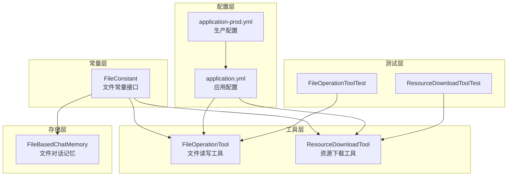
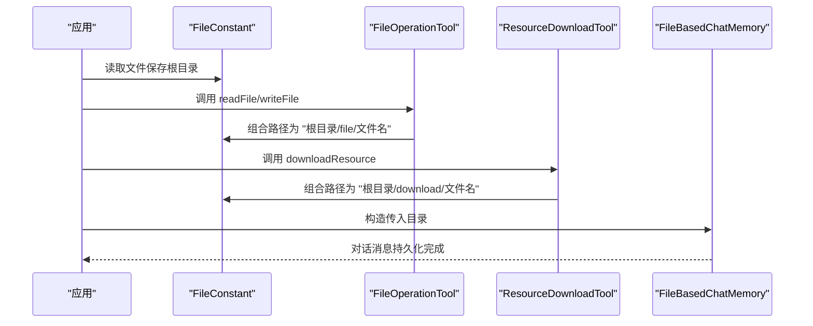
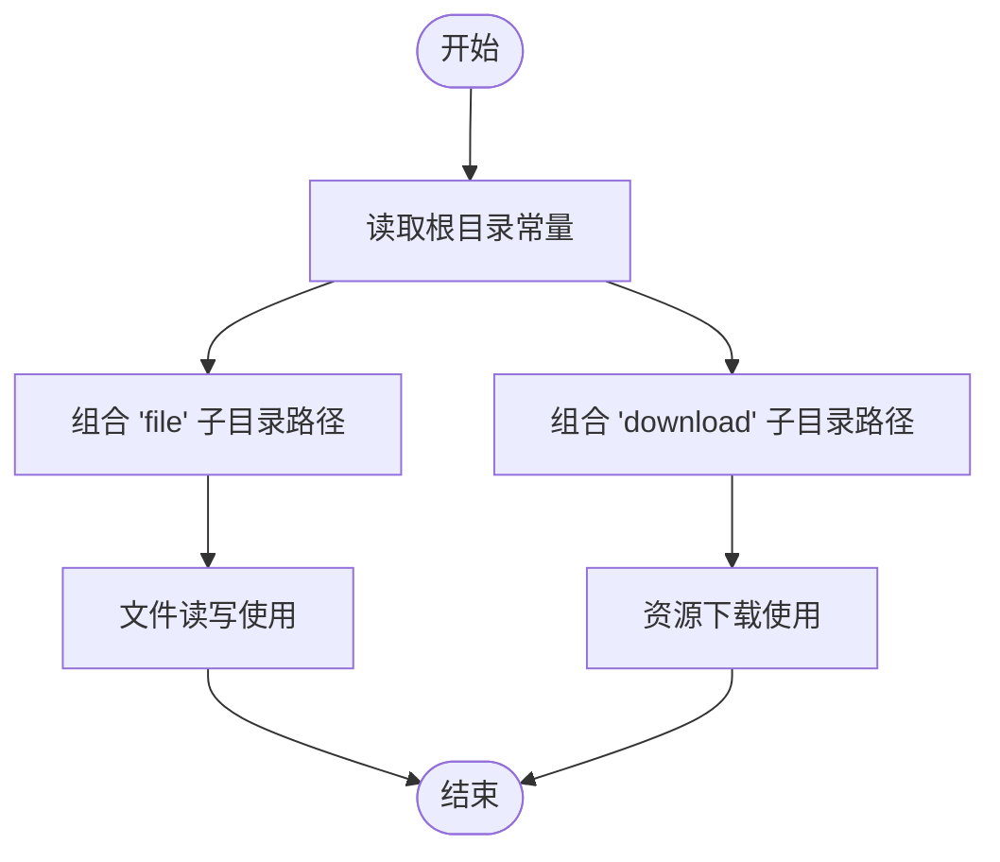
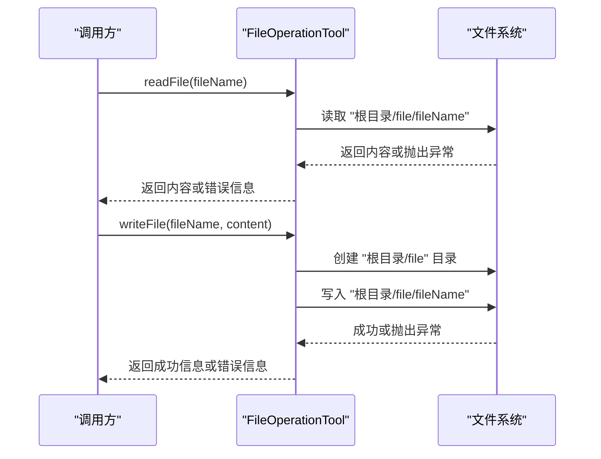
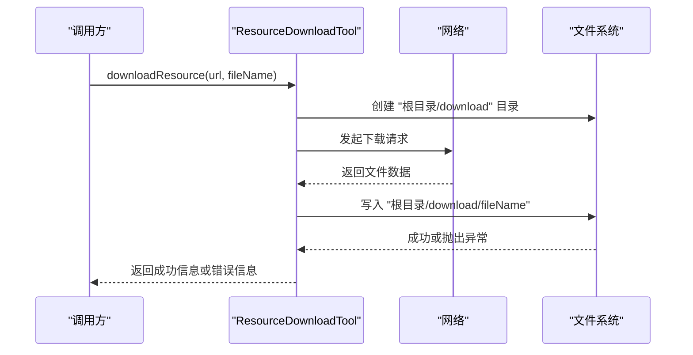
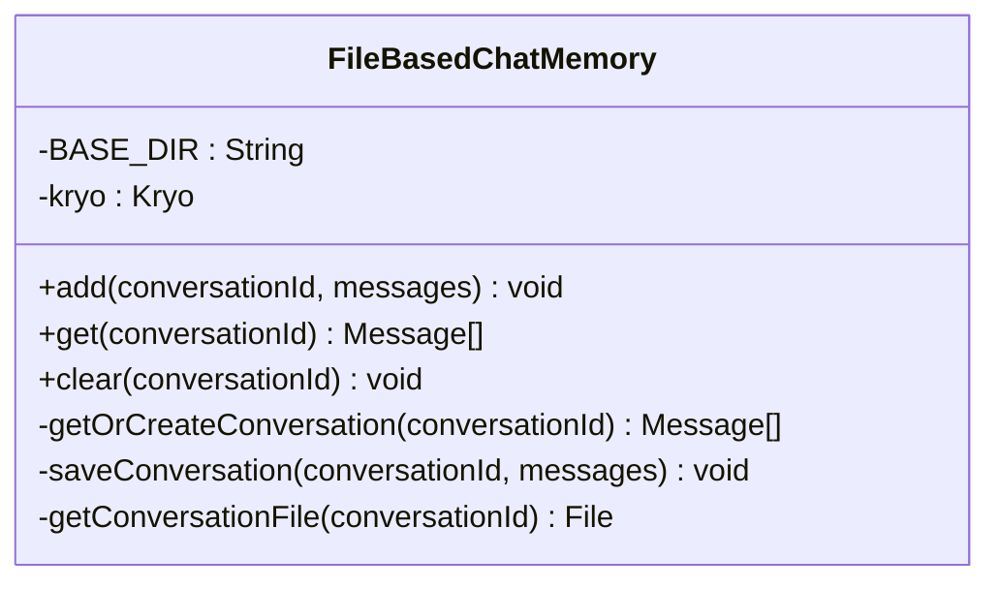
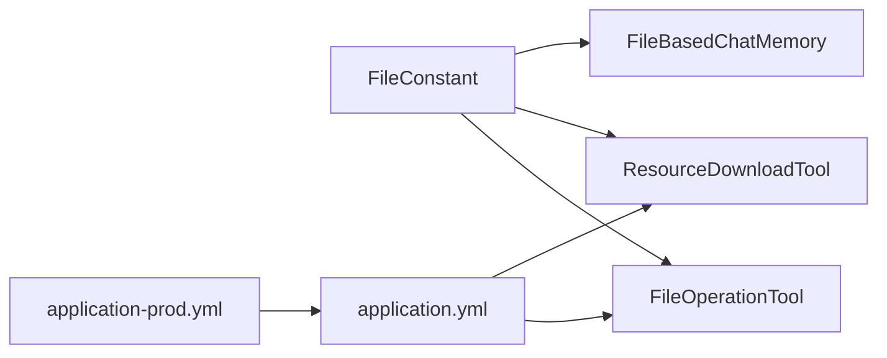

# 文件配置

<cite>
**本文引用的文件**
- [FileConstant.java](file://src/main/java/com/yupi/yuaiagent/constant/FileConstant.java)
- [FileOperationTool.java](file://src/main/java/com/yupi/yuaiagent/tools/FileOperationTool.java)
- [ResourceDownloadTool.java](file://src/main/java/com/yupi/yuaiagent/tools/ResourceDownloadTool.java)
- [FileBasedChatMemory.java](file://src/main/java/com/yupi/yuaiagent/chatmemory/FileBasedChatMemory.java)
- [application.yml](file://src/main/resources/application.yml)
- [application-prod.yml](file://src/main/resources/application-prod.yml)
- [FileOperationToolTest.java](file://src/test/java/com/yupi/yuaiagent/tools/FileOperationToolTest.java)
- [ResourceDownloadToolTest.java](file://src/test/java/com/yupi/yuaiagent/tools/ResourceDownloadToolTest.java)
- [LoveApp.java](file://src/main/java/com/yupi/yuaiagent/app/LoveApp.java)
</cite>

## 目录
1. [简介](#简介)
2. [项目结构](#项目结构)
3. [核心组件](#核心组件)
4. [架构总览](#架构总览)
5. [详细组件分析](#详细组件分析)
6. [依赖分析](#依赖分析)
7. [性能考量](#性能考量)
8. [故障排查指南](#故障排查指南)
9. [结论](#结论)
10. [附录](#附录)

## 简介
本文件聚焦于项目中的文件配置与处理机制，系统性说明以下方面：
- 文件常量与路径配置：重点解析 FileConstant 中的文件保存根目录常量及其在各组件中的使用方式。
- 文件上传、下载与存储：说明资源下载工具与文件读写工具的配置与行为。
- 类型限制、大小限制与安全检查：结合现有实现给出可扩展的配置建议。
- 临时文件与缓存文件管理策略：基于当前实现总结目录组织与清理建议。
- 错误处理与异常配置：梳理现有异常处理模式，并提出改进方向。
- 安全考虑与权限管理：从路径、访问控制、输入校验等维度给出实践建议。

## 项目结构
围绕文件配置与处理的关键文件分布如下：
- 常量层：FileConstant 提供统一的文件保存根目录常量。
- 工具层：FileOperationTool 提供文件读写；ResourceDownloadTool 提供远程资源下载。
- 存储层：FileBasedChatMemory 基于文件的对话记忆持久化。
- 配置层：application.yml 定义应用端口、上下文路径等运行参数；application-prod.yml 用于生产环境覆盖。
- 测试层：FileOperationToolTest、ResourceDownloadToolTest 提供基础功能验证。

**图表来源**
- [FileConstant.java:1-13](file://src/main/java/com/yupi/yuaiagent/constant/FileConstant.java#L1-L13)
- [FileOperationTool.java:1-41](file://src/main/java/com/yupi/yuaiagent/tools/FileOperationTool.java#L1-L41)
- [ResourceDownloadTool.java:1-31](file://src/main/java/com/yupi/yuaiagent/tools/ResourceDownloadTool.java#L1-L31)
- [FileBasedChatMemory.java:1-94](file://src/main/java/com/yupi/yuaiagent/chatmemory/FileBasedChatMemory.java#L1-L94)
- [application.yml:1-66](file://src/main/resources/application.yml#L1-L66)
- [application-prod.yml:1-2](file://src/main/resources/application-prod.yml#L1-L2)
- [FileOperationToolTest.java:1-27](file://src/test/java/com/yupi/yuaiagent/tools/FileOperationToolTest.java#L1-L27)
- [ResourceDownloadToolTest.java:1-18](file://src/test/java/com/yupi/yuaiagent/tools/ResourceDownloadToolTest.java#L1-L18)

**章节来源**
- [FileConstant.java:1-13](file://src/main/java/com/yupi/yuaiagent/constant/FileConstant.java#L1-L13)
- [FileOperationTool.java:1-41](file://src/main/java/com/yupi/yuaiagent/tools/FileOperationTool.java#L1-L41)
- [ResourceDownloadTool.java:1-31](file://src/main/java/com/yupi/yuaiagent/tools/ResourceDownloadTool.java#L1-L31)
- [FileBasedChatMemory.java:1-94](file://src/main/java/com/yupi/yuaiagent/chatmemory/FileBasedChatMemory.java#L1-L94)
- [application.yml:1-66](file://src/main/resources/application.yml#L1-L66)
- [application-prod.yml:1-2](file://src/main/resources/application-prod.yml#L1-L2)
- [FileOperationToolTest.java:1-27](file://src/test/java/com/yupi/yuaiagent/tools/FileOperationToolTest.java#L1-L27)
- [ResourceDownloadToolTest.java:1-18](file://src/test/java/com/yupi/yuaiagent/tools/ResourceDownloadToolTest.java#L1-L18)

## 核心组件
- 文件常量接口：提供统一的文件保存根目录常量，作为所有文件操作的基础路径前缀。
- 文件读写工具：封装文件读取与写入逻辑，自动创建目标目录并返回执行结果或错误信息。
- 资源下载工具：封装远程资源下载逻辑，自动创建目标目录并返回执行结果或错误信息。
- 文件对话记忆：基于 Kryo 的序列化存储，将对话消息持久化到文件，目录由构造函数传入。

**章节来源**
- [FileConstant.java:1-13](file://src/main/java/com/yupi/yuaiagent/constant/FileConstant.java#L1-L13)
- [FileOperationTool.java:1-41](file://src/main/java/com/yupi/yuaiagent/tools/FileOperationTool.java#L1-L41)
- [ResourceDownloadTool.java:1-31](file://src/main/java/com/yupi/yuaiagent/tools/ResourceDownloadTool.java#L1-L31)
- [FileBasedChatMemory.java:1-94](file://src/main/java/com/yupi/yuaiagent/chatmemory/FileBasedChatMemory.java#L1-L94)

## 架构总览
文件配置与处理的整体流程如下：
- 应用通过 FileConstant 获取统一的文件保存根目录。
- FileOperationTool 与 ResourceDownloadTool 在该根目录下分别创建“file”和“download”子目录，执行读写与下载。
- FileBasedChatMemory 接收外部传入的目录路径，用于持久化对话记忆。
- application.yml 定义服务器端口与上下文路径，影响文件访问入口；application-prod.yml 用于生产环境覆盖。

**图表来源**
- [FileConstant.java:1-13](file://src/main/java/com/yupi/yuaiagent/constant/FileConstant.java#L1-L13)
- [FileOperationTool.java:1-41](file://src/main/java/com/yupi/yuaiagent/tools/FileOperationTool.java#L1-L41)
- [ResourceDownloadTool.java:1-31](file://src/main/java/com/yupi/yuaiagent/tools/ResourceDownloadTool.java#L1-L31)
- [FileBasedChatMemory.java:1-94](file://src/main/java/com/yupi/yuaiagent/chatmemory/FileBasedChatMemory.java#L1-L94)

## 详细组件分析

### 文件常量与路径配置
- 文件保存根目录：由 FileConstant 提供统一的根目录常量，作为所有文件操作的基础路径前缀。
- 目录组织：工具与存储组件在此基础上创建子目录（如“file”、“download”）以隔离不同类型的文件。
- 运行时路径：根目录采用用户工作目录拼接“tmp”，便于本地开发与测试。

**图表来源**
- [FileConstant.java:1-13](file://src/main/java/com/yupi/yuaiagent/constant/FileConstant.java#L1-L13)
- [FileOperationTool.java:1-41](file://src/main/java/com/yupi/yuaiagent/tools/FileOperationTool.java#L1-L41)
- [ResourceDownloadTool.java:1-31](file://src/main/java/com/yupi/yuaiagent/tools/ResourceDownloadTool.java#L1-L31)

**章节来源**
- [FileConstant.java:1-13](file://src/main/java/com/yupi/yuaiagent/constant/FileConstant.java#L1-L13)

### 文件读写工具
- 功能职责：提供文件读取与写入能力，内部自动创建目标目录。
- 路径规则：在根目录下创建“file”子目录，文件名为传入的文件名。
- 异常处理：捕获异常并返回错误信息字符串，便于上层感知失败原因。

**图表来源**
- [FileOperationTool.java:1-41](file://src/main/java/com/yupi/yuaiagent/tools/FileOperationTool.java#L1-L41)

**章节来源**
- [FileOperationTool.java:1-41](file://src/main/java/com/yupi/yuaiagent/tools/FileOperationTool.java#L1-L41)
- [FileOperationToolTest.java:1-27](file://src/test/java/com/yupi/yuaiagent/tools/FileOperationToolTest.java#L1-L27)

### 资源下载工具
- 功能职责：从给定 URL 下载资源并保存到本地文件系统。
- 路径规则：在根目录下创建“download”子目录，文件名为传入的文件名。
- 异常处理：捕获异常并返回错误信息字符串，便于上层感知失败原因。

**图表来源**
- [ResourceDownloadTool.java:1-31](file://src/main/java/com/yupi/yuaiagent/tools/ResourceDownloadTool.java#L1-L31)

**章节来源**
- [ResourceDownloadTool.java:1-31](file://src/main/java/com/yupi/yuaiagent/tools/ResourceDownloadTool.java#L1-L31)
- [ResourceDownloadToolTest.java:1-18](file://src/test/java/com/yupi/yuaiagent/tools/ResourceDownloadToolTest.java#L1-L18)

### 文件对话记忆
- 功能职责：基于 Kryo 对消息列表进行序列化与反序列化，实现对话记忆的文件持久化。
- 目录管理：构造函数接收外部传入的目录路径，若不存在则自动创建。
- 文件命名：以会话 ID 为文件名，后缀为“.kryo”。

**图表来源**
- [FileBasedChatMemory.java:1-94](file://src/main/java/com/yupi/yuaiagent/chatmemory/FileBasedChatMemory.java#L1-L94)

**章节来源**
- [FileBasedChatMemory.java:1-94](file://src/main/java/com/yupi/yuaiagent/chatmemory/FileBasedChatMemory.java#L1-L94)
- [LoveApp.java:40-62](file://src/main/java/com/yupi/yuaiagent/app/LoveApp.java#L40-L62)

## 依赖分析
- FileConstant 为工具与存储组件提供统一的根目录常量，降低耦合度。
- FileOperationTool 与 ResourceDownloadTool 依赖 FileConstant 的根目录常量，分别在“file”和“download”子目录下进行文件操作。
- FileBasedChatMemory 通过构造函数接收目录路径，不直接依赖 FileConstant，但可与之配合使用。
- application.yml 与 application-prod.yml 提供运行时配置，影响文件访问入口与日志级别。

**图表来源**
- [FileConstant.java:1-13](file://src/main/java/com/yupi/yuaiagent/constant/FileConstant.java#L1-L13)
- [FileOperationTool.java:1-41](file://src/main/java/com/yupi/yuaiagent/tools/FileOperationTool.java#L1-L41)
- [ResourceDownloadTool.java:1-31](file://src/main/java/com/yupi/yuaiagent/tools/ResourceDownloadTool.java#L1-L31)
- [FileBasedChatMemory.java:1-94](file://src/main/java/com/yupi/yuaiagent/chatmemory/FileBasedChatMemory.java#L1-L94)
- [application.yml:1-66](file://src/main/resources/application.yml#L1-L66)
- [application-prod.yml:1-2](file://src/main/resources/application-prod.yml#L1-L2)

**章节来源**
- [FileConstant.java:1-13](file://src/main/java/com/yupi/yuaiagent/constant/FileConstant.java#L1-L13)
- [FileOperationTool.java:1-41](file://src/main/java/com/yupi/yuaiagent/tools/FileOperationTool.java#L1-L41)
- [ResourceDownloadTool.java:1-31](file://src/main/java/com/yupi/yuaiagent/tools/ResourceDownloadTool.java#L1-L31)
- [FileBasedChatMemory.java:1-94](file://src/main/java/com/yupi/yuaiagent/chatmemory/FileBasedChatMemory.java#L1-L94)
- [application.yml:1-66](file://src/main/resources/application.yml#L1-L66)
- [application-prod.yml:1-2](file://src/main/resources/application-prod.yml#L1-L2)

## 性能考量
- I/O 模式：文件读写与下载均为同步阻塞 I/O，适合小规模或低并发场景。
- 目录创建：工具在每次操作前都会尝试创建目标目录，避免重复创建可减少开销。
- 序列化成本：FileBasedChatMemory 使用 Kryo 进行序列化，具备较好的性能表现，但需注意消息对象的复杂度与数量。
- 缓存策略：当前未见专用缓存层，建议在高频读取场景引入内存缓存或 LRU 策略以减轻磁盘压力。

## 故障排查指南
- 文件读取失败：检查文件是否存在、路径是否正确、权限是否允许读取。
- 文件写入失败：检查目标目录是否存在且具备写权限，确认磁盘空间充足。
- 资源下载失败：检查网络连通性、URL 是否有效、目标目录权限。
- 对话记忆读取异常：检查“.kryo”文件完整性与序列化版本兼容性。
- 日志级别：可通过 application.yml 调整日志级别以便定位问题。

**章节来源**
- [FileOperationTool.java:1-41](file://src/main/java/com/yupi/yuaiagent/tools/FileOperationTool.java#L1-L41)
- [ResourceDownloadTool.java:1-31](file://src/main/java/com/yupi/yuaiagent/tools/ResourceDownloadTool.java#L1-L31)
- [FileBasedChatMemory.java:1-94](file://src/main/java/com/yupi/yuaiagent/chatmemory/FileBasedChatMemory.java#L1-L94)
- [application.yml:64-66](file://src/main/resources/application.yml#L64-L66)

## 结论
本项目的文件配置以 FileConstant 为核心，通过统一的根目录常量协调文件读写、资源下载与对话记忆的持久化。当前实现简洁明确，适合开发与测试阶段使用。为进一步提升安全性与稳定性，建议在后续版本中增加文件类型与大小限制、输入校验与访问控制，并引入缓存与清理策略。

## 附录

### 文件类型限制、大小限制与安全检查（配置建议）
- 文件类型限制：在工具层增加白名单校验，仅允许受信任的扩展名（如 txt、pdf、png 等），拒绝可疑类型。
- 大小限制：在下载与写入前检查文件大小阈值，超过阈值则拒绝操作并返回明确错误。
- 安全检查：对文件名进行路径规范化处理，防止目录穿越攻击；对输入进行长度与字符集校验。
- 权限控制：确保根目录仅授予必要权限；在容器化部署时挂载只读或受限卷。

### 临时文件与缓存文件管理策略
- 临时文件：将临时文件集中存放于根目录下的独立子目录，定期清理过期文件。
- 缓存文件：针对频繁读取的数据建立缓存层，结合 TTL 与容量上限控制内存占用。
- 清理策略：制定定时任务或事件驱动的清理机制，避免磁盘空间被占满。

### 错误处理与异常配置方案
- 统一异常包装：将底层异常转换为业务友好的错误信息，保留必要的堆栈摘要。
- 分级告警：区分可恢复与不可恢复错误，对可恢复错误进行重试，对不可恢复错误记录并上报。
- 日志规范：在 application.yml 中设置合适的日志级别，便于问题定位与审计。