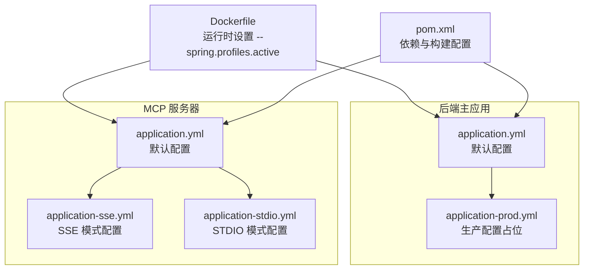
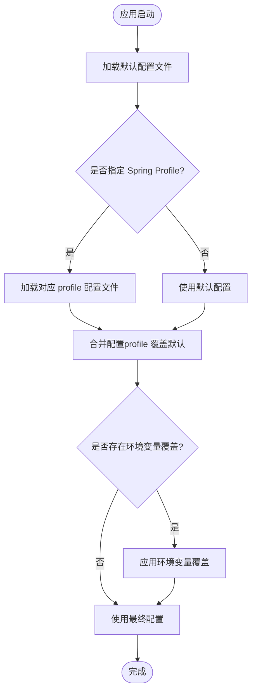
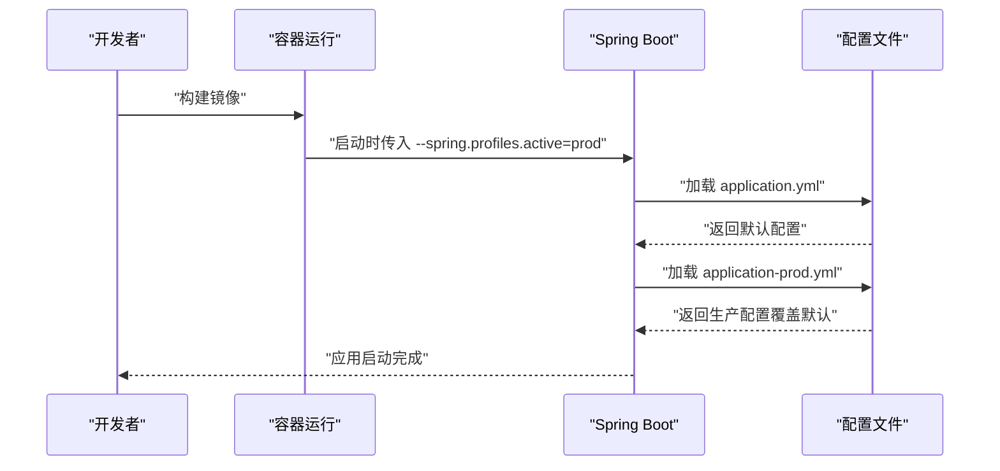
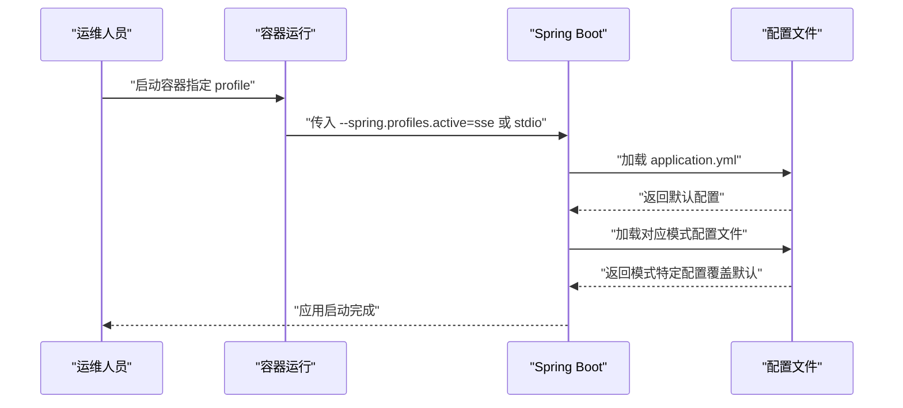
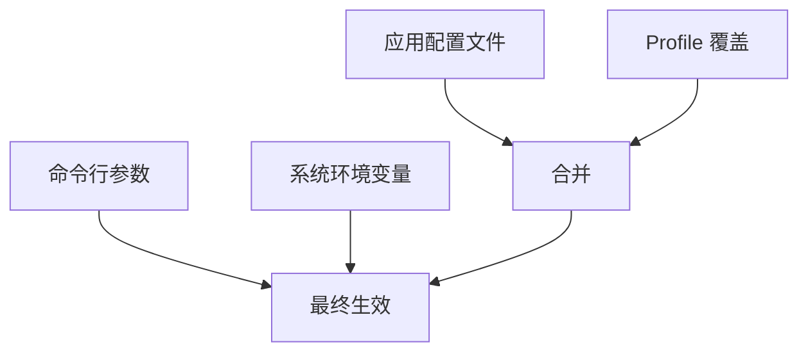
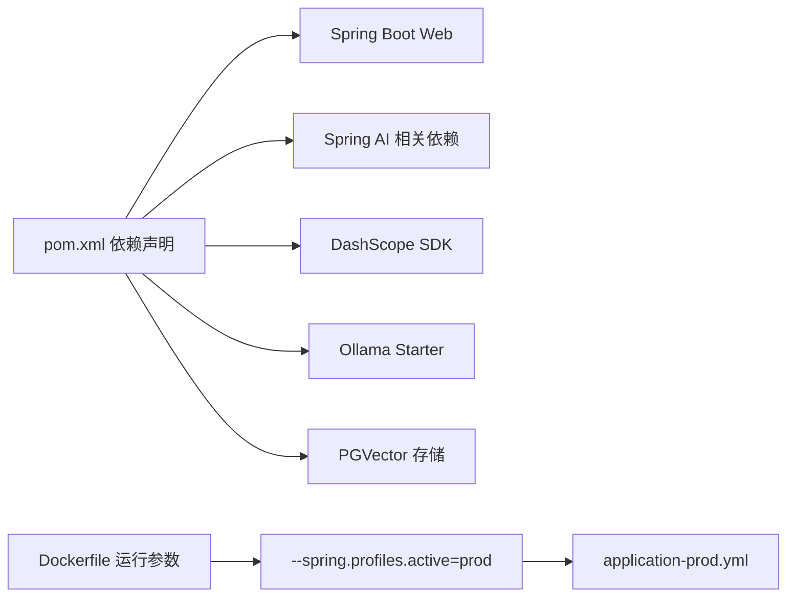

# 环境变量管理

<cite>
**本文档引用的文件**
- [application.yml](file://src/main/resources/application.yml)
- [application-prod.yml](file://src/main/resources/application-prod.yml)
- [application.yml](file://yu-image-search-mcp-server/src/main/resources/application.yml)
- [application-sse.yml](file://yu-image-search-mcp-server/src/main/resources/application-sse.yml)
- [application-stdio.yml](file://yu-image-search-mcp-server/src/main/resources/application-stdio.yml)
- [Dockerfile](file://Dockerfile)
- [pom.xml](file://pom.xml)
</cite>

## 目录
1. [简介](#简介)
2. [项目结构](#项目结构)
3. [核心组件](#核心组件)
4. [架构总览](#架构总览)
5. [详细组件分析](#详细组件分析)
6. [依赖关系分析](#依赖关系分析)
7. [性能考量](#性能考量)
8. [故障排查指南](#故障排查指南)
9. [结论](#结论)
10. [附录](#附录)

## 简介
本指南围绕项目中的环境变量管理实践展开，重点说明以下方面：
- 如何在配置文件中引用环境变量
- 开发、测试、生产环境的配置策略
- 敏感信息的管理与安全注意事项
- 环境变量的命名规范与组织结构建议
- 调试方法与常见问题排查
- 配置文件与环境变量的优先级与覆盖规则

当前代码库主要通过 Spring Boot 的配置文件进行参数管理，并在 Docker 构建与运行时通过命令行参数激活不同配置文件。从现有文件可见，尚未直接使用占位符形式的环境变量引用语法；但已具备通过 profile 切换与 Docker 参数激活配置的基础能力。

## 项目结构
项目采用多模块结构，后端主应用与独立的 MCP 服务器分别拥有各自的配置文件与 profile。Dockerfile 在运行时通过 JVM 参数指定 Spring Profile，从而加载对应配置文件。

图表来源
- [application.yml:1-66](file://src/main/resources/application.yml#L1-L66)
- [application-prod.yml:1-2](file://src/main/resources/application-prod.yml#L1-L2)
- [application.yml:1-7](file://yu-image-search-mcp-server/src/main/resources/application.yml#L1-L7)
- [application-sse.yml:1-10](file://yu-image-search-mcp-server/src/main/resources/application-sse.yml#L1-L10)
- [application-stdio.yml:1-13](file://yu-image-search-mcp-server/src/main/resources/application-stdio.yml#L1-L13)
- [Dockerfile:1-16](file://Dockerfile#L1-L16)
- [pom.xml:1-227](file://pom.xml#L1-L227)

章节来源
- [application.yml:1-66](file://src/main/resources/application.yml#L1-L66)
- [application-prod.yml:1-2](file://src/main/resources/application-prod.yml#L1-L2)
- [application.yml:1-7](file://yu-image-search-mcp-server/src/main/resources/application.yml#L1-L7)
- [application-sse.yml:1-10](file://yu-image-search-mcp-server/src/main/resources/application-sse.yml#L1-L10)
- [application-stdio.yml:1-13](file://yu-image-search-mcp-server/src/main/resources/application-stdio.yml#L1-L13)
- [Dockerfile:1-16](file://Dockerfile#L1-L16)
- [pom.xml:1-227](file://pom.xml#L1-L227)

## 核心组件
- 配置文件体系：主应用与 MCP 服务器均提供默认配置文件与按模式分离的配置文件，用于承载非敏感参数与模式切换。
- Profile 激活：通过 Docker CMD 中的 JVM 参数激活目标 profile，实现开发/生产等环境的快速切换。
- 依赖与构建：pom.xml 定义了 Spring AI、DashScope、Ollama 等相关依赖，为后续在配置中注入外部服务凭据提供基础。

章节来源
- [application.yml:1-66](file://src/main/resources/application.yml#L1-L66)
- [application.yml:1-7](file://yu-image-search-mcp-server/src/main/resources/application.yml#L1-L7)
- [Dockerfile:1-16](file://Dockerfile#L1-L16)
- [pom.xml:50-164](file://pom.xml#L50-L164)

## 架构总览
下图展示了配置加载与环境变量的关系：默认配置文件作为基线，通过 profile 文件进行覆盖；运行时通过 JVM 参数选择 profile；如需引入环境变量，可在 profile 文件中使用占位符语法进行引用。

图表来源
- [application.yml:1-66](file://src/main/resources/application.yml#L1-L66)
- [application-prod.yml:1-2](file://src/main/resources/application-prod.yml#L1-L2)
- [application.yml:1-7](file://yu-image-search-mcp-server/src/main/resources/application.yml#L1-L7)
- [application-sse.yml:1-10](file://yu-image-search-mcp-server/src/main/resources/application-sse.yml#L1-L10)
- [application-stdio.yml:1-13](file://yu-image-search-mcp-server/src/main/resources/application-stdio.yml#L1-L13)
- [Dockerfile](file://Dockerfile#L16)

## 详细组件分析

### 主应用配置与 Profile 策略
- 默认配置文件包含应用名称、AI 服务参数（如 DashScope、Ollama）、服务端口、OpenAPI 文档路径等。
- 生产配置文件为占位文件，建议仅存放生产专用且不包含敏感信息的参数，敏感信息应通过环境变量注入。
- Docker 运行时通过 JVM 参数激活 prod profile，实现一键切换生产配置。

图表来源
- [application.yml:1-66](file://src/main/resources/application.yml#L1-L66)
- [application-prod.yml:1-2](file://src/main/resources/application-prod.yml#L1-L2)
- [Dockerfile](file://Dockerfile#L16)

章节来源
- [application.yml:1-66](file://src/main/resources/application.yml#L1-L66)
- [application-prod.yml:1-2](file://src/main/resources/application-prod.yml#L1-L2)
- [Dockerfile](file://Dockerfile#L16)

### MCP 服务器配置与模式切换
- 默认配置文件定义应用名称与激活的 profile。
- SSE 与 STDIO 两种模式通过独立的 profile 文件控制 MCP 通信方式。
- 通过修改 JVM 参数可切换至对应模式，实现不同运行场景下的配置覆盖。

图表来源
- [application.yml:1-7](file://yu-image-search-mcp-server/src/main/resources/application.yml#L1-L7)
- [application-sse.yml:1-10](file://yu-image-search-mcp-server/src/main/resources/application-sse.yml#L1-L10)
- [application-stdio.yml:1-13](file://yu-image-search-mcp-server/src/main/resources/application-stdio.yml#L1-L13)

章节来源
- [application.yml:1-7](file://yu-image-search-mcp-server/src/main/resources/application.yml#L1-L7)
- [application-sse.yml:1-10](file://yu-image-search-mcp-server/src/main/resources/application-sse.yml#L1-L10)
- [application-stdio.yml:1-13](file://yu-image-search-mcp-server/src/main/resources/application-stdio.yml#L1-L13)

### 配置文件与环境变量的优先级与覆盖规则
- Spring Boot 遵循标准的配置优先级顺序（从高到低）：命令行参数 > 系统环境变量 > 应用配置文件（含 profile 覆盖）。因此，若在 profile 文件中使用占位符语法引用环境变量，其值将被系统环境变量覆盖。
- 当前仓库未在配置文件中使用占位符语法，建议后续在 profile 文件中以占位符形式引用环境变量，再通过系统环境变量注入具体值，从而实现“默认值+可覆盖”的灵活配置。

图表来源
- [application.yml:1-66](file://src/main/resources/application.yml#L1-L66)
- [application-prod.yml:1-2](file://src/main/resources/application-prod.yml#L1-L2)
- [application.yml:1-7](file://yu-image-search-mcp-server/src/main/resources/application.yml#L1-L7)
- [application-sse.yml:1-10](file://yu-image-search-mcp-server/src/main/resources/application-sse.yml#L1-L10)
- [application-stdio.yml:1-13](file://yu-image-search-mcp-server/src/main/resources/application-stdio.yml#L1-L13)
- [Dockerfile](file://Dockerfile#L16)

## 依赖关系分析
- 主应用依赖 Spring Boot Web、Spring AI、DashScope SDK、Ollama Starter、PGVector 存储等，这些依赖为后续在配置中注入外部服务密钥与地址提供了基础。
- Dockerfile 在运行时通过 JVM 参数激活 prod profile，确保生产环境使用生产配置文件。

图表来源
- [pom.xml:50-164](file://pom.xml#L50-L164)
- [Dockerfile](file://Dockerfile#L16)

章节来源
- [pom.xml:50-164](file://pom.xml#L50-L164)
- [Dockerfile](file://Dockerfile#L16)

## 性能考量
- 将敏感信息移出配置文件并通过环境变量注入，有助于减少配置文件体积与避免不必要的磁盘读取。
- 使用 profile 分离配置可降低启动时的合并成本，同时便于在不同环境中快速切换。
- 对于频繁变更的参数（如服务地址、超时时间），建议通过环境变量覆盖，避免重复打包与发布。

## 故障排查指南
- 症状：应用启动后未加载预期的生产配置
  - 排查要点：确认 Docker CMD 是否正确传入 --spring.profiles.active=prod；确认 application-prod.yml 是否存在且未被忽略。
  - 参考路径：[Dockerfile](file://Dockerfile#L16)、[application-prod.yml:1-2](file://src/main/resources/application-prod.yml#L1-L2)
- 症状：MCP 服务器无法连接到期望的通信方式
  - 排查要点：确认 JVM 参数是否指向正确的 profile（sse 或 stdio）；核对对应 profile 文件中的 MCP 配置项。
  - 参考路径：[application.yml:1-7](file://yu-image-search-mcp-server/src/main/resources/application.yml#L1-L7)、[application-sse.yml:1-10](file://yu-image-search-mcp-server/src/main/resources/application-sse.yml#L1-L10)、[application-stdio.yml:1-13](file://yu-image-search-mcp-server/src/main/resources/application-stdio.yml#L1-L13)
- 症状：配置未按预期被环境变量覆盖
  - 排查要点：确认环境变量名称与 Spring Boot 的属性映射一致；确认环境变量在应用启动前已设置；确认未被命令行参数提前覆盖。
  - 参考路径：[application.yml:1-66](file://src/main/resources/application.yml#L1-L66)

## 结论
- 当前项目通过 profile 与 Docker 参数实现了环境切换，但尚未启用环境变量占位符机制。
- 建议在 profile 文件中使用占位符引用环境变量，并通过系统环境变量注入具体值，结合命令行参数实现“默认值+可覆盖”的配置策略。
- 对于敏感信息，务必通过环境变量注入，避免硬编码在配置文件中。

## 附录

### 在配置文件中引用环境变量的方法
- 在 profile 文件中使用占位符语法引用环境变量，例如：
  - 在 application.yml 中添加占位符项
  - 在 application-prod.yml 中添加对应占位符项
- 通过系统环境变量或 Docker 环境变量注入具体值，实现“默认值+可覆盖”的配置策略

章节来源
- [application.yml:1-66](file://src/main/resources/application.yml#L1-L66)
- [application-prod.yml:1-2](file://src/main/resources/application-prod.yml#L1-L2)

### 开发、测试、生产环境的配置策略
- 开发环境：使用默认配置文件，必要时通过命令行参数临时覆盖个别参数
- 测试环境：可复用默认配置文件，通过环境变量注入测试所需的外部服务凭据
- 生产环境：通过 Docker 运行时设置 --spring.profiles.active=prod，加载生产配置文件，并通过环境变量注入敏感信息

章节来源
- [Dockerfile](file://Dockerfile#L16)
- [application.yml:1-66](file://src/main/resources/application.yml#L1-L66)
- [application-prod.yml:1-2](file://src/main/resources/application-prod.yml#L1-L2)

### 敏感信息的环境变量管理与安全考虑
- 不要在配置文件中保存敏感信息（如 API Key、数据库密码）
- 通过环境变量注入敏感信息，确保配置文件不包含明文敏感数据
- 在 CI/CD 中使用受控的密钥管理服务注入环境变量
- 对于需要在本地开发使用的敏感信息，建议通过 .env 文件或 IDE 的环境变量配置工具管理，避免提交到版本库

### 环境变量命名规范与组织结构建议
- 命名规范：使用全大写与下划线分隔，如 ENV_NAME、SPRING_PROFILES_ACTIVE
- 组织结构：按功能域分组，如 AI_DASHSCOPE_API_KEY、DATABASE_URL、OLLAMA_BASE_URL
- 属性映射：Spring Boot 支持将环境变量映射到配置属性，遵循驼峰转点号的规则

### 调试方法与常见问题排查
- 启用调试日志：在配置文件中调整日志级别，查看 Spring AI 的调用细节
- 验证覆盖顺序：通过命令行参数、环境变量与配置文件的组合验证最终生效的配置
- 核对 profile 切换：确认 JVM 参数与实际加载的 profile 文件一致

章节来源
- [application.yml:64-66](file://src/main/resources/application.yml#L64-L66)