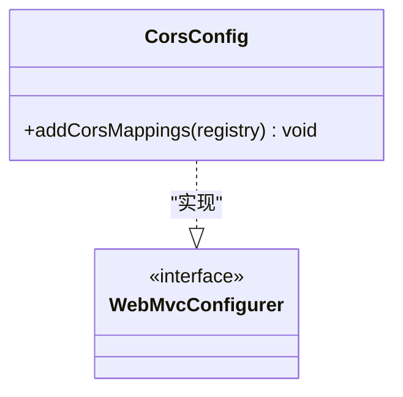
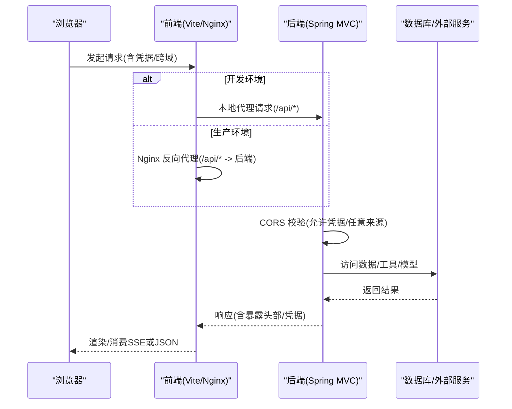
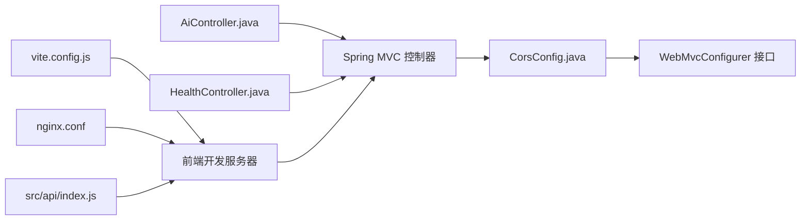

# 跨域配置

<cite>
**本文引用的文件**
- [CorsConfig.java](file://src/main/java/com/yupi/yuaiagent/config/CorsConfig.java)
- [application.yml](file://src/main/resources/application.yml)
- [application-prod.yml](file://src/main/resources/application-prod.yml)
- [AiController.java](file://src/main/java/com/yupi/yuaiagent/controller/AiController.java)
- [HealthController.java](file://src/main/java/com/yupi/yuaiagent/controller/HealthController.java)
- [index.js](file://yu-ai-agent-frontend/src/api/index.js)
- [vite.config.js](file://yu-ai-agent-frontend/vite.config.js)
- [nginx.conf](file://yu-ai-agent-frontend/nginx.conf)
- [nginx.conf](file://yu-ai-agent-frontend/nginx.conf)
</cite>

## 目录
1. [简介](#简介)
2. [项目结构与跨域相关组件](#项目结构与跨域相关组件)
3. [核心组件：CorsConfig 类详解](#核心组件corsconfig-类详解)
4. [架构总览](#架构总览)
5. [详细组件分析](#详细组件分析)
6. [依赖关系分析](#依赖关系分析)
7. [性能与安全考量](#性能与安全考量)
8. [故障排查指南](#故障排查指南)
9. [结论](#结论)
10. [附录](#附录)

## 简介
本指南围绕本项目的跨域配置展开，系统性讲解 CORS（跨域资源共享）的实现原理、配置方法、安全最佳实践、预检请求处理、以及开发与生产环境的差异。重点基于后端 Spring MVC 的全局 CORS 配置类与前端 Vite/Nginx 的代理/反向代理设置，结合后端控制器暴露的 SSE 接口，给出可操作的配置建议与排障思路。

## 项目结构与跨域相关组件
- 后端 Spring Boot 应用通过全局 CORS 配置类统一放行跨域请求，并允许携带凭据（Cookie）。
- 前端开发环境使用 Vite 的内置服务器，默认开启跨域支持；生产环境通过 Nginx 进行反向代理，避免浏览器同源限制。
- 控制器层提供 SSE 接口，用于流式响应，需确保跨域与长连接配置正确。

```mermaid
graph TB
FE["前端应用<br/>Vite 开发服务器/Nginx"] --> |HTTP(S) 请求| BE["Spring Boot 后端<br/>CORS + 控制器"]
BE --> |SSE/JSON| FE
subgraph "后端"
CC["CorsConfig.java<br/>全局 CORS 配置"]
AC["AiController.java<br/>SSE/REST 控制器"]
HC["HealthController.java<br/>健康检查"]
end
subgraph "前端"
VCFG["vite.config.js<br/>开发服务器跨域"]
NCONF["nginx.conf<br/>生产反向代理"]
API["src/api/index.js<br/>Axios/SSE 客户端"]
end
CC --> BE
AC --> BE
HC --> BE
VCFG --> FE
NCONF --> FE
API --> FE
```

图表来源
- [CorsConfig.java:10-25](file://src/main/java/com/yupi/yuaiagent/config/CorsConfig.java#L10-L25)
- [AiController.java:18-105](file://src/main/java/com/yupi/yuaiagent/controller/AiController.java#L18-L105)
- [HealthController.java:7-15](file://src/main/java/com/yupi/yuaiagent/controller/HealthController.java#L7-L15)
- [vite.config.js:13-16](file://yu-ai-agent-frontend/vite.config.js#L13-L16)
- [nginx.conf:14-35](file://yu-ai-agent-frontend/nginx.conf#L14-L35)
- [index.js:3-6](file://yu-ai-agent-frontend/src/api/index.js#L3-L6)

章节来源
- [CorsConfig.java:10-25](file://src/main/java/com/yupi/yuaiagent/config/CorsConfig.java#L10-L25)
- [AiController.java:18-105](file://src/main/java/com/yupi/yuaiagent/controller/AiController.java#L18-L105)
- [HealthController.java:7-15](file://src/main/java/com/yupi/yuaiagent/controller/HealthController.java#L7-L15)
- [vite.config.js:13-16](file://yu-ai-agent-frontend/vite.config.js#L13-L16)
- [nginx.conf:14-35](file://yu-ai-agent-frontend/nginx.conf#L14-L35)
- [index.js:3-6](file://yu-ai-agent-frontend/src/api/index.js#L3-L6)

## 核心组件：CorsConfig 类详解
- 作用：为整个应用提供全局 CORS 放行策略，覆盖所有路径映射。
- 关键点：
  - 允许凭据（Cookie）随请求发送，满足登录态跨域场景。
  - 使用通配符模式放行来源，避免与允许凭据产生冲突。
  - 放行常用方法（GET/POST/PUT/DELETE/OPTIONS）与通用头部与暴露头部。
- 适用范围：对所有控制器与接口生效，包括 SSE 流式接口。



图表来源
- [CorsConfig.java:10-25](file://src/main/java/com/yupi/yuaiagent/config/CorsConfig.java#L10-L25)

章节来源
- [CorsConfig.java:10-25](file://src/main/java/com/yupi/yuaiagent/config/CorsConfig.java#L10-L25)

## 架构总览
- 开发环境：前端 Vite 服务器默认启用跨域，后端 CORS 允许任意来源，SSE 通过本地代理直连后端。
- 生产环境：前端静态资源由 Nginx 提供，/api 前缀的请求被反向代理到后端，同时保持 SSE 连接特性。



图表来源
- [CorsConfig.java:14-23](file://src/main/java/com/yupi/yuaiagent/config/CorsConfig.java#L14-L23)
- [vite.config.js:13-16](file://yu-ai-agent-frontend/vite.config.js#L13-L16)
- [nginx.conf:14-35](file://yu-ai-agent-frontend/nginx.conf#L14-L35)
- [AiController.java:50-53](file://src/main/java/com/yupi/yuaiagent/controller/AiController.java#L50-L53)

## 详细组件分析

### 后端 CORS 配置（CorsConfig）
- 映射范围：覆盖所有路径。
- 凭据策略：允许携带 Cookie。
- 来源策略：使用通配符模式，避免与允许凭据冲突。
- 方法与头部：放行常用方法与通用头部，暴露必要头部。
- 影响范围：对所有控制器有效，包括 SSE 接口。

章节来源
- [CorsConfig.java:14-23](file://src/main/java/com/yupi/yuaiagent/config/CorsConfig.java#L14-L23)

### 控制器层接口与跨域
- SSE 接口：
  - GET /ai/love_app/chat/sse：返回文本事件流。
  - GET /ai/love_app/chat/server_sent_event：返回 ServerSentEvent。
  - GET /ai/love_app/chat/sse_emitter：返回 SseEmitter。
  - GET /ai/manus/chat：返回 SseEmitter。
- 跨域影响：由于全局 CORS 已放行，这些接口天然具备跨域能力；但需注意凭据与来源匹配。

章节来源
- [AiController.java:38-92](file://src/main/java/com/yupi/yuaiagent/controller/AiController.java#L38-L92)

### 健康检查接口
- GET /health：简单健康检查，常用于跨域环境下的探活。
- 跨域影响：作为轻量接口，同样受全局 CORS 放行保护。

章节来源
- [HealthController.java:11-14](file://src/main/java/com/yupi/yuaiagent/controller/HealthController.java#L11-L14)

### 前端开发与生产配置
- 开发环境（Vite）：
  - 服务器配置启用跨域，便于本地联调。
- 生产环境（Nginx）：
  - /api 前缀的请求被反向代理到后端，同时保留 SSE 连接特性。
  - 通过代理头传递真实客户端信息，便于后端日志与审计。

章节来源
- [vite.config.js:13-16](file://yu-ai-agent-frontend/vite.config.js#L13-L16)
- [nginx.conf:14-35](file://yu-ai-agent-frontend/nginx.conf#L14-L35)

### 前端 API 客户端与跨域
- 基础 URL 根据 NODE_ENV 切换：
  - 开发：http://localhost:8123/api
  - 生产：/api（相对路径，走 Nginx 代理）
- SSE 封装：通过 EventSource 连接后端 SSE 接口，注意在生产环境需确保代理支持长连接。

章节来源
- [index.js:3-6](file://yu-ai-agent-frontend/src/api/index.js#L3-L6)
- [index.js:14-45](file://yu-ai-agent-frontend/src/api/index.js#L14-L45)

## 依赖关系分析
- CorsConfig 作为 WebMvcConfigurer 实现，为整个应用提供 CORS 放行策略。
- 控制器层接口依赖于 CORS 配置，确保跨域访问与凭据传递正常。
- 前端开发服务器与 Nginx 代理分别承担开发与生产的跨域/反代职责。



图表来源
- [CorsConfig.java:10-25](file://src/main/java/com/yupi/yuaiagent/config/CorsConfig.java#L10-L25)
- [AiController.java:18-105](file://src/main/java/com/yupi/yuaiagent/controller/AiController.java#L18-L105)
- [HealthController.java:7-15](file://src/main/java/com/yupi/yuaiagent/controller/HealthController.java#L7-L15)
- [vite.config.js:13-16](file://yu-ai-agent-frontend/vite.config.js#L13-L16)
- [nginx.conf:14-35](file://yu-ai-agent-frontend/nginx.conf#L14-L35)
- [index.js:3-6](file://yu-ai-agent-frontend/src/api/index.js#L3-L6)

## 性能与安全考量

### CORS 安全最佳实践
- 最小权限原则：仅放行必要的来源、方法与头部，避免使用通配符来源与通配符头部。
- 凭据控制：仅在确有必要时允许凭据；若不需要 Cookie，建议关闭 allowCredentials。
- 预检缓存：合理设置预检请求缓存时间，减少 OPTIONS 请求开销。
- 暴露头部：仅暴露必要的响应头，避免泄露内部信息。

章节来源
- [CorsConfig.java:17-23](file://src/main/java/com/yupi/yuaiagent/config/CorsConfig.java#L17-L23)

### 预检请求与 OPTIONS 方法
- 触发条件：当请求满足以下任一条件时触发预检：
  - 使用自定义头部
  - 使用非简单方法（如 PUT/DELETE/PATCH）
  - 发送 JSON 以外的 Content-Type
  - 请求携带凭据
- 当前配置已放行 OPTIONS 方法，确保预检请求顺利通过。

章节来源
- [CorsConfig.java:21-23](file://src/main/java/com/yupi/yuaiagent/config/CorsConfig.java#L21-L23)

### SSE 与长连接注意事项
- 代理/反代需保持连接打开且禁用缓冲，避免中断流式传输。
- 生产环境建议在 Nginx 中明确设置长连接与读取超时，确保用户体验。

章节来源
- [AiController.java:77-92](file://src/main/java/com/yupi/yuaiagent/controller/AiController.java#L77-L92)
- [nginx.conf:25-31](file://yu-ai-agent-frontend/nginx.conf#L25-L31)

### 开发与生产环境差异
- 开发环境：Vite 默认跨域，便于快速联调；后端 CORS 放行任意来源。
- 生产环境：通过 Nginx 反向代理统一入口，隐藏后端细节，提升安全性与稳定性。

章节来源
- [vite.config.js:13-16](file://yu-ai-agent-frontend/vite.config.js#L13-L16)
- [nginx.conf:14-35](file://yu-ai-agent-frontend/nginx.conf#L14-L35)
- [application.yml:38-41](file://src/main/resources/application.yml#L38-L41)

## 故障排查指南

### 常见跨域问题与定位
- 403/拒绝访问
  - 检查是否携带凭据但来源为通配符；当前配置允许凭据与通配符来源，若仍失败，确认浏览器是否正确携带 Cookie。
  - 确认请求方法是否在放行列表中。
- 404/路径不匹配
  - 确认上下文路径与前缀一致（后端 context-path 与前端 baseURL 匹配）。
- 预检失败（OPTIONS）
  - 确认 OPTIONS 方法已放行；检查自定义头部与 Content-Type 是否触发预检。
- SSE 连接中断
  - 检查代理/反代是否禁用了缓冲、是否保持长连接；确认超时设置足够长。

章节来源
- [CorsConfig.java:17-23](file://src/main/java/com/yupi/yuaiagent/config/CorsConfig.java#L17-L23)
- [AiController.java:50-53](file://src/main/java/com/yupi/yuaiagent/controller/AiController.java#L50-L53)
- [nginx.conf:25-31](file://yu-ai-agent-frontend/nginx.conf#L25-L31)
- [index.js:3-6](file://yu-ai-agent-frontend/src/api/index.js#L3-L6)

### 诊断步骤
- 网络层面：使用浏览器开发者工具查看请求/响应头、预检请求与状态码。
- 后端层面：确认控制器路径与方法映射正确，SSE 输出类型与媒体类型一致。
- 前端层面：确认 baseURL 与 NODE_ENV 切换逻辑正确，SSE 参数拼接无误。

章节来源
- [AiController.java:50-53](file://src/main/java/com/yupi/yuaiagent/controller/AiController.java#L50-L53)
- [index.js:3-6](file://yu-ai-agent-frontend/src/api/index.js#L3-L6)

## 结论
本项目通过全局 CORS 配置与前端代理/反代机制，实现了开发与生产环境的跨域访问。建议在生产环境中收紧 CORS 策略，最小化来源与头部放行范围，谨慎使用凭据，并确保代理层对长连接与超时的正确配置，以兼顾安全与性能。

## 附录

### CORS 配置要点速查
- 允许凭据：仅在确有需要时开启。
- 来源放行：优先使用具体来源而非通配符。
- 方法与头部：按需放行，避免过度宽松。
- 预检缓存：根据业务调整缓存时间。

章节来源
- [CorsConfig.java:17-23](file://src/main/java/com/yupi/yuaiagent/config/CorsConfig.java#L17-L23)