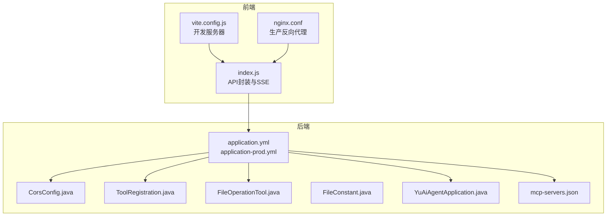
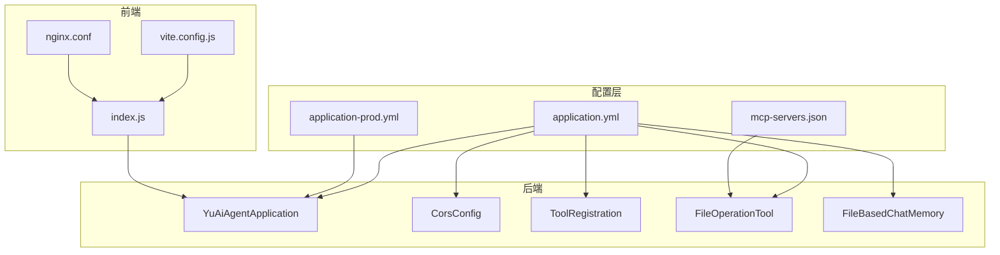
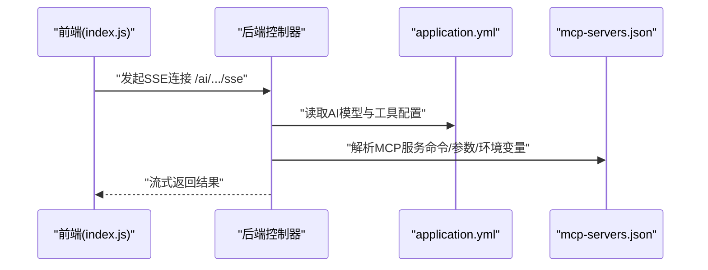
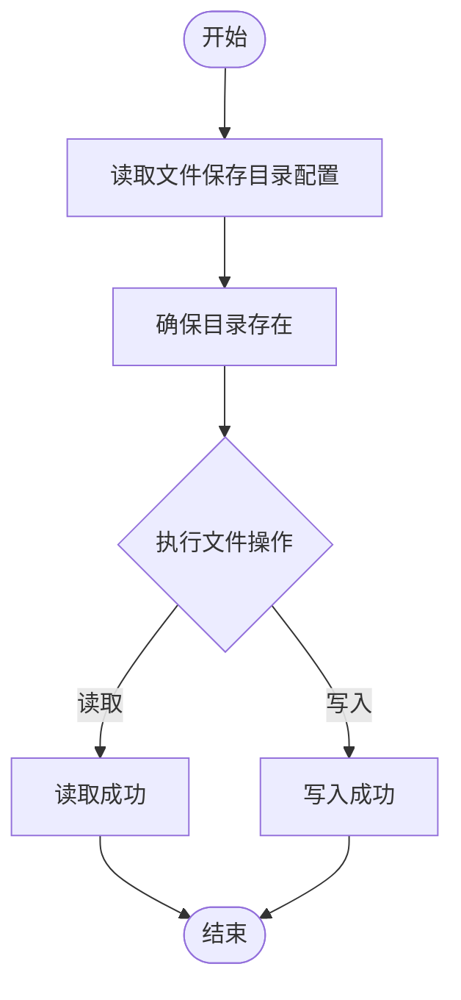
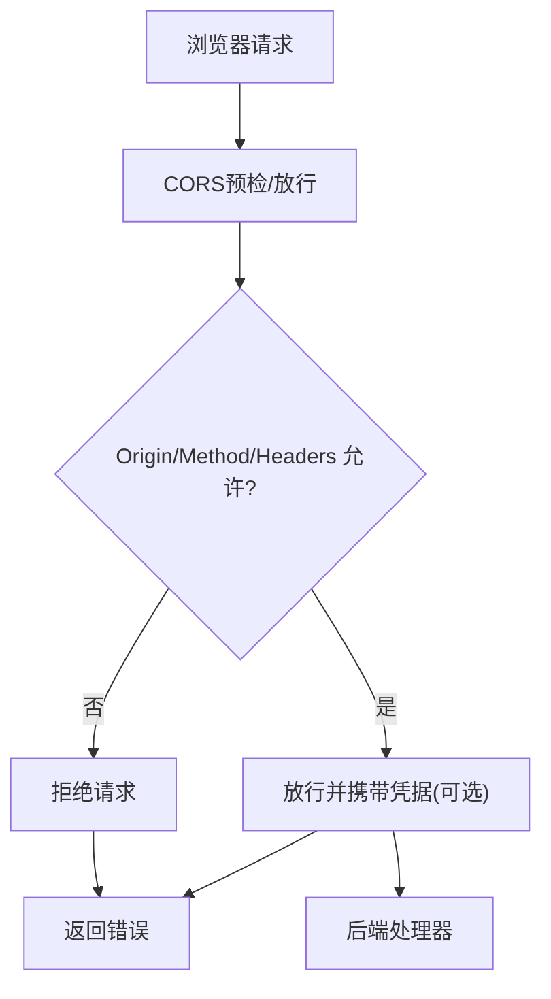
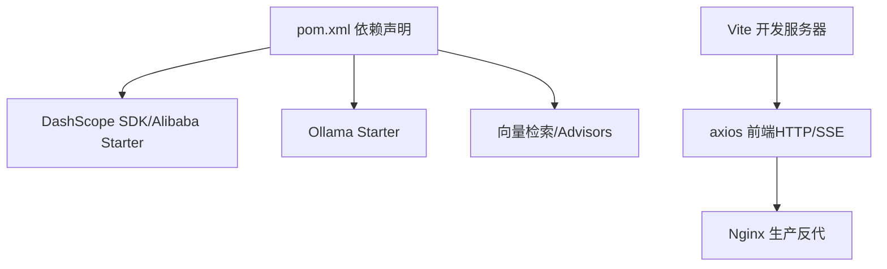

# 配置管理

<cite>
**本文引用的文件**
- [application.yml](file://src/main/resources/application.yml)
- [application-prod.yml](file://src/main/resources/application-prod.yml)
- [CorsConfig.java](file://src/main/java/com/yupi/yuaiagent/config/CorsConfig.java)
- [FileConstant.java](file://src/main/java/com/yupi/yuaiagent/constant/FileConstant.java)
- [FileOperationTool.java](file://src/main/java/com/yupi/yuaiagent/tools/FileOperationTool.java)
- [ToolRegistration.java](file://src/main/java/com/yupi/yuaiagent/tools/ToolRegistration.java)
- [YuAiAgentApplication.java](file://src/main/java/com/yupi/yuaiagent/YuAiAgentApplication.java)
- [mcp-servers.json](file://src/main/resources/mcp-servers.json)
- [index.js](file://yu-ai-agent-frontend/src/api/index.js)
- [vite.config.js](file://yu-ai-agent-frontend/vite.config.js)
- [nginx.conf](file://yu-ai-agent-frontend/nginx.conf)
- [FileBasedChatMemory.java](file://src/main/java/com/yupi/yuaiagent/chatmemory/FileBasedChatMemory.java)
- [TestApiKey.java](file://src/main/java/com/yupi/yuaiagent/demo/invoke/TestApiKey.java)
- [LoveAppRagCloudAdvisorConfig.java](file://src/main/java/com/yupi/yuaiagent/rag/LoveAppRagCloudAdvisorConfig.java)
- [PgVectorVectorStoreConfig.java](file://src/main/java/com/yupi/yuaiagent/rag/PgVectorVectorStoreConfig.java)
- [pom.xml](file://pom.xml)
</cite>

## 目录
1. [简介](#简介)
2. [项目结构](#项目结构)
3. [核心组件](#核心组件)
4. [架构总览](#架构总览)
5. [详细组件分析](#详细组件分析)
6. [依赖分析](#依赖分析)
7. [性能考量](#性能考量)
8. [故障排除指南](#故障排除指南)
9. [结论](#结论)
10. [附录](#附录)

## 简介
本指南面向开发者与运维人员，系统性讲解本项目的配置体系与管理策略，涵盖以下重点：
- application.yml 与 application-prod.yml 的差异与使用场景
- 数据库连接配置（当前默认禁用，按需启用）
- AI 模型配置（DashScope、Ollama）与外部 MCP 服务集成
- 文件存储与会话记忆配置
- 跨域配置的实现与安全注意事项
- 环境变量与敏感信息管理的最佳实践
- 配置调试与故障排除技巧

## 项目结构
后端采用 Spring Boot，配置文件位于 resources 目录；前端位于 yu-ai-agent-frontend，通过 Vite 开发服务器与 Nginx 生产部署。MCP 服务独立子模块，通过 JSON 配置文件声明。

**图表来源**
- [application.yml:1-66](file://src/main/resources/application.yml#L1-L66)
- [application-prod.yml:1-2](file://src/main/resources/application-prod.yml#L1-L2)
- [CorsConfig.java:1-26](file://src/main/java/com/yupi/yuaiagent/config/CorsConfig.java#L1-L26)
- [ToolRegistration.java:1-38](file://src/main/java/com/yupi/yuaiagent/tools/ToolRegistration.java#L1-L38)
- [FileOperationTool.java:1-40](file://src/main/java/com/yupi/yuaiagent/tools/FileOperationTool.java#L1-L40)
- [FileConstant.java:1-13](file://src/main/java/com/yupi/yuaiagent/constant/FileConstant.java#L1-L13)
- [YuAiAgentApplication.java:1-18](file://src/main/java/com/yupi/yuaiagent/YuAiAgentApplication.java#L1-L18)
- [mcp-servers.json:1-25](file://src/main/resources/mcp-servers.json#L1-L25)
- [index.js:1-60](file://yu-ai-agent-frontend/src/api/index.js#L1-L60)
- [vite.config.js:1-17](file://yu-ai-agent-frontend/vite.config.js#L1-L17)
- [nginx.conf:1-49](file://yu-ai-agent-frontend/nginx.conf#L1-L49)

**章节来源**
- [application.yml:1-66](file://src/main/resources/application.yml#L1-L66)
- [application-prod.yml:1-2](file://src/main/resources/application-prod.yml#L1-L2)
- [YuAiAgentApplication.java:1-18](file://src/main/java/com/yupi/yuaiagent/YuAiAgentApplication.java#L1-L18)

## 核心组件
- 配置文件层次：application.yml 为默认配置，application-prod.yml 用于生产覆盖，二者遵循 Spring Profile 覆盖规则。
- 跨域配置：全局 CORS 在 CorsConfig 中集中定义，支持凭据传递与通配符模式。
- 工具与文件：ToolRegistration 注入 search-api.api-key；FileOperationTool 使用 FileConstant 定义文件保存目录；FileBasedChatMemory 提供基于文件的会话记忆持久化。
- 应用入口：YuAiAgentApplication 默认禁用数据源自动配置，便于开发阶段不依赖数据库；如需 PgVector 等功能可按注释指引调整。
- 外部服务：mcp-servers.json 声明 MCP 服务命令、参数与环境变量；前端通过 API 基础路径区分开发/生产环境。

**章节来源**
- [application.yml:1-66](file://src/main/resources/application.yml#L1-L66)
- [CorsConfig.java:1-26](file://src/main/java/com/yupi/yuaiagent/config/CorsConfig.java#L1-L26)
- [ToolRegistration.java:1-38](file://src/main/java/com/yupi/yuaiagent/tools/ToolRegistration.java#L1-L38)
- [FileConstant.java:1-13](file://src/main/java/com/yupi/yuaiagent/constant/FileConstant.java#L1-L13)
- [FileOperationTool.java:1-40](file://src/main/java/com/yupi/yuaiagent/tools/FileOperationTool.java#L1-L40)
- [FileBasedChatMemory.java:1-45](file://src/main/java/com/yupi/yuaiagent/chatmemory/FileBasedChatMemory.java#L1-L45)
- [YuAiAgentApplication.java:1-18](file://src/main/java/com/yupi/yuaiagent/YuAiAgentApplication.java#L1-L18)
- [mcp-servers.json:1-25](file://src/main/resources/mcp-servers.json#L1-L25)
- [index.js:1-60](file://yu-ai-agent-frontend/src/api/index.js#L1-L60)

## 架构总览
下图展示配置在系统中的作用与交互：

**图表来源**
- [application.yml:1-66](file://src/main/resources/application.yml#L1-L66)
- [application-prod.yml:1-2](file://src/main/resources/application-prod.yml#L1-L2)
- [mcp-servers.json:1-25](file://src/main/resources/mcp-servers.json#L1-L25)
- [YuAiAgentApplication.java:1-18](file://src/main/java/com/yupi/yuaiagent/YuAiAgentApplication.java#L1-L18)
- [CorsConfig.java:1-26](file://src/main/java/com/yupi/yuaiagent/config/CorsConfig.java#L1-L26)
- [ToolRegistration.java:1-38](file://src/main/java/com/yupi/yuaiagent/tools/ToolRegistration.java#L1-L38)
- [FileOperationTool.java:1-40](file://src/main/java/com/yupi/yuaiagent/tools/FileOperationTool.java#L1-L40)
- [FileBasedChatMemory.java:1-45](file://src/main/java/com/yupi/yuaiagent/chatmemory/FileBasedChatMemory.java#L1-L45)
- [index.js:1-60](file://yu-ai-agent-frontend/src/api/index.js#L1-L60)
- [vite.config.js:1-17](file://yu-ai-agent-frontend/vite.config.js#L1-L17)
- [nginx.conf:1-49](file://yu-ai-agent-frontend/nginx.conf#L1-L49)

## 详细组件分析

### application.yml 与 application-prod.yml 的差异与使用场景
- application.yml 是默认配置文件，包含 AI 模型、服务器、文档与日志等基础配置；同时预留了数据库、MCP、向量库等“开发阶段临时注释”的开关，便于快速切换。
- application-prod.yml 用于生产环境覆盖，默认注释提示不要提交敏感信息，体现“配置分离、不落库”的原则。
- 使用场景：
  - 开发：激活 local profile，使用本地模型与工具，数据库与向量库可按需启用。
  - 测试/生产：通过激活 prod profile 或外部覆盖，注入真实密钥与生产地址，避免硬编码。

**章节来源**
- [application.yml:1-66](file://src/main/resources/application.yml#L1-L66)
- [application-prod.yml:1-2](file://src/main/resources/application-prod.yml#L1-L2)

### 数据库连接配置
- 当前默认禁用数据源自动配置，适合无需数据库的开发与演示场景。
- 如需启用数据库或向量存储（例如 PgVector），请参考注释指引进行配置覆盖与依赖引入。
- 建议：
  - 使用 application-prod.yml 覆盖敏感连接信息
  - 结合环境变量注入（见“环境变量与敏感信息”）

**章节来源**
- [YuAiAgentApplication.java:1-18](file://src/main/java/com/yupi/yuaiagent/YuAiAgentApplication.java#L1-L18)
- [application.yml:1-66](file://src/main/resources/application.yml#L1-L66)
- [pom.xml:38-134](file://pom.xml#L38-L134)

### AI 模型配置与外部 MCP 集成
- AI 模型配置：
  - DashScope：包含 API Key 与模型选择，可通过配置项切换模型与选项。
  - Ollama：包含 base-url 与 chat 模型名，便于本地推理。
- 外部 MCP 服务：
  - mcp-servers.json 声明 MCP 服务命令、参数与环境变量，例如地图与图像搜索服务。
  - 前端通过 SSE 连接后端接口，后端根据配置与工具链调用外部服务。

**图表来源**
- [index.js:1-60](file://yu-ai-agent-frontend/src/api/index.js#L1-L60)
- [application.yml:1-66](file://src/main/resources/application.yml#L1-L66)
- [mcp-servers.json:1-25](file://src/main/resources/mcp-servers.json#L1-L25)

**章节来源**
- [application.yml:1-66](file://src/main/resources/application.yml#L1-L66)
- [mcp-servers.json:1-25](file://src/main/resources/mcp-servers.json#L1-L25)
- [index.js:1-60](file://yu-ai-agent-frontend/src/api/index.js#L1-L60)

### 文件存储与会话记忆配置
- 文件存储：
  - FileConstant 定义文件保存目录，FileOperationTool 通过该常量进行读写。
  - 建议将目录映射到持久化卷或安全的临时目录，避免权限与磁盘空间问题。
- 会话记忆：
  - FileBasedChatMemory 基于文件与序列化实现对话记忆持久化，初始化时自动创建目录。
  - 建议结合业务场景设置清理策略与容量上限。

**图表来源**
- [FileConstant.java:1-13](file://src/main/java/com/yupi/yuaiagent/constant/FileConstant.java#L1-L13)
- [FileOperationTool.java:1-40](file://src/main/java/com/yupi/yuaiagent/tools/FileOperationTool.java#L1-L40)
- [FileBasedChatMemory.java:1-45](file://src/main/java/com/yupi/yuaiagent/chatmemory/FileBasedChatMemory.java#L1-L45)

**章节来源**
- [FileConstant.java:1-13](file://src/main/java/com/yupi/yuaiagent/constant/FileConstant.java#L1-L13)
- [FileOperationTool.java:1-40](file://src/main/java/com/yupi/yuaiagent/tools/FileOperationTool.java#L1-L40)
- [FileBasedChatMemory.java:1-45](file://src/main/java/com/yupi/yuaiagent/chatmemory/FileBasedChatMemory.java#L1-L45)

### 跨域配置的实现与安全考虑
- 实现方式：CorsConfig 使用 WebMvcConfigurer 接口统一配置，覆盖所有路径，允许凭据、通配符 Origin Patterns 与全量方法/头。
- 安全考虑：
  - 生产环境建议收窄 allowedOriginPatterns 至可信域名
  - 严格限制 exposedHeaders 与 allowedHeaders，避免泄露内部信息
  - 如非必要，关闭 allowCredentials 或配合安全的同源策略

**图表来源**
- [CorsConfig.java:1-26](file://src/main/java/com/yupi/yuaiagent/config/CorsConfig.java#L1-L26)

**章节来源**
- [CorsConfig.java:1-26](file://src/main/java/com/yupi/yuaiagent/config/CorsConfig.java#L1-L26)

### 环境变量的使用方法与最佳实践
- 后端：
  - ToolRegistration 通过 @Value 读取 search-api.api-key，便于从环境变量注入。
  - YuAiAgentApplication 默认禁用数据源自动配置，可结合环境变量启用数据库或向量存储。
- 前端：
  - index.js 根据 NODE_ENV 切换 API 基础路径，开发使用本地后端，生产使用相对路径。
  - vite.config.js 开启开发服务器 CORS，便于联调。
  - nginx.conf 作为生产反向代理，处理静态资源与 API 转发。
- 最佳实践：
  - 生产环境通过容器/平台注入环境变量，避免硬编码
  - 对外暴露的 API Key 与数据库密码使用密钥管理服务
  - 分离开发/测试/生产配置，避免误提交敏感信息

**章节来源**
- [ToolRegistration.java:1-38](file://src/main/java/com/yupi/yuaiagent/tools/ToolRegistration.java#L1-L38)
- [index.js:1-60](file://yu-ai-agent-frontend/src/api/index.js#L1-L60)
- [vite.config.js:1-17](file://yu-ai-agent-frontend/vite.config.js#L1-L17)
- [nginx.conf:1-49](file://yu-ai-agent-frontend/nginx.conf#L1-L49)
- [YuAiAgentApplication.java:1-18](file://src/main/java/com/yupi/yuaiagent/YuAiAgentApplication.java#L1-L18)

### 敏感信息保护与配置版本控制
- 不在仓库中提交敏感配置文件（如 application-prod.yml），或确保其内容为空且不包含真实密钥。
- 使用环境变量注入敏感值，结合 CI/CD 的密钥管理器进行注入。
- 对配置文件进行最小化公开，仅暴露必要的占位与注释说明。
- 版本控制建议：
  - 提交 application.yml 示例与注释，保留 application-prod.yml 为本地/CI 私有
  - 使用 .gitignore 屏蔽敏感文件与 IDE 生成目录

**章节来源**
- [application-prod.yml:1-2](file://src/main/resources/application-prod.yml#L1-L2)

## 依赖分析
- 后端依赖 Spring Boot 与 Spring AI 生态，包含 DashScope、Ollama、向量检索与 Advisors 等模块。
- 前端通过 axios 发起 SSE 请求，Vite 提供开发服务器，Nginx 提供生产反向代理与静态资源缓存。

**图表来源**
- [pom.xml:38-134](file://pom.xml#L38-L134)
- [index.js:1-60](file://yu-ai-agent-frontend/src/api/index.js#L1-L60)
- [vite.config.js:1-17](file://yu-ai-agent-frontend/vite.config.js#L1-L17)
- [nginx.conf:1-49](file://yu-ai-agent-frontend/nginx.conf#L1-L49)

**章节来源**
- [pom.xml:38-134](file://pom.xml#L38-L134)

## 性能考量
- SSE 连接：生产反代需关闭缓冲与缓存，保持长连接，合理设置超时时间，避免中间层中断。
- 日志级别：适当提高 AI 调用日志级别有助于定位性能瓶颈，但需平衡开销。
- 文件 I/O：文件存储与会话记忆应避免频繁小文件写入，建议批量或异步处理。
- 向量检索：如启用 PgVector，需关注索引类型、维度与距离度量对查询性能的影响。

[本节为通用指导，无需特定文件来源]

## 故障排除指南
- 无法连接外部 AI 服务
  - 检查 DashScope/Ollama 的 base-url 与模型配置是否正确
  - 确认 API Key 是否通过环境变量注入或配置文件覆盖
- 跨域失败
  - 核对 allowedOriginPatterns 与 allowCredentials 的组合
  - 生产环境建议缩小允许范围
- 文件读写异常
  - 确认文件保存目录存在且具备写权限
  - 检查路径拼接与字符集编码
- SSE 连接中断
  - 检查 Nginx 的 proxy_set_header 与缓冲设置
  - 确认后端控制器正确返回流式响应
- 数据库/向量库不可用
  - 确认已移除禁用数据源的配置注释并正确配置连接信息
  - 如使用向量库，请确认模型维度与距离度量匹配

**章节来源**
- [CorsConfig.java:1-26](file://src/main/java/com/yupi/yuaiagent/config/CorsConfig.java#L1-L26)
- [FileOperationTool.java:1-40](file://src/main/java/com/yupi/yuaiagent/tools/FileOperationTool.java#L1-L40)
- [FileBasedChatMemory.java:1-45](file://src/main/java/com/yupi/yuaiagent/chatmemory/FileBasedChatMemory.java#L1-L45)
- [nginx.conf:1-49](file://yu-ai-agent-frontend/nginx.conf#L1-L49)
- [application.yml:1-66](file://src/main/resources/application.yml#L1-L66)

## 结论
本项目的配置体系以 Spring Profile 为核心，结合环境变量与外部 JSON 配置实现灵活的开发/生产切换。通过集中式 CORS、工具与文件存储配置，以及明确的敏感信息管理策略，开发者可在保证安全的前提下高效迭代。建议在生产环境中严格收窄跨域范围、使用环境变量注入敏感信息，并完善 CI/CD 的密钥管理流程。

[本节为总结，无需特定文件来源]

## 附录
- 关键配置项速览
  - AI 模型：spring.ai.dashscope.api-key、spring.ai.dashscope.chat.options.model、ollama.base-url、ollama.chat.model
  - 服务器：server.port、server.servlet.context-path
  - 文档：springdoc.swagger-ui.path、springdoc.api-docs.path、knife4j.enable
  - 工具：search-api.api-key
  - 文件：FileConstant.FILE_SAVE_DIR
  - 跨域：CorsConfig 全局放行与凭据设置
- 前端环境切换
  - index.js 根据 NODE_ENV 切换 baseURL
  - vite.config.js 开启开发服务器 CORS
  - nginx.conf 提供生产反代与 SSE 优化

**章节来源**
- [application.yml:1-66](file://src/main/resources/application.yml#L1-L66)
- [CorsConfig.java:1-26](file://src/main/java/com/yupi/yuaiagent/config/CorsConfig.java#L1-L26)
- [ToolRegistration.java:1-38](file://src/main/java/com/yupi/yuaiagent/tools/ToolRegistration.java#L1-L38)
- [FileConstant.java:1-13](file://src/main/java/com/yupi/yuaiagent/constant/FileConstant.java#L1-L13)
- [index.js:1-60](file://yu-ai-agent-frontend/src/api/index.js#L1-L60)
- [vite.config.js:1-17](file://yu-ai-agent-frontend/vite.config.js#L1-L17)
- [nginx.conf:1-49](file://yu-ai-agent-frontend/nginx.conf#L1-L49)