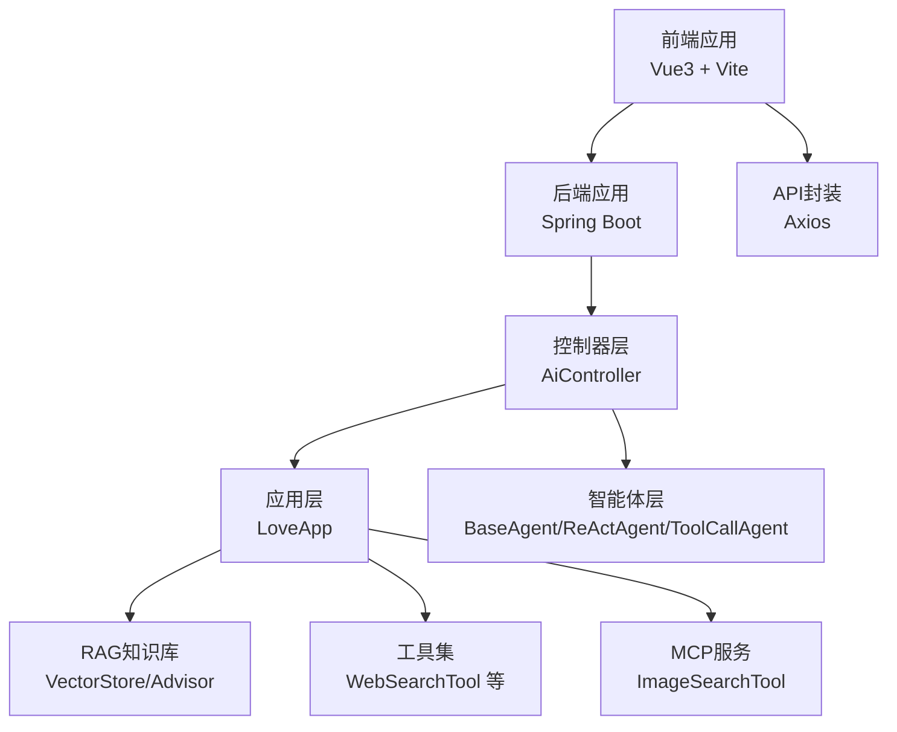
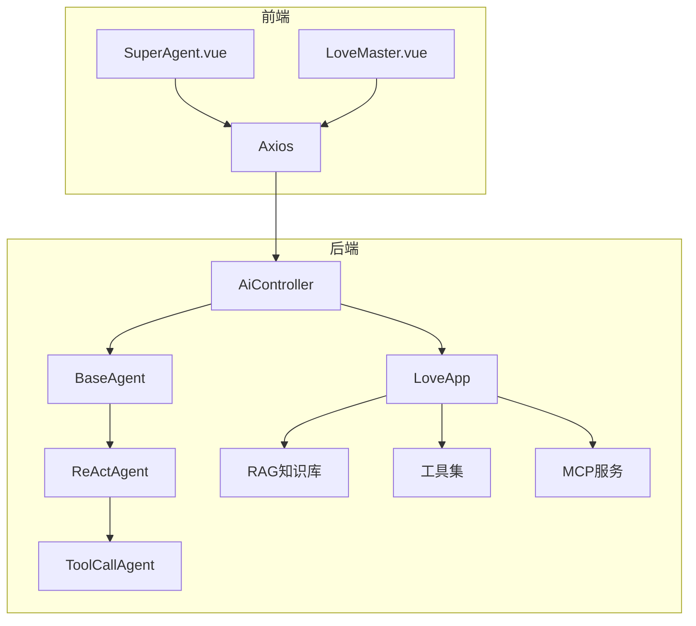
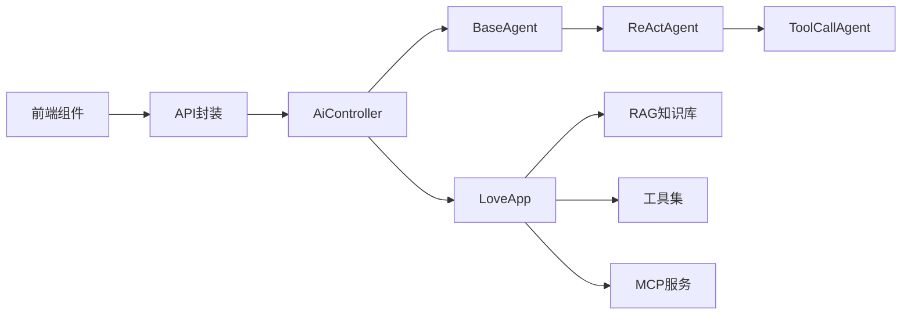

# 学习路线图

<cite>
**本文引用的文件**
- [README.md](file://README.md)
- [YuAiAgentApplication.java](file://src/main/java/com/yupi/yuaiagent/YuAiAgentApplication.java)
- [application.yml](file://src/main/resources/application.yml)
- [AiController.java](file://src/main/java/com/yupi/yuaiagent/controller/AiController.java)
- [LoveApp.java](file://src/main/java/com/yupi/yuaiagent/app/LoveApp.java)
- [BaseAgent.java](file://src/main/java/com/yupi/yuaiagent/agent/BaseAgent.java)
- [ReActAgent.java](file://src/main/java/com/yupi/yuaiagent/agent/ReActAgent.java)
- [ToolCallAgent.java](file://src/main/java/com/yupi/yuaiagent/agent/ToolCallAgent.java)
- [LoveAppContextualQueryAugmenterFactory.java](file://src/main/java/com/yupi/yuaiagent/rag/LoveAppContextualQueryAugmenterFactory.java)
- [WebSearchTool.java](file://src/main/java/com/yupi/yuaiagent/tools/WebSearchTool.java)
- [ImageSearchTool.java](file://yu-image-search-mcp-server/src/main/java/com/yupi/yuimagesearchmcpserver/tools/ImageSearchTool.java)
- [SuperAgent.vue](file://yu-ai-agent-frontend/src/views/SuperAgent.vue)
- [LoveMaster.vue](file://yu-ai-agent-frontend/src/views/LoveMaster.vue)
- [package.json](file://yu-ai-agent-frontend/package.json)
</cite>

## 目录
1. [引言](#引言)
2. [项目结构](#项目结构)
3. [核心组件](#核心组件)
4. [架构总览](#架构总览)
5. [详细组件分析](#详细组件分析)
6. [依赖分析](#依赖分析)
7. [性能考虑](#性能考虑)
8. [故障排除指南](#故障排除指南)
9. [结论](#结论)
10. [附录](#附录)

## 引言
本学习路线图面向“AI超级智能体项目”，围绕九个阶段的学习大纲，为开发者提供从零到一的系统化学习路径。项目以实战为导向，结合 Spring AI 与 LangChain4j 框架，覆盖 AI 大模型接入、多轮对话与记忆、RAG 知识库、工具调用、MCP 协议、ReAct 智能体、SSE 流式输出与前端交互、服务化部署等完整技术栈。适合初学者建立知识体系，也为有经验的开发者提供进阶方向与优化建议。

## 项目结构
项目采用前后端分离架构，后端由 Spring Boot 应用与独立的 MCP 服务组成，前端使用 Vue3 + Vite 构建。后端通过控制器暴露 REST 接口，支持同步与 SSE 流式响应；前端通过 API 层与后端交互，实现恋爱大师与超级智能体的聊天界面。

图表来源
- [AiController.java:18-105](file://src/main/java/com/yupi/yuaiagent/controller/AiController.java#L18-L105)
- [LoveApp.java:27-226](file://src/main/java/com/yupi/yuaiagent/app/LoveApp.java#L27-L226)
- [BaseAgent.java:23-192](file://src/main/java/com/yupi/yuaiagent/agent/BaseAgent.java#L23-L192)
- [ReActAgent.java:7-52](file://src/main/java/com/yupi/yuaiagent/agent/ReActAgent.java#L7-L52)
- [ToolCallAgent.java:24-135](file://src/main/java/com/yupi/yuaiagent/agent/ToolCallAgent.java#L24-L135)
- [WebSearchTool.java:15-53](file://src/main/java/com/yupi/yuaiagent/tools/WebSearchTool.java#L15-L53)
- [ImageSearchTool.java:16-66](file://yu-image-search-mcp-server/src/main/java/com/yupi/yuimagesearchmcpserver/tools/ImageSearchTool.java#L16-L66)
- [SuperAgent.vue:1-286](file://yu-ai-agent-frontend/src/views/SuperAgent.vue#L1-L286)
- [LoveMaster.vue:1-244](file://yu-ai-agent-frontend/src/views/LoveMaster.vue#L1-L244)
- [package.json:1-22](file://yu-ai-agent-frontend/package.json#L1-L22)

章节来源
- [README.md:100-120](file://README.md#L100-L120)
- [YuAiAgentApplication.java:1-18](file://src/main/java/com/yupi/yuaiagent/YuAiAgentApplication.java#L1-L18)
- [application.yml:1-66](file://src/main/resources/application.yml#L1-L66)

## 核心组件
- 应用入口与配置
  - 应用入口类负责启动 Spring Boot 应用，排除数据库自动配置以适配本地开发与演示。
  - 应用配置文件集中管理 AI 平台密钥、本地模型地址、SSE/MCP/向量库等开关与参数。
- 控制器层
  - 提供恋爱大师与超级智能体的 REST 接口，支持同步与 SSE 流式输出。
- 应用层（LoveApp）
  - 封装多轮对话、对话记忆、结构化输出、RAG 知识库问答、工具调用与 MCP 服务调用。
- 智能体层（BaseAgent/ReActAgent/ToolCallAgent）
  - 抽象基础智能体，支持步骤驱动与流式输出；ReAct 模式实现“思考-行动”循环；ToolCallAgent 支持工具调用与终止工具。
- RAG 知识库
  - 提供上下文查询增强器工厂与查询重写器，支撑本地/云向量库检索增强。
- 工具与 MCP 服务
  - 网页搜索工具、图片搜索 MCP 工具等，展示工具注册与外部服务集成。
- 前端交互
  - Vue3 组件通过 SSE 接收流式数据，渲染聊天气泡与状态反馈。

章节来源
- [YuAiAgentApplication.java:7-10](file://src/main/java/com/yupi/yuaiagent/YuAiAgentApplication.java#L7-L10)
- [application.yml:11-38](file://src/main/resources/application.yml#L11-L38)
- [AiController.java:38-104](file://src/main/java/com/yupi/yuaiagent/controller/AiController.java#L38-L104)
- [LoveApp.java:31-226](file://src/main/java/com/yupi/yuaiagent/app/LoveApp.java#L31-L226)
- [BaseAgent.java:53-177](file://src/main/java/com/yupi/yuaiagent/agent/BaseAgent.java#L53-L177)
- [ReActAgent.java:35-50](file://src/main/java/com/yupi/yuaiagent/agent/ReActAgent.java#L35-L50)
- [ToolCallAgent.java:59-134](file://src/main/java/com/yupi/yuaiagent/agent/ToolCallAgent.java#L59-L134)
- [LoveAppContextualQueryAugmenterFactory.java:9-22](file://src/main/java/com/yupi/yuaiagent/rag/LoveAppContextualQueryAugmenterFactory.java#L9-L22)
- [WebSearchTool.java:25-53](file://src/main/java/com/yupi/yuaiagent/tools/WebSearchTool.java#L25-L53)
- [ImageSearchTool.java:16-66](file://yu-image-search-mcp-server/src/main/java/com/yupi/yuimagesearchmcpserver/tools/ImageSearchTool.java#L16-L66)
- [SuperAgent.vue:64-157](file://yu-ai-agent-frontend/src/views/SuperAgent.vue#L64-L157)
- [LoveMaster.vue:69-107](file://yu-ai-agent-frontend/src/views/LoveMaster.vue#L69-L107)

## 架构总览
后端通过控制器统一对外提供接口，恋爱应用与智能体分别承担不同职责：前者侧重对话记忆、RAG 问答与工具/MCP 调用；后者侧重 ReAct 思考-行动循环与工具编排。前端通过 SSE 与后端保持长连接，实现流畅的对话体验。

图表来源
- [AiController.java:18-105](file://src/main/java/com/yupi/yuaiagent/controller/AiController.java#L18-L105)
- [LoveApp.java:27-226](file://src/main/java/com/yupi/yuaiagent/app/LoveApp.java#L27-L226)
- [BaseAgent.java:23-192](file://src/main/java/com/yupi/yuaiagent/agent/BaseAgent.java#L23-L192)
- [ReActAgent.java:7-52](file://src/main/java/com/yupi/yuaiagent/agent/ReActAgent.java#L7-L52)
- [ToolCallAgent.java:24-135](file://src/main/java/com/yupi/yuaiagent/agent/ToolCallAgent.java#L24-L135)
- [SuperAgent.vue:1-286](file://yu-ai-agent-frontend/src/views/SuperAgent.vue#L1-L286)
- [LoveMaster.vue:1-244](file://yu-ai-agent-frontend/src/views/LoveMaster.vue#L1-L244)

## 详细组件分析

### 阶段一：项目总览
- 学习目标
  - 了解项目背景、业务价值与整体技术选型，建立全局认知。
- 核心知识点
  - AI 应用平台使用、常用工具、编程技术与框架选型。
- 实践内容
  - 阅读 README，熟悉项目功能与优势，准备学习资源与环境。
- 学习建议
  - 先通读 README 的“学习大纲”，再对照代码逐步深入。

章节来源
- [README.md:180-199](file://README.md#L180-L199)

### 阶段二：AI 大模型接入
- 学习目标
  - 掌握多种大模型接入方式，理解本地与云端模型的差异与选择。
- 核心知识点
  - Spring AI ChatClient、模型配置、本地 Ollama 部署与云端 DashScope 集成。
- 实践内容
  - 在配置文件中填写 API Key 与模型参数，验证本地与云端调用。
- 学习建议
  - 先本地 Ollama 验证，再切换云端模型，对比输出质量与延迟。

章节来源
- [application.yml:11-21](file://src/main/resources/application.yml#L11-L21)
- [AiController.java:38-41](file://src/main/java/com/yupi/yuaiagent/controller/AiController.java#L38-L41)

### 阶段三：AI 应用开发
- 学习目标
  - 构建多轮对话应用，掌握对话记忆、结构化输出与流式响应。
- 核心知识点
  - ChatClient、Advisor、ChatMemory、SSE 流式输出、结构化输出实体。
- 实践内容
  - 实现恋爱大师应用的多轮对话、流式输出与恋爱报告生成。
- 学习建议
  - 优先实现同步对话，再扩展 SSE 流式输出，最后引入结构化输出。

章节来源
- [LoveApp.java:31-122](file://src/main/java/com/yupi/yuaiagent/app/LoveApp.java#L31-L122)
- [AiController.java:38-92](file://src/main/java/com/yupi/yuaiagent/controller/AiController.java#L38-L92)
- [SuperAgent.vue:64-157](file://yu-ai-agent-frontend/src/views/SuperAgent.vue#L64-L157)
- [LoveMaster.vue:69-107](file://yu-ai-agent-frontend/src/views/LoveMaster.vue#L69-L107)

### 阶段四：RAG 知识库基础
- 学习目标
  - 理解 RAG 核心步骤，掌握本地与云知识库的接入与问答流程。
- 核心知识点
  - 文档加载、向量存储、检索器、上下文增强与问答 Advisor。
- 实践内容
  - 使用内置 Advisor 进行本地/云知识库问答，观察检索增强效果。
- 学习建议
  - 先用本地知识库验证流程，再接入云服务或 PgVector。

章节来源
- [LoveApp.java:124-172](file://src/main/java/com/yupi/yuaiagent/app/LoveApp.java#L124-L172)
- [LoveAppContextualQueryAugmenterFactory.java:9-22](file://src/main/java/com/yupi/yuaiagent/rag/LoveAppContextualQueryAugmenterFactory.java#L9-L22)

### 阶段五：RAG 知识库进阶
- 学习目标
  - 深入理解 RAG 核心特性与调优策略，掌握查询重写、上下文增强与检索策略。
- 核心知识点
  - 查询重写器、上下文查询增强器、向量维度与距离类型、批量写入。
- 实践内容
  - 自定义增强器与 Advisor，结合查询重写提升召回质量。
- 学习建议
  - 从简单规则开始，逐步引入复杂增强逻辑，持续评估命中率与相关度。

章节来源
- [LoveApp.java:136-137](file://src/main/java/com/yupi/yuaiagent/app/LoveApp.java#L136-L137)
- [LoveAppContextualQueryAugmenterFactory.java:9-22](file://src/main/java/com/yupi/yuaiagent/rag/LoveAppContextualQueryAugmenterFactory.java#L9-L22)

### 阶段六：工具调用
- 学习目标
  - 掌握工具开发与注册，理解工具调用的思考-行动闭环与终止工具。
- 核心知识点
  - ToolCallback 注册、工具参数与返回值、ToolCallingManager 执行流程。
- 实践内容
  - 开发并注册网页搜索、文件操作、PDF 生成等工具，验证工具链路。
- 学习建议
  - 先实现单一工具，再组合多个工具形成复杂工作流。

章节来源
- [LoveApp.java:174-198](file://src/main/java/com/yupi/yuaiagent/app/LoveApp.java#L174-L198)
- [ToolCallAgent.java:24-135](file://src/main/java/com/yupi/yuaiagent/agent/ToolCallAgent.java#L24-L135)
- [WebSearchTool.java:15-53](file://src/main/java/com/yupi/yuaiagent/tools/WebSearchTool.java#L15-L53)

### 阶段七：MCP 协议
- 学习目标
  - 理解 MCP 协议与服务开发模式，掌握 SSE 与 STDIO 两种连接方式。
- 核心知识点
  - MCP 服务注册、ToolCallbackProvider、SSE/STDIO 连接配置。
- 实践内容
  - 开发图片搜索 MCP 服务，注册到客户端并验证调用。
- 学习建议
  - 从简单工具开始，逐步扩展为完整 MCP 服务。

章节来源
- [LoveApp.java:200-225](file://src/main/java/com/yupi/yuaiagent/app/LoveApp.java#L200-L225)
- [application.yml:22-30](file://src/main/resources/application.yml#L22-L30)
- [ImageSearchTool.java:16-66](file://yu-image-search-mcp-server/src/main/java/com/yupi/yuimagesearchmcpserver/tools/ImageSearchTool.java#L16-L66)

### 阶段八：AI 智能体构建
- 学习目标
  - 掌握 ReAct 智能体的思考-行动循环，理解工具调用与终止条件。
- 核心知识点
  - BaseAgent 步骤驱动、ReActAgent 思考-行动、ToolCallAgent 工具编排。
- 实践内容
  - 基于工具集与 MCP 服务，构建可自主规划的超级智能体。
- 学习建议
  - 以最小可行智能体起步，逐步增加思考深度与行动范围。

章节来源
- [BaseAgent.java:53-177](file://src/main/java/com/yupi/yuaiagent/agent/BaseAgent.java#L53-L177)
- [ReActAgent.java:35-50](file://src/main/java/com/yupi/yuaiagent/agent/ReActAgent.java#L35-L50)
- [ToolCallAgent.java:59-134](file://src/main/java/com/yupi/yuaiagent/agent/ToolCallAgent.java#L59-L134)
- [AiController.java:94-104](file://src/main/java/com/yupi/yuaiagent/controller/AiController.java#L94-L104)

### 阶段九：AI 服务化
- 学习目标
  - 掌握接口开发、SSE 流式输出与前端交互，理解服务化与部署要点。
- 核心知识点
  - REST 接口设计、SSE 事件流、前端 Axios 封装与聊天组件。
- 实践内容
  - 完成恋爱大师与超级智能体的前后端联调，验证流式输出与状态反馈。
- 学习建议
  - 优先保证接口稳定性与错误处理，再优化用户体验。

章节来源
- [AiController.java:38-104](file://src/main/java/com/yupi/yuaiagent/controller/AiController.java#L38-L104)
- [SuperAgent.vue:64-157](file://yu-ai-agent-frontend/src/views/SuperAgent.vue#L64-L157)
- [LoveMaster.vue:69-107](file://yu-ai-agent-frontend/src/views/LoveMaster.vue#L69-L107)
- [package.json:1-22](file://yu-ai-agent-frontend/package.json#L1-L22)

## 依赖分析
后端模块之间存在清晰的分层依赖：控制器依赖应用层与智能体层；应用层依赖 RAG、工具与 MCP；智能体层继承抽象基类并实现 ReAct 与工具调用。前端通过 API 封装与后端交互，组件间通过事件与状态传递实现松耦合。

图表来源
- [AiController.java:22-29](file://src/main/java/com/yupi/yuaiagent/controller/AiController.java#L22-L29)
- [LoveApp.java:27-226](file://src/main/java/com/yupi/yuaiagent/app/LoveApp.java#L27-L226)
- [BaseAgent.java:23-192](file://src/main/java/com/yupi/yuaiagent/agent/BaseAgent.java#L23-L192)
- [ReActAgent.java:7-52](file://src/main/java/com/yupi/yuaiagent/agent/ReActAgent.java#L7-L52)
- [ToolCallAgent.java:24-135](file://src/main/java/com/yupi/yuaiagent/agent/ToolCallAgent.java#L24-L135)
- [SuperAgent.vue:32-32](file://yu-ai-agent-frontend/src/views/SuperAgent.vue#L32-L32)
- [LoveMaster.vue:32-32](file://yu-ai-agent-frontend/src/views/LoveMaster.vue#L32-L32)
- [package.json:11-15](file://yu-ai-agent-frontend/package.json#L11-L15)

章节来源
- [AiController.java:18-105](file://src/main/java/com/yupi/yuaiagent/controller/AiController.java#L18-L105)
- [LoveApp.java:27-226](file://src/main/java/com/yupi/yuaiagent/app/LoveApp.java#L27-L226)

## 性能考虑
- 流式输出优化
  - SSE 连接超时与断开回调需合理设置，避免长时间占用资源。
- 工具调用与 MCP
  - 工具执行与外部服务调用应设置超时与重试策略，防止阻塞主流程。
- RAG 检索
  - 向量维度与距离类型影响检索效率，建议根据数据规模与精度需求调参。
- 前端渲染
  - 消息气泡的节流与合并有助于提升渲染性能与用户体验。

## 故障排除指南
- 常见问题
  - API Key 未配置：检查配置文件中的密钥与模型参数。
  - SSE 连接异常：确认后端控制器与前端事件监听逻辑一致。
  - 工具调用失败：检查工具注册与参数传递，关注异常日志。
  - MCP 服务不可达：确认 MCP 服务已启动且连接配置正确。
- 排查步骤
  - 启用 DEBUG 日志级别，观察调用链路与错误堆栈。
  - 分模块验证：先验证模型调用，再逐步接入 RAG、工具与 MCP。

章节来源
- [application.yml:64-66](file://src/main/resources/application.yml#L64-L66)
- [AiController.java:77-91](file://src/main/java/com/yupi/yuaiagent/controller/AiController.java#L77-L91)
- [ToolCallAgent.java:99-103](file://src/main/java/com/yupi/yuaiagent/agent/ToolCallAgent.java#L99-L103)
- [ImageSearchTool.java:25-31](file://yu-image-search-mcp-server/src/main/java/com/yupi/yuimagesearchmcpserver/tools/ImageSearchTool.java#L25-L31)

## 结论
本学习路线图以项目实战为主线，将 AI 大模型接入、对话应用、RAG 知识库、工具调用、MCP 协议与智能体构建串联为完整的学习路径。建议按阶段推进，先掌握基础概念与接口，再深入到工程化与性能优化，最终完成服务化部署与前端交互。

## 附录
- 学习时间安排建议
  - 阶段一：1 天（概览与准备）
  - 阶段二：2 天（模型接入与本地部署）
  - 阶段三：3 天（对话应用与流式输出）
  - 阶段四：2 天（RAG 基础）
  - 阶段五：2 天（RAG 进阶与调优）
  - 阶段六：3 天（工具开发与注册）
  - 阶段七：3 天（MCP 协议与服务）
  - 阶段八：4 天（智能体构建与工作流）
  - 阶段九：3 天（服务化与前端联调）
- 实践项目推荐
  - 恋爱大师应用：多轮对话 + RAG + 工具调用
  - 超级智能体：ReAct 智能体 + 工具编排 + MCP 服务
- 技能评估标准
  - 能独立完成模型接入与配置
  - 能实现多轮对话与流式输出
  - 能搭建并优化 RAG 知识库
  - 能开发并注册工具，实现自动化任务
  - 能开发 MCP 服务并与客户端对接
  - 能构建可自主规划的智能体并完成复杂任务
  - 能完成前后端联调与服务化部署