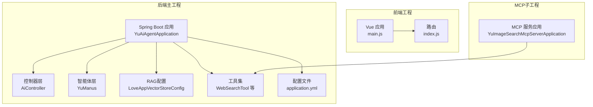
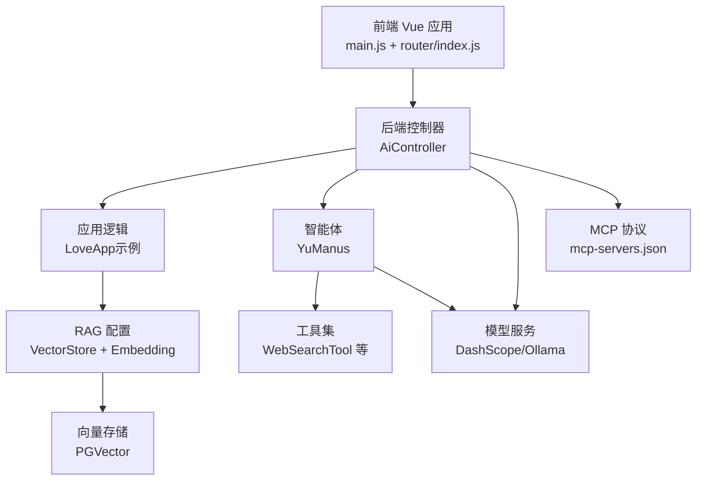
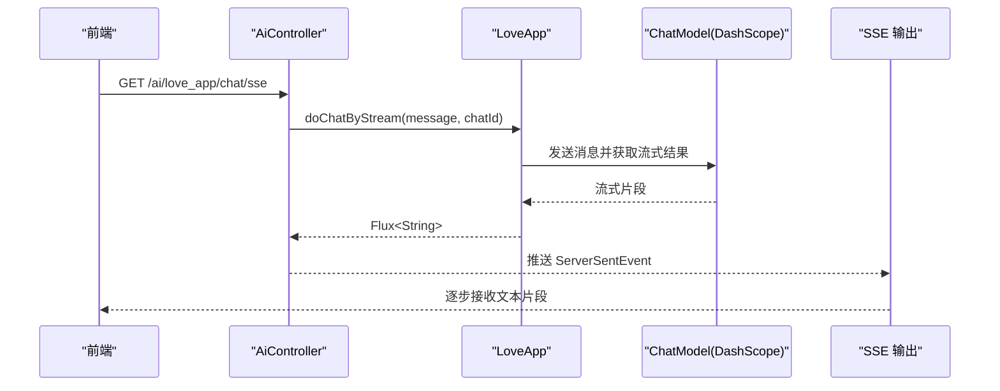
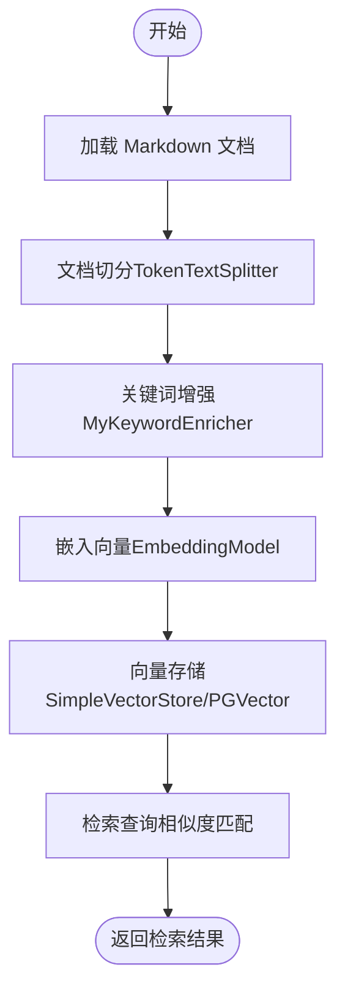
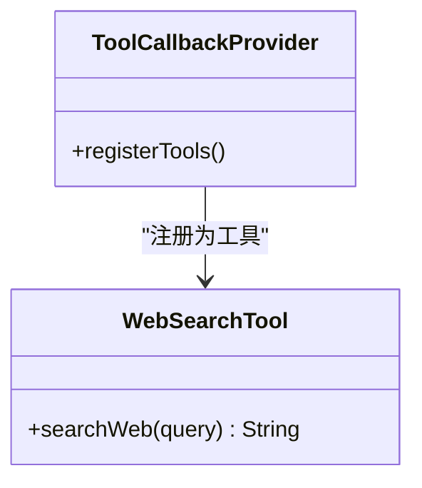
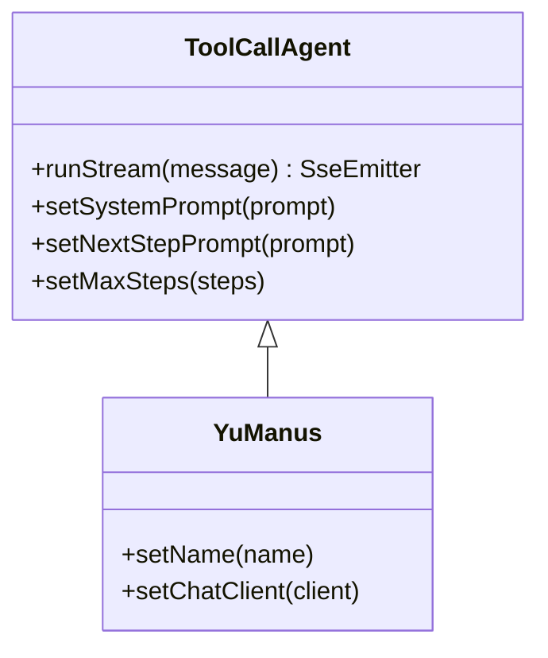
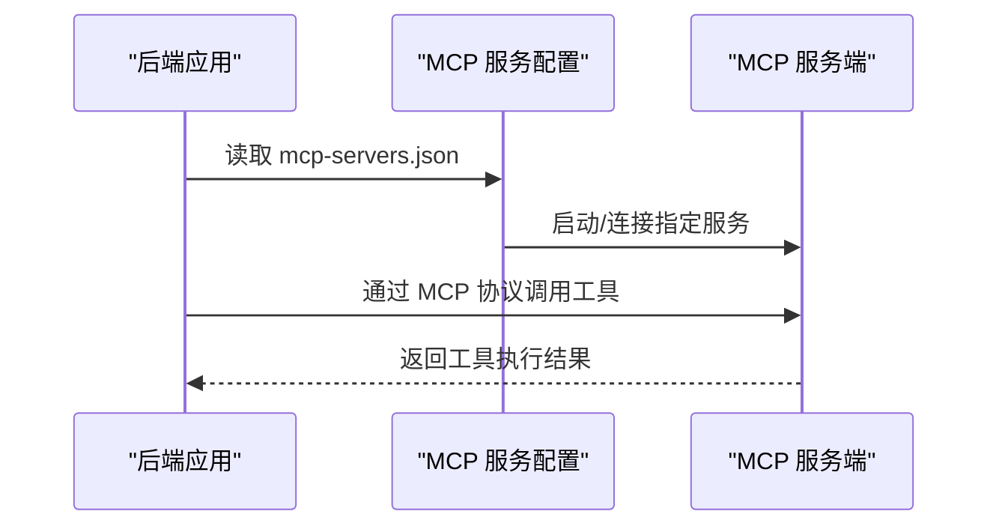
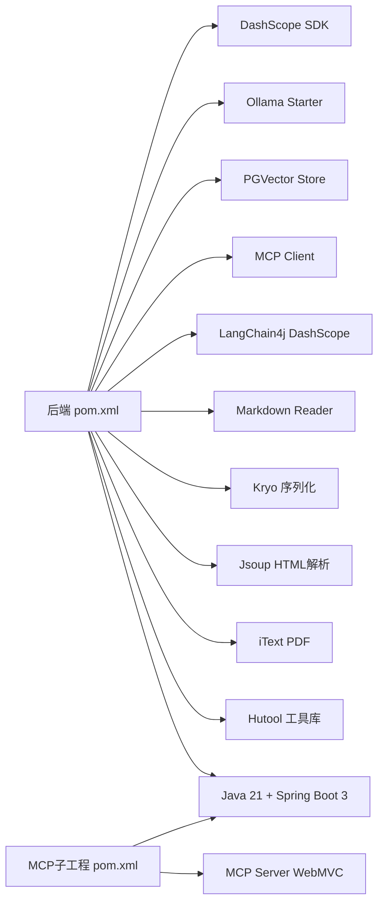

# 技术栈

<cite>
**本文引用的文件**
- [pom.xml](file://pom.xml)
- [application.yml](file://src/main/resources/application.yml)
- [README.md](file://README.md)
- [YuAiAgentApplication.java](file://src/main/java/com/yupi/yuaiagent/YuAiAgentApplication.java)
- [AiController.java](file://src/main/java/com/yupi/yuaiagent/controller/AiController.java)
- [LoveAppVectorStoreConfig.java](file://src/main/java/com/yupi/yuaiagent/rag/LoveAppVectorStoreConfig.java)
- [WebSearchTool.java](file://src/main/java/com/yupi/yuaiagent/tools/WebSearchTool.java)
- [YuManus.java](file://src/main/java/com/yupi/yuaiagent/agent/YuManus.java)
- [package.json](file://yu-ai-agent-frontend/package.json)
- [main.js](file://yu-ai-agent-frontend/src/main.js)
- [index.js](file://yu-ai-agent-frontend/src/router/index.js)
- [mcp-servers.json](file://src/main/resources/mcp-servers.json)
- [SpringAiAiInvoke.java](file://src/main/java/com/yupi/yuaiagent/demo/invoke/SpringAiAiInvoke.java)
- [yu-image-search-mcp-server/pom.xml](file://yu-image-search-mcp-server/pom.xml)
- [YuImageSearchMcpServerApplication.java](file://yu-image-search-mcp-server/src/main/java/com/yupi/yuimagesearchmcpserver/YuImageSearchMcpServerApplication.java)
</cite>

## 目录
1. [简介](#简介)
2. [项目结构](#项目结构)
3. [核心组件](#核心组件)
4. [架构总览](#架构总览)
5. [详细组件分析](#详细组件分析)
6. [依赖分析](#依赖分析)
7. [性能考虑](#性能考虑)
8. [故障排除指南](#故障排除指南)
9. [结论](#结论)
10. [附录](#附录)

## 简介
本项目围绕“AI超级智能体”主题，构建一套以Spring AI与LangChain4j为核心的后端技术栈，结合RAG知识库、PGVector向量数据库、Tool Calling工具调用、MCP模型上下文协议等关键技术，提供AI恋爱大师应用与具备自主规划能力的超级智能体（YuManus）。后端采用Java 21 + Spring Boot 3，前端采用Vue.js生态，支持SSE异步推送与Serverless部署思路，覆盖从模型接入（阿里云百炼、Ollama本地部署）到智能体工作流的完整技术链路。

## 项目结构
项目由三个主要部分组成：
- 后端主工程：包含控制器、智能体、RAG配置、工具集与MCP集成示例。
- 前端工程：基于Vue 3 + Vue Router的单页应用，提供聊天界面与路由管理。
- MCP独立子工程：演示如何作为MCP服务端提供工具能力（如图片搜索）。

图表来源
- [YuAiAgentApplication.java:1-18](file://src/main/java/com/yupi/yuaiagent/YuAiAgentApplication.java#L1-L18)
- [AiController.java:1-106](file://src/main/java/com/yupi/yuaiagent/controller/AiController.java#L1-L106)
- [YuManus.java:1-38](file://src/main/java/com/yupi/yuaiagent/agent/YuManus.java#L1-L38)
- [LoveAppVectorStoreConfig.java:1-42](file://src/main/java/com/yupi/yuaiagent/rag/LoveAppVectorStoreConfig.java#L1-L42)
- [WebSearchTool.java:1-54](file://src/main/java/com/yupi/yuaiagent/tools/WebSearchTool.java#L1-L54)
- [application.yml:1-66](file://src/main/resources/application.yml#L1-L66)
- [main.js:1-13](file://yu-ai-agent-frontend/src/main.js#L1-L13)
- [index.js:1-47](file://yu-ai-agent-frontend/src/router/index.js#L1-L47)
- [YuImageSearchMcpServerApplication.java:1-25](file://yu-image-search-mcp-server/src/main/java/com/yupi/yuimagesearchmcpserver/YuImageSearchMcpServerApplication.java#L1-L25)

章节来源
- [README.md:101-119](file://README.md#L101-L119)
- [pom.xml:1-227](file://pom.xml#L1-L227)
- [package.json:1-22](file://yu-ai-agent-frontend/package.json#L1-L22)

## 核心组件
- 后端技术栈：Java 21 + Spring Boot 3，配合Spring AI与LangChain4j生态，支持DashScope（阿里百炼）、Ollama本地模型、MCP客户端/服务端、向量存储（PGVector）等。
- 前端技术栈：Vue 3 + Vue Router + Axios，提供路由与页面组件，支持SSE消费后端流式响应。
- 关键特性：RAG知识库（文档加载、切分、嵌入、向量存储）、Tool Calling工具调用、MCP协议服务与客户端集成、SSE异步推送、结构化输出与对话记忆持久化等。

章节来源
- [pom.xml:29-48](file://pom.xml#L29-L48)
- [application.yml:1-66](file://src/main/resources/application.yml#L1-L66)
- [package.json:11-16](file://yu-ai-agent-frontend/package.json#L11-L16)

## 架构总览
整体架构围绕“控制器-智能体-工具-RAG-向量存储-模型服务”的链路展开，前端通过HTTP与SSE与后端交互，后端通过Spring AI统一编排模型调用、工具执行与流式输出。

图表来源
- [AiController.java:1-106](file://src/main/java/com/yupi/yuaiagent/controller/AiController.java#L1-L106)
- [YuManus.java:1-38](file://src/main/java/com/yupi/yuaiagent/agent/YuManus.java#L1-L38)
- [WebSearchTool.java:1-54](file://src/main/java/com/yupi/yuaiagent/tools/WebSearchTool.java#L1-L54)
- [LoveAppVectorStoreConfig.java:1-42](file://src/main/java/com/yupi/yuaiagent/rag/LoveAppVectorStoreConfig.java#L1-L42)
- [mcp-servers.json:1-25](file://src/main/resources/mcp-servers.json#L1-L25)
- [application.yml:1-66](file://src/main/resources/application.yml#L1-L66)

## 详细组件分析

### 后端应用入口与配置
- 应用入口排除数据源自动配置，便于开发阶段按需启用数据库或向量存储。
- application.yml集中管理模型服务（DashScope、Ollama）、SSE相关配置、OpenAPI文档与日志级别等。

章节来源
- [YuAiAgentApplication.java:1-18](file://src/main/java/com/yupi/yuaiagent/YuAiAgentApplication.java#L1-L18)
- [application.yml:1-66](file://src/main/resources/application.yml#L1-L66)

### 控制器与SSE流式输出
- 提供同步与多种SSE输出形式（Flux、ServerSentEvent、SseEmitter），支持长时间对话与流式响应。
- 集成智能体与应用示例，统一对外接口路径与参数约定。

图表来源
- [AiController.java:50-92](file://src/main/java/com/yupi/yuaiagent/controller/AiController.java#L50-L92)
- [application.yml:11-21](file://src/main/resources/application.yml#L11-L21)

章节来源
- [AiController.java:1-106](file://src/main/java/com/yupi/yuaiagent/controller/AiController.java#L1-L106)

### RAG知识库与向量存储
- 通过配置类加载Markdown文档、切分与关键词增强，构建向量存储并注入文档。
- 支持DashScope嵌入模型与SimpleVectorStore作为示例；PGVector配置在工程中已准备，可通过配置启用。

图表来源
- [LoveAppVectorStoreConfig.java:29-40](file://src/main/java/com/yupi/yuaiagent/rag/LoveAppVectorStoreConfig.java#L29-L40)

章节来源
- [LoveAppVectorStoreConfig.java:1-42](file://src/main/java/com/yupi/yuaiagent/rag/LoveAppVectorStoreConfig.java#L1-L42)
- [application.yml:31-38](file://src/main/resources/application.yml#L31-L38)

### 工具调用（Tool Calling）
- 以注解方式声明工具（如WebSearchTool），通过Spring AI工具回调机制注册与调用。
- 工具可组合用于复杂任务分解与执行，配合智能体实现ReAct式推理与行动。

图表来源
- [WebSearchTool.java:1-54](file://src/main/java/com/yupi/yuaiagent/tools/WebSearchTool.java#L1-L54)

章节来源
- [WebSearchTool.java:1-54](file://src/main/java/com/yupi/yuaiagent/tools/WebSearchTool.java#L1-L54)

### 智能体与自主规划（YuManus）
- 基于工具调用的智能体，内置系统提示与下一步引导，限制最大步数，使用ChatClient与Advisor进行日志与流程控制。
- 支持外部传入工具数组与模型实例，便于扩展与测试。

图表来源
- [YuManus.java:1-38](file://src/main/java/com/yupi/yuaiagent/agent/YuManus.java#L1-L38)

章节来源
- [YuManus.java:1-38](file://src/main/java/com/yupi/yuaiagent/agent/YuManus.java#L1-L38)

### MCP模型上下文协议
- 通过配置文件声明多个MCP服务（如高德地图、自研图片搜索），支持命令行启动与环境变量注入。
- 后端可作为MCP客户端连接这些服务，实现跨进程工具能力扩展。

图表来源
- [mcp-servers.json:1-25](file://src/main/resources/mcp-servers.json#L1-L25)
- [application.yml:22-30](file://src/main/resources/application.yml#L22-L30)

章节来源
- [mcp-servers.json:1-25](file://src/main/resources/mcp-servers.json#L1-L25)
- [application.yml:22-30](file://src/main/resources/application.yml#L22-L30)

### 前端工程与路由
- 前端采用Vue 3 + Vue Router，提供首页、恋爱大师、超级智能体三个视图，并在路由中设置页面标题与描述。
- 通过Axios发起HTTP请求，结合SSE消费后端流式输出，实现流畅的对话体验。

章节来源
- [package.json:11-16](file://yu-ai-agent-frontend/package.json#L11-L16)
- [main.js:1-13](file://yu-ai-agent-frontend/src/main.js#L1-L13)
- [index.js:1-47](file://yu-ai-agent-frontend/src/router/index.js#L1-L47)

### 模型接入与演示
- 支持阿里云百炼（DashScope）与Ollama本地模型，通过Spring AI Starter与SDK集成。
- 提供启动即运行的调用示例，便于验证模型连通性与输出质量。

章节来源
- [pom.xml:55-70](file://pom.xml#L55-L70)
- [application.yml:11-21](file://src/main/resources/application.yml#L11-L21)
- [SpringAiAiInvoke.java:1-28](file://src/main/java/com/yupi/yuaiagent/demo/invoke/SpringAiAiInvoke.java#L1-L28)

## 依赖分析
- 后端依赖管理采用Spring AI与Spring AI Alibaba的BOM，统一版本并引入DashScope、Ollama、PGVector、MCP客户端等模块。
- 前端依赖包含Vue 3、Vue Router、Axios与Vite构建工具，满足现代前端开发需求。
- MCP子工程独立打包，演示如何作为服务端提供工具能力，便于与后端协同工作。

图表来源
- [pom.xml:32-115](file://pom.xml#L32-L115)
- [yu-image-search-mcp-server/pom.xml:32-66](file://yu-image-search-mcp-server/pom.xml#L32-L66)

章节来源
- [pom.xml:1-227](file://pom.xml#L1-L227)
- [yu-image-search-mcp-server/pom.xml:1-121](file://yu-image-search-mcp-server/pom.xml#L1-L121)

## 性能考虑
- SSE长连接与背压：合理设置SSE超时与背压策略，避免长时间无输出导致连接中断。
- 向量检索优化：选择合适的距离类型与索引类型，批量插入与查询时注意分批大小与并发度。
- 工具调用幂等性：对易变外部资源（如网络搜索）设计重试与去重策略，减少重复调用。
- 模型调用成本：根据场景选择合适模型与温度参数，必要时启用缓存与结构化输出以降低无效输出。

## 故障排除指南
- 模型密钥与URL：确认DashScope API Key与Ollama基础URL正确，避免因鉴权失败或地址错误导致调用异常。
- 数据库与向量存储：开发阶段可禁用数据源自动配置；启用PGVector时需完善连接参数与索引配置。
- MCP服务可用性：检查mcp-servers.json中的命令与参数是否正确，确保外部服务可被正常启动与通信。
- 日志级别：适当提高Spring AI日志级别以便定位模型调用与工具执行过程中的问题。

章节来源
- [application.yml:11-30](file://src/main/resources/application.yml#L11-L30)
- [application.yml:64-66](file://src/main/resources/application.yml#L64-L66)

## 结论
本项目以Spring AI与LangChain4j为核心，结合RAG、PGVector、Tool Calling与MCP协议，构建了可扩展的AI智能体平台。后端通过统一的控制器与智能体编排模型与工具，前端通过SSE实现流畅的交互体验。该技术栈既适合教学与实战演练，也为生产化部署提供了清晰的扩展路径。

## 附录
- 技术选型理由概览
  - Java 21 + Spring Boot 3：稳定的企业级运行时与现代化特性。
  - Spring AI + LangChain4j：统一的AI开发抽象与丰富的生态集成。
  - RAG + PGVector：兼顾灵活性与性能的向量检索方案。
  - Tool Calling：将外部能力以标准化工具形式复用。
  - MCP：跨进程工具扩展与协议化治理。
  - SSE：实时流式输出，改善用户体验。
  - Serverless：通过容器与边缘计算思路实现弹性与低成本部署。

章节来源
- [README.md:101-119](file://README.md#L101-L119)