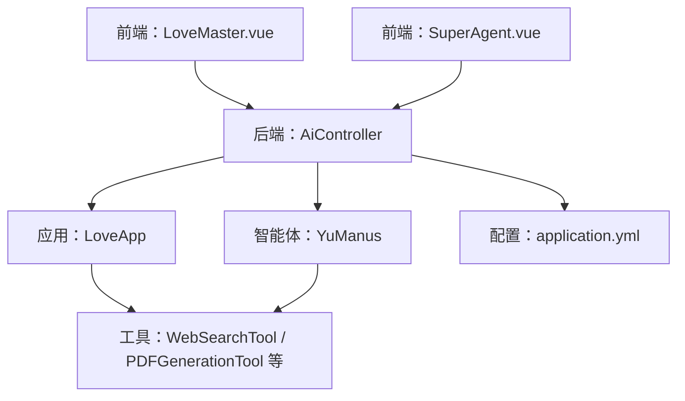
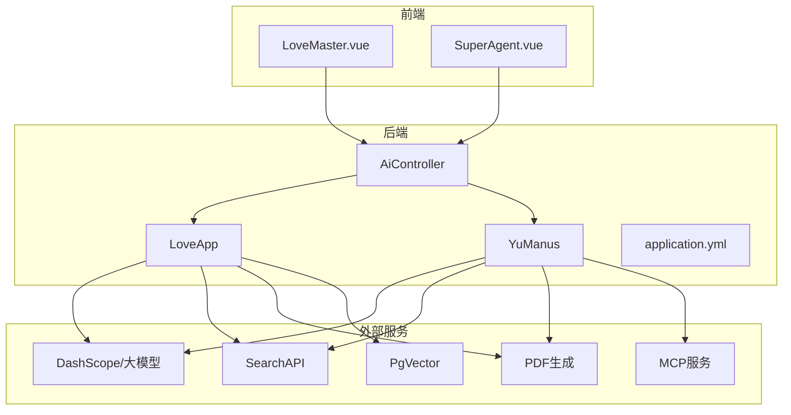
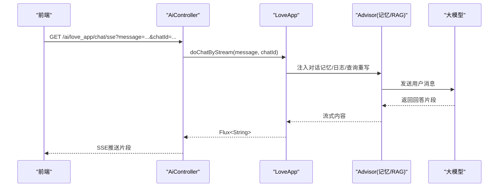
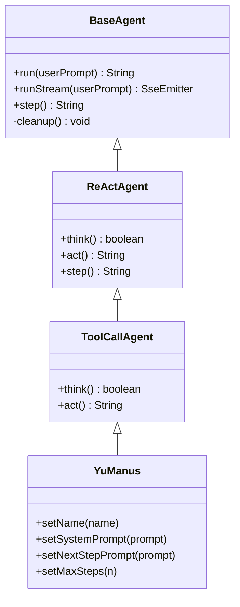
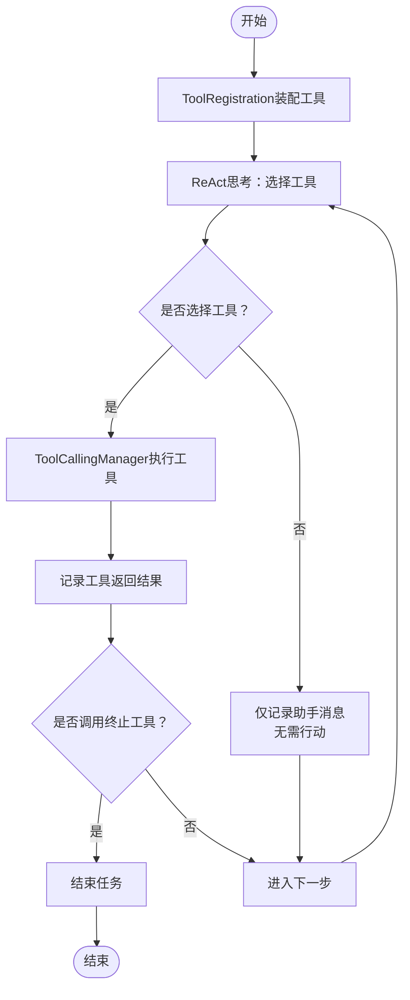
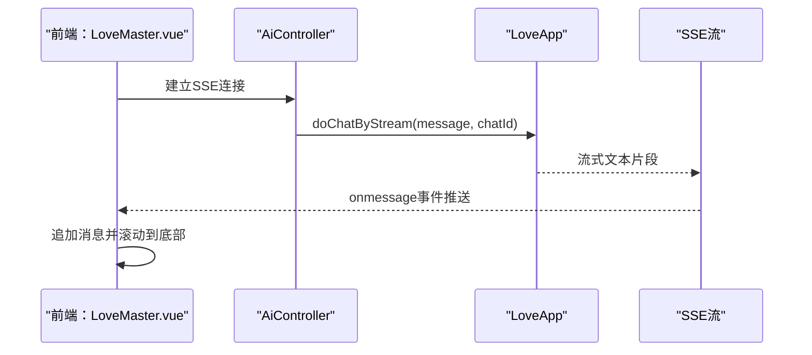
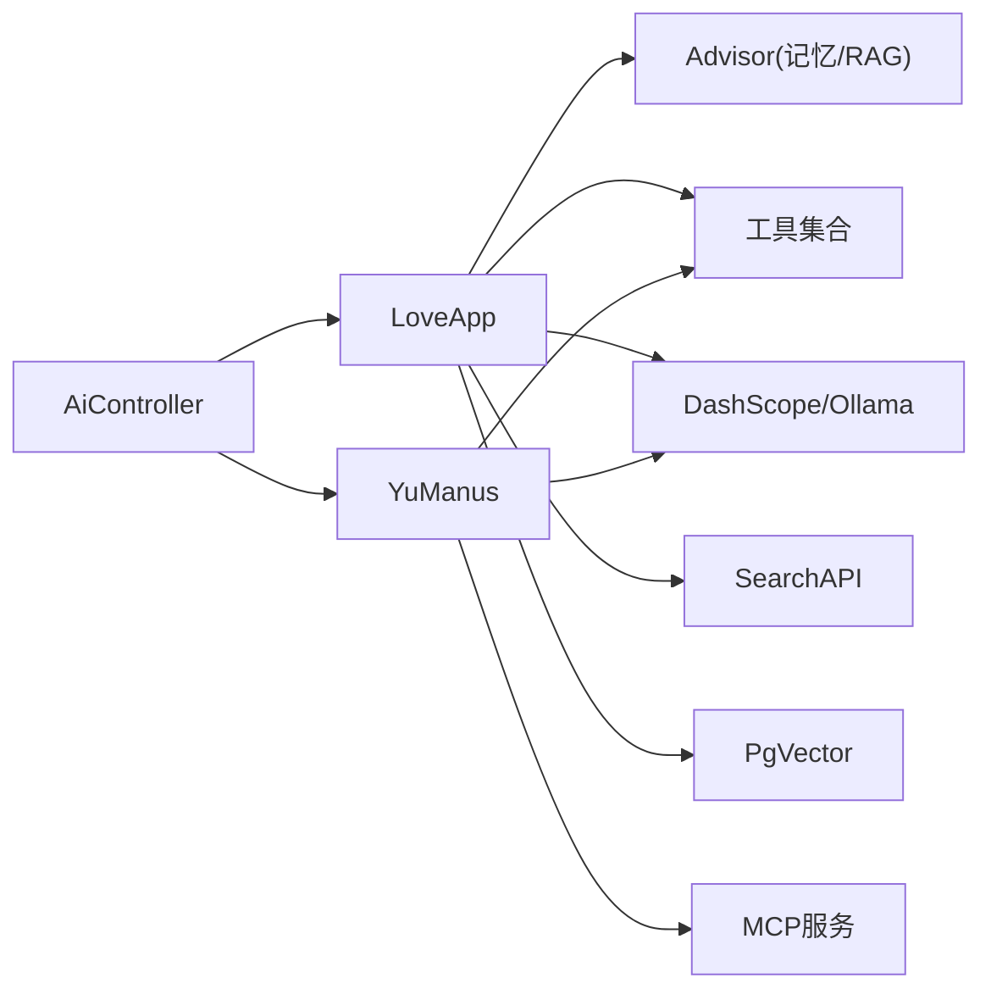

# 项目介绍

<cite>
**本文引用的文件**
- [README.md](file://README.md)
- [YuAiAgentApplication.java](file://src/main/java/com/yupi/yuaiagent/YuAiAgentApplication.java)
- [application.yml](file://src/main/resources/application.yml)
- [LoveApp.java](file://src/main/java/com/yupi/yuaiagent/app/LoveApp.java)
- [AiController.java](file://src/main/java/com/yupi/yuaiagent/controller/AiController.java)
- [BaseAgent.java](file://src/main/java/com/yupi/yuaiagent/agent/BaseAgent.java)
- [ReActAgent.java](file://src/main/java/com/yupi/yuaiagent/agent/ReActAgent.java)
- [ToolCallAgent.java](file://src/main/java/com/yupi/yuaiagent/agent/ToolCallAgent.java)
- [YuManus.java](file://src/main/java/com/yupi/yuaiagent/agent/YuManus.java)
- [ToolRegistration.java](file://src/main/java/com/yupi/yuaiagent/tools/ToolRegistration.java)
- [WebSearchTool.java](file://src/main/java/com/yupi/yuaiagent/tools/WebSearchTool.java)
- [PDFGenerationTool.java](file://src/main/java/com/yupi/yuaiagent/tools/PDFGenerationTool.java)
- [LoveMaster.vue](file://yu-ai-agent-frontend/src/views/LoveMaster.vue)
- [SuperAgent.vue](file://yu-ai-agent-frontend/src/views/SuperAgent.vue)
</cite>

## 目录
1. [引言](#引言)
2. [项目结构](#项目结构)
3. [核心组件](#核心组件)
4. [架构总览](#架构总览)
5. [详细组件分析](#详细组件分析)
6. [依赖分析](#依赖分析)
7. [性能考虑](#性能考虑)
8. [故障排除指南](#故障排除指南)
9. [结论](#结论)
10. [附录](#附录)

## 引言
本项目是一个面向教学实战的AI超级智能体项目，旨在通过“AI恋爱大师应用 + 拥有自主规划能力的超级智能体YuManus”的完整实现，系统性地覆盖AI大模型接入、多模态、RAG知识库、工具调用、MCP服务、智能体工作流、SSE流式交互、服务化与Serverless部署等核心技术点。项目强调从需求分析到完整落地的全流程实战，区别于传统的“增删改查”项目，具备更强的企业适用性与工程深度。

项目愿景：
- 帮助开发者掌握AI核心概念与实用技术，提升在AI时代的竞争力
- 提供从0到1的完整项目经验，涵盖需求设计、技术选型、前后端实现、优化与部署
- 展示如何将AI技术应用于真实业务场景，如情感咨询、任务编排与文档生成

项目价值：
- 教学实战性强：配套视频+文字教程、简历写法、面试题解、答疑服务
- 技术覆盖面广：Spring AI + LangChain4j、RAG、PgVector、Tool Calling、MCP、ReAct智能体、SSE、Serverless等
- 企业场景适配：可迁移至客服、内容创作、任务编排、知识问答等复杂业务

**章节来源**
- [README.md:10-299](file://README.md#L10-L299)

## 项目结构
后端采用Spring Boot工程，核心模块划分如下：
- 应用入口与配置：应用入口类、Spring配置与环境变量
- 应用层：AI恋爱大师应用LoveApp，封装多轮对话、RAG检索、工具调用、MCP调用
- 控制器层：AiController，提供REST接口与SSE流式输出
- 智能体层：BaseAgent、ReActAgent、ToolCallAgent、YuManus，实现ReAct模式与工具调用
- 工具层：统一工具注册与多种工具实现（搜索、抓取、下载、终端、PDF生成、终止）
- 前端：Vue3应用，包含AI恋爱大师与超级智能体两个页面，支持SSE实时聊天

**图表来源**
- [AiController.java:18-106](file://src/main/java/com/yupi/yuaiagent/controller/AiController.java#L18-L106)
- [LoveApp.java:27-227](file://src/main/java/com/yupi/yuaiagent/app/LoveApp.java#L27-L227)
- [YuManus.java:12-38](file://src/main/java/com/yupi/yuaiagent/agent/YuManus.java#L12-L38)
- [ToolRegistration.java:12-38](file://src/main/java/com/yupi/yuaiagent/tools/ToolRegistration.java#L12-L38)
- [application.yml:1-66](file://src/main/resources/application.yml#L1-L66)
- [LoveMaster.vue:1-244](file://yu-ai-agent-frontend/src/views/LoveMaster.vue#L1-L244)
- [SuperAgent.vue:1-286](file://yu-ai-agent-frontend/src/views/SuperAgent.vue#L1-L286)

**章节来源**
- [YuAiAgentApplication.java:11-18](file://src/main/java/com/yupi/yuaiagent/YuAiAgentApplication.java#L11-L18)
- [application.yml:1-66](file://src/main/resources/application.yml#L1-L66)

## 核心组件
- AI恋爱大师应用（LoveApp）
  - 支持多轮对话、对话记忆、结构化输出、RAG知识库问答、工具调用、MCP服务调用
  - 提供同步与SSE流式两种交互方式
- 超级智能体YuManus
  - 基于ReAct模式的自主规划智能体，具备工具选择与执行能力
  - 支持SSE流式输出，逐步展示思考与行动过程
- 工具体系
  - 统一注册：ToolRegistration集中装配所有工具
  - 典型工具：WebSearchTool（联网搜索）、PDFGenerationTool（PDF生成）、FileOperationTool、ResourceDownloadTool、TerminalOperationTool、WebScrapingTool、TerminateTool
- 控制器与前端
  - AiController提供REST接口与SSE流式输出
  - 前端LoveMaster.vue与SuperAgent.vue分别对接恋爱咨询与智能体聊天

**章节来源**
- [LoveApp.java:27-227](file://src/main/java/com/yupi/yuaiagent/app/LoveApp.java#L27-L227)
- [YuManus.java:12-38](file://src/main/java/com/yupi/yuaiagent/agent/YuManus.java#L12-L38)
- [ToolRegistration.java:12-38](file://src/main/java/com/yupi/yuaiagent/tools/ToolRegistration.java#L12-L38)
- [AiController.java:18-106](file://src/main/java/com/yupi/yuaiagent/controller/AiController.java#L18-L106)

## 架构总览
整体架构由“前端界面 + 后端控制器 + 应用层 + 智能体层 + 工具层 + 外部服务”构成。后端通过Spring AI与大模型交互，结合Advisor、ChatMemory、RAG、Tool Calling、MCP等能力，形成可扩展的AI应用平台。

**图表来源**
- [AiController.java:18-106](file://src/main/java/com/yupi/yuaiagent/controller/AiController.java#L18-L106)
- [LoveApp.java:27-227](file://src/main/java/com/yupi/yuaiagent/app/LoveApp.java#L27-L227)
- [YuManus.java:12-38](file://src/main/java/com/yupi/yuaiagent/agent/YuManus.java#L12-L38)
- [application.yml:11-30](file://src/main/resources/application.yml#L11-L30)

## 详细组件分析

### AI恋爱大师应用（LoveApp）
- 多轮对话与记忆：支持MessageChatMemory与文件级记忆（可选），通过Advisor注入实现
- 结构化输出：利用实体映射生成恋爱报告
- RAG问答：支持本地/云/自定义增强的RAG检索，查询重写与Advisor组合
- 工具调用：统一注册ToolCallback数组，按需启用
- MCP服务：通过ToolCallbackProvider集成MCP工具
- SSE流式：提供Flux内容流，前端实时渲染

**图表来源**
- [AiController.java:50-53](file://src/main/java/com/yupi/yuaiagent/controller/AiController.java#L50-L53)
- [LoveApp.java:90-97](file://src/main/java/com/yupi/yuaiagent/app/LoveApp.java#L90-L97)

**章节来源**
- [LoveApp.java:27-227](file://src/main/java/com/yupi/yuaiagent/app/LoveApp.java#L27-L227)
- [AiController.java:38-92](file://src/main/java/com/yupi/yuaiagent/controller/AiController.java#L38-L92)

### 超级智能体YuManus
- 设计模式：继承ToolCallAgent，复用ReAct思考-行动循环
- 工具选择：由大模型根据用户需求选择工具或组合工具
- 执行终止：检测终止工具调用，主动结束任务
- 流式输出：SSE逐步输出每步思考与结果

**图表来源**
- [BaseAgent.java:25-193](file://src/main/java/com/yupi/yuaiagent/agent/BaseAgent.java#L25-L193)
- [ReActAgent.java:14-53](file://src/main/java/com/yupi/yuaiagent/agent/ReActAgent.java#L14-L53)
- [ToolCallAgent.java:30-136](file://src/main/java/com/yupi/yuaiagent/agent/ToolCallAgent.java#L30-L136)
- [YuManus.java:12-38](file://src/main/java/com/yupi/yuaiagent/agent/YuManus.java#L12-L38)

**章节来源**
- [YuManus.java:12-38](file://src/main/java/com/yupi/yuaiagent/agent/YuManus.java#L12-L38)
- [ToolCallAgent.java:59-134](file://src/main/java/com/yupi/yuaiagent/agent/ToolCallAgent.java#L59-L134)

### 工具体系与注册
- 统一注册：ToolRegistration集中装配所有工具，便于扩展与替换
- 工具示例：WebSearchTool（联网搜索）、PDFGenerationTool（PDF生成）、FileOperationTool、ResourceDownloadTool、TerminalOperationTool、WebScrapingTool、TerminateTool
- 工具调用：ToolCallAgent通过ToolCallingManager执行工具，记录上下文并判断终止条件

**图表来源**
- [ToolRegistration.java:18-36](file://src/main/java/com/yupi/yuaiagent/tools/ToolRegistration.java#L18-L36)
- [ToolCallAgent.java:59-134](file://src/main/java/com/yupi/yuaiagent/agent/ToolCallAgent.java#L59-L134)

**章节来源**
- [ToolRegistration.java:12-38](file://src/main/java/com/yupi/yuaiagent/tools/ToolRegistration.java#L12-L38)
- [WebSearchTool.java:18-54](file://src/main/java/com/yupi/yuaiagent/tools/WebSearchTool.java#L18-L54)
- [PDFGenerationTool.java:19-53](file://src/main/java/com/yupi/yuaiagent/tools/PDFGenerationTool.java#L19-L53)

### 前端交互与SSE
- AI恋爱大师：LoveMaster.vue通过SSE接收流式回答，实时渲染消息
- 超级智能体：SuperAgent.vue对SSE片段进行聚合与气泡化展示，提升用户体验
- 会话ID：恋爱应用侧支持按chatId持久化对话记忆

**图表来源**
- [AiController.java:50-53](file://src/main/java/com/yupi/yuaiagent/controller/AiController.java#L50-L53)
- [LoveMaster.vue:70-107](file://yu-ai-agent-frontend/src/views/LoveMaster.vue#L70-L107)

**章节来源**
- [LoveMaster.vue:1-244](file://yu-ai-agent-frontend/src/views/LoveMaster.vue#L1-L244)
- [SuperAgent.vue:1-286](file://yu-ai-agent-frontend/src/views/SuperAgent.vue#L1-L286)

## 依赖分析
- 外部依赖
  - 大模型：DashScope（云端）与Ollama（本地）
  - 搜索：SearchAPI
  - 向量数据库：PgVector（可选）
  - MCP服务：可选，用于图片搜索等扩展能力
- 内部依赖
  - 控制器依赖应用与工具
  - 应用依赖Advisor、ChatMemory、RAG、工具与MCP Provider
  - 智能体依赖工具集合与大模型

**图表来源**
- [AiController.java:22-30](file://src/main/java/com/yupi/yuaiagent/controller/AiController.java#L22-L30)
- [LoveApp.java:31-62](file://src/main/java/com/yupi/yuaiagent/app/LoveApp.java#L31-L62)
- [application.yml:11-30](file://src/main/resources/application.yml#L11-L30)

**章节来源**
- [application.yml:11-30](file://src/main/resources/application.yml#L11-L30)

## 性能考虑
- SSE长连接：合理设置超时与断开回调，避免资源泄漏
- 工具调用：批量执行与上下文合并，减少往返次数
- RAG检索：查询重写与上下文增强，降低无效检索
- 本地部署：Ollama模型选择与资源限制，平衡响应速度与质量
- 日志与监控：适当调整日志级别，聚焦关键路径

[本节为通用建议，无需特定文件引用]

## 故障排除指南
- SSE连接异常
  - 检查后端SSE超时与完成回调是否正确触发
  - 前端确保在组件销毁时关闭SSE连接
- 工具调用失败
  - 核对工具注册与API密钥配置
  - 关注工具返回的错误信息并记录上下文
- RAG检索无结果
  - 检查查询重写逻辑与向量存储可用性
  - 确认Advisor顺序与参数传递
- 大模型访问失败
  - 校验DashScope/Ollama配置与网络连通性
  - 查看日志级别以获取详细调用信息

**章节来源**
- [AiController.java:100-104](file://src/main/java/com/yupi/yuaiagent/controller/AiController.java#L100-L104)
- [BaseAgent.java:163-176](file://src/main/java/com/yupi/yuaiagent/agent/BaseAgent.java#L163-L176)
- [application.yml:64-66](file://src/main/resources/application.yml#L64-L66)

## 结论
本项目以实战为导向，将AI大模型、RAG、工具调用、MCP、智能体工作流与SSE流式交互整合为可复用的教学案例。通过AI恋爱大师与超级智能体的完整实现，开发者能够系统掌握AI应用开发的关键技术，并具备迁移到企业级场景的能力。项目强调从需求到部署的全流程实践，适合希望在AI领域深入发展的工程师与团队。

[本节为总结性内容，无需特定文件引用]

## 附录

### 学习路线图与技能收获
- 阶段一：项目总览与技术选型
  - 掌握Spring AI与LangChain4j的基本使用
  - 了解RAG、向量数据库、工具调用、MCP、智能体等核心概念
- 阶段二：AI大模型接入与应用开发
  - 掌握多平台接入方式与本地部署
  - 实现多轮对话、结构化输出、对话记忆与SSE流式交互
- 阶段三：RAG知识库与检索增强
  - 理解RAG核心步骤与最佳实践
  - 实战本地/云向量存储与查询重写
- 阶段四：工具调用与MCP服务
  - 开发与集成常用工具，理解工具调用原理
  - 掌握MCP协议与服务开发
- 阶段五：智能体构建与工作流
  - 基于ReAct模式实现自主规划智能体
  - 设计多智能体协作与任务编排
- 阶段六：服务化与部署
  - 接口设计与Serverless部署
  - 优化性能与稳定性

[本节为学习规划概述，无需特定文件引用]