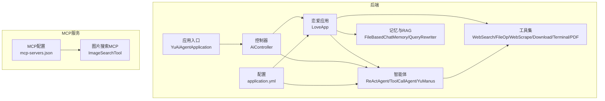
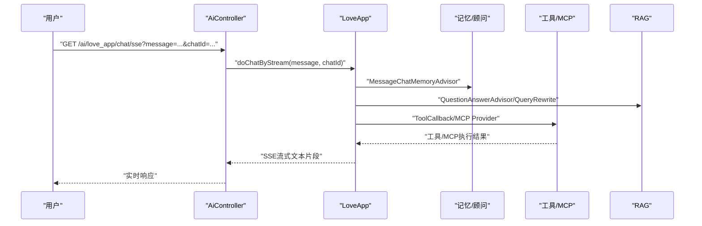
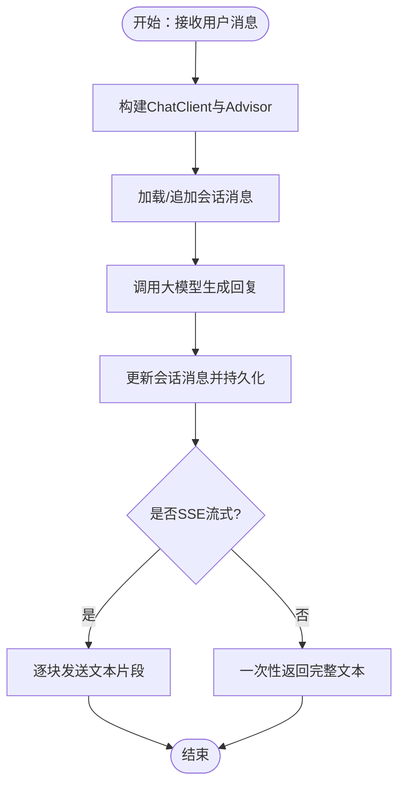
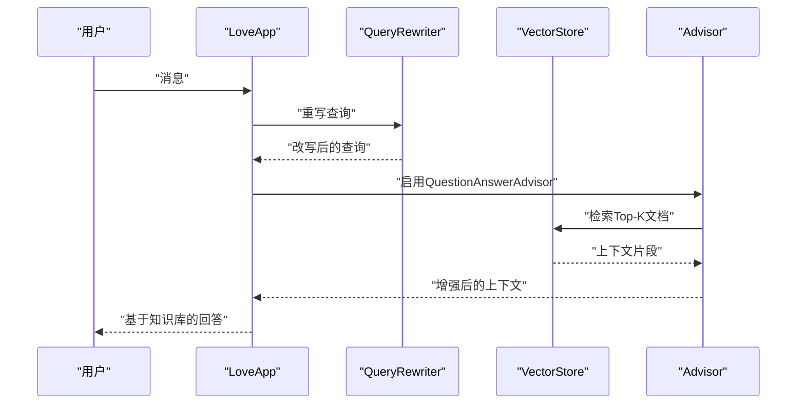
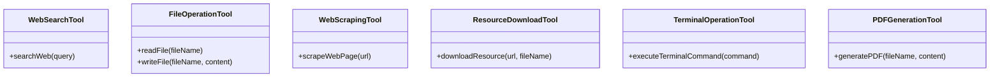
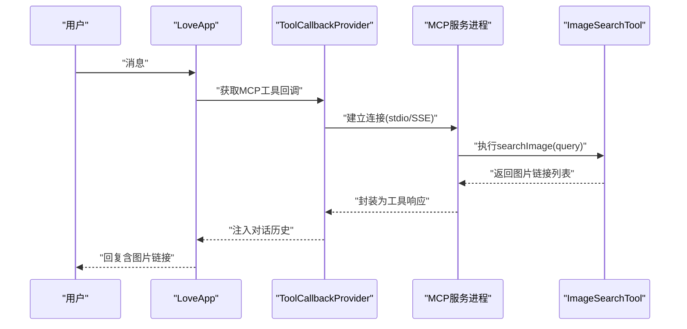
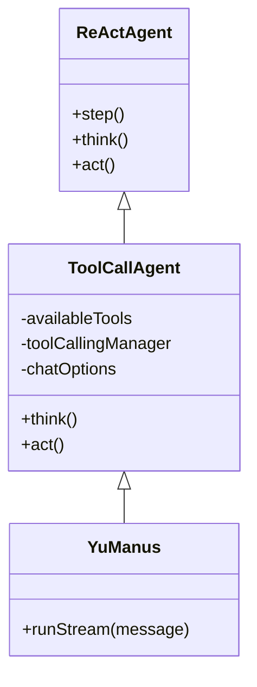
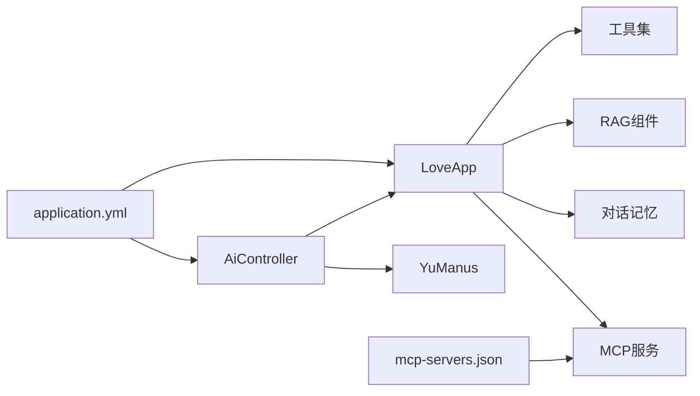

# 项目功能

<cite>
**本文引用的文件**
- [YuAiAgentApplication.java](file://src/main/java/com/yupi/yuaiagent/YuAiAgentApplication.java)
- [LoveApp.java](file://src/main/java/com/yupi/yuaiagent/app/LoveApp.java)
- [AiController.java](file://src/main/java/com/yupi/yuaiagent/controller/AiController.java)
- [YuManus.java](file://src/main/java/com/yupi/yuaiagent/agent/YuManus.java)
- [ReActAgent.java](file://src/main/java/com/yupi/yuaiagent/agent/ReActAgent.java)
- [ToolCallAgent.java](file://src/main/java/com/yupi/yuaiagent/agent/ToolCallAgent.java)
- [FileBasedChatMemory.java](file://src/main/java/com/yupi/yuaiagent/chatmemory/FileBasedChatMemory.java)
- [WebSearchTool.java](file://src/main/java/com/yupi/yuaiagent/tools/WebSearchTool.java)
- [FileOperationTool.java](file://src/main/java/com/yupi/yuaiagent/tools/FileOperationTool.java)
- [WebScrapingTool.java](file://src/main/java/com/yupi/yuaiagent/tools/WebScrapingTool.java)
- [ResourceDownloadTool.java](file://src/main/java/com/yupi/yuaiagent/tools/ResourceDownloadTool.java)
- [TerminalOperationTool.java](file://src/main/java/com/yupi/yuaiagent/tools/TerminalOperationTool.java)
- [PDFGenerationTool.java](file://src/main/java/com/yupi/yuaiagent/tools/PDFGenerationTool.java)
- [QueryRewriter.java](file://src/main/java/com/yupi/yuaiagent/rag/QueryRewriter.java)
- [mcp-servers.json](file://src/main/resources/mcp-servers.json)
- [application.yml](file://src/main/resources/application.yml)
- [ImageSearchTool.java](file://yu-image-search-mcp-server/src/main/java/com/yupi/yuimagesearchmcpserver/tools/ImageSearchTool.java)
- [README.md](file://README.md)
</cite>

## 目录
1. [简介](#简介)
2. [项目结构](#项目结构)
3. [核心组件](#核心组件)
4. [架构总览](#架构总览)
5. [详细组件分析](#详细组件分析)
6. [依赖分析](#依赖分析)
7. [性能考虑](#性能考虑)
8. [故障排除指南](#故障排除指南)
9. [结论](#结论)
10. [附录](#附录)

## 简介
本项目围绕“AI恋爱大师应用”与“超级智能体YuManus”的完整功能体系展开，涵盖多轮对话、对话记忆持久化、RAG知识库检索、工具调用、MCP服务调用等能力，并以ReAct模式实现智能体的自主规划与执行闭环。项目提供七种工具调用能力（联网搜索、文件操作、网页抓取、资源下载、终端操作、PDF生成），并集成MCP图片搜索服务，帮助开发者理解各功能模块的价值与应用场景。

## 项目结构
后端采用Spring Boot工程，核心模块包括：
- 应用入口与配置：应用启动类、全局配置文件
- 应用层：AI恋爱大师应用封装（多轮对话、RAG、工具/MCP调用）
- 控制器层：统一对外HTTP接口（同步/流式SSE）
- 智能体层：ReAct抽象、工具调用智能体、超级智能体YuManus
- 工具层：七种工具实现
- 记忆与RAG：对话记忆持久化、查询重写与向量检索
- MCP服务：独立子工程提供图片搜索MCP能力

图表来源
- [AiController.java:1-106](file://src/main/java/com/yupi/yuaiagent/controller/AiController.java#L1-L106)
- [LoveApp.java:1-227](file://src/main/java/com/yupi/yuaiagent/app/LoveApp.java#L1-L227)
- [YuManus.java:1-38](file://src/main/java/com/yupi/yuaiagent/agent/YuManus.java#L1-L38)
- [ReActAgent.java:1-53](file://src/main/java/com/yupi/yuaiagent/agent/ReActAgent.java#L1-L53)
- [ToolCallAgent.java:1-136](file://src/main/java/com/yupi/yuaiagent/agent/ToolCallAgent.java#L1-L136)
- [FileBasedChatMemory.java:1-94](file://src/main/java/com/yupi/yuaiagent/chatmemory/FileBasedChatMemory.java#L1-L94)
- [QueryRewriter.java:1-40](file://src/main/java/com/yupi/yuaiagent/rag/QueryRewriter.java#L1-L40)
- [application.yml:1-66](file://src/main/resources/application.yml#L1-L66)
- [mcp-servers.json:1-25](file://src/main/resources/mcp-servers.json#L1-L25)
- [ImageSearchTool.java:1-67](file://yu-image-search-mcp-server/src/main/java/com/yupi/yuimagesearchmcpserver/tools/ImageSearchTool.java#L1-L67)

章节来源
- [README.md:85-128](file://README.md#L85-L128)
- [application.yml:1-66](file://src/main/resources/application.yml#L1-L66)

## 核心组件
- AI恋爱大师应用（LoveApp）：提供多轮对话、结构化输出、RAG检索、工具/MCP调用等能力，适配恋爱场景的系统提示与顾问增强。
- 超级智能体YuManus：基于ReAct模式的自主规划智能体，具备工具选择与执行、终止控制、最大步数限制等能力。
- 工具集：七种实用工具，覆盖网络检索、文件读写、网页抓取、资源下载、终端命令执行、PDF生成。
- 记忆与RAG：对话记忆持久化（Kryo序列化）、查询重写与向量检索增强。
- MCP服务：图片搜索MCP服务，支持外部进程或stdio方式接入。

章节来源
- [LoveApp.java:27-227](file://src/main/java/com/yupi/yuaiagent/app/LoveApp.java#L27-L227)
- [YuManus.java:9-38](file://src/main/java/com/yupi/yuaiagent/agent/YuManus.java#L9-L38)
- [ToolCallAgent.java:24-136](file://src/main/java/com/yupi/yuaiagent/agent/ToolCallAgent.java#L24-L136)
- [FileBasedChatMemory.java:17-94](file://src/main/java/com/yupi/yuaiagent/chatmemory/FileBasedChatMemory.java#L17-L94)
- [QueryRewriter.java:10-40](file://src/main/java/com/yupi/yuaiagent/rag/QueryRewriter.java#L10-L40)
- [mcp-servers.json:1-25](file://src/main/resources/mcp-servers.json#L1-L25)

## 架构总览
系统通过控制器统一对外提供HTTP接口，内部以ChatClient为交互中枢，结合Advisor（顾问）扩展多轮对话记忆、日志记录、RAG检索、工具/MCP回调等能力。智能体层基于ReAct模式实现“思考-行动”循环，工具层提供可插拔的外部能力，MCP服务独立部署并通过配置文件接入。

图表来源
- [AiController.java:38-92](file://src/main/java/com/yupi/yuaiagent/controller/AiController.java#L38-L92)
- [LoveApp.java:63-172](file://src/main/java/com/yupi/yuaiagent/app/LoveApp.java#L63-L172)

## 详细组件分析

### 多轮对话与对话记忆持久化
- 多轮对话：通过ChatClient与MessageChatMemoryAdvisor实现会话记忆，支持同步与SSE流式响应。
- 对话记忆持久化：FileBasedChatMemory基于Kryo序列化，按会话ID将消息列表持久化到文件，支持新增、读取、清理。
- 应用示例：控制器提供同步与多种SSE变体接口，满足不同前端渲染需求。

图表来源
- [AiController.java:38-92](file://src/main/java/com/yupi/yuaiagent/controller/AiController.java#L38-L92)
- [LoveApp.java:63-97](file://src/main/java/com/yupi/yuaiagent/app/LoveApp.java#L63-L97)
- [FileBasedChatMemory.java:43-92](file://src/main/java/com/yupi/yuaiagent/chatmemory/FileBasedChatMemory.java#L43-L92)

章节来源
- [AiController.java:38-92](file://src/main/java/com/yupi/yuaiagent/controller/AiController.java#L38-L92)
- [LoveApp.java:63-97](file://src/main/java/com/yupi/yuaiagent/app/LoveApp.java#L63-L97)
- [FileBasedChatMemory.java:17-94](file://src/main/java/com/yupi/yuaiagent/chatmemory/FileBasedChatMemory.java#L17-L94)

### RAG知识库检索
- 查询重写：通过QueryRewriter对用户输入进行改写，提升检索质量。
- 向量检索：结合QuestionAnswerAdvisor与向量存储（支持云服务与PgVector），在顾问中注入检索增强逻辑。
- 应用示例：LoveApp提供doChatWithRag接口，串联查询重写与检索增强，返回融合知识库内容的回复。

图表来源
- [LoveApp.java:145-172](file://src/main/java/com/yupi/yuaiagent/app/LoveApp.java#L145-L172)
- [QueryRewriter.java:26-38](file://src/main/java/com/yupi/yuaiagent/rag/QueryRewriter.java#L26-L38)

章节来源
- [LoveApp.java:124-172](file://src/main/java/com/yupi/yuaiagent/app/LoveApp.java#L124-L172)
- [QueryRewriter.java:10-40](file://src/main/java/com/yupi/yuaiagent/rag/QueryRewriter.java#L10-L40)

### 工具调用（七种工具）
- 联网搜索：调用第三方搜索API，返回结构化搜索结果摘要。
- 文件操作：读取/写入文件，路径位于统一保存目录。
- 网页抓取：使用Jsoup抓取页面HTML内容。
- 资源下载：下载URL资源到本地目录。
- 终端操作：在Windows上执行命令，捕获标准输出与退出码。
- PDF生成：使用iText生成PDF文件，支持内置中文字体。

图表来源
- [WebSearchTool.java:15-54](file://src/main/java/com/yupi/yuaiagent/tools/WebSearchTool.java#L15-L54)
- [FileOperationTool.java:8-41](file://src/main/java/com/yupi/yuaiagent/tools/FileOperationTool.java#L8-L41)
- [WebScrapingTool.java:8-23](file://src/main/java/com/yupi/yuaiagent/tools/WebScrapingTool.java#L8-L23)
- [ResourceDownloadTool.java:11-31](file://src/main/java/com/yupi/yuaiagent/tools/ResourceDownloadTool.java#L11-L31)
- [TerminalOperationTool.java:10-38](file://src/main/java/com/yupi/yuaiagent/tools/TerminalOperationTool.java#L10-L38)
- [PDFGenerationTool.java:16-53](file://src/main/java/com/yupi/yuaiagent/tools/PDFGenerationTool.java#L16-L53)

章节来源
- [WebSearchTool.java:15-54](file://src/main/java/com/yupi/yuaiagent/tools/WebSearchTool.java#L15-L54)
- [FileOperationTool.java:8-41](file://src/main/java/com/yupi/yuaiagent/tools/FileOperationTool.java#L8-L41)
- [WebScrapingTool.java:8-23](file://src/main/java/com/yupi/yuaiagent/tools/WebScrapingTool.java#L8-L23)
- [ResourceDownloadTool.java:11-31](file://src/main/java/com/yupi/yuaiagent/tools/ResourceDownloadTool.java#L11-L31)
- [TerminalOperationTool.java:10-38](file://src/main/java/com/yupi/yuaiagent/tools/TerminalOperationTool.java#L10-L38)
- [PDFGenerationTool.java:16-53](file://src/main/java/com/yupi/yuaiagent/tools/PDFGenerationTool.java#L16-L53)

### MCP服务调用（图片搜索）
- MCP配置：通过mcp-servers.json声明外部MCP服务（如高德地图、图片搜索），支持命令行与环境变量。
- 图片搜索MCP：独立子工程提供图片搜索工具，调用Pexels API返回中等尺寸图片链接。
- 应用示例：LoveApp提供doChatWithMcp接口，将MCP工具注册为回调，实现跨进程能力调用。

图表来源
- [AiController.java:202-225](file://src/main/java/com/yupi/yuaiagent/controller/AiController.java#L202-L225)
- [LoveApp.java:200-225](file://src/main/java/com/yupi/yuaiagent/app/LoveApp.java#L200-L225)
- [mcp-servers.json:1-25](file://src/main/resources/mcp-servers.json#L1-L25)
- [ImageSearchTool.java:25-66](file://yu-image-search-mcp-server/src/main/java/com/yupi/yuimagesearchmcpserver/tools/ImageSearchTool.java#L25-L66)

章节来源
- [AiController.java:200-225](file://src/main/java/com/yupi/yuaiagent/controller/AiController.java#L200-L225)
- [LoveApp.java:200-225](file://src/main/java/com/yupi/yuaiagent/app/LoveApp.java#L200-L225)
- [mcp-servers.json:1-25](file://src/main/resources/mcp-servers.json#L1-L25)
- [ImageSearchTool.java:16-66](file://yu-image-search-mcp-server/src/main/java/com/yupi/yuimagesearchmcpserver/tools/ImageSearchTool.java#L16-L66)

### 超级智能体YuManus与ReAct模式
- ReActAgent：定义“思考-行动”循环，step()顺序执行think()与act()，并处理异常。
- ToolCallAgent：实现工具调用的think/act逻辑，禁用内置工具执行，自管消息上下文与工具调用管理器。
- YuManus：继承ToolCallAgent，设置系统提示、下一步提示、最大步数，绑定ChatClient与工具集合，提供流式运行接口。

图表来源
- [ReActAgent.java:7-53](file://src/main/java/com/yupi/yuaiagent/agent/ReActAgent.java#L7-L53)
- [ToolCallAgent.java:24-136](file://src/main/java/com/yupi/yuaiagent/agent/ToolCallAgent.java#L24-L136)
- [YuManus.java:9-38](file://src/main/java/com/yupi/yuaiagent/agent/YuManus.java#L9-L38)

章节来源
- [ReActAgent.java:11-53](file://src/main/java/com/yupi/yuaiagent/agent/ReActAgent.java#L11-L53)
- [ToolCallAgent.java:24-136](file://src/main/java/com/yupi/yuaiagent/agent/ToolCallAgent.java#L24-L136)
- [YuManus.java:9-38](file://src/main/java/com/yupi/yuaiagent/agent/YuManus.java#L9-L38)

### 结构化输出与报告
- 结构化解析：LoveApp提供结构化输出能力，将对话结果解析为领域对象（如恋爱报告），便于前端展示与归档。
- 应用示例：在恋爱场景下，系统可生成标题与建议列表的结构化报告。

章节来源
- [LoveApp.java:104-122](file://src/main/java/com/yupi/yuaiagent/app/LoveApp.java#L104-L122)

### 流式传输与SSE
- SSE支持：控制器提供多种SSE变体（Flux<String>、ServerSentEvent、SseEmitter），满足不同前端渲染与兼容性需求。
- 应用示例：前端可逐步接收大模型生成的文本片段，提升交互体验。

章节来源
- [AiController.java:50-92](file://src/main/java/com/yupi/yuaiagent/controller/AiController.java#L50-L92)

## 依赖分析
- 外部依赖：DashScope（大模型）、Ollama（本地模型）、SearchAPI（搜索）、Pexels（图片）、PgVector（向量存储，可选）、Kryo（序列化）、Jsoup（网页抓取）、iText（PDF生成）。
- 配置依赖：application.yml中定义API Key、模型选项、MCP连接与向量存储开关；mcp-servers.json声明MCP服务进程与参数。
- 运行依赖：Spring Boot、Spring AI、Knife4j（接口文档）。

图表来源
- [application.yml:11-30](file://src/main/resources/application.yml#L11-L30)
- [mcp-servers.json:1-25](file://src/main/resources/mcp-servers.json#L1-L25)
- [AiController.java:22-30](file://src/main/java/com/yupi/yuaiagent/controller/AiController.java#L22-L30)
- [LoveApp.java:126-136](file://src/main/java/com/yupi/yuaiagent/app/LoveApp.java#L126-L136)

章节来源
- [application.yml:11-30](file://src/main/resources/application.yml#L11-L30)
- [mcp-servers.json:1-25](file://src/main/resources/mcp-servers.json#L1-L25)
- [AiController.java:22-30](file://src/main/java/com/yupi/yuaiagent/controller/AiController.java#L22-L30)
- [LoveApp.java:126-136](file://src/main/java/com/yupi/yuaiagent/app/LoveApp.java#L126-L136)

## 性能考虑
- 流式传输：优先使用SSE减少首字节延迟，提升用户体验。
- 工具调用：避免频繁I/O与网络请求，合理缓存中间结果。
- 记忆持久化：Kryo序列化开销较低，但注意会话消息规模控制，避免过大文件。
- RAG检索：合理设置Top-K与重写策略，平衡召回与速度。
- MCP服务：尽量复用连接，避免频繁启动进程；在容器环境中预热MCP服务。

## 故障排除指南
- API Key与模型配置：检查application.yml中的DashScope/Ollama配置与API Key。
- MCP服务未启动：确认mcp-servers.json中命令与参数正确，必要时启用stdio或SSE连接。
- 工具调用异常：查看工具实现的异常返回信息，确保网络可达与权限充足。
- 记忆持久化失败：确认保存目录存在且具备读写权限。
- RAG检索无结果：检查QueryRewriter与向量存储配置，确认文档入库与索引构建完成。

章节来源
- [application.yml:11-30](file://src/main/resources/application.yml#L11-L30)
- [mcp-servers.json:1-25](file://src/main/resources/mcp-servers.json#L1-L25)
- [FileBasedChatMemory.java:34-41](file://src/main/java/com/yupi/yuaiagent/chatmemory/FileBasedChatMemory.java#L34-L41)

## 结论
本项目以“AI恋爱大师应用”与“超级智能体YuManus”为核心，系统性展示了多轮对话、对话记忆持久化、RAG知识库检索、工具调用与MCP服务调用的完整能力谱系。通过ReAct模式实现智能体的自主规划与执行闭环，结合七种实用工具与图片搜索MCP服务，为开发者提供了可扩展、可落地的AI应用范式。

## 附录
- 快速开始：配置API Key与模型选项，启动后端与MCP服务，访问Swagger或直接调用HTTP接口。
- 场景示例：用户输入“帮我制定一个周末约会计划”，智能体可联动搜索周边餐厅、抓取详情、生成PDF行程单并返回给用户。