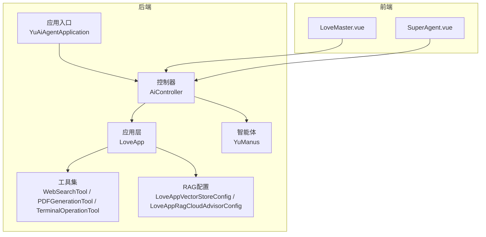
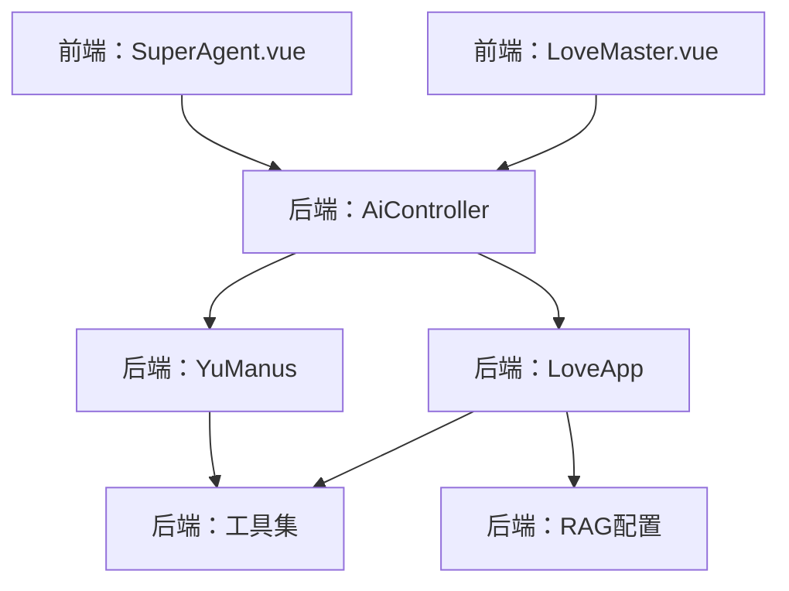
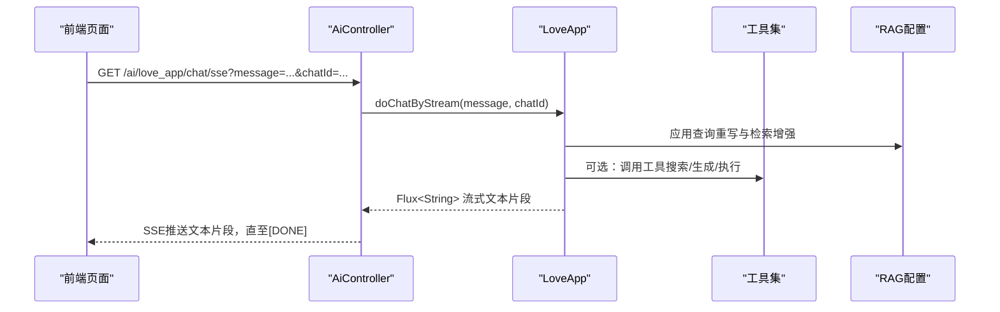
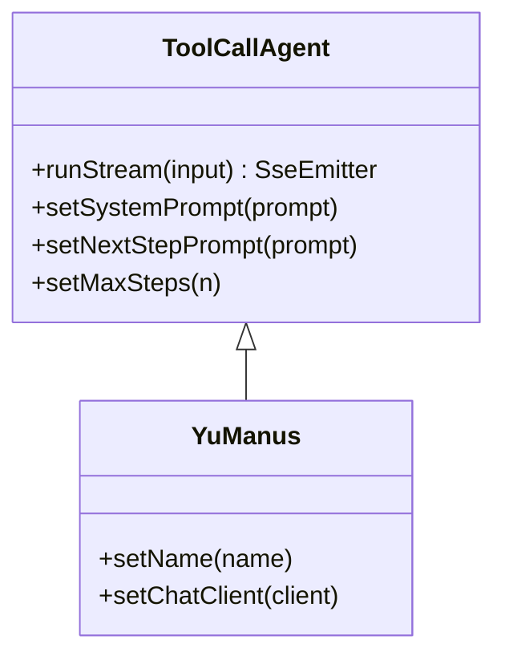
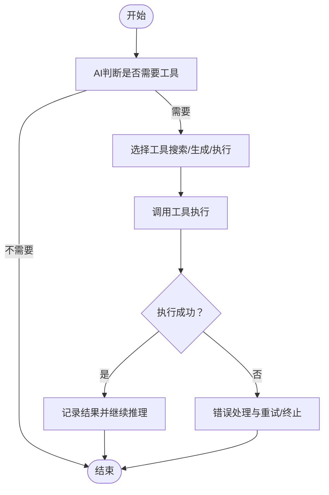
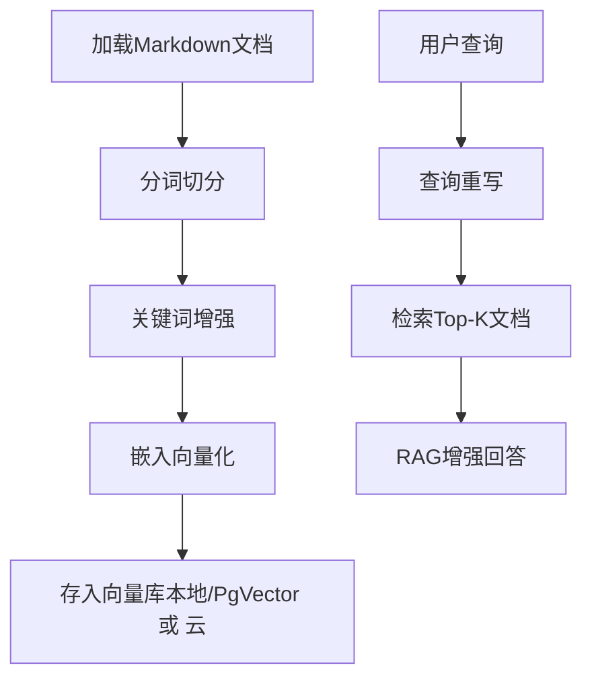
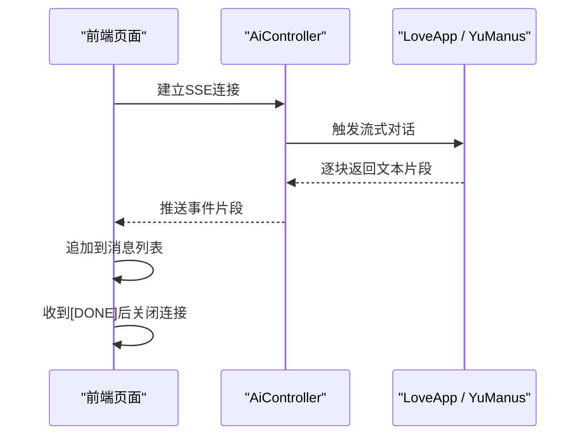
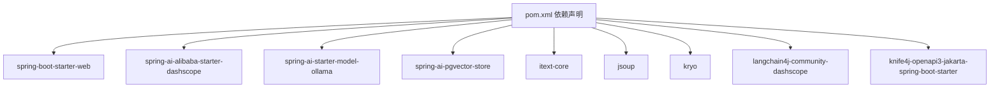

# 项目概述

<cite>
**本文引用的文件**
- [README.md](file://README.md)
- [pom.xml](file://pom.xml)
- [application.yml](file://src/main/resources/application.yml)
- [YuAiAgentApplication.java](file://src/main/java/com/yupi/yuaiagent/YuAiAgentApplication.java)
- [AiController.java](file://src/main/java/com/yupi/yuaiagent/controller/AiController.java)
- [LoveApp.java](file://src/main/java/com/yupi/yuaiagent/app/LoveApp.java)
- [YuManus.java](file://src/main/java/com/yupi/yuaiagent/agent/YuManus.java)
- [WebSearchTool.java](file://src/main/java/com/yupi/yuaiagent/tools/WebSearchTool.java)
- [PDFGenerationTool.java](file://src/main/java/com/yupi/yuaiagent/tools/PDFGenerationTool.java)
- [TerminalOperationTool.java](file://src/main/java/com/yupi/yuaiagent/tools/TerminalOperationTool.java)
- [LoveAppVectorStoreConfig.java](file://src/main/java/com/yupi/yuaiagent/rag/LoveAppVectorStoreConfig.java)
- [LoveAppRagCloudAdvisorConfig.java](file://src/main/java/com/yupi/yuaiagent/rag/LoveAppRagCloudAdvisorConfig.java)
- [yu-ai-agent-frontend/README.md](file://yu-ai-agent-frontend/README.md)
- [yu-ai-agent-frontend/src/views/LoveMaster.vue](file://yu-ai-agent-frontend/src/views/LoveMaster.vue)
- [yu-ai-agent-frontend/src/views/SuperAgent.vue](file://yu-ai-agent-frontend/src/views/SuperAgent.vue)
</cite>

## 目录
1. [引言](#引言)
2. [项目结构](#项目结构)
3. [核心组件](#核心组件)
4. [架构总览](#架构总览)
5. [详细组件分析](#详细组件分析)
6. [依赖分析](#依赖分析)
7. [性能考虑](#性能考虑)
8. [故障排查指南](#故障排查指南)
9. [结论](#结论)
10. [附录](#附录)

## 引言
本项目是一个面向教学实战的AI超级智能体系统，旨在通过“AI恋爱大师应用 + 自主规划智能体YuManus”的完整实现，系统性地覆盖AI大模型接入、RAG知识库、工具调用、MCP服务、结构化输出、SSE流式交互、向量数据库等核心技术点。项目强调从需求分析到完整落地的全流程实战，区别于传统的增删改查类项目，具备更强的企业适用性与工程深度，适合希望在AI方向快速成长的开发者。

项目目标与价值：
- 教学实战导向：以“从0到1”的直播式教学贯穿需求、设计、开发、优化、部署全过程，配套视频、文字教程、简历写法、面试题解与答疑服务。
- 技术栈前沿：Spring AI + LangChain4j、RAG、PgVector、Tool Calling、MCP、ReAct智能体、SSE、Serverless等。
- 业务场景真实：恋爱情感咨询、约会计划制定、知识问答、工具编排与文档生成等，贴近真实企业智能体应用场景。
- 工程能力提升：通过真实项目演练，掌握Prompt工程、RAG调优、向量检索、工具开发、MCP协议、智能体工作流等关键技能。

## 项目结构
后端采用Spring Boot 3 + Java 21，统一入口为应用启动类，控制器层提供REST接口，应用层封装AI恋爱大师能力，智能体层实现自主规划的YuManus，工具层提供网络搜索、PDF生成、终端执行等实用工具，RAG层负责文档加载、切分、嵌入与检索增强。

前端采用Vue3 + Vite，提供“AI恋爱大师”和“AI超级智能体”两个核心页面，通过SSE实现流式对话体验。

图表来源
- [YuAiAgentApplication.java:1-18](file://src/main/java/com/yupi/yuaiagent/YuAiAgentApplication.java#L1-L18)
- [AiController.java:1-106](file://src/main/java/com/yupi/yuaiagent/controller/AiController.java#L1-L106)
- [LoveApp.java:1-227](file://src/main/java/com/yupi/yuaiagent/app/LoveApp.java#L1-L227)
- [YuManus.java:1-38](file://src/main/java/com/yupi/yuaiagent/agent/YuManus.java#L1-L38)
- [WebSearchTool.java:1-54](file://src/main/java/com/yupi/yuaiagent/tools/WebSearchTool.java#L1-L54)
- [PDFGenerationTool.java:1-53](file://src/main/java/com/yupi/yuaiagent/tools/PDFGenerationTool.java#L1-L53)
- [TerminalOperationTool.java:1-38](file://src/main/java/com/yupi/yuaiagent/tools/TerminalOperationTool.java#L1-L38)
- [LoveAppVectorStoreConfig.java:1-42](file://src/main/java/com/yupi/yuaiagent/rag/LoveAppVectorStoreConfig.java#L1-L42)
- [LoveAppRagCloudAdvisorConfig.java:1-39](file://src/main/java/com/yupi/yuaiagent/rag/LoveAppRagCloudAdvisorConfig.java#L1-L39)
- [yu-ai-agent-frontend/src/views/LoveMaster.vue:1-244](file://yu-ai-agent-frontend/src/views/LoveMaster.vue#L1-L244)
- [yu-ai-agent-frontend/src/views/SuperAgent.vue:1-286](file://yu-ai-agent-frontend/src/views/SuperAgent.vue#L1-L286)

章节来源
- [README.md:100-128](file://README.md#L100-L128)
- [pom.xml:1-227](file://pom.xml#L1-L227)
- [application.yml:1-66](file://src/main/resources/application.yml#L1-L66)

## 核心组件
- 应用入口与配置
  - 应用入口排除数据源自动配置，便于开发调试与按需启用PgVector。
  - 默认端口8123，上下文路径/api，集成Knife4j与OpenAPI。
- 控制器层
  - 提供AI恋爱大师同步与SSE流式接口、AI超级智能体流式接口，统一对外暴露。
- 应用层（LoveApp）
  - 封装系统提示、多轮对话记忆、结构化输出（恋爱报告）、RAG知识库问答、工具调用、MCP服务调用等能力。
- 智能体（YuManus）
  - 基于工具调用的ReAct智能体，具备自主规划、多步推理与终止控制。
- 工具集
  - 网络搜索、PDF生成、终端命令执行等常用工具，支持注册为Tool Callback。
- RAG模块
  - 文档加载、切分、关键词增强、向量存储与检索增强顾问配置，支持本地与云知识库。

章节来源
- [YuAiAgentApplication.java:1-18](file://src/main/java/com/yupi/yuaiagent/YuAiAgentApplication.java#L1-L18)
- [AiController.java:1-106](file://src/main/java/com/yupi/yuaiagent/controller/AiController.java#L1-L106)
- [LoveApp.java:1-227](file://src/main/java/com/yupi/yuaiagent/app/LoveApp.java#L1-L227)
- [YuManus.java:1-38](file://src/main/java/com/yupi/yuaiagent/agent/YuManus.java#L1-L38)
- [WebSearchTool.java:1-54](file://src/main/java/com/yupi/yuaiagent/tools/WebSearchTool.java#L1-L54)
- [PDFGenerationTool.java:1-53](file://src/main/java/com/yupi/yuaiagent/tools/PDFGenerationTool.java#L1-L53)
- [TerminalOperationTool.java:1-38](file://src/main/java/com/yupi/yuaiagent/tools/TerminalOperationTool.java#L1-L38)
- [LoveAppVectorStoreConfig.java:1-42](file://src/main/java/com/yupi/yuaiagent/rag/LoveAppVectorStoreConfig.java#L1-L42)
- [LoveAppRagCloudAdvisorConfig.java:1-39](file://src/main/java/com/yupi/yuaiagent/rag/LoveAppRagCloudAdvisorConfig.java#L1-L39)

## 架构总览
系统采用前后端分离架构，后端以Spring Boot提供REST与SSE接口，前端通过Vue3页面发起SSE连接，实现流畅的实时对话体验。后端内部通过应用层、智能体层、工具层与RAG层协同，形成从“感知—规划—行动—反馈”的闭环。

图表来源
- [AiController.java:1-106](file://src/main/java/com/yupi/yuaiagent/controller/AiController.java#L1-L106)
- [LoveApp.java:1-227](file://src/main/java/com/yupi/yuaiagent/app/LoveApp.java#L1-L227)
- [YuManus.java:1-38](file://src/main/java/com/yupi/yuaiagent/agent/YuManus.java#L1-L38)
- [yu-ai-agent-frontend/src/views/LoveMaster.vue:1-244](file://yu-ai-agent-frontend/src/views/LoveMaster.vue#L1-L244)
- [yu-ai-agent-frontend/src/views/SuperAgent.vue:1-286](file://yu-ai-agent-frontend/src/views/SuperAgent.vue#L1-L286)

## 详细组件分析

### AI恋爱大师应用（LoveApp）
- 设计理念
  - 以“情感咨询专家”角色切入，引导用户描述情境，结合系统提示与多轮对话记忆，提供个性化建议。
- 关键能力
  - 多轮对话记忆：支持会话ID维度的记忆持久化与窗口化管理。
  - 结构化输出：将对话结果解析为恋爱报告实体，便于前端展示与归档。
  - RAG知识库问答：对查询进行重写，结合向量检索与云/本地知识库增强回答质量。
  - 工具调用：支持联网搜索、网页抓取、资源下载、PDF生成、终端执行等工具。
  - MCP服务调用：通过工具回调提供外部MCP服务能力。
- 接口形态
  - 同步对话、SSE流式对话、ServerSentEvent与SseEmitter三种形式，满足不同前端渲染与性能需求。

图表来源
- [AiController.java:50-92](file://src/main/java/com/yupi/yuaiagent/controller/AiController.java#L50-L92)
- [LoveApp.java:90-172](file://src/main/java/com/yupi/yuaiagent/app/LoveApp.java#L90-L172)

章节来源
- [LoveApp.java:1-227](file://src/main/java/com/yupi/yuaiagent/app/LoveApp.java#L1-L227)
- [AiController.java:1-106](file://src/main/java/com/yupi/yuaiagent/controller/AiController.java#L1-L106)

### 超级智能体YuManus（自主规划智能体）
- 设计理念
  - 基于ReAct范式，具备“思考—行动—观察—反思”的循环能力，支持复杂任务拆解与工具组合。
- 关键能力
  - 自定义系统提示与下一步提示，明确任务目标与工具选择策略。
  - 最大步数限制与终止工具，避免无限循环。
  - 流式SSE输出，前端可逐步渲染中间结果。
- 业务价值
  - 适用于需要跨域信息检索、文档生成、计划制定等复杂场景，具备企业级智能体工作流潜力。

图表来源
- [YuManus.java:1-38](file://src/main/java/com/yupi/yuaiagent/agent/YuManus.java#L1-L38)

章节来源
- [YuManus.java:1-38](file://src/main/java/com/yupi/yuaiagent/agent/YuManus.java#L1-L38)
- [AiController.java:100-104](file://src/main/java/com/yupi/yuaiagent/controller/AiController.java#L100-L104)

### 工具体系（WebSearchTool / PDFGenerationTool / TerminalOperationTool）
- 设计理念
  - 通过注解驱动的工具注册机制，将外部能力（搜索、生成、执行）注入到AI对话流程中。
- 典型流程
  - WebSearchTool：封装第三方搜索API，返回结构化结果摘要。
  - PDFGenerationTool：基于iText生成PDF文档，支持中文内容。
  - TerminalOperationTool：安全地执行系统命令，返回标准输出。
- 集成方式
  - 在应用层或智能体层通过工具回调注册，由AI根据上下文决定调用时机。

图表来源
- [WebSearchTool.java:1-54](file://src/main/java/com/yupi/yuaiagent/tools/WebSearchTool.java#L1-L54)
- [PDFGenerationTool.java:1-53](file://src/main/java/com/yupi/yuaiagent/tools/PDFGenerationTool.java#L1-L53)
- [TerminalOperationTool.java:1-38](file://src/main/java/com/yupi/yuaiagent/tools/TerminalOperationTool.java#L1-L38)

章节来源
- [WebSearchTool.java:1-54](file://src/main/java/com/yupi/yuaiagent/tools/WebSearchTool.java#L1-L54)
- [PDFGenerationTool.java:1-53](file://src/main/java/com/yupi/yuaiagent/tools/PDFGenerationTool.java#L1-L53)
- [TerminalOperationTool.java:1-38](file://src/main/java/com/yupi/yuaiagent/tools/TerminalOperationTool.java#L1-L38)

### RAG知识库（文档加载、切分、嵌入与检索增强）
- 设计理念
  - 通过文档加载器读取Markdown，使用分词器切分，关键词增强，再将向量存入SimpleVectorStore或PgVector，最终在问答阶段进行检索增强。
- 云/本地双通道
  - 云知识库：基于阿里云DashScope文档检索器，按索引名检索。
  - 本地向量库：基于PgVector，支持HNSW索引与余弦距离。
- 查询增强
  - 通过查询重写器对用户输入进行改写，提升检索命中率与相关性。

图表来源
- [LoveAppVectorStoreConfig.java:1-42](file://src/main/java/com/yupi/yuaiagent/rag/LoveAppVectorStoreConfig.java#L1-L42)
- [LoveAppRagCloudAdvisorConfig.java:1-39](file://src/main/java/com/yupi/yuaiagent/rag/LoveAppRagCloudAdvisorConfig.java#L1-L39)

章节来源
- [LoveAppVectorStoreConfig.java:1-42](file://src/main/java/com/yupi/yuaiagent/rag/LoveAppVectorStoreConfig.java#L1-L42)
- [LoveAppRagCloudAdvisorConfig.java:1-39](file://src/main/java/com/yupi/yuaiagent/rag/LoveAppRagCloudAdvisorConfig.java#L1-L39)

### 前端页面与SSE交互
- 页面职责
  - LoveMaster.vue：恋爱咨询场景，SSE流式接收AI回复，支持会话ID与连接状态管理。
  - SuperAgent.vue：超级智能体场景，SSE分段渲染，模拟“思考—停顿—输出”的自然节奏。
- 技术要点
  - 使用浏览器原生EventSource或SseEmitter，实现低延迟、高并发的流式通信。
  - 前端对[DONE]标记进行识别，完成连接关闭与最终状态更新。

图表来源
- [AiController.java:50-92](file://src/main/java/com/yupi/yuaiagent/controller/AiController.java#L50-L92)
- [yu-ai-agent-frontend/src/views/LoveMaster.vue:69-107](file://yu-ai-agent-frontend/src/views/LoveMaster.vue#L69-L107)
- [yu-ai-agent-frontend/src/views/SuperAgent.vue:64-157](file://yu-ai-agent-frontend/src/views/SuperAgent.vue#L64-L157)

章节来源
- [yu-ai-agent-frontend/README.md:1-56](file://yu-ai-agent-frontend/README.md#L1-L56)
- [yu-ai-agent-frontend/src/views/LoveMaster.vue:1-244](file://yu-ai-agent-frontend/src/views/LoveMaster.vue#L1-L244)
- [yu-ai-agent-frontend/src/views/SuperAgent.vue:1-286](file://yu-ai-agent-frontend/src/views/SuperAgent.vue#L1-L286)

## 依赖分析
- 后端核心依赖
  - Spring Boot Starter Web、Spring AI Alibaba、Ollama、DashScope SDK、LangChain4J DashScope、Kryo、Jsoup、iText、Knife4j、PgVector等。
- 配置要点
  - application.yml中配置API Key、模型参数、SSE/MCP/向量库等开关，便于本地开发与生产切换。
- 依赖关系示意

图表来源
- [pom.xml:50-164](file://pom.xml#L50-L164)
- [application.yml:11-38](file://src/main/resources/application.yml#L11-L38)

章节来源
- [pom.xml:1-227](file://pom.xml#L1-L227)
- [application.yml:1-66](file://src/main/resources/application.yml#L1-L66)

## 性能考虑
- SSE流式传输
  - 前端按片段渲染，降低首屏等待时间；后端使用Flux/Reactor，减少内存占用。
- 工具调用与MCP
  - 工具执行可能阻塞，建议在工具内部设置超时与异常兜底，避免影响对话流畅度。
- RAG检索
  - 合理设置Top-K与过滤条件，避免过多无关文档干扰；必要时启用查询重写与关键词增强。
- 向量库
  - PgVector索引类型与距离度量需结合数据规模与精度要求权衡；批量写入时注意批次大小与事务开销。
- 日志与可观测性
  - 通过MyLoggerAdvisor与日志级别调整，定位调用链路与性能瓶颈。

## 故障排查指南
- SSE连接失败
  - 检查后端SSE接口是否正确返回文本片段与[DONE]标记；前端EventSource是否正确关闭。
- 工具调用异常
  - 核查工具参数与权限（如终端命令执行），确认第三方API Key与配额。
- RAG检索无结果
  - 检查文档加载与嵌入是否成功，向量库是否初始化；查询重写是否合理。
- 向量库连接问题
  - 确认数据库连接信息与PgVector扩展可用性；必要时临时禁用数据源自动配置以定位问题。
- 日志定位
  - 将日志级别调整至DEBUG，观察Advisor与工具调用链路，快速定位异常节点。

章节来源
- [AiController.java:77-92](file://src/main/java/com/yupi/yuaiagent/controller/AiController.java#L77-L92)
- [application.yml:64-66](file://src/main/resources/application.yml#L64-L66)

## 结论
本项目以实战为导向，将AI大模型、RAG、工具调用、MCP与智能体工作流有机融合，形成可复用、可扩展的教学案例。通过前后端分离与SSE流式交互，既保证了良好的用户体验，又体现了现代AI应用的工程化能力。项目在教学与企业实践中均具备显著价值，是开发者深入理解AI应用全栈技术栈的优质载体。

## 附录
- 学习路线图（节选）
  - 第1期：项目总览与技术选型
  - 第2期：AI大模型接入与本地部署
  - 第3期：多轮对话、结构化输出与对话记忆
  - 第4期：RAG知识库（本地与云）
  - 第5期：RAG进阶与调优
  - 第6期：工具调用与原理
  - 第7期：MCP协议与服务开发
  - 第8期：智能体构建与工作流
  - 第9期：服务化与Serverless部署
- 技术收获
  - Prompt工程、RAG原理与调优、向量检索、工具开发、MCP协议、智能体工作流、SSE流式交互、工程化部署与监控。

章节来源
- [README.md:180-299](file://README.md#L180-L299)